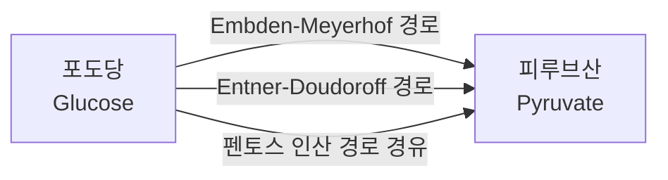

# Chapter 1. 대사모델링의 개요

> 게놈 규모 대사 모델링(Genome-scale Metabolic Modeling, GEM)은 생명체의 게놈 서열에 인코딩된 모든 대사 반응을 수학적으로 표현하여, 세포의 대사 행동을 정량적으로 예측하는 계산 생물학의 한 분야입니다. 이 장을 마치면 여러분은 "왜 대사를 굳이 수학으로 옮겨야 하는가"라는 질문에 스스로 답할 수 있고, COBRApy로 실제 *E. coli* 모델을 불러와 그 크기를 눈으로 확인할 수 있게 됩니다.


생장곡선, Monod 식, 배양 방식, 중심탄소대사와 효소 분류가 낯설다면 먼저 [준비 학습 A](supplements/microbial-growth-metabolism.md)를 읽으십시오. 이후 장의 `mmol gDW⁻¹ h⁻¹` 단위와 배지 제약을 훨씬 쉽게 해석할 수 있습니다.


---

## 이 장을 시작하며

여러분은 오늘 아침에 무엇을 드셨나요? 밥 한 공기, 계란 하나, 우유 한 잔이라고 해봅시다. 지금 이 문장을 읽고 있는 이 순간에도, 여러분의 몸속 수십조 개의 세포 하나하나에서는 그 밥과 계란과 우유가 수천 가지의 화학 반응을 거쳐 에너지로, 근육 단백질로, 신경전달물질로 바뀌고 있습니다. 이 반응들은 서로 완전히 독립적이지 않습니다. 한 반응의 생성물이 다음 반응의 원료가 되고, 그 다음 반응의 생성물이 또 다른 반응의 원료가 되는 식으로 거대한 사슬—아니, 사슬이라기보다는 그물망—을 이룹니다.

여기서 흥미로운 질문 하나를 던져보겠습니다.

> 대장균(*E. coli*)의 특정 유전자 하나를 인위적으로 망가뜨리면(유전자 결손, gene knockout), 이 세균은 죽을까요, 살아남을까요? 살아남는다면 성장 속도는 얼마나 느려질까요? 그리고 어떤 부산물을 새로 분비하게 될까요?

이 질문에 자신 있게 답할 수 있는 사람은 많지 않을 것입니다. 그 이유는 단순합니다 — 대장균만 해도 4,000개가 넘는 유전자와 수천 개의 대사 반응이 얽혀 있어서, 유전자 하나를 없앴을 때 그 파급 효과가 네트워크 전체로 어떻게 퍼져나가는지 사람의 머릿속 직관만으로는 도저히 추적할 수 없기 때문입니다. 그런데 실제로 이 질문에 **정확히, 몇 초 만에, 컴퓨터로** 답할 수 있는 방법이 있습니다. 그것이 바로 이 책 전체가 다룰 **게놈 규모 대사 모델링(GEM)**입니다.

이 장은 이 책의 출발점입니다. 아직 화학량론 행렬도, GPR도, FBA 수식도 등장하지 않습니다. 대신 다음 질문들에 대한 큰 그림을 그립니다: 대사란 무엇인가? 왜 이것을 "모델링"해야 하는가? GEM이란 정확히 무엇인가? 그리고 이 분야는 지난 35년간 어떻게 발전해 왔는가? 이 장을 다 읽고 나면, 여러분은 왜 다음 장부터 화학량론 행렬이라는 다소 낯선 수학적 도구를 배워야 하는지 스스로 납득하게 될 것입니다.

---

## 학습 목표 (Learning Objectives)

이 장을 마치면 학습자는 다음을 할 수 있습니다:

1. 대사(Metabolism)와 대사 네트워크(Metabolic Network)의 기본 개념을 비유를 들어 설명할 수 있다.
2. 대사를 왜 "모델링"해야 하는지 — 즉 직관적 이해만으로는 부족한 이유 — 를 구체적 사례로 설명할 수 있다.
3. 게놈 규모 대사 모델(GEM)의 정의와 그 핵심 가정(의사-정상 상태)을 설명할 수 있다.
4. 제약 기반 모델링(CBM)과 동역학 모델링(Kinetic Modeling)의 원리를 비교하고, 각각이 적합한 상황을 판단할 수 있다.
5. 대사 모델을 범위·수학적 틀·생물학적 대상에 따라 분류(Taxonomy)할 수 있다.
6. 대사 모델링의 역사를 4개 시대로 구분하여 대표 모델과 핵심 혁신을 설명할 수 있다.
7. COBRApy로 대사 모델을 불러오고 기본 구성 요소(반응·대사물·유전자)의 개수를 확인하는 첫걸음을 뗄 수 있다.

---

## 1. 대사(Metabolism)와 대사 네트워크

### 1.1 대사란 무엇인가?

**대사(Metabolism, 대사작용)**란 생명체가 생명 활동을 유지하기 위해 영양분을 에너지와 세포 구성 성분으로 전환하는 모든 화학 반응의 총칭입니다.

앞서 이야기했던 아침 식사로 돌아가 봅시다. 밥(탄수화물), 계란(단백질·지방), 우유(단백질·지방·당)는 소화관에서 잘게 분해된 뒤 소장에서 흡수됩니다. 이렇게 흡수된 작은 분자들은 혈액을 타고 온몸의 세포로 운송되며, 세포 안에서는 수천 가지의 화학 반응을 거쳐 다음 세 가지 용도로 쓰입니다.

1. **에너지 생산(Energy Production)**: 포도당(Glucose) 같은 분자가 산화되어 ATP(아데노신 삼인산, Adenosine Triphosphate)라는 "세포의 에너지 화폐"를 생성합니다. 여러분이 계단을 오르거나 생각을 할 때 소모하는 에너지가 바로 이 ATP에서 나옵니다.
2. **생체 분자 합성(Biosynthesis)**: 아미노산(Amino Acids)이 결합하여 단백질(Protein)을 만들고, 지방산이 결합하여 세포막을 형성합니다. 여러분의 근육, 머리카락, 세포막은 모두 이렇게 만들어진 것입니다.
3. **분해와 배출(Catabolism & Excretion)**: 노폐물과 독성 물질을 분해하여 체외로 배출합니다.

대사는 크게 두 방향으로 나뉩니다.

- **분해 대사(Catabolism)**: 복잡한 분자를 단순한 분자로 분해하며 에너지를 방출하는 과정입니다. 예를 들어 해당과정(Glycolysis, 글리콜라이스)에서 포도당 한 분자는 여러 단계를 거쳐 피루브산(Pyruvate) 두 분자로 쪼개지며, 이 과정에서 소량의 ATP가 만들어집니다.
- **합성 대사(Anabolism)**: 단순한 전구체(Precursor, 어떤 물질을 만들기 위한 출발 원료)로부터 복잡한 생체 분자를 만드는 과정입니다. 에너지를 소비합니다. 예를 들어 아미노산들이 순서대로 연결되어 하나의 단백질이 되는 과정이 여기 해당합니다.


💡 **팁:** "분해(catabolism)"와 "합성(anabolism)"을 헷갈린다면, "cata-"는 그리스어로 "아래로(down)", "ana-"는 "위로(up)"라는 뜻임을 기억하세요. 분해 대사는 큰 분자를 "아래로" 쪼개고, 합성 대사는 작은 분자를 "위로" 쌓아 올립니다.


아래 표는 분해 대사와 합성 대사의 대표적인 예시를 몇 가지 더 정리한 것입니다.

| 구분 | 대표 반응/경로 | 방향 | 에너지 관계 |
|:---|:---|:---|:---|
| 분해 대사(Catabolism) | 해당과정: 포도당 → 피루브산 | 큰 분자 → 작은 분자 | ATP 순생산 (2분자) |
| 분해 대사(Catabolism) | TCA 회로: 아세틸-CoA → CO$$_2$$ | 큰 분자 → 작은 분자 | NADH·FADH$$_2$$(추후 ATP로 전환되는 환원력) 생산 |
| 합성 대사(Anabolism) | 아미노산 → 단백질(번역) | 작은 분자 → 큰 분자 | ATP 소비 |
| 합성 대사(Anabolism) | 아세틸-CoA → 지방산 | 작은 분자 → 큰 분자 | ATP·NADPH 소비 |

> 🤔 **잠깐, 생각해보기.** 표에서 분해 대사는 ATP를 만들고 합성 대사는 ATP를 씁니다. 그렇다면 세포가 "성장(더 많은 단백질·지질을 합성)"하려면 분해 대사와 합성 대사 중 어느 쪽이 더 활발해야 할까요?

둘 다 활발해야 합니다 — 다만 균형이 중요합니다. 합성 대사가 요구하는 ATP·NADPH·전구체를 분해 대사가 충분히 공급하지 못하면 세포는 자랄 수 없습니다. 즉 성장이란 분해 대사가 만들어낸 에너지와 전구체를, 합성 대사가 세포 구성 성분으로 얼마나 효율적으로 전환하는가의 문제입니다. 이 "전환 효율"을 하나의 수식으로 표현한 것이 바로 [Chapter 3](chapter-3.-genome-scale-metabolic-model-gem.md)에서 배울 **생물량 반응(Biomass Reaction)**입니다.

### 1.2 대사 네트워크(Metabolic Network)의 개념

세포 내의 대사 반응들은 서로 연결되어 거대한 **대사 네트워크(Metabolic Network)**를 형성합니다. 하나의 반응이 끝나면 그 결과물이 곧바로 다음 반응의 재료가 되기 때문에, 반응 하나하나는 결코 고립된 사건이 아닙니다.

이를 이해하기 위해 도로 네트워크(Road Network)에 비유해 보겠습니다. 여러분이 사는 도시의 지도를 떠올려 보세요.

| 도로 네트워크 | 대사 네트워크 | 설명 |
|:---|:---|:---|
| 도로(Road) | 반응(Reaction) | 특정 출발지(기질, Substrate)에서 목적지(생성물, Product)로 물질을 실어 나릅니다. |
| 교차로(Intersection) | 대사물(Metabolite) | 한 반응의 생성물이 다음 반응의 기질이 되어 흐름이 이어집니다. |
| 통행료소/신호등 | 효소(Enzyme) | 효소가 있어야만 반응이 촉매되어 실제로 물질의 흐름(플럭스, Flux)이 발생합니다. 신호등이 고장 나면(효소가 없으면) 그 도로로는 차가 다니지 못합니다. |

이 비유에서 가장 중요한 통찰은 이것입니다: **도로(반응)는 교차로(대사물)를 통해서만 서로 연결되며, 하나의 교차로에는 여러 갈래의 도로가 모입니다.** 즉 대사 네트워크는 반응들이 일렬로 늘어선 사슬이 아니라, 사방으로 뻗어나가는 그물입니다. 이 반응과 대사물이 실제로 어떤 수학적 구조(화학량론 행렬)로 표현되는지는 [Chapter 2](chapter-2..md)에서 자세히 다룹니다. 지금은 "네트워크"라는 그림을 머릿속에 그리는 것으로 충분합니다.

**연결성과 중복성 — 왜 그물망은 튼튼한가**

대사 네트워크의 핵심 특징은 **연결성(Connectivity)**과 **중복성(Redundancy, 여분의 경로가 존재함)**입니다. 예를 들어, 대장균(*E. coli*)은 포도당에서 피루브산(Pyruvate)을 생성하는 경로를 최소 3가지나 보유하고 있습니다.

1. **Embden-Meyerhof 해당과정(Glycolysis) 경로**: 가장 널리 쓰이는 주요 경로
2. **Entner-Doudoroff 경로**: 일부 세균에서 쓰이는 대안적 경로
3. **펜토스 인산 경로(Pentose Phosphate Pathway)**: 핵산 합성에 필요한 리보스와, 환원력을 담은 NADPH 생성을 병행하는 경로

아래 그림은 이 세 경로를 매우 단순화하여 나타낸 것입니다 (실제 경로는 각각 여러 단계의 반응으로 이루어지지만, 여기서는 "포도당에서 피루브산으로 가는 세 갈래 길"이라는 개념만 보여줍니다).



이러한 중복성은 세포가 한 경로가 막혔을 때(예: 유전자 돌연변이로 효소가 실활되었을 때) 대안 경로를 사용하여 생존할 수 있게 하는 **강건성(Robustness, 외부 교란에도 기능을 유지하는 성질)**을 제공합니다.

> 🤔 **잠깐, 생각해보기.** 만약 Embden-Meyerhof 경로의 핵심 효소를 담당하는 유전자를 통째로 없앤다면, 대장균은 반드시 죽을까요?

정답은 "아니요, 꼭 그렇지는 않다"입니다. 위 그림처럼 대안 경로(Entner-Doudoroff, 펜토스 인산 경로)가 있다면 세포는 여전히 포도당을 피루브산으로 바꿀 수 있습니다. 다만 대안 경로는 보통 ATP 생산 효율이 다르기 때문에, 세포는 **살아남되 더 느리게 자랄 가능성**이 높습니다. "죽는다/산다"의 이분법이 아니라 "성장률이 얼마나 떨어지는가"라는 정량적 질문이 되는 것이며, 바로 이 정량적 답을 계산해 내는 것이 GEM의 역할입니다.

### 1.3 대사 네트워크의 규모: 왜 "직관"만으로는 부족한가

지금까지는 "포도당 → 피루브산"이라는 아주 작은 조각만 보았습니다. 하지만 실제 생명체의 대사 네트워크는 이보다 훨씬 큽니다. 게놈 규모 대사 모델에서 다루는 네트워크의 규모는 생명체의 복잡도에 따라 다르지만, 어떤 경우에도 사람의 머릿속에서 손쉽게 추적할 수 있는 수준을 훨씬 넘어섭니다.

| 생명체 | 게놈 크기 | 대사 반응 수 | 대사물 수 | 흥미로운 특징 |
|:---|:---:|---:|---:|:---|
| *Mycoplasma genitalium* | 0.58 Mb | ~470 | ~400 | 자립적으로 생존 가능한 생명체 중 가장 작은 게놈 |
| *E. coli* K-12 | 4.6 Mb | ~2,700 | ~1,200 | 가장 잘 연구된 세균 |
| *S. cerevisiae* (효모) | 12.1 Mb | ~1,700 | ~1,400 | 진핵세포 대사의 모델 생물 |
| *Homo sapiens* (인간) | 3,200 Mb | ~13,000 | ~4,000 | 8개 이상의 세포 구획(compartment) 보유 |

> 🤔 **잠깐, 생각해보기.** 만약 여러분이 종이와 연필로 *Mycoplasma genitalium*의 470개 반응을 하나하나 손으로 그려서 네트워크 지도를 완성한 뒤, 유전자 하나를 지웠을 때 어떤 반응들이 영향받는지 손으로 추적한다고 상상해 보세요. 이 작업에 얼마나 걸릴까요? 그리고 이 생명체는 지구상에서 **가장 단순한** 자립 생존 세포라는 점을 기억하세요.

*Mycoplasma genitalium*조차 470개의 반응이 서로 얽혀 있어서, 유전자 하나의 영향을 손으로 추적하려면 최소 며칠, 어쩌면 몇 주가 걸릴 수 있습니다. 그런데 대장균은 이보다 6배, 인간은 이보다 30배 가까이 더 복잡합니다. 이것이 바로 다음 절에서 다룰, 계산 모델이 필요한 이유입니다.

이 표에서 알 수 있듯, 가장 단순한 자립 생존 세균조차 수백 개의 상호 연결된 반응을 인코딩하고 있습니다. 수천 개의 반응이 서로 얽혀 있는 네트워크에서 "유전자 X를 없애면 세포가 살아남을까?", "이 조건에서 세포는 어떤 부산물을 분비할까?"와 같은 질문에 직관만으로 답하는 것은 사실상 불가능합니다. 바로 이 지점에서 **계산 모델(Computational Model)**이 필요해지며, 이것이 다음 절에서 다룰 대사모델링의 동기입니다.

---

## 2. 왜 대사를 모델링하는가: 동기와 필요성

대사 네트워크는 수천 개의 반응이 상호 연결된 복잡계이며, 각 반응의 속도는 효소 농도, 기질 농도, 조절 메커니즘 등 수많은 변수에 의해 결정됩니다. 이러한 복잡성을 다루기 위해 계산 모델이 요구되는 이유는 크게 세 가지로 요약할 수 있습니다.

**1. 예측의 필요성.** 실험만으로 모든 유전자 결실·환경 조합의 효과를 확인하는 것은 시간과 비용 면에서 비현실적입니다. 대장균의 유전자는 약 4,400개입니다. 이들의 **단일** 결실 효과만 실험적으로 모두 스크리닝하려 해도 4,400번의 별도 실험이 필요하고, 만약 **두 유전자를 동시에** 없애는 조합(이중 결손, double knockout)까지 고려한다면 그 경우의 수는 약 970만 가지(4,400 × 4,399 / 2)에 달합니다. 이를 모두 실험실에서 배양하고 관찰하는 것은 시간과 비용 면에서 현실적으로 불가능합니다. 계산 모델은 이러한 스크리닝을 컴퓨터 상에서 초 단위로 수행할 수 있게 합니다.

> 🤔 **잠깐, 생각해보기.** 970만 가지 조합을 실험실에서 하나하나 배양 접시에 키워 확인한다고 상상해 보세요. 한 조합을 배양하고 결과를 확인하는 데 하루가 걸린다고 가정하면, 970만 일은 약 26,000년입니다. 반면 컴퓨터로 이 970만 가지 조합 각각에 대해 FBA를 한 번씩 실행하면 어느 정도 시간이 걸릴까요? (힌트: [Chapter 4](chapter-4.-flux-balance-analysis-fba.md)에서 다룰 FBA 한 번은 일반적으로 1초 미만이 걸립니다.)

단순 계산으로도 970만 초는 약 112일입니다. 물론 일반 데스크톱 한 대로도 벅찬 규모지만, 여러 대의 컴퓨터에 나누어 병렬로 계산하면(예: 100대에 나누면 약 하루) 충분히 현실적인 시간 안에 끝낼 수 있습니다. "26,000년 vs 하루"라는 극단적인 차이가, 계산 모델이 왜 필요한지를 가장 직관적으로 보여주는 숫자입니다.

**2. 시스템적 이해의 필요성.** 개별 반응이나 경로 각각을 이해하는 것과, 전체 네트워크가 하나의 시스템으로서 어떻게 행동하는지를 이해하는 것은 다른 문제입니다. 아세테이트 오버플로(Acetate Overflow, 포도당이 충분한 호기적 조건에서도 *E. coli*가 아세테이트를 분비하는 현상)가 좋은 예시입니다. 얼핏 생각하면 "산소가 충분한데 왜 완전히 산화시키지 않고 아세테이트라는 부산물을 배출할까?"라는 의문이 들 수 있는데, 이는 개별 효소 하나의 조절만으로는 설명되지 않으며, 네트워크 전체의 화학량론적·용량적 제약이 만들어내는 결과입니다(이 사례는 아래 §6.1 "Pre-genome 시대"에서 최초로 이를 규명한 연구와 함께 다시 다룹니다).

**3. 응용의 필요성.** 대사모델링은 이미 다양한 실용적 문제에 답을 제공하고 있습니다.

- 어떤 유전자를 결실시켜야 목표 화합물(예: 바이오 연료, 아미노산)의 수율이 높아지는가 → [Chapter 8](chapter-8..md)
- 병원체의 어떤 대사 유전자가 약물 표적이 될 수 있는가 → [Chapter 7](chapter-7..md)
- 특정 환자·조직의 대사 이상을 어떻게 예측할 수 있는가 → [Chapter 5](chapter-5..md), [Chapter 7](chapter-7..md)

> **핵심 개념 · 용어(English):** **게놈 규모 대사 모델(Genome-scale Metabolic Model, GEM)**은 생명체의 게놈 서열에서 추론된 모든 대사 반응을 수학적으로 표현한 계산 모델로, 앞서 말한 예측·이해·응용의 필요성에 답하기 위해 고안되었습니다.

이러한 동기에서 출발하여, 다음 절에서는 GEM이 구체적으로 무엇을 의미하는지 정의합니다.

---

## 3. 게놈 규모 대사 모델(GEM)이란 무엇인가

### 3.1 GEM의 정의

**게놈 규모 대사 모델(Genome-scale Metabolic Model, GEM)**은 생명체의 게놈 서열에서 추론된 모든 대사 반응을 수학적으로 표현한 계산 모델입니다. GEM을 구성하는 핵심 요소는 다음과 같습니다.

1. **화학량론 행렬(Stoichiometric Matrix, $$\mathbf{S}$$)**: 모든 반응의 화학량론적 계수를 행렬 형태로 정리한 것 — 자세한 구성과 성질은 [Chapter 2](chapter-2..md)에서 다룹니다.
2. **반응 방향성(Reaction Directionality)**: 각 반응이 가역(Reversible, 정반응과 역반응이 모두 가능)인지 비가역(Irreversible, 한 방향으로만 진행)인지의 정보
3. **유전자-단백질-반응 연관(Gene-Protein-Reaction, GPR)**: 유전자 → 효소 → 반응의 대응 관계 — 상세 논리는 [Chapter 3](chapter-3.-genome-scale-metabolic-model-gem.md)에서 다룹니다.
4. **생물량 반응(Biomass Reaction, 바이오매스 목적함수)**: 세포 증식에 필요한 모든 전구체의 조합 — 구성 원리는 [Chapter 3](chapter-3.-genome-scale-metabolic-model-gem.md)에서 다룹니다.
5. **교환 반응(Exchange Reactions)**: 세포 외부 환경과의 물질 교환(영양분 흡수, 노폐물 배출)을 나타내는 반응

이 다섯 가지 요소가 추상적으로 느껴진다면, §9의 실습에서 다시 만날 `e_coli_core` 모델에 각 요소가 실제로 어떻게 담겨 있는지 미리 살짝 엿보겠습니다.

| GEM 구성 요소 | `e_coli_core`에서의 모습 | 상세히 다루는 장 |
|:---|:---|:---|
| 화학량론 행렬 $$\mathbf{S}$$ | 대사물 72개 × 반응 95개 크기의 행렬 | [Chapter 2](chapter-2..md) |
| 반응 방향성 | 95개 반응 각각이 가역(`<=>`) 또는 비가역(`-->`)으로 표시됨 | [Chapter 2](chapter-2..md) |
| GPR | 137개 유전자가 AND/OR 규칙으로 95개 반응에 연결됨 | [Chapter 3](chapter-3.-genome-scale-metabolic-model-gem.md) |
| 생물량 반응 | `BIOMASS_Ecoli_core_w_GAM`이라는 이름의 특수 반응 1개 | [Chapter 3](chapter-3.-genome-scale-metabolic-model-gem.md) |
| 교환 반응 | `EX_glc__D_e`(포도당 교환) 등 세포외 대사물에 대한 반응 약 20여 개 | [Chapter 3](chapter-3.-genome-scale-metabolic-model-gem.md) |

GEM의 정의적 특징은 **범위(Scope)**에 있습니다. 경로 특이적 모델(Pathway-specific Model, 예: 여러분이 생화학 교과서에서 본 해당과정 경로도 한 장)이 해당과정이나 TCA 회로(구연산 회로)만을 다루는 것과 달리, GEM은 게놈에 인코딩된 **모든 대사 능력**을 체계적으로 포함하려는 것을 목표로 합니다. 현대의 잘 연구된 생명체(예: *E. coli*)에 대한 GEM은 2,700개 이상의 반응을 포함하며, 이는 일차 탄소 대사, 아미노산 및 뉴클레오티드 생합성, 지질 대사, 보조 인자(Cofactor, 효소 반응을 돕는 소분자) 합성, 이차 대사 경로를 모두 포괄합니다.


💡 **팁:** "경로 특이적 모델"과 "GEM"의 차이를 도시 지도에 비유하면, 경로 특이적 모델은 "우리 동네 지도"이고 GEM은 "도시 전체 지도"입니다. 우리 동네만 봐서는 옆 동네로 우회하는 길이 있다는 것을 알 수 없듯이, 해당과정 경로도만 봐서는 그 경로가 막혔을 때 도시 전체(다른 대사 경로)에서 어떤 우회로가 있는지 알 수 없습니다.


### 3.2 "재구축(Reconstruction)"의 의미

GEM 커뮤니티에서는 모델을 만드는 과정을 "모델링(Modeling)"이 아닌 **"재구축(Reconstruction)"**이라고 의도적으로 부릅니다. 왜 이런 구분을 할까요? "모델링"이라는 단어는 마치 수학 공식 몇 개를 조합해서 계산으로 뚝딱 만들어낼 수 있다는 인상을 줍니다. 하지만 실제로는 그렇지 않습니다. 재구축은 세계 곳곳에 흩어진 생화학 지식 — 오래된 논문, 효소 데이터베이스, 게놈 주석 — 을 사람이 하나하나 찾아 조립하는 과정이며, 이는 모델 구축이 단순한 계산적 연산이 아니라 **지식의 조립(Knowledge Assembly)** 과정임을 강조하는 용어 선택입니다. Thiele와 Palsson(2010)은 이 과정을 96단계 프로토콜로 형식화하였으며, 이는 단일 생명체에 대해 수 개월에서 수 년의 전문가 큐레이션(Curation, 정보를 선별하고 검증하여 정리하는 작업)이 필요합니다.

재구축 과정은 다음의 데이터 소스들을 통합합니다.

- **게놈 주석(Genome Annotation)**: 어떤 유전자가 어떤 효소를 인코딩하는지에 대한 정보
- **효소 데이터베이스**: KEGG, MetaCyc, UniProt 등에 정리된 반응 정보
- **일차 문헌**: 각 반응의 화학량론적 계수와 방향성에 대한 실험적 증거
- **실험 데이터**: 세포 성장률, 대사물 분비 패턴, 유전자 필수성 데이터

> **핵심 개념 · 용어(English):** **재구축(Reconstruction)**은 게놈 주석, 생화학 데이터베이스, 문헌, 실험 데이터를 통합하여 대사 네트워크 모델을 조립하는 지식 큐레이션 과정입니다. 재구축의 구체적 단계별 방법론과 품질관리(QC/MEMOTE)는 [Chapter 5](chapter-5..md)에서 다룹니다.

### 3.3 GEM의 핵심 가정: 의사-정상 상태(Pseudo-Steady-State)

GEM의 가장 중요한 수학적 가정은 **의사-정상 상태(Pseudo-Steady-State)**입니다. 이는 관심 시간 척도에서 세포 내 대사물 농도가 유의미하게 변하지 않는다는 것을 의미합니다. 수학적으로는 다음과 같이 씁니다.

$$\frac{d\mathbf{x}}{dt} = \mathbf{0}$$

여기서 $$\mathbf{x}$$는 대사물 농도 벡터(Concentration Vector)이고, $$\frac{d\mathbf{x}}{dt}$$는 시간에 따른 그 농도의 변화율입니다. 이 식은 "모든 대사물의 농도가 시간이 지나도 변하지 않는다"는 뜻입니다.

**왜 이런 가정이 타당할까요?** 이 가정은 대사 반응이 매우 빠르게 평형 상태에 도달한다는 사실에 근거합니다(일반적으로 수 초에서 수 분 이내). 반면, 세포가 두 배로 자라서 분열하는 데는 대장균조차 20분~수 시간, 사람 세포는 하루 이상 걸립니다. 즉 대사 반응의 시간 척도(초~분)와 세포 성장의 시간 척도(시간~일)는 수십 배에서 수백 배 차이가 납니다. 이렇게 시간 척도가 크게 다를 때는, 빠른 과정(대사 반응)이 느린 과정(성장)에 비해 "항상 이미 평형에 도달해 있다"고 근사해도 무방합니다.


❓ **흔한 오해:** "정상 상태(steady state)"라는 말을 들으면 "대사가 멈췄다" 또는 "아무 일도 일어나지 않는다"고 오해하기 쉽습니다. 그러나 이는 정확히 반대입니다. 정상 상태는 "생성 속도 = 소비 속도"가 되어 각 대사물의 **순 변화**가 0이라는 뜻이지, 반응 자체가 멈췄다는 뜻이 아닙니다.

싱크대에 비유해 봅시다. 수도꼭지를 계속 틀어놓은 채로 배수구도 열어놓으면, 들어오는 물의 양과 나가는 물의 양이 같아져서 싱크대 안의 물 높이(농도에 해당)는 일정하게 유지됩니다. 하지만 물은 끊임없이 흐르고 있습니다 — 멈춘 것이 아니라 "균형"을 이루고 있는 것입니다. 대사물의 정상 상태도 마찬가지입니다: ATP는 초당 수백만 분자가 만들어지고 소비되지만, 그 농도 자체는 거의 일정하게 유지됩니다.


> 🤔 **잠깐, 생각해보기.** 세포가 실제로는 계속 자라고 분열하는데, 어떻게 "정상 상태"라고 가정할 수 있을까요? 성장한다는 것 자체가 "변화"아닌가요?

좋은 지적입니다! 핵심은 **어떤 것이 정상 상태인가**를 구분하는 데 있습니다. 정상 상태 가정은 세포 전체의 크기나 질량이 변하지 않는다는 뜻이 아니라, 개별 대사물 하나하나의 **농도(단위 부피/질량당 양)**가 대사 반응의 빠른 시간 척도에서 거의 일정하다는 뜻입니다. 세포가 자라는 것은 이 일정한 농도 상태를 유지하면서 대사물이 새로 합성되어 세포 구성 성분(단백질, 지질, 핵산 등)으로 축적되는, 훨씬 느린 시간 척도의 현상입니다. 이 "느린 축적"을 대표하는 것이 바로 [Chapter 3](chapter-3.-genome-scale-metabolic-model-gem.md)에서 다룰 **생물량 반응(Biomass Reaction)**입니다.

이 가정이 수학적으로 $$\mathbf{S}\mathbf{v} = \mathbf{0}$$이라는 질량 보존 제약으로 이어지는 과정과, 이 제약이 만드는 해공간(Null Space, 영공간)의 성질은 [Chapter 2](chapter-2..md)에서 자세히 다룹니다.

---

## 4. 두 가지 패러다임: 제약 기반 모델링 vs 동역학 모델링

대사 네트워크를 계산적으로 다루는 방법에는 크게 두 가지 패러다임이 있습니다: **제약 기반 모델링(Constraint-Based Modeling, CBM)**과 **동역학 모델링(Kinetic Modeling)**입니다. GEM은 일반적으로 전자에 속합니다.

### 4.1 제약 기반 모델링(CBM)의 개념

**제약 기반 모델링(CBM)**은 대사 네트워크를 반응 통량(Flux, 단위 시간당 물질의 흐름량)에 대한 **물리화학적 및 생물학적 제약 조건**을 통해 분석하는 방법론입니다. CBM의 핵심 통찰은 다음 한 문장으로 요약됩니다.

> 세포의 대사 행위는 수천 개의 동역학적 매개변수에 의해 결정되지만, 그 행위의 가능한 범위는 훨씬 더 적은 수의 제약 조건으로 정의될 수 있다.

이 말이 다소 추상적으로 들릴 수 있으니, 비유를 들어보겠습니다. 여러분이 자동차로 갈 수 있는 곳을 예측하고 싶다고 해봅시다. 엔진의 정확한 연소 화학, 타이어와 도로의 마찰 계수, 운전자의 반응 속도 등 모든 물리적 세부사항(동역학적 매개변수에 해당)을 알 필요는 없습니다. 대신 **"기름이 가득 찼을 때 최대 주행 거리는 500km", "도로는 시속 100km 제한"** 같은 몇 가지 제약 조건만 알아도, "이 차로 오늘 안에 도달할 수 있는 도시가 어디인가"라는 질문에 상당히 유용한 답을 얻을 수 있습니다. CBM은 바로 이런 식으로, 세포 대사의 미시적 세부사항 대신 몇 가지 굵직한 제약만으로 "가능한 행동의 범위"를 좁혀나가는 접근법입니다.

CBM에서 사용되는 네 가지 주요 제약의 종류는 다음과 같습니다.

| 제약 종류 | 수학적 형태 | 생물학적 근거 | 예시 |
|:---|:---|:---|:---|
| **질량 보존(Mass Balance)** | $$\mathbf{S} \cdot \mathbf{v} = \mathbf{0}$$ | 질량 보존 법칙 | 각 대사물의 생성량 = 소비량 |
| **열역학적(Thermodynamic)** | $$v_j \geq 0$$ (비가역 반응) | 열역학 제2법칙 | 반응 방향성 제한 |
| **용량(Capacity)** | $$v_j^{lb} \leq v_j \leq v_j^{ub}$$ | 효소 포화, 막 수송 한계 | 포도당 흡수 속도 상한 |
| **환경적(Environmental)** | 교환 반응의 bounds 제한 | 영양분 가용성 | 혐기 조건에서 $$O_2$$ 흡수 = 0 |

**작은 숫자로 감을 잡아보기.** 예를 들어 포도당을 세포 안으로 흡수하는 교환 반응(exchange reaction) 하나만 떼어놓고 생각해 봅시다. 실험적으로 대장균은 호기적 조건에서 포도당을 대략 시간당 세포 건조중량 1그램당 10 밀리몰(mmol·gDW⁻¹·h⁻¹) 이상 흡수하지 못한다고 알려져 있습니다. 이를 용량 제약으로 쓰면 다음과 같습니다.

$$0 \leq v_{glucose} \leq 10 \ \text{mmol·gDW}^{-1}\text{·h}^{-1}$$

이 한 줄의 부등식이 바로 "환경적 제약"이자 "용량 제약"의 실제 사례입니다. 이런 부등식들이 반응 하나마다 하나씩 붙고, 여기에 모든 대사물에 대한 질량 보존 등식(위 표의 첫 번째 행)까지 합쳐지면, 비로소 하나의 GEM이 갖는 전체 제약 집합이 완성됩니다. 실제 모델에서 이런 부등식과 등식을 반응 수만큼(수십~수천 개) 동시에 어떻게 다루는지는 [Chapter 2](chapter-2..md)와 [Chapter 4](chapter-4.-flux-balance-analysis-fba.md)에서 행렬 형태로 체계화합니다.

**제약이 하나씩 쌓이면 "가능한 범위"가 어떻게 좁아지는가.** 아주 작은 장난감 네트워크로 이 과정을 손으로 직접 따라가 봅시다. 반응이 딱 2개뿐인 사슬을 생각합니다.

$$A \xrightarrow{\ v_1\ } B \xrightarrow{\ v_2\ } C$$

여기서 $$v_1$$은 A를 B로 바꾸는 반응의 통량, $$v_2$$는 B를 C로 바꾸는 반응의 통량입니다. 이 시스템에 제약을 하나씩 추가하면서 "허용되는 $$(v_1, v_2)$$ 조합의 집합"이 어떻게 줄어드는지 살펴봅니다.

| 단계 | 추가하는 제약 | 허용되는 $$(v_1, v_2)$$ 집합 |
|:---|:---|:---|
| 제약 없음 | — | $$v_1, v_2$$ 각각 어떤 값이든 가능 (2차원 평면 전체) |
| ① 질량 보존 추가 | 대사물 B는 정상 상태이므로 생성량 = 소비량, 즉 $$v_1 = v_2$$ | 평면 위의 대각선 하나(직선)로 줄어듦 |
| ② 비가역성 추가 | $$v_1, v_2 \geq 0$$ | 대각선 중 원점을 지나 오른쪽 위로 뻗는 반직선만 남음 |
| ③ 용량 제약 추가 | $$v_1 \leq 10$$ (A 흡수 속도 상한) | 반직선 중 $$v_1=v_2=0$$부터 $$v_1=v_2=10$$까지의 **선분**만 남음 |

세 가지 제약을 모두 적용하고 나면, 처음에는 무한했던 2차원 평면 전체가 길이 10인 선분 하나로 좁혀집니다. 그런데 이 선분 위에도 여전히 무수히 많은 점(가능한 해)이 남아 있습니다 — $$v_1=v_2=3$$도 가능하고, $$v_1=v_2=7.5$$도 가능합니다. 반응이 95개, 대사물이 72개인 `e_coli_core` 모델에서는 이 "선분"이 훨씬 더 고차원의 도형(볼록 다면체)이 되며, 그 안에는 여전히 무한히 많은 후보 해가 존재합니다. 바로 이 지점 — "제약만으로는 하나의 답을 고를 수 없다"는 문제 — 에서 다음 절의 최적화 원리가 등장합니다.

이 네 제약의 교집합은 **볼록 다면체(Convex Polyhedron)** 형태의 **가능 통량 분포(Feasible Flux Distribution)** 집합을 정의합니다. 그러나 이 제약들만으로는 여전히 무수히 많은 해가 존재하므로(즉, 미지수보다 조건식이 적은 부정계, Underdetermined System), 하나의 해를 선택하기 위해 **최적화 원리(Optimization Principle)**를 도입하는 것이 바로 **[통량 균형 분석(Flux Balance Analysis, FBA)](chapter-4.-flux-balance-analysis-fba.md)**입니다. FBA는 통상 생물량 생성 속도를 최대화하는 선형 계획법(Linear Programming, LP) 문제로 정식화되며, 그 구체적 수식·듀얼리티(Duality, 쌍대성)·그림자 가격(Shadow Price)·FVA 등은 [Chapter 4](chapter-4.-flux-balance-analysis-fba.md)에서 상세히 다룹니다.

### 4.2 동역학 모델링(Kinetic Modeling)의 원리

**동역학 모델링(Kinetic Modeling)**은 대사 네트워크를 **상미분 방정식(Ordinary Differential Equations, ODEs)**의 체계로 표현합니다. 제약 기반 모델링이 "가능한 범위"만 좁혀나가는 것과 달리, 동역학 모델링은 각 대사물의 농도가 **시간에 따라 실제로 어떻게 변하는지**를 직접 계산합니다. 각 반응의 속도는 기질 농도, 효소 농도, 그리고 동역학적 매개변수의 함수로 기술됩니다.

$$\frac{d\mathbf{x}}{dt} = \mathbf{S} \cdot \mathbf{v}(\mathbf{x}, \mathbf{p})$$

여기서:
- $$\mathbf{x}$$: 대사물 농도 벡터 (§3.3에서 등장한 것과 동일한 벡터입니다 — 다만 이번에는 시간에 따라 실제로 변합니다)
- $$\mathbf{v}(\mathbf{x}, \mathbf{p})$$: 대사물 농도 $$\mathbf{x}$$와 동역학적 매개변수 $$\mathbf{p}$$의 함수로 표현되는 반응 속도
- $$\mathbf{p}$$: Michaelis 상수 $$K_m$$, 효소 회전수(turnover number) $$k_{cat}$$, Hill 계수 등 반응마다 필요한 동역학적 매개변수들의 모음

가장 널리 쓰이는 Michaelis-Menten 동역학식은 다음과 같습니다.

$$v = \frac{v_{max} [S]}{K_m + [S]} = \frac{k_{cat} [E]_{total} [S]}{K_m + [S]}$$

여기서 $$[S]$$는 기질(substrate)의 농도, $$[E]_{total}$$은 전체 효소 농도, $$K_m$$은 반응 속도가 최대치의 절반이 되는 기질 농도, $$k_{cat}$$은 효소 하나가 초당 몇 번 반응을 촉매할 수 있는지를 나타내는 값입니다.

동역학 모델은 CBM과 달리 정상 상태를 가정할 필요가 없으며, 시간에 따른 대사물 농도 변화 자체를 예측할 수 있습니다. 그 대신 반응마다 $$K_m$$, $$k_{cat}$$ 등 수많은 매개변수를 실험적으로 결정해야 하므로, 게놈 규모로 확장하기 어렵습니다.


⚠️ **주의:** GEM(제약 기반 모델)로 계산한 결과는 **대사물의 농도**가 아니라 **반응의 통량(flux)**입니다. "이 모델로 세포 안의 ATP 농도가 정확히 얼마인지 알 수 있나요?"라는 질문에는 원칙적으로 "아니요"라고 답해야 합니다 — 이는 애초에 GEM이 답하도록 설계된 질문이 아닙니다. 농도의 시간적 변화가 궁금하다면 동역학 모델링이 필요합니다. 이 둘의 역할을 혼동하지 않는 것이 중요합니다.


### 4.3 두 방법론의 비교

| 특성 | 제약 기반 GEM | 동역학 모델 |
|:---|:---|:---|
| **수학적 틀** | 선형 계획법 (최적화) | 상미분 방정식 |
| **정상 상태 가정** | 필요 (의사-정상 상태) | 불필요; 동역학 포착 가능 |
| **매개변수 요구량** | 최소 (통량 bounds, 생물량 조성) | 광범위 ($$K_m$$, $$k_{cat}$$ 등) |
| **확장성** | 게놈 규모 가능 (>10,000 반응) | 일반적으로 <100 반응 |
| **통량 분포 예측** | 가능 | 가능 |
| **대사물 농도 예측** | 불가능 | 가능 |
| **과도적 동역학 예측** | 불가능 (확장: dFBA) | 가능 |
| **조절적 피드백 포착** | 간접적 (제약을 통해) | 직접적 |
| **계산 비용** | 수 초 (선형 계획법) | 수 시간~수 일 (ODE 적분) |
| **유전자 결실 예측** | GPR을 통해 직접 | 재매개변수화 필요 |
| **주요 도구** | COBRA Toolbox, COBRApy | COPASI, SBML ODE Solver |

> 🤔 **잠깐, 생각해보기.** 표를 보면 동역학 모델이 훨씬 더 많은 것(농도, 과도적 동역학, 직접적 조절 피드백)을 예측할 수 있는데, 왜 오늘날 게놈 규모(수천 개 반응) 모델은 대부분 동역학 모델이 아니라 제약 기반 모델(GEM)로 만들어질까요?

정답은 표의 "매개변수 요구량"과 "확장성" 행에 있습니다. 동역학 모델은 반응 하나마다 $$K_m$$, $$k_{cat}$$ 등 여러 개의 매개변수를 실험으로 정확히 측정해야 하는데, 수천 개 반응 각각에 대해 이 값을 다 측정하는 것은 현재 기술로도 사실상 불가능합니다. 반면 제약 기반 모델은 화학량론(반응식)과 몇 가지 상한·하한만 있으면 되므로, 게놈 규모로 확장하기에 훨씬 유리합니다. "더 적은 정보로 더 큰 시스템을 다룰 수 있다"는 실용적 이유가 GEM이 널리 쓰이는 배경입니다.

### 4.4 각 방법론의 적합한 활용 사례

**제약 기반 GEM이 적합한 경우:**
- **대규모 유전자 결실 스크리닝**: 수천 개의 유전자 결실에 대한 표현형 예측
- **대사 공학 설계**: 바이오 연료, 항생제, 아미노산 생산 균주 설계 ([Chapter 8](chapter-8..md))
- **약물 표적 예측**: 병원체의 필수 유전자 식별 ([Chapter 7](chapter-7..md))
- **영양 최적화**: 미생물 배지 조성 최적화

**동역학 모델링이 적합한 경우:**
- **조절 메커니즘 연구**: 피드백 억제, 전사 조절의 동적 효과
- **시간적 진화 예측**: 배치 발효에서의 대사물 농도 변화
- **효소 포화 효과**: 기질 농도 의존적 반응 속도의 비선형성
- **약물 농도-반응 관계**: 약물 농도에 따른 대사 반응의 동적 변화

### 4.5 하이브리드 접근법: 두 세계의 통합

최근에는 두 방법론의 장점을 결합한 **하이브리드 접근법**이 활발히 개발되고 있습니다.

- **동적 FBA (dynamic FBA, dFBA)**: 정적 FBA를 시간 단계별로 반복 실행하여 동적 변화를 근사합니다. 예를 들어 발효 탱크 안에서 포도당이 서서히 고갈되는 상황을, 아주 짧은 시간 구간마다 FBA를 새로 풀어서 이어붙이는 방식으로 흉내 냅니다.
- **효소 제약 GEM (enzyme-constrained GEM, ecGEM)**: 효소의 회전수($$k_{cat}$$)와 단백질 농도를 추가 제약으로 통합하여 통량의 가변 범위를 5~6차수(order of magnitude, 10배씩 5~6번) 감소시킵니다.
- **ME-model (Metabolism and Expression model)**: 대사 반응과 유전자 발현, 단백질 합성 과정을 통합적으로 모델링합니다.

ecGEM류 모델이 도입하는 대표적 효소 제약은 다음과 같습니다.

$$v_j \leq [E_j] \cdot k_{cat,j}$$

여기서 $$[E_j]$$는 효소 농도, $$k_{cat,j}$$는 촉매 회전수입니다. 이 제약은 "아무리 화학량론적으로 가능한 반응이라도, 그 반응을 수행할 효소가 충분히 없으면 통량은 그 이상 커질 수 없다"는 물리적 현실을 반영합니다(자세한 사례는 아래 §6.4 "현대" 절의 GECKO 3.0 참고).

> **핵심 통찰**: GEM과 동역학 모델은 서로 **상호 보완적**입니다. GEM은 유전적 조작 전략을 스크리닝하는 데 탁월하고, 동역학 모델은 조절 메커니즘과 동적 거동에 대한 기계론적 통찰을 제공합니다. 실제 연구에서는 GEM으로 후보 전략을 식별한 뒤, 동역학 모델로 검증하는 워크플로우가 자주 사용됩니다.

---

## 5. 대사 모델의 분류(Taxonomy)

지금까지 살펴본 개념들을 정리하면, 대사 모델은 세 가지 축으로 분류할 수 있습니다. 이 세 축은 서로 **독립적**입니다 — 즉 하나의 모델은 세 축 각각에서 동시에 하나씩의 값을 가집니다. 이 분류표는 앞으로 이 책 전체가 어떤 지도를 따라가는지 보여주는 이정표이기도 합니다.

### 5.1 범위(Scope)에 따른 분류

첫 번째 축은 "이 모델이 대사의 얼마만큼을 다루는가"입니다.

| 분류 | 설명 | 예시 |
|:---|:---|:---|
| **경로 특이적 모델(Pathway-specific Model)** | 해당과정, TCA 회로 등 특정 경로만 포함 | 교과서의 대사 경로도 |
| **게놈 규모 모델(Genome-scale Model, GEM/GSM)** | 게놈에 인코딩된 모든 대사 능력을 포괄 | iML1515, Human1 |
| **커뮤니티/미생물군집 모델(Community Model)** | 여러 종(균주)의 GEM을 연결한 다중 종 모델 | AGORA2 + MICOM |

### 5.2 수학적 프레임워크에 따른 분류

두 번째 축은 "이 모델이 어떤 수학 언어로 쓰여 있는가"입니다 — 앞서 §4에서 비교한 CBM과 동역학 모델링이 바로 이 축의 두 극단이며, 그 사이·그 이상에 효소 제약·통합 모델이 자리합니다.

| 분류 | 수학적 틀 | 대표 방법론/모델 | 상세 설명 위치 |
|:---|:---|:---|:---|
| **제약 기반(Constraint-Based)** | 선형 계획법(LP) | FBA, FVA, pFBA | [Chapter 4](chapter-4.-flux-balance-analysis-fba.md) |
| **동역학(Kinetic)** | 상미분 방정식(ODE) | Michaelis-Menten 기반 모델 | 본 장 §4.2 |
| **효소 제약(Enzyme-Constrained)** | LP + 효소 용량 제약 | ecGEM, GECKO | 본 장 §4.5 |
| **통합(Integrated)** | LP/ODE + 발현·조절 | ME-model, GIMME, iMAT | [Chapter 6](chapter-6.-omics.md) |

### 5.3 생물학적 대상에 따른 분류

세 번째 축은 "이 모델이 어떤 생명체(또는 생명체들의 집합)를 다루는가"입니다.

| 분류 | 설명 | 대표 모델 | 상세 응용 위치 |
|:---|:---|:---|:---|
| **미생물 단일종 모델** | 세균·고균 등 원핵생물의 GEM | *E. coli* iML1515 | [Chapter 8](chapter-8..md) |
| **진핵 미생물 모델** | 효모 등 단세포 진핵생물의 GEM | *S. cerevisiae* Yeast8 | [Chapter 8](chapter-8..md) |
| **인체/포유류 모델** | 다구획·조직 특이성을 반영한 GEM | Human1, Recon3D | [Chapter 5](chapter-5..md), [Chapter 7](chapter-7..md) |
| **미생물군집 모델** | 숙주-미생물 또는 다종 미생물 상호작용 모델 | AGORA2 | [Chapter 6](chapter-6.-omics.md) |

> 🤔 **잠깐, 생각해보기.** 세 축이 "독립적"이라는 말은 무슨 뜻일까요? 예를 들어 AGORA2는 5.1절 기준으로는 "커뮤니티 모델"인데, 5.3절 기준으로는 "미생물군집 모델"이기도 합니다. 이게 모순은 아닐까요?

모순이 아닙니다. 세 축은 같은 모델을 서로 다른 질문으로 바라보는 것입니다: "범위가 얼마나 넓은가"(5.1), "어떤 수학으로 풀리는가"(5.2), "누구의 대사를 다루는가"(5.3)는 서로 답이 다른 별개의 질문입니다. 그래서 AGORA2는 (범위: 커뮤니티) × (수학: 제약 기반) × (대상: 미생물군집)이라는 세 좌표를 동시에 갖는 하나의 점으로 분류표 위에 놓입니다. 같은 방식으로 `e_coli_core`는 (범위: 게놈 규모의 축소판) × (수학: 제약 기반) × (대상: 미생물 단일종)로 위치를 지정할 수 있습니다. 이렇게 세 축의 좌표를 알면, 어떤 새로운 모델을 만나더라도 이 책의 어느 장에서 그 모델의 세부 사항을 다루는지 곧바로 짐작할 수 있습니다.

이 분류 체계는 이후 장들의 지도이기도 합니다: Chapter 2~4는 수학적 프레임워크 중 제약 기반 모델링을, Chapter 5는 재구축과 인체 모델 구축을, Chapter 6은 통합/조건 특이 모델을, Chapter 7~8은 인체·미생물 응용을, Chapter 9는 최신 AI 기반 접근을 각각 다룹니다.

---

## 6. 대사 모델링의 역사

대사 모델링의 역사는 1990년대 초반의 소규모 화학량론적 모델에서 시작하여, 오늘날 수만 개의 반응을 포함하는 통합 인체 모델에 이르기까지 약 35년간의 발전을 거쳤습니다. 이 역사를 4개의 시대로 구분하여 살펴봅니다. 아래의 간단한 시간대 그림을 먼저 참고하세요.

```
1990 ────────── 1997 ────────────── 2007 ──────────────────────── 2017 ────────────────── 현재
  │  Pre-genome 시대   │   게놈 시대 개막      │    확장과 정제 시대           │      현대
  │  (FBA 프레임워크   │  (iJE660, iJR904,     │  (iML1515, Recon2,           │  (Recon3D, Human1,
  │   확립)            │   Recon 1, iFF708)    │   Yeast8, 96단계 프로토콜)    │   AGORA2, GECKO 3.0)
```

### 6.1 Pre-genome 시대 (1990–1997): CBM의 토대를 다지다

**Majewski & Domach (1990): 초기 화학량론적 flux 분석**

게놈 규모 대사 모델링의 기원은 1990년 Majewski와 Domach가 발표한 *E. coli* 중심 대사의 소규모 화학량론적 모델로 거슬러 올라갑니다. 이 선구적 연구는 호기적 성장에서 나타나는 **아세테이트 오버플로(Acetate Overflow)**를 대사 용량 관점에서 분석했습니다. 다만 오늘날의 FBA를 한 논문이 단번에 발명했다고 보기보다, 이 연구와 Savinell & Palsson(1992)의 최적성 분석, Varma & Palsson(1993–1994)의 성장 최적화·실험 비교가 이어져 프레임워크가 정립되었다고 보는 편이 정확합니다.

Majewski-Domach 모델은 *E. coli* 게놈이 완전히 서열분석되기 7년 전에, 오직 생화학적 지식만으로 구축되었습니다. 비록 14개 반응과 약 10개 대사물이라는 제한된 규모였지만, 이 모델은 이후 모든 GEM 개발을 지도할 기본 원리를 확립했습니다.

> 대사 네트워크의 화학량론적 구조 + 질량 보존 제약 + 최적화 목적함수 = 세포 대사의 정량적 예측

이 연구는 아세테이트 오버플로를 조절 인자 하나가 아니라 대사 네트워크의 화학량론과 용량 제약에서 설명할 수 있다는 가능성을 보여주었습니다. FBA·pFBA·MOMA·ROOM의 원 논문이 실제로 무엇을 결론 내렸는지는 [대표 논문 가이드](landmark-papers.md)에서 분리해 읽습니다.

**Varma & Palsson (1993, 1994): FBA의 공식화**

1993년, Varma와 Palsson은 146개 반응으로 구성된 *E. coli* 대사 모델을 발표하며 FBA를 대사 네트워크 연구를 위한 일반적 계산 프레임워크로 공식화했습니다. 1994년의 후속 연구에서는 실험적 검증이 이루어졌습니다: 최대 산소 흡수율 15 mmol O$$_2$$/(g 건조중량)/h와 유지 에너지 요구량(생존을 위해 성장과 무관하게 소비되는 에너지)을 실험적으로 결정하여 FBA 모델에 통합하고, 키모스탯(chemostat, 배양 조건을 일정하게 유지하는 연속 배양 장치) 실험에서 관찰된 포도당·산소 흡수율과 아세테이트 분비율을 정확히 예측했습니다. 이 연구는 (1) 계산 예측을 실험 데이터와 비교하는 **모델 검증(Validation)**, (2) 생리학적 제약의 통합, (3) 키모스탯 실험 조건에서의 성장률 예측이라는 표준 관행을 확립했습니다.

**Pramanik & Keasling (1997): 생합성 경로의 확장**

1997년, Pramanik와 Keasling은 *E. coli* 재구축을 317개 반응으로 확장하고, **성장률 의존적 생물량 목적함수**를 처음 도입했습니다. 같은 해 Blattner와 동료들이 *E. coli* K-12 MG1655의 완전한 게놈 서열(4.6 Mb, 약 4,400개 ORF)을 발표하여, 재구축이 게놈적 증거에 직접 기반할 수 있는 토대를 마련했습니다.

Pre-genome 시대는 세 가지 핵심 원칙을 확립했습니다.

| 원칙 | 수학적 표현 | 의미 |
|:---|:---|:---|
| **질량 보존** | $$\mathbf{S} \cdot \mathbf{v} = \mathbf{0}$$ | 어떤 대사물도 자발적으로 생성되거나 소멸되지 않음 |
| **용량 제약** | $$v_j^{min} \leq v_j \leq v_j^{max}$$ | 효소 용량, 영양분 가용성, 열역학적 가역성에 기반한 제한 |
| **최적화 원리** | $$\max \mathbf{c}^\top \mathbf{v}$$ | 세포는 효율적 성장을 위해 진화했다는 가정 |

### 6.2 게놈 시대의 개막 (1998–2007): 게놈에서 모델로

Pre-genome 시대가 "생화학 지식만으로 원리를 확립"한 시기였다면, 1997년 *E. coli* 전체 게놈 서열이 공개된 이후로는 상황이 달라집니다. 이제는 추측이나 부분적 문헌 조사가 아니라, 게놈에 실제로 존재하는 유전자 목록에서 출발하여 체계적으로 모델을 만들 수 있게 된 것입니다.

**Edwards & Palsson (1999): 첫 번째 게놈 규모 재구축 — *H. influenzae***

대사 모델링의 게놈 시대는 1999년 Edwards와 Palsson이 발표한 *Haemophilus influenzae* Rd의 게놈 규모 재구축 논문으로 시작되었습니다. 488개 반응, 343개 대사물로 구성된 이 재구축은 **게놈 서열 → 대사 모델** 파이프라인을 최초로 입증했습니다. 즉, "게놈을 읽고 → 그 안에 어떤 대사 효소 유전자가 있는지 찾아 → 그 유전자들이 만드는 반응들을 모아 네트워크를 구성한다"는, 오늘날까지 이어지는 재구축의 기본 흐름이 여기서 처음 실현되었습니다.

**iJE660 (2000): 첫 번째 게놈 규모 *E. coli* 모델**

2000년, Edwards와 Palsson이 발표한 iJE660(유전자 660개, 반응 627개, 대사물 438개, 1개 구획)은 모든 생명체를 통틀어 최초의 게놈 규모 대사 모델(GSM)로 널리 인정받습니다. 이 모델은 **명명 규칙**도 확립했습니다: 접두사 "i"(in silico, 컴퓨터 안에서 시뮬레이션됨을 뜻하는 라틴어 표현의 약자) + 제1 저자의 이니셜 + 포함된 유전자 수(iJE660, iJR904, iAF1260, iJO1366, iML1515). 이 이름만 보고도 "누가, 몇 개 유전자로 만들었는지"를 바로 짐작할 수 있는 실용적인 관례입니다.

**iJR904 (2003): GPR 연관의 도입**

2003년 Reed 등이 발표한 iJR904(유전자 904, 반응 931, 대사물 625)의 가장 중요한 혁신은 **유전자-단백질-반응(GPR) 연관**의 체계적 도입입니다. GPR은 AND 논리(효소 복합체 — 여러 유전자 모두 필요)와 OR 논리(동위 효소, Isozyme — 어느 하나라도 존재하면 반응 가능)로 유전자 좌위를 촉매 기능에 연결합니다(자세한 논리 구조는 [Chapter 3](chapter-3.-genome-scale-metabolic-model-gem.md) 참고). GPR이 있어야만 "유전자 X를 없애면 반응 Y가 사라지는가"라는 질문에 모델이 답할 수 있습니다. iJR904는 실험적 결실 데이터와 비교하여 **유전자 필수성 예측 정확도 86%**를 달성했습니다.

**iFF708 (2003): 첫 번째 진핵세포 GEM — *S. cerevisiae***

2003년 Forster 등이 발표한 iFF708(유전자 708, 반응 1,145, 대사물 825, 3개 구획)은 *Saccharomyces cerevisiae*(출아효모)를 위한 최초의 게놈 규모 모델입니다. **세포 구획(Compartment)**의 포함은 주요 발전이었습니다: 진핵세포의 대사는 세포질, 미토콘드리아, 과립체 등 다양한 막으로 둘러싸인 구획에서 공간적으로 조직화되며, 구획 간 물질 수송은 대사 조절의 중요한 계층입니다(구획화 모델링의 세부는 [Chapter 3](chapter-3.-genome-scale-metabolic-model-gem.md) 참고).

**iAF1260 (2007): *E. coli* 모델의 대폭적 확장**

2007년 Feist 등이 발표한 iAF1260(유전자 1,260, 반응 2,077, 대사물 1,039, 3개 구획)은 당시 가장 큰 단세포 생물의 대사 재구축이었으며, **체계적 열역학 일관성 분석**을 최초로 도입하여 열역학적으로 불가능한 통량 순환을 제거했습니다. **유전자 필수성 예측 정확도 92%**를 달성했습니다.

**Recon 1 (2007): 최초의 인체 게놈 규모 대사 모델**

2007년 Duarte 등이 Bernhard Palsson의 UC San Diego 연구실에서 발표한 **Recon 1**(유전자 1,496, 반응 3,311, 대사물 2,766, 8개 구획)은 *Homo sapiens*를 위한 최초의 포괄적 문헌 기반 게놈 규모 대사 재구축입니다. Recon 1의 발표는 GEM을 **인체 생물학과 의학**에 적용하는 새로운 지평을 열었고, 이후 암 대사, 선천성 대사 이상, 영양 과학 등의 응용이 뒤따랐습니다(자세한 내용은 [Chapter 5](chapter-5..md), [Chapter 7](chapter-7..md)).

> 🤔 **잠깐, 생각해보기.** iJR904가 유전자 필수성 예측 정확도 86%를 달성했다는 것은, 나머지 14%는 모델의 예측과 실험 결과가 어긋났다는 뜻입니다. 이 오차는 어디서 왔을까요?

여러 원인이 있을 수 있습니다. 예를 들어 (1) 모델에 아직 포함되지 않은 반응이나 대안 경로가 실제로는 존재해서 모델이 "필수"라고 잘못 예측했거나, (2) 반대로 모델은 대안 경로가 있다고 보는데 실제로는 그 경로가 다른 조건에서만 발현되어 "비필수"라고 잘못 예측했을 수 있습니다. 즉 오차는 재구축의 불완전성(아직 다 담지 못한 지식)에서 비롯됩니다. 이후 절에서 보듯, iAF1260(92%), iML1515(93.4%)로 갈수록 정확도가 개선되는 것은 바로 이러한 재구축의 완성도가 점차 높아졌기 때문입니다.

### 6.3 확장과 정제 시대 (2008–2017): 커뮤니티 주도 발전

2007년까지의 재구축은 대부분 한두 개 연구실이 단독으로 진행했습니다. 그러나 모델의 규모가 커지고 요구되는 큐레이션의 양이 방대해지면서, 한 연구실의 역량만으로는 품질과 속도를 동시에 만족시키기 어려워졌습니다. 이 시기의 특징은 바로 이 한계를 "협업"으로 돌파했다는 점입니다.

**잼보리(Jamboree) 접근법의 등장**

2008년부터 효모 모델링 커뮤니티는 새로운 협력적 접근법인 **잼보리(Jamboree, 여러 전문가가 한자리에 모여 집중적으로 작업하는 워크숍)**를 도입했습니다. Herrgård 등(2008)은 여러 효모 연구 그룹을 워크숍에 초대하여 각 그룹이 특정 대사 하위 시스템에 대한 전문 지식을 기여하도록 했고, 그 결과물인 **Yeast1**은 효모를 위한 최초의 컨센서스(합의) 게놈 규모 네트워크 재구축이 되었습니다. 이 잼보리 모델은 Yeast1부터 Yeast9(2024)까지 반복적 정제의 템플릿이 되었으며, Chalmers University of Technology의 SysBioChalmers 그룹은 GitHub에서 yeast-GEM 저장소를 버전 관리와 함께 유지하여 전 세계 연구자들의 커뮤니티 기여를 가능하게 했습니다. 이 **개방형 개발 모델**은 이전의 **폐쇄형 단일 연구실 접근법**에서의 근본적인 전환을 나타냅니다.

**iJO1366 (2011)**: Orth 등이 발표한 iJO1366(유전자 1,366, 반응 2,251, 대사물 1,136)은 이후 6년간 *E. coli* 참조 모델로 기능했습니다.

**Recon2 (2013)**: Thiele 등이 *Nature Biotechnology*에 발표한 Recon2(유전자 1,789, 반응 7,440, unique 대사물 2,626)는 수십 개 기관의 연구자들이 참여한 커뮤니티 주도 잼보리 접근법을 통해 구축되었습니다. 핵심 검증은 **49개 선천성 대사 이상(Inborn Errors of Metabolism, IEM, 특정 대사 효소의 유전적 결함으로 인한 질환)**에서 보고된 **54개 대사물 바이오마커**의 증가·감소 방향을 예측해 **77%의 방향 일치율**을 보인 것입니다. 이는 질환 자체를 77% 정확도로 진단했다는 뜻이 아닙니다.

**Thiele & Palsson (2010): 96단계 재구축 프로토콜**

이 시대의 중요한 방법론적 기여는 재구축을 네 stage로 조직화한 **96단계 게놈 규모 대사 재구축 프로토콜**입니다. Stage 1(steps 1–5)은 초안 생성, Stage 2(6–37)는 수동 재구축 정제, Stage 3(38–42)은 수학적 모델로의 변환, Stage 4(43–96)는 네트워크 평가·디버깅과 검증을 다룹니다. 96개 번호를 다섯 개의 임의적 작업 묶음으로 다시 나누면 원 논문의 단계와 달라지므로, 세부 체크리스트는 [Chapter 5](chapter-5..md)에서 원문 순서대로 확인합니다.

**iML1515 (2017): 가장 포괄적인 *E. coli* 모델**

2017년 Monk 등이 발표한 iML1515(유전자 1,516, 반응 2,712, 대사물 1,877)는 *E. coli* 대사 모델링에서 널리 쓰이는 참조 재구축입니다. 설포글라이콜라이스, 포스포네이트 대사, ROS(활성 산소 종) 대사, 대사물 수리 경로 등 새로운 대사 기능을 추가하고 여러 탄소원에서 유전자 필수성 예측을 검증했습니다. 높은 정확도는 강한 기준선이라는 뜻이지, 조절·효소 용량·조건 특이성이 모두 해결되어 모델 개선이 끝났다는 뜻은 아닙니다.

### 6.4 현대 (2018–현재): 통합과 자동화

2017년 이후의 초점은 모델 크기를 늘리는 일만이 아니라, 예측이 실패하는 조건과 원인을 더 명시적으로 다루는 쪽으로 옮겨갔습니다. 최근 흐름은 세 방향으로 요약됩니다: (1) 구조 정보·효소 동역학 등 **더 풍부한 데이터층**을 통합하는 것, (2) 단일 생명체를 넘어 **미생물군집**으로 범위를 넓히는 것, (3) 사람이 일일이 손으로 하던 큐레이션 일부를 **계산 도구와 AI로 보조**하는 것입니다.

**Recon3D (2018)**: Brunk 등이 발표한 Recon3D(유전자 3,288, 반응 13,543, 대사물 4,140)는 12,890개의 단백질 구조 데이터를 게놈 규모 재구축에 통합하여, 아미노산 변이가 효소 기능에 미치는 영향 예측, 약물 결합 부위의 대사 경로 매핑 등 새로운 분석을 가능하게 했습니다.[^recon3d-versions]

[^recon3d-versions]: Recon3D 논문은 **전체 reconstruction**(반응 13,543, 유전자/ORF 3,288, unique 대사물 4,140)과 그 안에서 계산에 사용할 수 있도록 정리한 **flux·stoichiometrically consistent model subset**(반응 10,600, 구획화 대사물 5,835)을 함께 보고합니다. 따라서 13,543과 10,600의 차이는 단순한 논문판–BiGG 배포판 차이가 아니라, reconstruction 전체와 계산 모델 subset이라는 대상·counting convention의 차이입니다.

**Human1 (2020)**: 인체 GEM은 Recon 계열과 HMR 계열이 각각 발전하다가 여러 번 분기·병합되었습니다. Robinson 등이 발표한 **Human1**은 HMR2, iHsa, Recon3D를 통합·정제한 13,417반응·10,138 구획화 대사산물·3,625유전자의 consensus GEM입니다. 100% **stoichiometric consistency**를 달성했다는 것은 내부 대사산물에 질량을 일관되게 부여할 수 있다는 뜻이며, 모든 개별 반응이 질량·전하 보존이라는 뜻과 같지 않습니다. 논문은 각각 99.4% mass balance와 98.2% charge balance를 보고했습니다.

**Human2 (2026)**: Luo 등은 LLM으로 Human-GEM v1의 **26,246개 gene–reaction pair**를 대규모 점검하고 전문가가 flagged pair를 재검토했습니다. 반응 교정·확장·중복 제거는 이 GPR 점검과 구분되는 전문가·커뮤니티 큐레이션으로 수행해 **Human2**를 공개했습니다. Human2는 2,848유전자·12,931반응·8,461 구획화 대사산물을 포함합니다. 모델과 LLM 근거가 충돌한 항목을 사람이 다시 판정한 결과 1,135개 GPR을 고치고 비대사 유전자 203개를 제거했습니다. 핵심은 “LLM이 모델을 자동 생성했다”가 아니라 **대규모 오류 후보 생성과 추적 가능한 전문가 검토를 결합했다**는 점입니다. Human-GEM v2.0.0은 2026년 3월 30일 공개되었으며, 논문은 2026년 4월 온라인 출판되었습니다(DOI: [10.1073/pnas.2516511123](https://doi.org/10.1073/pnas.2516511123)). Recon1부터 Human2까지의 fork/merge 계보와 버전별 검증은 [Chapter 5](chapter-5..md)에서 자세히 다룹니다.

**AGORA2 (2023)**: 7,302개 균주 수준 모델로 구성된 **AGORA2**(Assembly of Gut Organisms through Reconstruction and Analysis, version 2)는 단일 생명체 모델링에서 **커뮤니티 규모 대사 재구축**으로의 패러다임 전환을 나타냅니다. AGORA2 기반 커뮤니티 모델은 대사물 종류에 따라 **0.72~0.84의 정확도**로 인간 장내 미생물군의 대사물 프로파일을 예측했습니다.

**GECKO 3.0 (2024)**: **GECKO 3.0**은 GEM에 효소량과 turnover number($$k_{cat}$$)를 결합해 $$v_j \leq [E_j]k_{cat,j}$$ 형태의 용량 제약을 추가하는 재구축·보정 workflow입니다. 실험값이 없는 효소에는 딥러닝 기반 $$k_{cat}$$ 예측을 활용할 수 있지만, 예측값과 proteomics를 넣는 순간 자동으로 정확해지는 것은 아닙니다. 과도한 제약으로 모델이 infeasible해질 수 있어 parameter provenance, relaxation과 재검증이 필요합니다(Chen et al., 2024, DOI: [10.1038/s41596-023-00931-7](https://doi.org/10.1038/s41596-023-00931-7)).

### 6.5 역사적 발전의 주요 패턴

대사 모델의 35년 역사에서 몇 가지 주목할 만한 패턴이 나타납니다.

**1. 규모의 지수적 성장**: 1990년 Majewski-Domach 모델의 14개 반응에서 2018년 Recon3D의 13,543개 반응으로, 약 **970배 증가**했습니다. 1990~2010년 기간 동안 반응 수가 대략 3년마다 두 배로 늘어나는 경향이 있었습니다.

**2. 검증 범위의 확장**: 후속 *E. coli* 모델은 더 많은 배지·결손 데이터와 비교되며 예측 성능을 개선했습니다. 다만 서로 다른 논문의 정확도는 균주, 배지, 판정 임계값과 데이터셋이 다르므로 숫자만 직접 순위화해서는 안 됩니다.

**3. 개인 연구에서 커뮤니티 주도로의 전환**: Yeast1(2008)과 Recon2(2013)에서 시작된 협력적 잼보리 접근법은 여러 기관의 전문 지식을 통합하여 재구축의 품질과 포괄성을 향상시켰습니다.

**4. 수동 큐레이션에서 자동화로의 진화**: CarveMe(2018), ModelSEED, gapseq 등의 자동화 도구는 수천 개의 생명체에 대한 초안 모델을 신속하게 생성할 수 있게 했으나, 최고 수준의 예측 정확도를 위해서는 여전히 수동 큐레이션이 필요합니다.

**5. 단일 세포에서 생태계로의 확장**: AGORA2는 단일 생명체 모델에서 7,302개 균주를 포함하는 미생물군집 모델로의 전환을 보여주며, 대사 모델링이 개인 의료와 미생물군집 건강에 적용되는 길을 열었습니다.

| 시대 | 기간 | 대표 모델 | 핵심 혁신 |
|:---|:---|:---|:---|
| **Pre-genome** | 1990–1997 | Majewski-Domach, Varma-Palsson | FBA 프레임워크 확립 |
| **게놈 시대** | 1998–2007 | iJE660, iJR904, Recon 1, iFF708 | 게놈 기반 재구축, GPR, 세포 구획 |
| **확장과 정제** | 2008–2017 | iML1515, Recon2, Yeast8 | 커뮤니티 큐레이션, 96단계 프로토콜 |
| **현대** | 2018–현재 | Recon3D, Human1·Human2, AGORA2, GECKO 3.0 | 3D 구조·효소 제약·미생물군집 통합, AI 보조 큐레이션 |

---

## 7. 미생물·인체 모델의 응용: 전체 지형 개관

앞서 §6에서 살펴본 모델들이 실제로 어떤 문제에 쓰이는지 간단히 조망합니다. 상세 내용은 각 응용을 전담하는 장에서 다룹니다.

**미생물 모델 응용** — *E. coli*와 *S. cerevisiae*는 대사 모델의 "실험용 쥐"로서 가장 성숙한 예측 정확도를 보유합니다. 이들 모델은 바이오 연료(에탄올, 부탄올, 이소부탄올), 항생제 전구체, 아미노산(글루탐산, 라이신, 트립토판) 등 산업 생산 균주 설계에 활용되며, 대표적으로 OptKnock과 같은 유전자 결실 최적화 알고리듬이 사용됩니다. 이러한 균주 설계 전략과 미생물군집 모델링의 상세는 **[Chapter 8. 미생물·세포공장·합성생물학 응용](chapter-8..md)**에서 다룹니다.

**인체 모델 응용** — Recon 계열과 Human1/Human2는 암 대사 재프로그래밍, 선천성 대사 이상의 바이오마커, 약물 표적, 영양 조건 등을 연구하는 범용 기반 모델입니다. 이 계보는 Recon1→Recon2→Recon3D→Human1→Human2라는 단일 직선이 아니라 HMR2·iHsa 등을 합친 **fork/merge 역사**이며, 범용 Human2 자체와 그로부터 만든 조직·기관·전신 모델을 구분해야 합니다. AGORA2 기반 미생물군집 모델은 장내 미생물군과 숙주 사이 대사 교환을 연구하는 데 쓰입니다. 질병 모델링·약물 표적 발굴은 **[Chapter 7](chapter-7..md)**에서, 조건 특이적 모델은 **[Chapter 6](chapter-6.-omics.md)**에서, 정확한 인체 모델 계보와 품질관리는 **[Chapter 5](chapter-5..md)**에서 각각 다룹니다.

**최신 동향** — 효소 제약, 커뮤니티 모델링에 이어 최근에는 머신러닝/딥러닝을 GEM 구축·예측에 결합하는 시도가 활발합니다. 이는 **[Chapter 9. 최신 동향: AI와 대사모델링](chapter-9.-ai.md)**에서 다룹니다.

---

## 8. 대사모델링 전체 워크플로 개관

지금까지 살펴본 개념·역사·분류를 종합하면, 하나의 게놈 규모 대사 모델이 만들어지고 활용되기까지의 전체 워크플로는 대략 다음과 같은 단계로 이루어집니다.


*그림 8.1. GEM의 입력–재구축–수학적 모델–표현형 예측 흐름. 아래의 7단계 목록은 이 개념도를 품질관리와 맥락 특이화까지 확장한 것입니다.*

```
1단계. 대사 네트워크 재구축(Reconstruction)
        게놈 주석 + 데이터베이스(KEGG, MetaCyc) + 문헌 → 초안 네트워크
        [상세: Chapter 5]
              │
              ▼
2단계. 모델 구조화(Formalization)
        화학량론 행렬 S 구성, GPR 규칙 부여, 구획·수송 반응,
        생물량 목적함수(Biomass Objective Function) 정의
        [상세: Chapter 2, Chapter 3]
              │
              ▼
3단계. 제약 설정(Constraining)
        열역학적/용량적/환경적 bounds 설정 (배지 조성, 산소 조건 등)
        [상세: Chapter 2, Chapter 3]
              │
              ▼
4단계. 시뮬레이션(Simulation)
        FBA/pFBA/FVA를 통한 통량 분포 예측, 유전자 결실 스크리닝
        [상세: Chapter 4]
              │
              ▼
5단계. 검증과 정제(Validation & QC)
        실험 데이터(성장률, 필수성, 분비 프로파일)와 비교, MEMOTE 품질 평가
        [상세: Chapter 5]
              │
              ▼
6단계. 조건 특이화(Context-Specific Integration) — 선택적
        전사체/단백체 데이터를 통합하여 특정 세포·조직·조건에 맞는 모델 도출
        [상세: Chapter 6]
              │
              ▼
7단계. 응용(Application)
        균주 설계, 약물 표적 발굴, 질병 메커니즘 규명, AI 결합 예측 등
        [상세: Chapter 7, Chapter 8, Chapter 9]
```

각 단계를 아주 간단히 한 문장씩 풀어보면 다음과 같습니다.

- **1단계(재구축)**는 "이 생명체가 가진 대사 능력의 목록을 만드는" 단계입니다. 게놈을 읽고, 어떤 유전자가 어떤 효소를 만드는지 찾아, 그 효소가 촉매하는 반응들을 데이터베이스와 문헌에서 확인합니다.
- **2단계(구조화)**는 이렇게 모은 반응 목록을 컴퓨터가 계산할 수 있는 수학적 형태 — 화학량론 행렬, GPR 규칙, 생물량 반응 — 로 바꾸는 단계입니다.
- **3단계(제약 설정)**는 "이 세포가 어떤 환경에 있는가"를 반영하는 단계입니다. 배지에 포도당이 얼마나 있는지, 산소가 있는지 없는지 등을 각 반응의 상한·하한으로 표현합니다.
- **4단계(시뮬레이션)**는 이렇게 완성된 수학 문제를 실제로 풀어서, "이 조건에서 세포는 어떤 속도로 자라고, 각 반응은 얼마나 활발히 일어나는가"를 계산하는 단계입니다.
- **5단계(검증)**는 계산 결과를 실제 실험 데이터와 비교해서 모델이 믿을 만한지 확인하는 단계입니다.
- **6단계(조건 특이화)**는 선택적 단계로, "일반적인 세포"가 아니라 "이 환자의 이 조직 세포"처럼 더 구체적인 상황에 맞게 모델을 조정하는 단계입니다.
- **7단계(응용)**은 완성된 모델을 실제 문제 — 균주 설계, 신약 표적 탐색 등 — 에 사용하는 단계입니다.

이 워크플로는 선형적이라기보다 **반복적(Iterative)**입니다. 5단계에서 모델-실험 불일치가 발견되면 1~2단계로 되돌아가 네트워크를 정제하는 과정이 반복되며, 이는 §6.3에서 살펴본 96단계 프로토콜의 핵심 철학이기도 합니다.

---

## 💡 실습: COBRApy로 첫 GEM 만나기

이론적 개념을 확인하는 가장 좋은 방법은 실제로 모델을 열어 보는 것입니다. 여기서는 Python 라이브러리 **COBRApy**(Constraints-Based Reconstruction and Analysis in Python)를 이용해, 교육용으로 널리 쓰이는 *E. coli* core 모델을 불러오고 앞서 정의한 구성 요소(반응·대사물·유전자)의 개수를 확인해 보겠습니다.

이 모델은 **이 책 전체에서 반복적으로 등장할 "동반 모델(companion model)"**입니다. 앞으로 Chapter 2에서는 이 모델의 화학량론 행렬을, Chapter 3에서는 이 모델의 GPR과 구획 구조를, Chapter 4에서는 이 모델로 실제 FBA를 실행하는 법을 배우게 됩니다. 지금은 첫 만남으로서, 이 모델이 "무엇으로 이루어져 있는지" 개수만 세어 봅니다.


✅ **독립 실행:** 먼저 [재현 가능한 실습 환경](supplements/reproducible-environment.md)의 core 패키지와 Jupyter kernel을 준비하십시오. `load_model("textbook")`은 캐시에 모델이 없으면 원격 저장소에서 내려받으므로 첫 실행에는 네트워크가 필요할 수 있습니다. 장기 분석에서는 이름과 캐시만 믿지 말고 Chapter 10처럼 SBML과 checksum을 보존합니다.


**1단계 — 모델 불러오기**

```python
import cobra

# COBRApy 모델 저장소의 교육용 E. coli core 모델을 내려받거나 캐시에서 불러오기
model = cobra.io.load_model("textbook")

print(f"모델 ID: {model.id}")
print(f"반응 수: {len(model.reactions)}")
print(f"대사물 수: {len(model.metabolites)}")
print(f"유전자 수: {len(model.genes)}")

# 기대 출력:
# 모델 ID: e_coli_core
# 반응 수: 95
# 대사물 수: 72
# 유전자 수: 137
```

**2단계 — 반응·대사물을 몇 개만 들여다보기**

숫자만 세는 것보다, 실제로 반응과 대사물이 어떻게 이름 붙여져 있는지 눈으로 보는 것이 감을 잡는 데 도움이 됩니다.

```python
# 처음 5개 반응의 ID와 반응식을 출력
for rxn in model.reactions[:5]:
    print(f"{rxn.id:10s} : {rxn.reaction}")

# 기대 출력(예시, 순서는 버전에 따라 다를 수 있음):
# ACALD      : acald_c + coa_c + nad_c <=> accoa_c + h_c + nadh_c
# ACALDt     : acald_e <=> acald_c
# ACKr       : ac_c + atp_c <=> actp_c + adp_c
# ACONTa     : cit_c <=> acon_C_c + h2o_c
# ACONTb     : acon_C_c + h2o_c <=> icit_c
```

```python
# 처음 5개 대사물의 ID와 이름을 출력
for met in model.metabolites[:5]:
    print(f"{met.id:10s} : {met.name}")

# 기대 출력(예시):
# 13dpg_c    : 3-Phospho-D-glyceroyl phosphate
# 2pg_c      : D-Glycerate 2-phosphate
# 3pg_c      : 3-Phospho-D-glycerate
# 6pgc_c     : 6-Phospho-D-gluconate
# 6pgl_c     : 6-phospho-D-glucono-1,5-lactone
```

대사물 ID 끝에 붙은 `_c`, `_e`는 각각 세포질(cytoplasm)과 세포외(extracellular) 구획을 나타냅니다. 이 모델은 구획 2개(c, e)만을 가진 비교적 단순한 모델이며, 구획이 무엇이고 왜 중요한지는 [Chapter 3](chapter-3.-genome-scale-metabolic-model-gem.md)에서 자세히 다룹니다.


💡 **팁:** 위 코드에서 `PGI`(포스포글루코스 이성질화효소, phosphoglucose isomerase)라는 반응 ID를 기억해 두세요. 이 반응은 해당과정의 두 번째 단계를 촉매하며, [Chapter 2](chapter-2..md)에서 화학량론 행렬 $$\mathbf{S}$$의 한 열(column)이 실제로 어떻게 구성되는지 보여주는 대표 예시로 다시 등장합니다.


**3단계 — 이 모델이 "코어(core)"라는 의미 되새기기**

이 72개 대사물, 95개 반응, 137개 유전자로 구성된 "코어 모델"은 해당과정, TCA 회로, 산화적 인산화 등 중심 탄소 대사만을 포함한 축소판으로, iML1515(반응 2,712개) 같은 완전한 게놈 규모 모델과 대비됩니다. 왜 이 책은 완전한 게놈 규모 모델이 아니라 이 작은 코어 모델로 시작할까요? 이유는 간단합니다 — 95개 반응은 사람이 한눈에 훑어볼 수 있는 규모이면서도, 게놈 규모 모델이 가진 핵심 구조(화학량론, GPR, 구획, 목적함수)를 모두 갖추고 있기 때문입니다. 작은 지도로 지도 읽는 법을 먼저 익힌 뒤, 큰 지도로 넘어가는 것입니다.


💡 **팁:** 이 장에서 실행한 코드는 COBRApy 설치와 모델 불러오기의 "맛보기"입니다. 설치 과정(Gurobi 등 solver 설정 포함)과 iML1515·Recon3D 같은 대형 모델을 불러와 원핵생물·진핵생물 모델을 비교하는 전체 실습은 이번 주차 실습 노트북 `gem9_w01_lab.ipynb`에 있습니다. COBRApy로 실제 FBA를 실행하여 성장률을 계산하는 법은 [Chapter 4](chapter-4.-flux-balance-analysis-fba.md)에서 이어집니다.


---

## 한 장 요약

- **대사(Metabolism)**는 생명체가 에너지와 생체 분자를 생성·분해하는 모든 화학 반응의 총칭이며, 이들이 얽혀 만드는 **대사 네트워크**는 가장 단순한 자립 생존 세균에서도 수백 개 이상의 반응으로 구성되어 직관적 이해의 한계를 넘어선다.
- 이 복잡성 때문에 **예측·시스템적 이해·응용**이라는 세 가지 필요에서 계산 모델, 즉 **게놈 규모 대사 모델(GEM)**이 요구된다.
- GEM은 화학량론 행렬, GPR, 생물량 반응, 교환 반응으로 구성되며, **의사-정상 상태 가정**($$\frac{d\mathbf{x}}{dt}=\mathbf{0}$$)을 핵심 전제로 삼는다. 모델을 만드는 과정은 "모델링"이 아니라 지식 조립으로서의 **재구축**이라 불린다.
- 대사를 계산적으로 다루는 두 축은 **제약 기반 모델링(CBM)**과 **동역학 모델링**이며, 전자는 게놈 규모 확장성을, 후자는 동적·농도 예측 능력을 제공하는 상호 보완 관계에 있다. 두 접근을 결합한 dFBA·ecGEM·ME-model 등 하이브리드 방법도 발전하고 있다.
- 대사 모델은 **범위**(경로 특이적 vs 게놈 규모 vs 커뮤니티), **수학적 프레임워크**(CBM vs 동역학 vs 효소 제약 vs 통합), **생물학적 대상**(미생물 vs 인체 vs 미생물군집)이라는 세 축으로 분류할 수 있다.
- 대사 모델링의 35년 역사는 **Pre-genome(1990–1997) → 게놈 시대(1998–2007) → 확장과 정제(2008–2017) → 현대(2018–현재)**의 4개 시대로 구분되며, 반응 수의 지수적 성장·정확도 향상·커뮤니티 주도 개발·자동화·생태계로의 확장이라는 패턴을 보인다.
- 하나의 GEM이 완성되어 응용되기까지는 **재구축 → 구조화 → 제약 설정 → 시뮬레이션 → 검증 → (조건 특이화) → 응용**의 반복적 워크플로를 거치며, 각 단계는 이 책의 Chapter 2~9가 각각 담당한다.
- COBRApy로 모델을 불러오는 한 줄의 코드(`cobra.io.load_model("textbook")`)는 이 모든 이론이 실제로 작동하는 소프트웨어로 구현되어 있음을 보여주는 첫걸음이며, 이렇게 불러온 `e_coli_core` 모델은 이 책 전체에서 계속 다시 만나게 될 동반 모델이다.

---

## 스스로 점검

1. **개념 확인**: "대사 네트워크의 중복성(redundancy)"이 세포에게 주는 이점을 한 문장으로 설명하고, 본문에서 다룬 대장균의 포도당→피루브산 경로 3가지 이름을 적어보세요.
   > *힌트*: §1.2를 참고하세요. 중복 경로가 있으면 한 경로가 막혀도 대안 경로로 생존할 수 있습니다(강건성).

2. **개념 확인**: "의사-정상 상태 가정"이 "대사가 멈췄다"는 뜻이 아닌 이유를 싱크대 비유를 들어 설명해 보세요.
   > *힌트*: §3.3의 hint 박스를 참고하세요. 유입량 = 유출량이면 농도는 일정하게 유지되지만 흐름 자체는 계속됩니다.

3. **비교/판단**: 어떤 연구팀이 "특정 항암제 후보 물질의 농도에 따라 암세포 내 대사물 농도가 시간에 따라 어떻게 변하는지"를 예측하고 싶어 합니다. 제약 기반 모델(GEM)과 동역학 모델 중 어느 쪽이 더 적합할까요? 이유는?
   > *힌트*: §4.3의 비교표에서 "대사물 농도 예측"과 "과도적 동역학 예측" 행을 확인하세요. 답: 동역학 모델. GEM은 통량만 예측하고 농도의 시간적 변화는 예측할 수 없기 때문입니다.

4. **역사 이해**: iJE660(2000) → iJR904(2003) → iAF1260(2007) → iJO1366(2011) → iML1515(2017)로 이어지는 *E. coli* 모델 계보에서, 반응 수는 어떻게 변했으며 그 사이 유전자 필수성 예측 정확도는 어떻게 달라졌나요?
   > *힌트*: §6.2~6.3의 각 모델 소개와 §6.5의 "정확도의 점진적 향상" 단락을 참고하세요.

5. **코드 예측**: 아래 코드를 실행하면 무엇이 출력될지 실행 전에 예측해 보세요. (힌트: 본문의 실습 코드와 §3.1의 e_coli_core 통계를 참고하세요.)
   ```python
   import cobra
   model = cobra.io.load_model("textbook")
   print(len(model.reactions), len(model.metabolites), len(model.genes))
   ```
   > *힌트*: §9(실습)의 기대 출력과 동일해야 합니다 — `95 72 137`.

---

## 다음 장 예고

이 장에서 우리는 대사가 무엇인지, 왜 이를 모델링해야 하는지, GEM이 무엇이고 어떤 가정 위에 서 있는지, 그리고 이 분야가 지난 35년간 어떻게 발전해 왔는지를 큰 그림으로 살펴보았습니다. 아직 우리는 실제로 계산을 해본 적이 없습니다 — 반응 목록과 개수만 확인했을 뿐입니다.

생명체의 대사 지도를 컴퓨터가 실제로 다루려면, 먼저 이 수천 개의 반응을 사람의 언어(화학식)가 아니라 **숫자와 행렬**로 옮겨야 합니다. 다음 [Chapter 2. 생화학 반응과 대사 네트워크 표현](chapter-2..md)에서는, 오늘 만난 `e_coli_core` 모델의 반응들을 화학량론 행렬 $$\mathbf{S}$$(72개 대사물 × 95개 반응)로 바꾸는 법을 배우고, PGI 반응 하나가 이 행렬의 한 열로 어떻게 표현되는지 직접 확인해 봅니다. 그 다음에야 비로소 $$\mathbf{S}\mathbf{v}=\mathbf{0}$$이라는, 이 책 전체를 관통하는 핵심 방정식의 의미를 제대로 이해할 수 있게 됩니다.

---

## 핵심 용어 정리

| 용어 (한글) | 용어 (English) | 정의 | 관련 챕터 |
|:---|:---|:---|:---|
| 대사 | Metabolism | 생명체가 영양분을 에너지와 세포 구성 성분으로 전환하는 모든 화학 반응의 총칭 | Ch1 |
| 대사 네트워크 | Metabolic Network | 반응과 대사물이 상호 연결되어 형성하는 네트워크 | Ch1, Ch2 |
| 강건성 | Robustness | 경로 중복 등으로 인해 외부 교란에도 기능을 유지하는 성질 | Ch1 |
| 게놈 규모 대사 모델 | Genome-scale Metabolic Model (GEM) | 게놈에서 추론된 모든 대사 반응을 수학적으로 표현한 모델 | Ch1, Ch3 |
| 재구축 | Reconstruction | 게놈 주석·데이터베이스·문헌·실험 데이터를 통합해 대사 모델을 조립하는 과정 | Ch1, Ch5 |
| 의사-정상 상태 가정 | Pseudo-Steady-State Assumption | 관심 시간 척도에서 세포 내 대사물 농도의 순 변화가 0이라는 가정 | Ch1, Ch2 |
| 제약 기반 모델링 | Constraint-Based Modeling (CBM) | 물리화학적·생물학적 제약을 통해 대사 네트워크를 분석하는 방법론 | Ch1, Ch4 |
| 동역학 모델링 | Kinetic Modeling | 반응 속도를 효소·기질 농도의 함수로 표현하는 ODE 기반 모델링 | Ch1 |
| 통량 균형 분석 | Flux Balance Analysis (FBA) | 선형 계획법을 이용해 정상 상태 통량 분포를 예측하는 CBM 방법 | Ch1, Ch4 |
| 효소 제약 GEM | enzyme-constrained GEM (ecGEM) | 효소 농도·회전수를 추가 제약으로 통합한 GEM (예: GECKO) | Ch1 |
| 미생물군집 모델 | Community Metabolic Model | 여러 종/균주의 GEM을 연결해 상호작용을 모사하는 모델 (예: AGORA2) | Ch1, Ch6 |

---

## 참고문헌 / 더 읽을거리

1. **Varma A, Palsson BO** (1994). "Stoichiometric flux balance models quantitatively predict growth and metabolic by-product secretion in wild-type Escherichia coli W3110." *Applied and Environmental Microbiology*, 60(10), 3724–3731.
2. **Edwards JS, Palsson BO** (2000). "The Escherichia coli MG1655 in silico metabolic genotype: Its definition, characteristics, and capabilities." *Proceedings of the National Academy of Sciences*, 97(10), 5528–5533. — iJE660
3. **Reed JL, Vo TD, Schilling CH, Palsson BO** (2003). "An expanded genome-scale model of Escherichia coli K-12 (iJR904 GSM/GPR)." *Genome Biology*, 4(9), R54.
4. **Forster J, Famili I, Fu P, Palsson BO, Nielsen J** (2003). "Genome-scale reconstruction of the Saccharomyces cerevisiae metabolic network." *Genome Research*, 13(2), 244–253. — iFF708
5. **Feist AM, Henry CS, Reed JL, et al.** (2007). "A genome-scale metabolic reconstruction for Escherichia coli K-12 MG1655 that accounts for 1260 ORFs and thermodynamic information." *Molecular Systems Biology*, 3, 121. — iAF1260
6. **Duarte NC, Becker SA, Jamshidi N, et al.** (2007). "Global reconstruction of the human metabolic network based on genomic and bibliomic data." *Proceedings of the National Academy of Sciences*, 104(6), 1777–1782. — Recon 1
7. **Orth JD, Conrad TM, Na J, et al.** (2011). "A comprehensive genome-scale reconstruction of Escherichia coli metabolism–2011." *Molecular Systems Biology*, 7, 535. — iJO1366
8. **Thiele I, Palsson BØ** (2010). "A protocol for generating a high-quality genome-scale metabolic reconstruction." *Nature Protocols*, 5(1), 93–121. — 96단계 재구축 프로토콜
9. **Thiele I, Swainston N, Fleming RMT, et al.** (2013). "A community-driven global reconstruction of human metabolism." *Nature Biotechnology*, 31(5), 419–425. — Recon 2
10. **Monk JM, Lloyd CJ, Brunk E, et al.** (2017). "iML1515, a knowledgebase that computes Escherichia coli traits." *Nature Biotechnology*, 35(10), 904–908.
11. **Brunk E, Sahoo S, Zielinski DC, et al.** (2018). "Recon3D enables a three-dimensional view of gene variation in human metabolism." *Nature Biotechnology*, 36(3), 272–281.
12. **Lu H, Li F, Sánchez BJ, et al.** (2019). "A consensus S. cerevisiae metabolic model Yeast8 and its ecosystem for comprehensively probing cellular metabolism." *Nature Communications*, 10, 3586.
13. **Robinson JL, Kocabas P, Wang H, et al.** (2020). "An atlas of human metabolism." *Science Signaling*, 13(624), eaaz1482. — Human1
14. **Ebrahim A, Lerman JA, Palsson BO, Hyduke DR** (2013). "COBRApy: Constraints-Based Reconstruction and Analysis for Python." *BMC Systems Biology*, 7, 74.
15. **Lieven C, Beber ME, Olivier BG, et al.** (2020). "MEMOTE for standardized genome-scale metabolic model testing." *Nature Biotechnology*, 38(3), 272–276.
16. **Palsson BØ** (2015). *Systems Biology: Constraint-based Reconstruction and Analysis*, 2nd Edition, Cambridge University Press. — 대사 모델링의 바이블
17. **Klipp E, et al.** (2016). *Systems Biology in Practice: Concepts, Implementation and Application*, Wiley-VCH.
18. **Stephanopoulos G, Aristidou AA, Nielsen J** (1998). *Metabolic Engineering: Principles and Methodologies*, Academic Press.
19. **Savinell JM, Palsson BO** (1992). "Network analysis of intermediary metabolism using linear optimization. I. Development of mathematical formalism." *Journal of Theoretical Biology*, 154, 421–454. DOI: [10.1016/S0022-5193(05)80161-4](https://doi.org/10.1016/S0022-5193(05)80161-4).
20. **Chen Y, Gustafsson J, Rangel AET, et al.** (2024). "Reconstruction, simulation and analysis of enzyme-constrained metabolic models using GECKO Toolbox 3.0." *Nature Protocols*, 19, 629–667. DOI: [10.1038/s41596-023-00931-7](https://doi.org/10.1038/s41596-023-00931-7).
21. **Luo J, et al.** (2026). "Reconstruction of human metabolic models with large language models." *PNAS*, 123(15), e2516511123. DOI: [10.1073/pnas.2516511123](https://doi.org/10.1073/pnas.2516511123). — Human2

> 온라인 자료: [COBRApy 문서](https://cobrapy.readthedocs.io) · [BiGG Models](http://bigg.ucsd.edu) · [Human-GEM (Human1/Human2) GitHub](https://github.com/SysBioChalmers/Human-GEM) · [yeast-GEM GitHub](https://github.com/SysBioChalmers/yeast-GEM) · [MEMOTE](https://memote.io)
