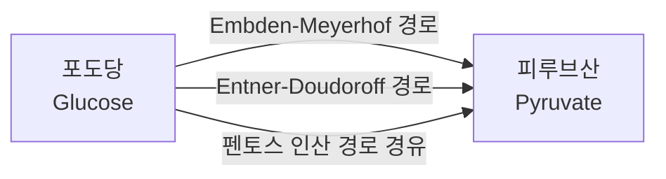

# 1. 대사(Metabolism)와 대사 네트워크

## 1.1 대사란 무엇인가?

**왜 이걸 배우나요?** 앞으로 이 책은 "반응", "대사물", "플럭스"라는 말을 계속 사용합니다. 이 용어들이 실제로 몸속에서 벌어지는 어떤 현상을 가리키는지 감이 잡히지 않으면, 이후 나오는 화학량론 행렬이나 FBA 수식은 그저 암기해야 할 기호 뭉치로 느껴질 것입니다. 이번 절의 목표는 단 하나 — "대사"와 "대사 네트워크"라는 말을 들었을 때 머릿속에 구체적인 그림이 떠오르게 만드는 것입니다.

**대사(Metabolism, 대사작용)**란 생명체가 생명 활동을 유지하기 위해 영양분을 에너지와 세포 구성 성분으로 전환하는 모든 화학 반응의 총칭입니다.

앞서 이야기했던 아침 식사로 돌아가 봅시다. 밥(탄수화물), 계란(단백질·지방), 우유(단백질·지방·당)는 소화관에서 잘게 분해된 뒤 소장에서 흡수됩니다. 이렇게 흡수된 작은 분자들은 혈액을 타고 온몸의 세포로 운송되며, 세포 안에서는 수천 가지의 화학 반응을 거쳐 다음 세 가지 용도로 쓰입니다.

1. **에너지 생산(Energy Production)**: 포도당(Glucose) 같은 분자가 산화되어 ATP(아데노신 삼인산, Adenosine Triphosphate)라는 "세포의 에너지 화폐"를 생성합니다. 여러분이 계단을 오르거나 생각을 할 때 소모하는 에너지가 바로 이 ATP에서 나옵니다.
2. **생체 분자 합성(Biosynthesis)**: 아미노산(Amino Acids)이 결합하여 단백질(Protein)을 만들고, 지방산이 결합하여 세포막을 형성합니다. 여러분의 근육, 머리카락, 세포막은 모두 이렇게 만들어진 것입니다.
3. **분해와 배출(Catabolism & Excretion)**: 노폐물과 독성 물질을 분해하여 체외로 배출합니다.

대사는 크게 두 방향으로 나뉩니다.

- **분해 대사(Catabolism)**: 복잡한 분자를 단순한 분자로 분해하며 에너지를 방출하는 과정입니다. 예를 들어 해당과정(Glycolysis, 글리콜라이스)에서 포도당 한 분자는 여러 단계를 거쳐 피루브산(Pyruvate) 두 분자로 쪼개지며, 이 과정에서 소량의 ATP가 만들어집니다.
- **합성 대사(Anabolism)**: 단순한 전구체(Precursor, 어떤 물질을 만들기 위한 출발 원료)로부터 복잡한 생체 분자를 만드는 과정입니다. 에너지를 소비합니다. 예를 들어 아미노산들이 순서대로 연결되어 하나의 단백질이 되는 과정이 여기 해당합니다.


💡 **팁:** "분해(catabolism)"와 "합성(anabolism)"을 헷갈린다면, "cata-"는 그리스어로 "아래로(down)", "ana-"는 "위로(up)"라는 뜻임을 기억하세요. 분해 대사는 큰 분자를 "아래로" 쪼개고, 합성 대사는 작은 분자를 "위로" 쌓아 올립니다.


아래 표는 분해 대사와 합성 대사의 대표적인 예시를 몇 가지 더 정리한 것입니다.

| 구분 | 대표 반응/경로 | 방향 | 에너지 관계 |
|:---|:---|:---|:---|
| 분해 대사(Catabolism) | 해당과정: 포도당 → 피루브산 | 큰 분자 → 작은 분자 | ATP 순생산 (2분자) |
| 분해 대사(Catabolism) | TCA 회로: 아세틸-CoA → CO$$_2$$ | 큰 분자 → 작은 분자 | NADH·FADH$$_2$$(추후 ATP로 전환되는 환원력) 생산 |
| 합성 대사(Anabolism) | 아미노산 → 단백질(번역) | 작은 분자 → 큰 분자 | ATP 소비 |
| 합성 대사(Anabolism) | 아세틸-CoA → 지방산 | 작은 분자 → 큰 분자 | ATP·NADPH 소비 |

> 🤔 **잠깐, 생각해보기.** 표에서 분해 대사는 ATP를 만들고 합성 대사는 ATP를 씁니다. 그렇다면 세포가 "성장(더 많은 단백질·지질을 합성)"하려면 분해 대사와 합성 대사 중 어느 쪽이 더 활발해야 할까요?

둘 다 활발해야 합니다 — 다만 균형이 중요합니다. 합성 대사가 요구하는 ATP·NADPH·전구체를 분해 대사가 충분히 공급하지 못하면 세포는 자랄 수 없습니다. 즉 성장이란 분해 대사가 만들어낸 에너지와 전구체를, 합성 대사가 세포 구성 성분으로 얼마나 효율적으로 전환하는가의 문제입니다. 이 "전환 효율"을 하나의 수식으로 표현한 것이 바로 [Chapter 3](../chapter-3/README.md)에서 배울 **생물량 반응(Biomass Reaction)**입니다.

**통화(currency) 대사물이라는 개념.** 위 표에서 ATP·NADH·NADPH가 여러 반응에 반복해서 등장한다는 점을 눈여겨보십시오. 이런 분자들을 **통화 대사물(Currency Metabolite)**이라고 부릅니다. 마치 어떤 나라에서든 "돈"이 상품과 교환되는 매개 수단이듯, ATP는 에너지가 필요한 모든 반응에서 "에너지 화폐"로 오가고, NAD(P)H는 산화·환원 반응 사이에서 "환원력 화폐"로 오갑니다. 통화 대사물은 특정 경로 하나에 속하는 것이 아니라 네트워크 전체를 가로질러 등장하기 때문에, 이후 [Chapter 2](../chapter-2/README.md)에서 화학량론 행렬을 그릴 때 매우 많은 반응과 연결된 "허브(hub)" 행으로 나타납니다.

> 🤔 **잠깐, 생각해보기.** 만약 세포 안의 ATP 재고가 갑자기 절반으로 줄어든다면, 이 영향은 해당과정 한 곳에만 머무를까요, 아니면 널리 퍼질까요?

널리 퍼집니다. ATP는 단백질 합성, DNA 복제, 막수송, 심지어 이 문장을 여러분이 눈으로 읽는 신경 신호 전달에도 관여하는 "만능 화폐"이기 때문에, ATP 공급에 문제가 생기면 그 여파는 특정 경로에 국한되지 않고 네트워크 전역으로 퍼집니다. 이것이 바로 대사 네트워크를 "국소적으로" 이해하는 것만으로는 부족하고, 전체를 하나의 시스템으로 다뤄야 하는 이유 중 하나입니다 — 이 논점은 §2에서 "시스템적 이해의 필요성"이라는 이름으로 다시 다룹니다.

## 1.2 대사 네트워크(Metabolic Network)의 개념

세포 내의 대사 반응들은 서로 연결되어 거대한 **대사 네트워크(Metabolic Network)**를 형성합니다. 하나의 반응이 끝나면 그 결과물이 곧바로 다음 반응의 재료가 되기 때문에, 반응 하나하나는 결코 고립된 사건이 아닙니다.

이를 이해하기 위해 도로 네트워크(Road Network)에 비유해 보겠습니다. 여러분이 사는 도시의 지도를 떠올려 보세요.

| 도로 네트워크 | 대사 네트워크 | 설명 |
|:---|:---|:---|
| 도로(Road) | 반응(Reaction) | 특정 출발지(기질, Substrate)에서 목적지(생성물, Product)로 물질을 실어 나릅니다. |
| 교차로(Intersection) | 대사물(Metabolite) | 한 반응의 생성물이 다음 반응의 기질이 되어 흐름이 이어집니다. |
| 통행료소/신호등 | 효소(Enzyme) | 효소가 있어야만 반응이 촉매되어 실제로 물질의 흐름(플럭스, Flux)이 발생합니다. 신호등이 고장 나면(효소가 없으면) 그 도로로는 차가 다니지 못합니다. |

이 비유에서 가장 중요한 통찰은 이것입니다: **도로(반응)는 교차로(대사물)를 통해서만 서로 연결되며, 하나의 교차로에는 여러 갈래의 도로가 모입니다.** 즉 대사 네트워크는 반응들이 일렬로 늘어선 사슬이 아니라, 사방으로 뻗어나가는 그물입니다. 이 반응과 대사물이 실제로 어떤 수학적 구조(화학량론 행렬)로 표현되는지는 [Chapter 2](../chapter-2/README.md)에서 자세히 다룹니다. 지금은 "네트워크"라는 그림을 머릿속에 그리는 것으로 충분합니다.

**연결성과 중복성 — 왜 그물망은 튼튼한가**

대사 네트워크의 핵심 특징은 **연결성(Connectivity)**과 **중복성(Redundancy, 여분의 경로가 존재함)**입니다. 예를 들어, 대장균(*E. coli*)은 포도당에서 피루브산(Pyruvate)을 생성하는 경로를 최소 3가지나 보유하고 있습니다.

1. **Embden-Meyerhof 해당과정(Glycolysis) 경로**: 가장 널리 쓰이는 주요 경로
2. **Entner-Doudoroff 경로**: 일부 세균에서 쓰이는 대안적 경로
3. **펜토스 인산 경로(Pentose Phosphate Pathway)**: 핵산 합성에 필요한 리보스와, 환원력을 담은 NADPH 생성을 병행하는 경로

아래 그림은 이 세 경로를 매우 단순화하여 나타낸 것입니다 (실제 경로는 각각 여러 단계의 반응으로 이루어지지만, 여기서는 "포도당에서 피루브산으로 가는 세 갈래 길"이라는 개념만 보여줍니다).

이러한 중복성은 세포가 한 경로가 막혔을 때(예: 유전자 돌연변이로 효소가 실활되었을 때) 대안 경로를 사용하여 생존할 수 있게 하는 **강건성(Robustness, 외부 교란에도 기능을 유지하는 성질)**을 제공합니다.

> 🤔 **잠깐, 생각해보기.** 만약 Embden-Meyerhof 경로의 핵심 효소를 담당하는 유전자를 통째로 없앤다면, 대장균은 반드시 죽을까요?

정답은 "아니요, 꼭 그렇지는 않다"입니다. 위 그림처럼 대안 경로(Entner-Doudoroff, 펜토스 인산 경로)가 있다면 세포는 여전히 포도당을 피루브산으로 바꿀 수 있습니다. 다만 대안 경로는 보통 ATP 생산 효율이 다르기 때문에, 세포는 **살아남되 더 느리게 자랄 가능성**이 높습니다. "죽는다/산다"의 이분법이 아니라 "성장률이 얼마나 떨어지는가"라는 정량적 질문이 되는 것이며, 바로 이 정량적 답을 계산해 내는 것이 GEM의 역할입니다.

## 1.3 그래프로 본 대사 네트워크: 마디와 차수

앞서 도로 네트워크 비유를 조금 더 형식적으로 다듬어 보겠습니다. 대사 네트워크는 수학적으로 **그래프(Graph)** — 마디(node)와 그 마디를 잇는 간선(edge)의 모음 — 로 볼 수 있습니다. 다만 대사 네트워크에는 마디의 종류가 두 가지입니다: 대사물(Metabolite)과 반응(Reaction). 이렇게 두 종류의 마디가 서로 다른 종류끼리만 연결되는 그래프를 **이분 그래프(Bipartite Graph)**라고 부르는데, 그 정확한 정의와 그리는 법은 [Chapter 2](../chapter-2/README.md)에서 다룹니다. 지금은 한 가지 개념만 가져가면 충분합니다: 그래프에서 어떤 마디에 연결된 간선의 개수를 **차수(Degree)**라고 하며, 대사 네트워크에서는 이 차수가 대사물마다 크게 다릅니다.

- ATP, NADH, 물(H$$_2$$O), 무기 인산과 같은 통화 대사물은 차수가 매우 높습니다 — 수십, 심지어 수백 개의 반응에 관여합니다.
- 어느 한 경로에서만 등장하는 특이 중간산물(예: 해당과정의 중간체 하나)은 차수가 낮습니다 — 대개 2개(그 물질을 만드는 반응 하나, 소비하는 반응 하나) 정도입니다.

이렇게 소수의 마디가 매우 높은 차수를 갖고 대부분의 마디는 낮은 차수를 갖는 분포를, 통계학·네트워크 과학에서는 **척도 없는(Scale-free) 분포**에 가깝다고 부릅니다. 실제로 대사 네트워크는 이런 성질을 가진 대표적 생물학적 네트워크로 여러 문헌에서 보고되어 왔습니다.


💡 **팁:** "허브가 많은 네트워크가 왜 튼튼한가"는 항공 노선망을 떠올리면 이해하기 쉽습니다. 작은 지방 공항 하나가 문을 닫아도 전체 항공망은 크게 흔들리지 않지만, 인천공항 같은 허브가 문을 닫으면 전국이 영향을 받습니다. 대사 네트워크도 마찬가지입니다 — ATP 대사에 문제가 생기면 네트워크 전역이 흔들리지만, 특이 중간산물 하나를 만드는 반응이 사라지면 그 주변 국소적인 영향에 그치는 경우가 많습니다. 다만 이는 일반적 경향이며, §1.2에서 보았듯 대안 경로의 유무에 따라 실제 영향은 달라집니다.


이 그래프적 관점은 추상적인 그림 이상의 실용적 가치가 있습니다. "어떤 대사물의 차수가 높은가"를 세는 것만으로도 그 대사물이 네트워크에서 얼마나 중요한 역할을 하는지 짐작할 수 있고, 이는 [Chapter 9](../chapter-9/README.md)에서 다룰 그래프 신경망(GNN) 기반 예측의 기초 아이디어이기도 합니다. 지금 단계에서는 "대사 네트워크 = 대사물과 반응이라는 두 종류의 마디로 이루어진 그래프"라는 그림만 기억해두면 충분합니다.

## 1.4 대사 네트워크의 규모: 왜 "직관"만으로는 부족한가

지금까지는 "포도당 → 피루브산"이라는 아주 작은 조각만 보았습니다. 하지만 실제 생명체의 대사 네트워크는 이보다 훨씬 큽니다. 게놈 규모 대사 모델에서 다루는 네트워크의 규모는 생명체의 복잡도에 따라 다르지만, 어떤 경우에도 사람의 머릿속에서 손쉽게 추적할 수 있는 수준을 훨씬 넘어섭니다.

| 생명체 | 게놈 크기 | 대사 반응 수 | 대사물 수 | 흥미로운 특징 |
|:---|:---:|---:|---:|:---|
| *Mycoplasma genitalium* | 0.58 Mb | ~470 | ~400 | 자립적으로 생존 가능한 생명체 중 가장 작은 게놈 |
| *E. coli* K-12 | 4.6 Mb | ~2,700 | ~1,200 | 가장 잘 연구된 세균 |
| *S. cerevisiae* (효모) | 12.1 Mb | ~1,700 | ~1,400 | 진핵세포 대사의 모델 생물 |
| *Homo sapiens* (인간) | 3,200 Mb | ~13,000 | ~4,000 | 8개 이상의 세포 구획(compartment) 보유 |

> 🤔 **잠깐, 생각해보기.** 만약 여러분이 종이와 연필로 *Mycoplasma genitalium*의 470개 반응을 하나하나 손으로 그려서 네트워크 지도를 완성한 뒤, 유전자 하나를 지웠을 때 어떤 반응들이 영향받는지 손으로 추적한다고 상상해 보세요. 이 작업에 얼마나 걸릴까요? 그리고 이 생명체는 지구상에서 **가장 단순한** 자립 생존 세포라는 점을 기억하세요.

*Mycoplasma genitalium*조차 470개의 반응이 서로 얽혀 있어서, 유전자 하나의 영향을 손으로 추적하려면 최소 며칠, 어쩌면 몇 주가 걸릴 수 있습니다. 그런데 대장균은 이보다 6배, 인간은 이보다 30배 가까이 더 복잡합니다. 이것이 바로 다음 절에서 다룰, 계산 모델이 필요한 이유입니다.

이 표에서 알 수 있듯, 가장 단순한 자립 생존 세균조차 수백 개의 상호 연결된 반응을 인코딩하고 있습니다. 수천 개의 반응이 서로 얽혀 있는 네트워크에서 "유전자 X를 없애면 세포가 살아남을까?", "이 조건에서 세포는 어떤 부산물을 분비할까?"와 같은 질문에 직관만으로 답하는 것은 사실상 불가능합니다. 바로 이 지점에서 **계산 모델(Computational Model)**이 필요해지며, 이것이 다음 절에서 다룰 대사모델링의 동기입니다.


❓ **흔한 오해:** "반응 수가 많을수록 그 생명체가 더 복잡하고 우월하다"고 생각하기 쉽습니다. 하지만 표를 자세히 보면 *S. cerevisiae*(효모, 반응 ~1,700개)는 *E. coli*(반응 ~2,700개)보다 반응 수가 적은데도 진핵세포라는 훨씬 복잡한 구조(핵, 미토콘드리아 등 여러 세포 구획)를 가지고 있습니다. 즉 반응의 "개수"와 세포의 "구조적 복잡성"은 서로 다른 축입니다 — 후자는 [Chapter 3](../chapter-3/README.md)에서 다룰 구획화(compartmentalization)와 더 관련이 깊습니다. 반응 수는 어디까지나 대사 능력의 한 가지 지표일 뿐, 생명체의 우열을 가르는 잣대가 아닙니다.


**미리 보기 — 이 절에서 다음 절로.** 지금까지 우리는 "대사 네트워크는 그물망이며, 그 규모는 사람의 직관을 넘어선다"는 것을 확인했습니다. 그런데 "규모가 크다"는 사실 자체만으로 계산 모델이 반드시 필요하다고 결론지을 수는 없습니다 — 어쩌면 몇 가지 경험 법칙(rule of thumb)만으로도 충분할지 모릅니다. 다음 절 [§2](02.md)에서는 이 질문을 더 구체적인 숫자로 파고들어, 계산 모델이 왜 "있으면 좋은 것"이 아니라 "없이는 답할 수 없는 것"인지를 보입니다.

---
