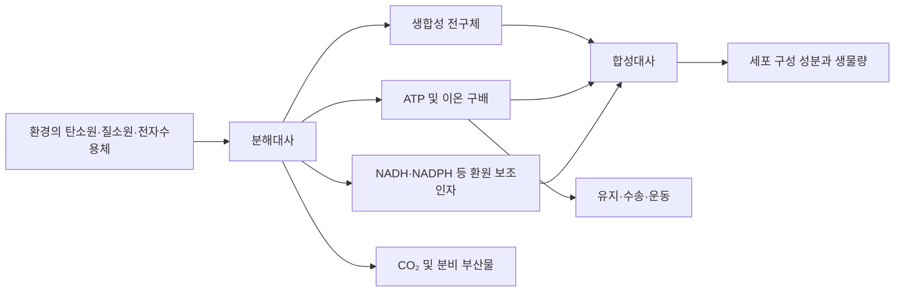
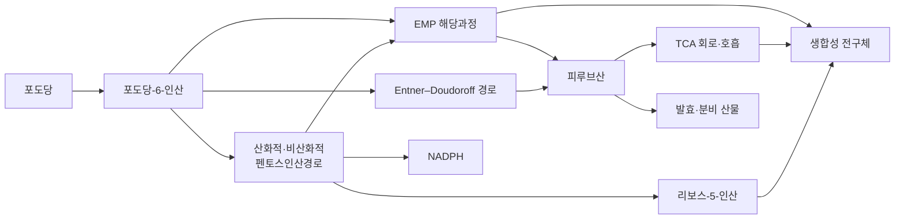

# 1. 대사와 대사 네트워크

세포 안에서는 물질이 끊임없이 다른 물질로 바뀐다. 대사모델링은 이 과정을 컴퓨터에서 다루기 위해 **대사물(metabolite)**, **반응(reaction)**, **플럭스(flux; 대사 통량)**라는 세 종류의 객체로 표현한다. 대사물은 반응에 참여하는 물질이고, 반응은 물질이 바뀌는 규칙이며, 플럭스는 저장된 반응 방향에 대한 진행률이다. 플럭스의 정규화 단위는 모델과 분석 조건에 따라 명시한다. 이 모델 객체는 실제 세포를 단순화한 표현이다. 따라서 이후 화학량론 행렬과 플럭스 균형 분석을 읽을 때에는 실제 세포의 현상과 모델이 표현하는 범위를 구분해야 한다.

## 1.1 생화학적 대사와 모델의 대사

**대사(metabolism)**는 생명체가 물질과 에너지를 얻고, 바꾸고, 나누고, 내보내는 데 관여하는 화학 반응 전체를 뜻한다. 여기에는 영양소를 분해하는 일뿐 아니라 여러 기능이 함께 들어간다. 세포 구성 성분을 합성하고, 산화·환원 보조인자를 재생하며, 이온 구배와 세포 항상성을 유지하고, 대사 부산물을 배출하는 일이 모두 대사다. 그래서 대사를 “영양분을 에너지로 바꾸는 과정”이라고만 정의하면 생합성과 항상성 유지 기능이 빠진다.

게놈 규모 대사 모델(genome-scale metabolic model, GEM)은 이러한 생화학 전체를 그대로 복제하지 않는다. 일반적인 GEM은 다음 범위에 초점을 둔다.

- 유전자 또는 생화학적 근거가 있는 효소 촉매 반응
- 세포 [구획](../glossary.md) 사이의 [수송 반응](../glossary.md)
- 세포와 환경 사이의 교환을 나타내는 [경계 반응](../glossary.md)
- 성장과 유지 요구량을 모아 표현한 바이오매스·[ATP 유지](../glossary.md) 의사반응

반면 표준 화학량론적 GEM은 대부분의 세부 기작을 명시적으로 담지 않는다. 전사 조절, 효소 농도의 시간 변화, 대사물 농도, 신호전달, 거대분자 중합의 상세 기작이 여기에 해당한다. 그러므로 “세포 대사”와 “특정 GEM이 표현하는 반응 집합”은 같은 범주의 개념이 아니다.

### 대사물, 반응, 플럭스

반응 $$j$$를 다음과 같이 나타내자.

$$
\sum_i \nu_{ij}^{-}X_i \longrightarrow \sum_i \nu_{ij}^{+}X_i
$$

$$X_i$$는 화학종, $$\nu_{ij}^{-}$$와 $$\nu_{ij}^{+}$$는 각각 반응물과 생성물의 비음수 화학량론 계수이다. 순 화학량론 계수는

$$
S_{ij}=\nu_{ij}^{+}-\nu_{ij}^{-}
$$

로 정의한다. 따라서 반응에서 소비되는 대사물은 $$S_{ij}<0$$, 생성되는 대사물은 $$S_{ij}>0$$이다.

**대사물(metabolite)**은 모델에서 하나의 행으로 표현되는 화학종이다. 동일한 분자라도 양성자화 상태, 전하 또는 세포 구획이 다르면 서로 다른 대사물로 취급할 수 있다. 예를 들어 세포질 피루브산과 미토콘드리아 피루브산은 화학 구조가 같더라도 서로 다른 행을 차지하며, 두 행 사이의 물질 이동에는 별도의 수송 반응이 필요하다.

**반응(reaction)**은 하나 이상의 대사물을 정해진 화학량론으로 소비하고 생성하는 변환 규칙이며, 화학량론 행렬의 한 열에 해당한다. 많은 세포 내 반응은 효소가 촉매하지만, 모든 모델 반응이 효소 한 개와 일대일 대응하지는 않는다. 자발 반응, 확산·수송, 교환 반응 및 바이오매스 의사반응은 유전자 연관이 없을 수 있고, 효소 복합체나 동위효소 때문에 하나의 반응에 여러 유전자가 연결될 수도 있다.

**[플럭스(flux)](../glossary.md)** $$v_j$$는 반응 $$j$$가 진행되는 속도이다. 배양 세포의 GEM에서는 흔히 $$\mathrm{mmol\,gDW^{-1}\,h^{-1}}$$ 단위로 나타낸다. 즉 건조 세포 질량 1 g이 1시간 동안 처리하는 물질량으로 정규화한다. 여기서 주의할 점이 있다. 플럭스는 대사물의 양이나 농도가 아니다. 표준 FBA가 계산하는 것도 농도 변화가 아니라, 주어진 제약을 만족하는 반응 속도 벡터이다. 플럭스의 부호는 모델에 기록된 반응 방향을 기준으로 한다. 따라서 음의 값은 반응이 기록된 방향의 반대로 진행된다는 뜻이다.

| 용어 | 생화학적 대상 | GEM에서의 표현 | 해석상의 주의 |
|:---|:---|:---|:---|
| 대사물 $$X_i$$ | 구분 가능한 화학종 | $$\mathbf{S}$$의 행 | 구획·전하가 다르면 별도 객체가 될 수 있음 |
| 반응 $$R_j$$ | 화학적 전환 또는 수송 | $$\mathbf{S}$$의 열 | 효소나 유전자와 반드시 일대일 대응하지 않음 |
| 화학량론 계수 $$S_{ij}$$ | 반응당 소비·생성 몰수 | 음수: 소비, 양수: 생성 | 반응 속도나 조절 강도를 뜻하지 않음 |
| 플럭스 $$v_j$$ | 반응 진행률 | 최적화 문제의 연속 변수 | 농도·효소 활성·분자 개수와 구분해야 함 |

예를 들어 $$\mathrm A+2\mathrm B\rightarrow\mathrm C$$를 반응 $$R$$로 저장하면 $$R$$ 열은 $$(S_{A,R},S_{B,R},S_{C,R})=(-1,-2,+1)$$이다. 계수는 무차원 몰비이고, $$v_R=3\ \mathrm{mmol\,gDW^{-1}\,h^{-1}}$$라면 이 반응의 기여는 $$(-3,-6,+3)\ \mathrm{mmol\,gDW^{-1}\,h^{-1}}$$이다. 같은 참여 관계를 이분 그래프로 그리면 연결은 보이지만, 이 값이나 실제 플럭스 분배는 정해지지 않는다.

## 1.2 분해대사와 합성대사의 결합

대사는 기능적으로 **분해대사(catabolism)**와 **합성대사(anabolism)**로 구분할 수 있다. 분해대사는 유기물을 산화하거나 분해하면서 자유에너지와 환원력을 회수한다. 합성대사는 전구체와 에너지를 사용하여 단백질, 핵산, 지질, 세포벽 성분과 같은 세포 구성 물질을 만든다. 구연산 회로처럼 에너지 획득과 생합성 전구체 공급에 모두 기여하는 경로는 **양면대사 경로(amphibolic pathway)**에 해당한다. 따라서 “큰 분자의 분해”와 “작은 분자의 조립”만으로 모든 대사 반응을 분류할 수는 없다.

두 대사 부문은 ATP와 산화·환원 보조인자를 매개로 결합된다.

- ATP 가수분해는 열역학적으로 불리한 생합성·수송·기계적 일을 구동한다.
- NADH와 $$\mathrm{FADH_2}$$는 주로 이화 과정에서 얻은 전자를 호흡계 등에 전달한다.
- NADPH는 여러 생합성 반응과 항산화계에 환원력을 제공한다.
- 탄소 골격은 중심탄소대사에서 분기되어 아미노산·뉴클레오타이드·지질 합성으로 유입된다.

*그림 1.2. 물질, 에너지 및 환원력의 관점에서 본 분해대사와 합성대사의 결합. 화살표는 개별 반응이 아니라 기능적 물질·에너지 전달을 나타낸다. 저자 작성; 개념 근거: Clark, Douglas & Choi, [OpenStax Biology 2e, §6.1](https://openstax.org/books/biology-2e/pages/6-1-energy-and-metabolism), CC BY-NC-SA 4.0.*

ATP나 NAD(P)H는 수많은 반응에 되풀이해 등장한다. 그래서 이들을 흔히 **[통화 대사물](../glossary.md)(currency metabolite)**이라 부른다. 마치 여러 거래에 두루 쓰이는 화폐 같다는 뜻의 비유다. 다만 이는 기능적 비유일 뿐 엄밀한 화학 분류가 아니다. 특히 ATP가 많은 반응과 연결되어 있다고 해서, 그 사실만으로 ATP를 필수적이거나 조절을 지배하는 물질로 단정해서는 안 된다. 연결 차수는 네트워크를 어떤 그래프로 그렸는지, 물·양성자·보조인자를 포함했는지에 따라 크게 달라지기 때문이다.

## 1.3 대사 네트워크의 수학적 구조

대사 네트워크는 세 가지로 정의할 수 있다. 대사물 집합 $$M$$, 반응 집합 $$R$$, 그리고 두 집합 사이의 화학량론적 관계다. 이를 그림으로 가장 곧이곧대로 옮기면 **이분 그래프(bipartite graph)**가 된다. 이분 그래프는 대사물 노드와 반응 노드를 서로 다른 종류로 나누어 표시한다. 대사물 $$i$$와 반응 $$j$$ 사이에는 $$S_{ij}\neq0$$일 때 간선이 놓이고, 계수의 부호로 소비와 생성을 구분한다. 반응 하나에는 여러 반응물과 생성물이 함께 참여할 수 있다. 그래서 대사물만 서로 잇는 단순 그래프보다, **대사물 노드와 반응 노드를 모두 남기는 이분 그래프**가 반응의 참여 관계를 더 잘 보존한다. 여기서는 이분 그래프까지만 이해하면 충분하다.

다음 도식은 *Escherichia coli* 중심탄소대사의 일부를 경로 수준으로 축약한 것이다.

*그림 1.3. 대장균 중심탄소대사의 주요 분기와 재합류 지점을 나타낸 경로 수준 모식도. 각 상자는 여러 효소 반응을 합친 것이며, 세 경로가 모든 조건에서 동등하게 활성이라는 뜻은 아니다. 저자 작성; 실험적 근거: Long et al. (2016), [doi:10.1016/j.ymben.2016.05.006](https://doi.org/10.1016/j.ymben.2016.05.006); Hollinshead et al. (2016), [doi:10.1186/s13068-016-0630-y](https://doi.org/10.1186/s13068-016-0630-y).*

그림 1.3에서 포도당-6-인산과 피루브산은 여러 경로가 갈라지거나 다시 만나는 대사물이다. 그러나 경로도의 연결선만 보고 실제 플럭스 분배를 정할 수는 없다. 어느 경로가 실제로 쓰이는지는 조건마다 다르며, 반응 방향성, 기질 공급, 효소 용량, 전사 조절, 세포의 생리 상태에 달려 있다. 화학량론 행렬은 가능한 연결과 물질수지를 나타낼 뿐, 이 정보만으로 실제 세포의 유일한 플럭스 상태를 짚어 주지는 않는다.

## 1.4 대체 경로와 강건성의 조건부 성격

같은 대사 기능을 해낼 수 있는 반응 집합이 네트워크에 둘 이상 있으면, 이를 **구조적 대체성(structural redundancy)**이라 부른다. 한 경로가 막혀도 다른 경로가 대신할 여지가 있다는 뜻이다. 구조적 대체성은 유전자 결손이나 환경 변화에 대한 강건성을 줄 수 있다. 다만 다음 조건을 모두 만족해야 실제로 우회 플럭스가 흐른다.

1. 대체 경로의 효소 유전자가 존재하고 발현되어야 한다.
2. 모든 반응이 주어진 대사물 농도와 열역학 조건에서 올바른 방향으로 진행할 수 있어야 한다.
3. 수송체와 보조인자 재생 경로를 포함한 연결 반응이 가동되어야 한다.
4. 대체 경로의 용량이 성장과 유지 요구량을 감당해야 한다.

예를 들어 *E. coli* K-12는 EMP, 펜토스인산, Entner–Doudoroff(ED) 경로에 관련된 반응을 모두 가지고 있다. 그러나 포도당에서 자라는 야생형 세포에서는 ED 경로의 기여가 작을 수 있다. `pfkA` 결손이나 ED 효소 과발현 같은 교란을 준 뒤에야 플럭스가 재배치되기도 한다. 그러므로 경로도에 우회로가 그려져 있다는 사실만으로 결손 표현형을 단정할 수 없다. 실제 연구에서도 중심탄소대사 결손주는 결손 유전자와 배양 조건에 따라 성장률, 기질 흡수, 부산물 분비, 내부 플럭스가 제각기 다르게 변했다([Long et al., 2016](https://doi.org/10.1016/j.ymben.2016.05.006)).

그래프의 차수 분포를 읽을 때도 같은 주의가 필요하다. 초기 연구는 대사 네트워크를 척도 없는 네트워크로 기술했다. 그런데 대사물끼리만 잇는 투영에서는 ATP·물·양성자 같은 통화 대사물을 매개로, 생화학적으로 아무 관계도 없는 변환이 곧장 이어져 버릴 수 있다. 대신 원자 또는 특정 화학 부분이 실제로 어느 반응으로 전달되는지까지 보존해 경로를 정의하면, 평균 경로 길이와 연결 구조가 달라진다([Arita, 2004](https://doi.org/10.1073/pnas.0306458101)). 그러므로 “연결 차수가 높다”와 “그 대사물이 기능적으로 필수다”는 서로 다른 명제다. 필수성은 네트워크 구조만으로 판단할 수 없고, 경계조건과 목적·대사 작업을 명시한 뒤 교란 분석으로 평가해야 한다.

## 1.5 네트워크 규모는 모델 버전의 속성이다

반응 수와 대사물 수는 생물 종에 고정된 특성이 아니다. 재구축 범위, 구획 수, 경계·의사반응을 포함했는지 여부, 릴리스 버전에 따라 달라진다. 그래서 규모를 비교할 때는 반드시 어떤 모델을 어떤 기준으로 셌는지 함께 밝혀야 한다.

| 비교 항목 | 보고에 함께 고정할 정보 |
|:---|:---|
| 모델 식별 | 정확한 릴리스·태그, 원본 파일의 SHA-256, 확인일 |
| 유전자 | GPR에 등장한 유전자만 셀지 등 객체 정의와 제외 규칙 |
| 반응 | exchange·demand·sink·pseudo-reaction 포함 여부 |
| 대사물 | 구획별 species를 셀지, chemical identity를 병합할지 |

현재 iML1515, Yeast8, Human1의 비교 수치는 이 교재의 검증 원장에 릴리스·불변 파일·집계 코드를 결박하지 않았으므로 확정값으로 제시하지 않는다. 세 모델명은 재구축의 예로만 사용하며, 수치 비교는 위 네 항목을 고정한 재집계 기록이 마련된 뒤에 한다.

이렇게 집계 기준을 고정하더라도 모델 규모는 생물학적 복잡성의 순위를 매기는 근거가 되지 않는다. 예를 들어 진핵생물에서는 같은 화학종이 여러 구획에 각각 기록되므로 대사물 행 수가 늘어난다. 반대로 큐레이션 정책이 엄격하거나 모델의 목적이 좁으면, 잘 연구된 생물이라도 반응 수가 더 적을 수 있다. 결국 모델 규모는 완전성을 가늠하는 단서 하나일 뿐이다. 질량·전하 균형, 주석 추적성, 대사 작업 수행, 표현형 검증과 함께 평가해야 한다.

## 1.6 대사 네트워크에서 화학량론 행렬로

대사 네트워크를 계산 모델로 옮기면, 각 반응의 화학량론 계수는 [화학량론 행렬](../glossary.md) $$\mathbf{S}\in\mathbb{R}^{m\times n}$$에, 각 반응의 플럭스는 벡터 $$\mathbf{v}\in\mathbb{R}^{n}$$에 담긴다. 이때 내부 대사물의 순 생성률은

$$
\frac{d\mathbf{x}}{dt}=\mathbf{S}\mathbf{v}
$$

로 나타낼 수 있다. [제약 기반 모델링](../glossary.md)은 관심 시간 척도에서 내부 대사물이 순축적되지 않는다고 근사하여 $$\mathbf{S}\mathbf{v}=\mathbf{0}$$을 부과한다. 이 식은 반응이 멈춘다는 뜻이 아니다. 각 내부 대사물에 대해 총 생성률과 총 소비률이 같아진다는 뜻이다. 다만 급격한 배지 전환, 세포주기 변화, 짧은 과도 상태처럼 대사물 풀이 실제로 변하는 현상에는 이 근사가 맞지 않을 수 있다.

이 절의 핵심 구분은 다음과 같다.

1. 대사물은 화학종이고, 반응은 화학량론적 변환이며, 플럭스는 그 변환의 속도이다.
2. 화학량론은 “무엇이 얼마나 전환되는가”를 규정하지만, 반응 속도와 조절 기작을 직접 제공하지 않는다.
3. 대체 경로의 존재는 잠재적 강건성을 의미할 뿐, 특정 조건에서의 실제 사용을 보장하지 않는다.
4. 반응·대사물 수는 생물 종 자체가 아니라 명시된 모델 릴리스와 집계 기준의 속성이다.

[Chapter 2](../chapter-2/README.md)에서는 이 정의를 바탕으로 화학량론 행렬을 구성하고, $$\mathbf{S}\mathbf{v}=\mathbf{0}$$이 허용하는 플럭스 공간을 분석한다.

---
