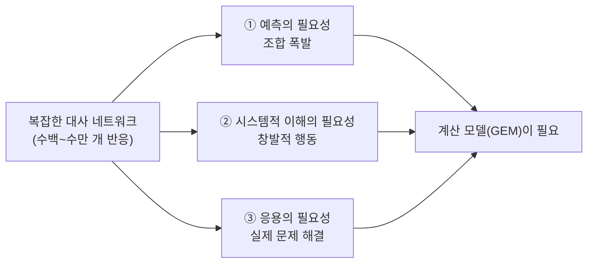

# 2. 왜 대사를 모델링하는가: 동기와 필요성

**왜 이걸 배우나요?** §1에서 우리는 "대사 네트워크가 사람의 직관을 넘어설 만큼 복잡하다"는 사실을 확인했습니다. 그런데 "복잡하다"는 것과 "계산 모델이 반드시 필요하다"는 것 사이에는 아직 논리적 거리가 있습니다. 복잡한 시스템이라도 오랜 경험과 직관, 몇 가지 경험 법칙(rule of thumb)만으로 충분히 다룰 수 있는 경우도 많기 때문입니다. 이번 절은 이 거리를 메웁니다 — "왜 하필 대사만큼은 직관이나 개별 실험만으로 부족하고, 계산 모델이 있어야만 하는가"를 구체적 숫자와 사례로 논증합니다.

대사 네트워크는 수천 개의 반응이 상호 연결된 복잡계이며, 각 반응의 속도는 효소 농도, 기질 농도, 조절 메커니즘 등 수많은 변수에 의해 결정됩니다. 이러한 복잡성을 다루기 위해 계산 모델이 요구되는 이유는 크게 세 가지로 요약할 수 있습니다.

## 2.1 예측의 필요성 — 조합의 폭발

실험만으로 모든 유전자 결실·환경 조합의 효과를 확인하는 것은 시간과 비용 면에서 비현실적입니다. 대장균의 유전자는 약 4,400개입니다. 이들의 **단일** 결실 효과만 실험적으로 모두 스크리닝하려 해도 4,400번의 별도 실험이 필요하고, 만약 **두 유전자를 동시에** 없애는 조합(이중 결손, double knockout)까지 고려한다면 그 경우의 수는 약 970만 가지(4,400 × 4,399 / 2)에 달합니다. 이를 모두 실험실에서 배양하고 관찰하는 것은 시간과 비용 면에서 현실적으로 불가능합니다. 계산 모델은 이러한 스크리닝을 컴퓨터 상에서 초 단위로 수행할 수 있게 합니다.

**손으로 짚어보는 조합 계산.** 이 숫자가 어디서 나오는지 직접 확인해 봅시다. $$n$$개의 유전자 중 서로 다른 2개를 고르는 조합의 수는 다음과 같이 계산합니다.

$$\binom{n}{2} = \frac{n(n-1)}{2}$$

여기서 $$n=4{,}400$$을 대입하면 다음과 같습니다.

$$\binom{4{,}400}{2} = \frac{4{,}400 \times 4{,}399}{2} = \frac{19{,}355{,}600}{2} = 9{,}677{,}800 \approx 970만$$

이 식에서 분모의 2는 "유전자 A와 B를 함께 없애는 것"과 "유전자 B와 A를 함께 없애는 것"이 같은 조합이므로 중복을 세지 않기 위한 것입니다.

> 🤔 **잠깐, 생각해보기.** 970만 가지 조합을 실험실에서 하나하나 배양 접시에 키워 확인한다고 상상해 보세요. 한 조합을 배양하고 결과를 확인하는 데 하루가 걸린다고 가정하면, 970만 일은 약 26,000년입니다. 반면 컴퓨터로 이 970만 가지 조합 각각에 대해 FBA를 한 번씩 실행하면 어느 정도 시간이 걸릴까요? (힌트: [Chapter 4](../chapter-4/README.md)에서 다룰 FBA 한 번은 일반적으로 1초 미만이 걸립니다.)

단순 계산으로도 970만 초는 약 112일입니다. 물론 일반 데스크톱 한 대로도 벅찬 규모지만, 여러 대의 컴퓨터에 나누어 병렬로 계산하면(예: 100대에 나누면 약 하루) 충분히 현실적인 시간 안에 끝낼 수 있습니다. "26,000년 vs 하루"라는 극단적인 차이가, 계산 모델이 왜 필요한지를 가장 직관적으로 보여주는 숫자입니다.

아래 표는 이 조합 폭발이 삼중 결손(triple knockout)까지 확장될 때 얼마나 더 가팔라지는지 보여줍니다.

| 결손 유전자 수 | 조합 수 (n = 4,400) | 하루 1개씩 실험할 때 걸리는 기간 |
|:---:|---:|:---|
| 1개(단일) | 4,400 | 약 12년 |
| 2개(이중) | 약 970만 | 약 26,000년 |
| 3개(삼중) | 약 141억 | 약 3,900만 년 |


💡 **팁:** 삼중 결손의 조합 수는 $$\binom{n}{3} = \frac{n(n-1)(n-2)}{6}$$로 계산합니다. 결손 유전자 수가 하나씩 늘 때마다 조합의 수는 곱셈적으로(multiplicatively) 증가한다는 것이 핵심입니다 — 이런 폭발적 증가를 **조합적 폭발(Combinatorial Explosion)**이라 부르며, 계산생물학 전반에서 계산 모델이 필요한 근본적 이유 중 하나입니다.


## 2.2 시스템적 이해의 필요성 — 부분의 합은 전체가 아니다

개별 반응이나 경로 각각을 이해하는 것과, 전체 네트워크가 하나의 시스템으로서 어떻게 행동하는지를 이해하는 것은 다른 문제입니다. 아세테이트 오버플로(Acetate Overflow, 포도당이 충분한 호기적 조건에서도 *E. coli*가 아세테이트를 분비하는 현상)가 좋은 예시입니다. 얼핏 생각하면 "산소가 충분한데 왜 완전히 산화시키지 않고 아세테이트라는 부산물을 배출할까?"라는 의문이 들 수 있는데, 이는 개별 효소 하나의 조절만으로는 설명되지 않으며, 네트워크 전체의 화학량론적·용량적 제약이 만들어내는 결과입니다(이 사례는 아래 §6.1 "Pre-genome 시대"에서 최초로 이를 규명한 연구와 함께 다시 다룹니다).

이런 현상을 **창발적 행동(Emergent Behavior)**이라고 부릅니다 — 시스템을 구성하는 부품 하나하나를 아무리 잘 알아도, 그 부품들이 함께 작동할 때만 비로소 드러나는 성질입니다. 오케스트라에 비유하면, 바이올린 연주자 한 명, 첼로 연주자 한 명 각각의 연주 실력을 아무리 자세히 안다고 해도 "이 오케스트라가 함께 연주했을 때 어떤 화음이 나오는가"는 개별 연주자 정보만으로는 예측하기 어렵습니다. 화음은 여러 악기가 **동시에, 서로 맞물려** 연주될 때만 나타나는 성질이기 때문입니다. 대사 네트워크의 아세테이트 오버플로도 마찬가지로, 해당과정 효소 하나, TCA 회로 효소 하나를 따로따로 아무리 자세히 연구해도 "왜 세포 전체가 이런 부산물을 분비하기로 선택하는가"는 설명되지 않고, 네트워크 전체의 화학량론과 용량 제약을 함께 볼 때 비로소 답이 보입니다.

> 🤔 **잠깐, 생각해보기.** 만약 여러분이 아세테이트 오버플로를 일으키는 단일 효소를 찾아내어 그 효소만 억제하는 약을 개발한다면, 이 문제가 해결될까요?

꼭 그렇지는 않습니다. 이 현상이 네트워크 전체의 용량 제약에서 비롯된다면, 특정 효소 하나를 억제하더라도 세포는 다른 경로로 우회하여 비슷한 결과(어떤 형태로든 과잉 탄소를 배출)를 만들어낼 수 있습니다. 이것이 바로 개별 요소가 아니라 **시스템 수준**에서 문제를 봐야 하는 이유이며, 대사공학에서 유전자 하나만 조작하는 전략보다 여러 반응을 동시에 고려하는 전략([Chapter 8](../chapter-8/README.md)의 균주 설계)이 더 자주 성공하는 이유이기도 합니다.

## 2.3 응용의 필요성 — 실제 문제에 답하기

대사모델링은 이미 다양한 실용적 문제에 답을 제공하고 있습니다.

- 어떤 유전자를 결실시켜야 목표 화합물(예: 바이오 연료, 아미노산)의 수율이 높아지는가 → [Chapter 8](../chapter-8/README.md)
- 병원체의 어떤 대사 유전자가 약물 표적이 될 수 있는가 → [Chapter 7](../chapter-7/README.md)
- 특정 환자·조직의 대사 이상을 어떻게 예측할 수 있는가 → [Chapter 5](../chapter-5/README.md), [Chapter 7](../chapter-7/README.md)

이 세 가지 응용 사례에는 공통된 패턴이 있습니다: 모두 "수많은 후보 중 어느 것이 원하는 결과를 낳는가"를 묻는 **탐색(search)** 문제라는 점입니다. 균주 설계는 수천 개의 유전자 결손 후보 중에서, 약물 표적 발굴은 수백 개의 필수 유전자 후보 중에서, 대사 이상 예측은 수많은 가능한 대사 경로 이상 중에서 답을 찾습니다. 앞서 §2.1에서 본 "조합 폭발" 문제가 이 모든 응용의 배경에 공통적으로 깔려 있는 셈입니다.

| 응용 분야 | 탐색하는 대상 | 담당 장 |
|:---|:---|:---|
| 대사공학·균주 설계 | 수천 개의 유전자 결손·과발현 조합 | [Chapter 8](../chapter-8/README.md) |
| 약물 표적 발굴 | 병원체의 필수 유전자 후보 | [Chapter 7](../chapter-7/README.md) |
| 질병·대사 이상 예측 | 환자·조직 특이적 대사 재구성 패턴 | [Chapter 5](../chapter-5/README.md), [Chapter 7](../chapter-7/README.md) |
| 미생물군집 설계 | 균주 간 대사 교환 조합 | [Chapter 6](../chapter-6/README.md) |

> **핵심 개념 · 용어(English):** **게놈 규모 대사 모델(Genome-scale Metabolic Model, GEM)**은 생명체의 게놈 서열에서 추론된 모든 대사 반응을 수학적으로 표현한 계산 모델로, 앞서 말한 예측·이해·응용의 필요성에 답하기 위해 고안되었습니다.


❓ **흔한 오해:** "계산 모델이 있으면 실험은 더 이상 필요 없다"고 생각하기 쉽습니다. 사실은 정반대에 가깝습니다. GEM은 수백만 가지 후보 중 유망한 소수를 빠르게 걸러내는 **필터** 역할을 할 뿐, 최종 결론은 여전히 실험으로 검증해야 합니다. §2.1의 예로 돌아가면, 컴퓨터가 970만 가지 조합 중 "성장에 큰 지장이 없어 보이는" 상위 몇십 개를 골라주면, 그 몇십 개만 실제로 배양해 확인하면 됩니다. 즉 계산 모델의 역할은 실험을 대체하는 것이 아니라 **실험할 후보의 수를 극적으로 줄여주는 것**입니다.


이러한 동기에서 출발하여, 다음 절에서는 GEM이 구체적으로 무엇을 의미하는지 정의합니다.

---
