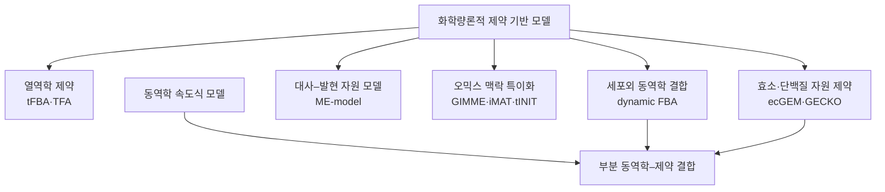

# 4. 제약 기반 모델과 동역학 모델

대사 네트워크의 계산 표현은 연구 질문에 따라 달라진다. [제약 기반 모델링](../glossary.md)(constraint-based modeling, CBM)은 정상 상태 물질수지와 반응 경계가 허용하는 **상태의 집합**을 분석한다. [동역학 모델링](../glossary.md)(kinetic modeling)은 반응 속도를 농도와 매개변수의 함수로 지정하여 **시간에 따른 상태 변화**를 계산한다. 두 접근은 동일한 화학량론 행렬을 공유할 수 있지만, 필요한 자료와 예측 대상이 다르다.

## 4.1 제약 기반 모델링

대사물 $$m$$개와 반응 $$n$$개를 갖는 모델에서 화학량론 행렬을 $$\mathbf{S}\in\mathbb{R}^{m\times n}$$, 플럭스 벡터를 $$\mathbf{v}\in\mathbb{R}^{n}$$라 하자. 표준 정상 상태 제약은

$$
\mathbf{S}\mathbf{v}=\mathbf{0}
$$

이고, 반응별 허용 범위는

$$
\mathbf{l}\leq\mathbf{v}\leq\mathbf{u}
$$

로 나타낸다. 두 조건의 교집합은 가능 플럭스 집합

$$
\mathcal{F}=\left\{\mathbf{v}\in\mathbb{R}^{n}:\mathbf{S}\mathbf{v}=\mathbf{0},\ \mathbf{l}\leq\mathbf{v}\leq\mathbf{u}\right\}
$$

을 정의한다. 경계 $$\mathbf{l},\mathbf{u}$$에는 다음 정보가 반영될 수 있다.

| 정보 | 경계조건의 예 | 해석 |
|:---|:---|:---|
| 반응 방향성 | 비가역 방향으로 $$v_j\geq0$$ | 큐레이션된 열역학·생화학적 방향성 |
| 배지 조성 | 포도당 교환 반응의 흡수 범위 | 환경에서 이용 가능한 기질 |
| 측정 플럭스 | $$v_j^{\mathrm{obs}}-\epsilon\leq v_j\leq v_j^{\mathrm{obs}}+\epsilon$$ | 섭취·분비 또는 내부 플럭스 자료 |
| 효소·수송 용량 | 유한한 $$u_j$$ | 촉매·막수송 능력에 대한 상한 |

방향성 경계 하나만으로 완전한 열역학적 타당성이 보장되지는 않는다. 농도 범위와 반응 Gibbs 자유에너지를 사용하는 열역학 기반 모델은 추가 제약을 필요로 하며, 내부 순환을 제거하는 loopless 조건도 별도의 분석이다.

### 목적함수와 대안 최적해

[플럭스 균형 분석](../chapter-4/README.md)(flux balance analysis, FBA)은 가능 집합 위에서 선형 목적함수 $$\mathbf{c}^{\mathsf T}\mathbf{v}$$를 최적화한다.

$$
\begin{aligned}
\max_{\mathbf v}\quad & \mathbf{c}^{\mathsf T}\mathbf v\\
\text{s.t.}\quad & \mathbf S\mathbf v=\mathbf0,\\
& \mathbf l\leq\mathbf v\leq\mathbf u
\end{aligned}
$$

목적 벡터 $$\mathbf{c}$$는 생물량, ATP 유지 또는 특정 산물의 생성 반응을 선택할 수 있다. 목적함수는 가능 집합을 하나의 생물학적 상태로 자동 변환하지 않는다. 같은 최적 목적값을 갖는 여러 플럭스 벡터가 존재할 수 있으므로, 솔버가 반환한 한 해를 유일한 예측으로 해석해서는 안 된다. FVA와 flux sampling은 이 비유일성을 분석한다.

다음 2반응 예제는 제약의 기하학적 역할만을 나타낸다.

$$
A \xrightarrow{v_1} B \xrightarrow{v_2} C,
\qquad v_1=v_2,
\qquad 0\leq v_1\leq10
$$

중간 대사물 $$B$$의 정상 상태 제약은 $$v_1=v_2$$를 강제한다. 비가역성과 용량 경계를 함께 적용하면 가능 집합은 $$(0,0)$$과 $$(10,10)$$을 잇는 선분이다. $$v_2$$를 최대화하면 $$(10,10)$$이 선택되지만, 목적을 지정하지 않으면 선분 위의 모든 점이 가능하다. 고차원 GEM에서도 같은 원리가 적용되며, 실제 가능 집합의 차원과 경계는 $$\mathbf{S}$$의 [rank](../glossary.md)뿐 아니라 유한한 bounds와 활성 제약에 의해 결정된다.

## 4.2 동역학 모델링

동역학 모델은 반응 속도를 대사물 농도 $$\mathbf{x}$$, 효소량 또는 조절 상태, 매개변수 $$\boldsymbol\theta$$의 함수로 지정한다.

$$
\frac{d\mathbf{x}}{dt}=\mathbf{S}\,\mathbf{r}(\mathbf{x},t;\boldsymbol\theta)
$$

필요하면 세포 부피 변화, 성장 희석, 유입·유출 및 효소 합성·분해 항을 추가한다. 단일 기질 효소 반응의 한 예는 Michaelis–Menten 식이다.

$$
r=\frac{V_{\max}[S]}{K_m+[S]}
=\frac{k_{\mathrm{cat}}[E]_{\mathrm{tot}}[S]}{K_m+[S]}
$$

그러나 모든 세포 반응이 이 식을 따르는 것은 아니다. 가역 반응, 다중 기질 반응, 협동성, 생성물 억제 및 알로스테릭 조절에는 다른 속도식이 필요하다. 동역학 모델의 품질은 속도식 구조, 매개변수 식별 가능성, 초기 농도와 실험 조건에 좌우된다.

동역학 모델은 정상 상태로 제한되지 않으며, 충분히 식별된 경우 대사물 농도의 시간 궤적과 과도 반응을 계산할 수 있다. 대신 게놈 규모의 모든 반응에 대해 일관된 속도식과 세포 내 매개변수를 확보하기 어렵다. 문헌의 $$K_m$$과 $$k_{\mathrm{cat}}$$은 생물종, 효소 아이소폼, pH, 온도 및 측정법이 다를 수 있으므로 단순 결합하면 불확실성이 커진다.

## 4.3 두 접근의 비교

| 항목 | 제약 기반 모델 | 동역학 모델 |
|:---|:---|:---|
| 기본 질문 | 어떤 정상 상태 플럭스가 가능한가 | 상태가 시간에 따라 어떻게 변하는가 |
| 핵심 변수 | 반응 플럭스 $$\mathbf v$$ | 농도·양·조절 상태 $$\mathbf x(t)$$ |
| 필수 자료 | 화학량론, bounds, 분석 조건 | 화학량론, 속도식, 매개변수, 초기조건 |
| 대표 계산 | [LP](../glossary.md)/[MILP](../glossary.md)/[QP](../glossary.md), [FVA](../glossary.md), sampling | ODE/DAE 적분, 정상 상태·안정성·매개변수 추정 |
| 농도 예측 | 표준 FBA만으로는 불가 | 상태변수와 매개변수가 정의된 범위에서 가능 |
| 비유일성·불확실성 | [대안 최적해](../glossary.md)와 bounds에 존재 | 매개변수·모델 구조·초기조건에 존재 |
| 확장성 | 수천~수만 반응 모델에 널리 적용 | 범위가 커질수록 매개변수 식별이 주요 병목 |
| 교란 분석 | GPR과 bounds를 통한 조건부 예측 | 효소·조절 변화를 속도식에 반영해야 함 |

모델 크기나 실행 시간을 고정된 숫자로 비교하는 것은 적절하지 않다. 작은 MILP가 큰 ODE보다 느릴 수 있고, 희소 Jacobian과 잘 식별된 구조를 사용하는 대규모 동역학 모델도 존재한다. 방법 선택은 규모보다 연구 질문, 가용 자료 및 검증 가능한 출력에 근거해야 한다.

## 4.4 확장 방법은 하나의 선형 스펙트럼이 아니다

제약 기반 모델과 동역학 모델 사이에는 여러 확장법이 존재하지만, 이를 “매개변수가 적은 방법에서 많은 방법으로” 이어지는 단일 순서로 배열하면 서로 다른 설계축이 혼동된다.

*그림 1.6. 대사모델 확장의 서로 다른 설계축. 화살표는 정확도나 복잡도의 순위를 뜻하지 않는다. 저자 작성; FBA 정식화: Orth et al. (2010), [doi:10.1038/nbt.1614](https://doi.org/10.1038/nbt.1614); dFBA: Mahadevan et al. (2002), [doi:10.1016/S0006-3495(02)73903-9](https://doi.org/10.1016/S0006-3495(02)73903-9); GECKO 3.0: Chen et al. (2024), [doi:10.1038/s41596-023-00931-7](https://doi.org/10.1038/s41596-023-00931-7).*

- **[열역학 기반 분석](../glossary.md)**은 대사물 농도 범위와 반응 자유에너지를 사용하여 방향성과 열역학적으로 불가능한 상태를 제한한다.
- **[효소 제약 GEM](../glossary.md)**은 플럭스와 효소량을 $$v_j\leq k_{\mathrm{cat},j}E_j$$와 같은 용량 관계로 연결한다. 누락된 $$k_{\mathrm{cat}}$$과 단백질체 커버리지가 주요 불확실성이다.
- **ME-model**은 대사뿐 아니라 전사·번역과 단백질 합성 비용을 화학량론적 자원배분 문제에 포함한다. 이것이 곧 모든 반응의 동역학식을 갖는다는 뜻은 아니다.
- **오믹스 통합법**은 발현 증거를 반응 선택 또는 bounds에 반영한다. [GIMME](../glossary.md)나 [iMAT](../glossary.md)은 동역학 모델이 아니라 맥락 특이적 제약 기반 방법이다.
- **[동적 FBA](../glossary.md)**는 세포외 기질·산물과 생물량의 동역학을 적분하면서 각 시간 단계에서 내부 FBA를 푼다. 내부 소분자 전체의 효소 동역학을 직접 계산하는 방법과 구별해야 한다.

## 4.5 방법 선택 기준

| 연구 질문 | 우선 고려할 접근 | 추가 검증 |
|:---|:---|:---|
| 배지에서 가능한 성장·분비 범위 | FBA, FVA, sampling | 성장률·섭취·분비 측정 |
| 대규모 결손 후보 순위화 | GPR 기반 FBA와 교란 분석 | 독립 결손·경쟁 배양 |
| 효소 용량과 단백질 비용 | ecGEM·자원배분 모델 | 정량 단백질체·효소활성 |
| 배치 배양의 세포외 농도 변화 | dynamic FBA | 시간별 배양 자료 |
| 짧은 대사 과도 상태·피드백 | 동역학 모델 | 시계열 대사체·동위원소 추적 |
| 일부 경로의 동역학과 전세포 자원 결합 | 하이브리드 모델 | 경계면의 단위·보존·매개변수 검증 |

제약 기반 모델은 가능한 상태를 좁히는 데 강하고, 동역학 모델은 시간적 기작을 검정하는 데 강하다. 어느 한 접근이 항상 우월한 것이 아니라, 예측할 양과 이용 가능한 자료에 맞춰 선택하거나 결합해야 한다.

---
