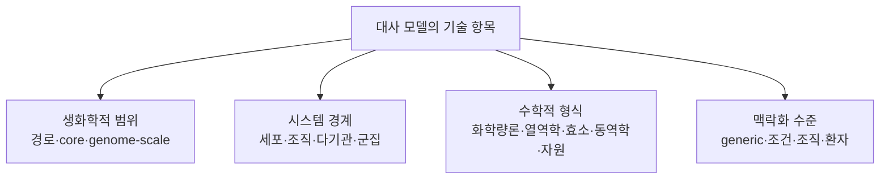

# 5. 대사 모델의 분류

iML1515, Human1, AGORA2, ecYeast8 및 ME-model은 서로 다른 기준으로 붙인 이름이다. 어떤 이름은 생물종과 재구축 버전을, 어떤 이름은 수학적 제약을, 또 다른 이름은 다중 생물 시스템의 조립 방식을 나타낸다. 따라서 모델을 하나의 선형 목록으로 분류하기보다 **생화학적 범위, 시스템 경계, 수학적 형식, 맥락화 수준**을 별도로 기술하는 편이 정확하다.

이 네 기준은 유용한 기술 축이지만 통계적으로 완전히 독립적이거나 각 축의 범주가 상호 배타적이라는 뜻은 아니다. 예를 들어 효소 제약 모델도 동시에 열역학 제약과 조직 특이적 발현 자료를 포함할 수 있고, 군집 모델은 구성원의 단일종 GEM을 결합하여 만든다.

*그림 1.7. 대사 모델을 기술하는 네 기준. 각 가지는 우열이나 규모 순서를 나타내지 않으며, 하나의 모델에 여러 수학적 태그가 동시에 적용될 수 있다. 저자 작성.*

## 5.1 생화학적 범위

생화학적 범위는 모델이 한 생물학적 단위 안에서 어느 정도의 반응 집합을 포함하는지를 나타낸다.

| 범위 | 정의 | 예시 | 주요 용도 |
|:---|:---|:---|:---|
| 경로 특이적 | 특정 경로나 대사 기능의 반응만 포함 | 해당과정 동역학 모델 | 상세 기작·매개변수 분석 |
| core 네트워크 | 중심 기능을 대표하는 축약 반응 집합 | COBRApy `textbook` 모델 | 교육·알고리듬 검증 |
| 게놈 규모 재구축 | 유전체가 지지하는 대사 능력을 체계적으로 포괄 | iML1515, Yeast8, Human1 | 전세포 수준 물질수지·교란 분석 |

“게놈 규모”는 반응 수의 임계값으로 정의되지 않는다. 게놈 주석과 문헌을 전체적으로 조사한 범위와 추적 가능한 재구축 절차가 핵심이며, 미확인 반응과 생물학적 누락이 존재할 수 있다. 반응 수는 버전과 큐레이션 정책에 따라 달라진다.

다중 종 군집 모델을 단일종 GEM보다 “더 큰 범위”로만 분류하는 것도 충분하지 않다. 군집 모델의 핵심은 여러 네트워크 사이의 교환과 공동 환경이라는 **시스템 경계**에 있으므로 다음 절의 별도 기준으로 다룬다.

## 5.2 시스템 경계와 생물학적 조직 수준

| 시스템 경계 | 모델링 대상 | 구조적 특징 | 예시 |
|:---|:---|:---|:---|
| 단일 세포·단일 종 | 한 균주 또는 세포형 | 하나의 세포 경계와 환경 | iML1515, Yeast8 |
| 조직·세포형 | 특정 조직 또는 세포 계통 | 범용 재구축의 맥락 특이화 | 간세포·암세포 모델 |
| 다기관·전신 | 조직 사이 혈액·대사물 교환 | 기관별 구획과 순환 경계 | whole-body metabolic model |
| 미생물 군집 | 둘 이상의 종 또는 균주 | 종별 구획, 공동 환경, cross-feeding | AGORA2 기반 MICOM 모델 |
| 숙주–미생물계 | 숙주 조직과 미생물 군집 | 서로 다른 생물 경계의 연결 | 장–간–미생물 통합 모델 |

AGORA2는 인체 장내 미생물 종의 단일종 재구축을 대규모로 모은 자원이며, 그 자체를 특정 표본의 군집 플럭스 예측 결과와 동일시해서는 안 된다. MICOM과 같은 도구는 표본의 조성 자료와 단일종 모델을 결합해 군집 최적화 문제를 구성한다.

## 5.3 수학적 형식과 추가 제약

수학적 형식은 단일 선택지가 아니라 누적 가능한 특성으로 기록한다.

| 태그 | 추가되는 정보 또는 식 | 대표 방법 | 해석상 핵심 |
|:---|:---|:---|:---|
| 화학량론적 제약 기반 | $$\mathbf S\mathbf v=0$$, bounds | FBA, FVA, sampling | 가능 플럭스 공간 |
| 열역학 기반 | $$\Delta_rG$$와 농도 범위 | TFA, thermodynamic FBA | 방향성과 에너지 타당성 강화 |
| 효소 제약 | $$v_j\leq k_{\mathrm{cat},j}E_j$$ | ecGEM, GECKO | 단백질 용량과 효소 비용 |
| 대사–발현 자원 모델 | 전사·번역·단백질 합성의 자원수지 | ME-model | 대사와 발현 자원의 결합 |
| 동역학 | $$d\mathbf x/dt=\mathbf S\mathbf r(\mathbf x;\theta)$$ | kinetic ODE model | 농도의 시간 변화 |
| 외부 동역학 결합 | 세포외 물질수지 + 반복 FBA | dynamic FBA | 배양 환경의 시간 변화 |
| 맥락 특이화 | 오믹스 기반 반응 선택·가중·bounds | GIMME, iMAT, tINIT | 조건별 반응 증거 통합 |

GIMME·iMAT·tINIT은 발현 자료를 사용하는 제약 기반 방법이며, 대사–발현 자원 모델이나 효소 동역학 모델과 같은 범주가 아니다. ME-model 역시 대사와 발현을 화학량론적 자원 요구량으로 결합한 모델이지 모든 반응의 속도상수를 갖는 ODE 모델을 뜻하지 않는다.

## 5.4 맥락화 수준

범용 재구축(generic reconstruction)은 대상 생물이나 기관이 가질 수 있는 대사 능력의 합집합을 지향한다. 실제 분석에서는 다음 자료로 조건을 구체화한다.

- 배지 조성, 산소 공급 및 섭취·분비 속도
- 조직·세포형의 전사체와 단백질체
- 환자별 유전 변이 또는 효소 결핍
- 미생물군집의 종 조성과 상대 풍부도
- 성장, ATP 유지, 분비 또는 대사 작업과 같은 분석 목적

같은 Human1 재구축으로부터 간, 근육, 암 세포주 또는 환자별 모델을 만들 수 있다. 이 파생 모델들은 반응 수가 작다고 해서 자동으로 품질이 높거나 낮은 것이 아니다. 보호해야 할 대사 작업, 데이터 임계값, 알고리듬 및 외부 검증이 함께 기록되어야 한다.

## 5.5 대표 모델의 다축 기술

| 모델·자원 | 생화학적 범위 | 시스템 경계 | 수학적 형식 | 맥락화 |
|:---|:---|:---|:---|:---|
| COBRApy `textbook` | core | 단일 *E. coli* 세포 | 화학량론적 CBM | 고정 교육용 배지 |
| iML1515 | genome-scale | 단일 *E. coli* 균주 | 화학량론적 CBM | 분석 시 배지 지정 |
| Human1 | genome-scale | 범용 인체 세포 | 화학량론적 CBM | generic reconstruction |
| ecYeast8 | genome-scale | 단일 효모 세포 | 화학량론 + 효소 제약 | 배양·단백질 조건 의존 |
| AGORA2 기반 표본 모델 | genome-scale 구성원 집합 | 미생물 군집 | 다종 화학량론적 CBM | 표본별 종 조성·배지 |
| *E. coli* ME-model | genome-scale 대사·발현 | 단일 세포 | 화학량론 + 발현 자원 | 성장 조건 의존 |

모델 이름만으로 분석 가능성을 판단해서는 안 된다. 최소한 사용한 릴리스, 시스템 경계, 활성화한 추가 제약, 배지, 목적함수 및 맥락화 자료를 확인해야 한다. 이러한 정보가 있어야 서로 다른 연구의 결과를 재현하고 비교할 수 있다.

---
