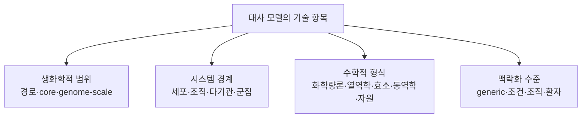

# 5. 대사 모델의 분류

iML1515, [Human1](../landmark-papers.md), [AGORA2](https://doi.org/10.1038/s41587-022-01628-0), ecYeast8, ME-model은 모두 이름이지만, 붙인 기준이 제각각이다. 어떤 이름은 생물종과 재구축 버전을, 어떤 이름은 수학적 제약을, 또 어떤 이름은 여러 생물을 조립한 방식을 가리킨다. 그래서 이 모델들을 한 줄로 늘어놓아 분류하기보다, **생화학적 범위, 시스템 경계, 수학적 형식, 맥락화 수준**이라는 네 가지를 따로 적어 두는 편이 정확하다.

이 네 기준은 모델을 기술하는 유용한 축이다. 다만 네 축이 통계적으로 완전히 독립이라거나, 한 축 안의 범주끼리 서로 배타적이라는 뜻은 아니다. 예를 들어 효소 제약 모델이 열역학 제약과 조직 특이적 발현 자료를 함께 담을 수 있고, 군집 모델은 구성원 각각의 단일종 GEM을 합쳐서 만든다.

*그림 1.7. 대사 모델을 기술하는 네 기준. 각 가지는 우열이나 규모 순서를 나타내지 않으며, 하나의 모델에 여러 수학적 태그가 동시에 적용될 수 있다. 저자 작성.*

## 5.1 생화학적 범위

생화학적 범위는 모델이 한 생물학적 단위 안에서 어느 정도의 반응 집합을 포함하는지를 나타낸다.

| 범위 | 정의 | 예시 | 주요 용도 |
|:---|:---|:---|:---|
| 경로 특이적 | 특정 경로나 대사 기능의 반응만 포함 | 해당과정 동역학 모델 | 상세 기작·매개변수 분석 |
| core 네트워크 | 중심 기능을 대표하는 축약 반응 집합 | COBRApy `textbook` 모델 | 교육·알고리듬 검증 |
| 게놈 규모 재구축 | 유전체가 지지하는 대사 능력을 체계적으로 포괄 | iML1515, Yeast8, Human1 | 전세포 수준 물질수지·교란 분석 |

“게놈 규모”는 반응이 몇 개 이상이면 된다는 식의 기준선으로 정의되지 않는다. 핵심은 게놈 주석과 문헌을 전체적으로 훑은 범위, 그리고 추적 가능한 재구축 절차다. 그 안에도 아직 확인되지 않은 반응이나 빠진 생물학이 남아 있을 수 있다. 반응 수 자체는 버전과 큐레이션 정책에 따라 달라진다.

여러 종을 담은 군집 모델을 단일종 GEM보다 그저 “범위가 더 넓다”고만 분류하는 것도 충분하지 않다. 군집 모델의 핵심은 여러 네트워크가 물질을 주고받는 방식과 공동 환경, 곧 **시스템 경계**에 있다. 그래서 이는 다음 절에서 별도 기준으로 다룬다.

## 5.2 시스템 경계와 생물학적 조직 수준

| 시스템 경계 | 모델링 대상 | 구조적 특징 | 예시 |
|:---|:---|:---|:---|
| 단일 세포·단일 종 | 한 균주 또는 세포형 | 하나의 세포 경계와 환경 | iML1515, Yeast8 |
| 조직·세포형 | 특정 조직 또는 세포 계통 | 범용 재구축의 맥락 특이화 | 간세포·암세포 모델 |
| 다기관·전신 | 조직 사이 혈액·대사물 교환 | 기관별 구획과 순환 경계 | whole-body metabolic model |
| 미생물 군집 | 둘 이상의 종 또는 균주 | 종별 구획, 공동 환경, cross-feeding | AGORA2 기반 MICOM 모델 |
| 숙주–미생물계 | 숙주 조직과 미생물 군집 | 서로 다른 생물 경계의 연결 | 장–간–미생물 통합 모델 |

AGORA2는 인체 장내 미생물 종의 단일종 재구축을 대규모로 모아 둔 자원이다. 이 자원 자체를 특정 표본의 군집 플럭스 예측 결과와 같은 것으로 취급해서는 안 된다. MICOM 같은 도구는 표본의 조성 자료와 단일종 모델을 결합해 군집 최적화 문제를 만든다.

## 5.3 수학적 형식과 추가 제약

수학적 형식은 단일 선택지가 아니라 누적 가능한 특성으로 기록한다.

| 태그 | 추가되는 정보 또는 식 | 대표 방법 | 해석상 핵심 |
|:---|:---|:---|:---|
| 화학량론적 제약 기반 | $$\mathbf S\mathbf v=0$$, bounds | [FBA](../chapter-4/README.md), [FVA](../glossary.md), sampling | 가능 플럭스 공간 |
| 열역학 기반 | $$\Delta_rG$$와 농도 범위 | [TFA](../glossary.md), thermodynamic FBA | 방향성과 에너지 타당성 강화 |
| 효소 제약 | $$v_j\leq k_{\mathrm{cat},j}E_j$$ | [ecGEM](../glossary.md), GECKO | 단백질 용량과 효소 비용 |
| 대사–발현 자원 모델 | 전사·번역·단백질 합성의 자원수지 | ME-model | 대사와 발현 자원의 결합 |
| [동역학](../glossary.md) | $$d\mathbf x/dt=\mathbf S\mathbf r(\mathbf x;\theta)$$ | kinetic ODE model | 농도의 시간 변화 |
| 외부 동역학 결합 | 세포외 물질수지 + 반복 FBA | [dynamic FBA](../glossary.md) | 배양 환경의 시간 변화 |
| 맥락 특이화 | 오믹스 기반 반응 선택·가중·bounds | [GIMME](../glossary.md), [iMAT](../glossary.md), [tINIT](../glossary.md) | 조건별 반응 증거 통합 |

GIMME·iMAT·tINIT은 발현 자료를 쓰는 제약 기반 방법이다. 대사–발현 자원 모델이나 효소 동역학 모델과는 다른 범주다. ME-model도 대사와 발현을 화학량론적 자원 요구량으로 묶은 모델이며, 모든 반응의 속도상수를 갖춘 ODE 모델이라는 뜻이 아니다.

## 5.4 맥락화 수준

범용 재구축(generic reconstruction)은 대상 생물이나 기관이 가질 수 있는 대사 능력을 모두 합친 상태를 지향한다. 실제 분석에서는 특정 상황에 맞게 조건을 좁혀야 하며, 다음 자료를 쓴다.

- 배지 조성, 산소 공급 및 섭취·분비 속도
- 조직·세포형의 전사체와 단백질체
- 환자별 유전 변이 또는 효소 결핍
- 미생물군집의 종 조성과 상대 풍부도
- 성장, [ATP 유지](../glossary.md), 분비 또는 [대사 작업](../glossary.md)과 같은 분석 목적

같은 Human1 재구축에서 간, 근육, 암 세포주, 환자별 모델을 각각 만들 수 있다. 이렇게 파생된 모델은 반응 수가 적다고 해서 저절로 품질이 좋거나 나쁜 것이 아니다. 어떤 대사 작업을 지켜야 하는지, 데이터 임계값과 알고리듬은 무엇인지, 외부 검증은 어떻게 했는지를 함께 기록해야 한다.

## 5.5 대표 모델의 다축 기술

| 모델·자원 | 생화학적 범위 | 시스템 경계 | 수학적 형식 | 맥락화 |
|:---|:---|:---|:---|:---|
| COBRApy `textbook` | core | 단일 *E. coli* 세포 | 화학량론적 CBM | 고정 교육용 배지 |
| iML1515 | genome-scale | 단일 *E. coli* 균주 | 화학량론적 CBM | 분석 시 배지 지정 |
| Human1 | genome-scale | 범용 인체 세포 | 화학량론적 CBM | generic reconstruction |
| ecYeast8 | genome-scale | 단일 효모 세포 | 화학량론 + 효소 제약 | 배양·단백질 조건 의존 |
| AGORA2 기반 표본 모델 | genome-scale 구성원 집합 | 미생물 군집 | 다종 화학량론적 CBM | 표본별 종 조성·배지 |
| *E. coli* ME-model | genome-scale 대사·발현 | 단일 세포 | 화학량론 + 발현 자원 | 성장 조건 의존 |

모델 이름만 보고 무엇을 분석할 수 있는지 판단해서는 안 된다. 최소한 사용한 릴리스, 시스템 경계, 켜 둔 추가 제약, 배지, 목적함수, 맥락화 자료를 확인해야 한다. 이런 정보가 있어야 서로 다른 연구의 결과를 재현하고 비교할 수 있다.

---
