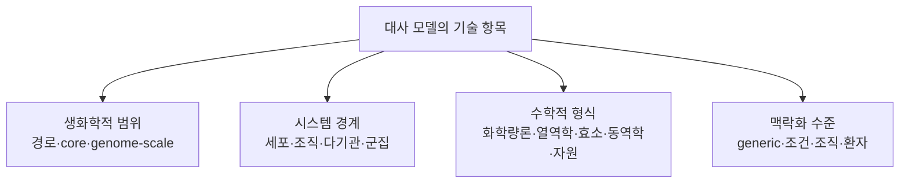

# 5. 대사 모델의 분류

iML1515, [Human1](../landmark-papers.md), [AGORA2](https://doi.org/10.1038/s41587-022-01628-0), ecYeast8, ME-model은 모두 이름이지만, 붙인 기준이 제각각이다. 어떤 이름은 생물종과 재구축 버전을, 어떤 이름은 수학적 제약을, 또 어떤 이름은 여러 생물을 조립한 방식을 가리킨다. 그래서 이 모델들을 한 줄로 늘어놓아 분류하기보다, **생화학적 범위, 시스템 경계, 수학적 형식, 맥락화 수준**이라는 네 가지를 따로 적어 두는 편이 정확하다.

이 네 기준은 모델을 기술하는 유용한 축이다. 다만 네 축이 통계적으로 완전히 독립이라거나, 한 축 안의 범주끼리 서로 배타적이라는 뜻은 아니다. 예를 들어 효소 제약 모델이 열역학 제약과 조직 특이적 발현 자료를 함께 담을 수 있고, 군집 모델은 구성원 각각의 단일종 GEM을 합쳐서 만든다.

*그림 1.7. 대사 모델을 기술하는 네 기준을 정리한 분류 모식도이며, 모델 계산 결과가 아니다. 각 가지는 우열이나 규모 순서를 나타내지 않으며, 하나의 모델에 여러 수학적 태그가 동시에 적용될 수 있다. 저자 작성; 개념 근거: 수학적 형식 축은 Orth, Thiele & Palsson (2010), [doi:10.1038/nbt.1614](https://doi.org/10.1038/nbt.1614); 재구축과 조건부 계산 모델을 구분하는 맥락화 축은 Thiele & Palsson (2010), [doi:10.1038/nprot.2009.203](https://doi.org/10.1038/nprot.2009.203).*

## 5.1 생화학적 범위는 반응 집합의 포괄성을 나타낸다

생화학적 범위는 모델이 한 생물학적 단위 안에서 어느 정도의 반응 집합을 포함하는지를 나타낸다.

| 범위 | 정의 | 예시 | 주요 용도 |
|:---|:---|:---|:---|
| 경로 특이적 | 특정 경로나 대사 기능의 반응만 포함 | 해당과정 동역학 모델 | 상세 기작·매개변수 분석 |
| core 네트워크 | 중심 기능을 대표하는 축약 반응 집합 | COBRApy `textbook` 모델 | 교육·알고리듬 검증 |
| 게놈 규모 재구축 | 유전체가 지지하는 대사 능력을 체계적으로 포괄 | iML1515, Yeast8, Human1 | 전세포 수준 물질수지·교란 분석 |

“게놈 규모”는 반응이 몇 개 이상이면 된다는 식의 기준선으로 정의되지 않는다. 핵심은 게놈 주석과 문헌을 전체적으로 훑은 범위, 그리고 추적 가능한 재구축 절차다. 그 안에도 아직 확인되지 않은 반응이나 빠진 생물학이 남아 있을 수 있다. 반응 수 자체는 버전과 큐레이션 정책에 따라 달라진다.

여러 종을 담은 군집 모델을 단일종 GEM보다 그저 “범위가 더 넓다”고만 분류하는 것도 충분하지 않다. 군집 모델의 핵심은 여러 네트워크가 물질을 주고받는 방식과 공동 환경, 곧 **시스템 경계**에 있다. 그래서 이는 다음 절에서 별도 기준으로 다룬다.

## 5.2 시스템 경계는 모델 내부의 교환 범위를 정한다

시스템 경계는 어떤 세포·조직·기관·종과 그 사이의 물질 교환을 모델 내부에 포함할지 정하는 기준이다. 따라서 생화학적 범위가 넓어도 단일 세포 경계일 수 있고, 작은 구성원 모델을 여러 개 연결해 군집 또는 다기관 경계를 만들 수도 있다.

| 시스템 경계 | 모델링 대상 | 구조적 특징 | 예시 |
|:---|:---|:---|:---|
| 단일 세포·단일 종 | 한 균주 또는 세포형 | 하나의 세포 경계와 환경 | iML1515, Yeast8 |
| 조직·세포형 | 특정 조직 또는 세포 계통 | 범용 재구축의 맥락 특이화 | 간세포·암세포 모델 |
| 다기관·전신 | 조직 사이 혈액·대사물 교환 | 기관별 구획과 순환 경계 | 전신 대사 모델(whole-body metabolic model) |
| 미생물 군집 | 둘 이상의 종 또는 균주 | 종별 구획, 공동 환경, cross-feeding | AGORA2 기반 MICOM 모델 |
| 숙주–미생물계 | 숙주 조직과 미생물 군집 | 서로 다른 생물 경계의 연결 | 장–간–미생물 통합 모델 |

AGORA2와 MICOM의 정확한 릴리스·입력·출력 범위는 사용 전 공식 자료로 확인해야 한다. 일반적으로 단일종 재구축 모음은 특정 표본의 군집 플럭스 예측과 같지 않으며, 표본별 분석에는 구성원 선택, 상대 풍부도, 공동 배지, 목적함수와 교환 경계를 별도로 기록해야 한다.

## 5.3 수학적 형식 태그는 누적되는 정보와 한계를 기록한다

수학적 형식은 단일 선택지가 아니라 누적 가능한 특성으로 기록한다.

| 태그 | 추가되는 정보 또는 식 | 대표 방법 | 이 태그만으로 보장하지 않는 결론 |
|:---|:---|:---|:---|
| 화학량론적 제약 기반 | $$\mathbf S\mathbf v=0$$, bounds | [FBA](../chapter-4/README.md), [FVA](../glossary.md), sampling | 실제 세포의 시간 변화나 조절 기전을 확정하지 않는다 |
| 열역학 기반 | $$\Delta_rG$$와 농도 범위 | [TFA](../glossary.md), thermodynamic FBA | 측정하지 않은 농도·표준 상태·경계조건의 불확실성을 없애지 않는다 |
| 효소 제약 | $$v_j\leq k_{\mathrm{cat},j}E_j$$ | [ecGEM](../glossary.md), GECKO | $$k_{cat}$$, 효소량, 복합체·동질효소 매핑이 없으면 실제 용량을 확정하지 않는다 |
| 대사–발현 자원 모델 | 전사·번역·단백질 합성의 자원수지 | 대사–발현(ME) 모델 | 모든 반응의 속도상수를 갖춘 동역학 ODE 모델을 뜻하지 않는다 |
| [동역학](../glossary.md) | $$d\mathbf x/dt=\mathbf S\mathbf r(\mathbf x;\theta)$$ | kinetic ODE model | 매개변수·초기조건이 없으면 시간 경과 예측을 검증하지 못한다 |
| 외부 동역학 결합 | 세포외 물질수지 + 반복 FBA | [dynamic FBA](../glossary.md) | 세포 내부의 조절 동역학을 자동으로 포함하지 않는다 |
| GIMME 맥락 특이화 | 발현 자료와 보존할 대사 과제 | [GIMME](../glossary.md) | 발현 임계값 자체가 반응 활성의 실측값임을 보장하지 않는다 |
| iMAT 맥락 특이화 | 발현 상태와 반응 활성의 일관성 목적 | [iMAT](../glossary.md) | 이산화 규칙과 임계값 선택이 유일한 맥락 모델을 만들지 않는다 |
| tINIT 맥락 특이화 | 조직 관련 증거와 보존할 대사 기능 | [tINIT](../glossary.md) | 증거 점수만으로 조직에서의 플럭스 관찰을 확정하지 않는다 |

GIMME·iMAT·tINIT은 모두 발현 자료를 사용하지만, 입력의 이산화·점수화와 보존할 대사 과제의 규칙을 같은 것으로 취급하지 않는다. 이 표의 태그는 상호 배타적이지 않다. 예를 들어 한 조직 특이 효소 제약 모델에는 화학량론적 제약, 효소 제약, 맥락 특이화 태그를 함께 붙일 수 있다. 정확한 알고리듬과 구현의 입력·출력은 사용한 릴리스와 방법 근거에서 확인해야 한다.

## 5.4 맥락화는 입력과 검증 계약을 함께 바꾼다

범용 재구축(generic reconstruction)은 대상 생물이나 기관이 가질 수 있는 대사 능력을 모두 합친 상태를 지향한다. 실제 분석에서는 특정 상황에 맞게 조건을 좁혀야 하며, 다음 자료를 쓴다.

- 배지 조성, 산소 공급 및 섭취·분비 속도
- 조직·세포형의 전사체와 단백질체
- 환자별 유전 변이 또는 효소 결핍
- 미생물군집의 종 조성과 상대 풍부도
- 성장, [ATP 유지](../glossary.md), 분비 또는 [대사 작업](../glossary.md)과 같은 분석 목적

같은 Human1 재구축에서 간, 근육, 암 세포주, 환자별 모델을 각각 만들 수 있다. 이렇게 파생된 모델은 반응 수가 적다고 해서 저절로 품질이 좋거나 나쁜 것이 아니다. 어떤 대사 작업을 지켜야 하는지, 데이터 임계값과 알고리듬은 무엇인지, 외부 검증은 어떻게 했는지를 함께 기록해야 한다.

예를 들어 범용 인체 재구축에서 조직 후보 모델을 만들 때에는 (1) 어떤 전사체·단백질체 자료와 표본 처리 규칙을 입력했는지, (2) 발현 임계값과 선택 알고리듬을 어떻게 고정했는지, (3) 반드시 보존할 대사 작업을 무엇으로 정했는지, (4) 모델 출력과 독립적인 대사체·섭취/분비·효소 활성 관찰 중 무엇으로 검증할지를 하나의 계약으로 기록한다. 이 절의 예시는 방법 계약을 설명할 뿐 특정 조직·환자의 관찰값이나 진단 결과를 제시하지 않는다. 따라서 환자 맥락 모델의 계산 출력은 임상 관찰·진단·치료 효과와 등치할 수 없다.

## 5.5 모델 카드는 네 축과 재현 조건을 함께 기록한다

| 모델·자원 | 생화학적 범위 | 시스템 경계 | 수학적 형식 | 맥락화 | 재현에 반드시 기록할 항목 |
|:---|:---|:---|:---|:---|:---|
| COBRApy `textbook` | core | 단일 *E. coli* 세포 | 화학량론적 제약 기반 | 고정 교육용 배지 | 모델 bytes/checksum, COBRApy·solver, 배지 bounds, 목적함수 |
| iML1515 | 게놈 규모 | 단일 *E. coli* 균주 | 화학량론적 제약 기반 | 분석별 배지 | 정확한 릴리스, 배지 bounds, 목적함수, 활성 추가 제약 |
| Human1 | 게놈 규모 | 범용 인체 세포 | 화학량론적 제약 기반 | 범용 재구축 | 정확한 릴리스, generic/context 구분, 배지·목적함수, 맥락 입력 |
| ecYeast8 | 게놈 규모 | 단일 효모 세포 | 화학량론적 제약 + 효소 제약 | 배양·단백질 조건 의존 | 기반 재구축, $$k_{cat}$$·단백질 자료, 매핑, 배지·목적함수 |
| AGORA2 기반 표본 모델 | 게놈 규모 구성원 집합 | 미생물 군집 | 다종 화학량론적 제약 기반 | 표본별 종 조성·배지 | 구성원 릴리스, 조성, 교환 경계, 공동 배지, 군집 목적함수 |
| *E. coli* ME-model | 게놈 규모 대사·발현 | 단일 세포 | 화학량론적 제약 + 발현 자원 | 성장 조건 의존 | 정확한 릴리스, 발현 자원 제약, 성장 조건, 목적함수 |

위 표의 마지막 열은 완성된 모델 메타데이터가 아니라 모델 카드의 최소 필드다. 실제 카드는 각 값과 출처를 채우며, 모르는 값은 추정하지 않고 `미확인`으로 남긴다. 모델 이름만 보고 무엇을 분석할 수 있는지 판단해서는 안 된다. 최소한 사용한 릴리스, 시스템 경계, 켜 둔 추가 제약, 배지, 목적함수, 맥락화 자료를 확인해야 한다. 이런 정보가 있어야 서로 다른 연구의 결과를 재현하고 비교할 수 있다.

---
