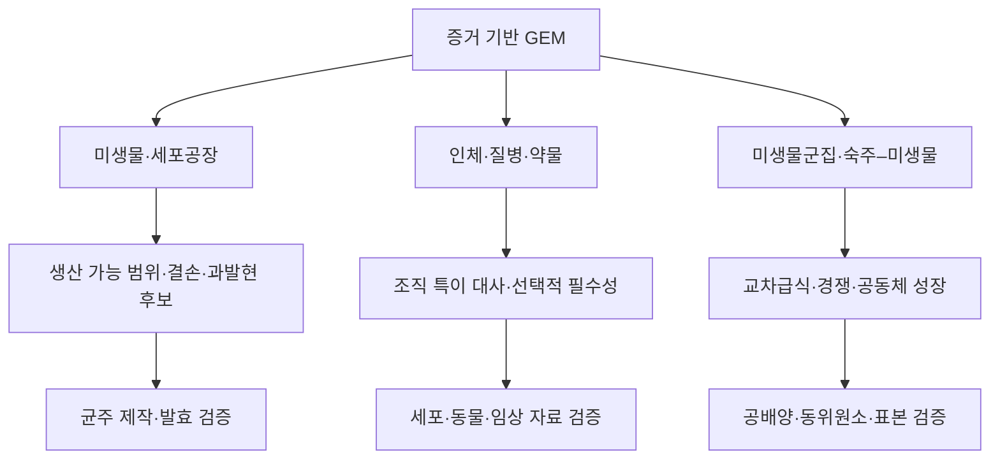

# 7. 미생물·인체·군집 모델의 응용 범위

GEM의 응용은 생물학적 대상이 아니라 **연구 질문, 시스템 경계, 사용한 자료와 검증 수준**을 함께 기준으로 평가해야 한다. 동일한 FBA와 유전자 결손 연산도 미생물 세포공장에서는 생산–성장 결합을, 질병 모델에서는 병든 세포와 정상 세포 사이의 선택적 취약성을 탐색하는 데 사용된다. 계산 절차가 같다고 해서 요구되는 실험적 근거나 해석 수준도 같은 것은 아니다.

*그림 1.8. 생물학적 대상에 따른 GEM 응용과 대표 검증 단계. 계산 결과는 각 분야의 실험 검증을 거쳐야 하며, 화살표는 임상·산업 성과를 자동으로 보장하지 않는다. 저자 작성.*

## 7.1 미생물과 세포공장

미생물 GEM은 기질 이용, 성장, 부산물 분비, 유전자 필수성 및 목표 화합물 생산 가능 범위를 분석하는 데 사용된다. *E. coli*와 *Saccharomyces cerevisiae*는 [재구축](../glossary.md), 결손 라이브러리, 발효 자료 및 유전공학 도구가 비교적 풍부하여 방법 개발과 검증에 널리 사용된다.

대표적인 계산 질문은 다음과 같다.

- 특정 배지에서 이론적으로 가능한 최대 수율은 얼마인가?
- 유전자 결손 후 성장과 목표 산물 생산이 결합되는가?
- 대안 최적해에서도 최소 생산량이 유지되는가?
- 효소 또는 단백질 자원 제약을 추가하면 병목이 어떻게 달라지는가?

**[OptKnock](../glossary.md)**은 성장 최적화를 세포의 내부 문제로, 목표 생산을 설계자의 외부 문제로 둔 이중수준 최적화의 대표 사례이다([Burgard et al., 2003](https://doi.org/10.1002/bit.10803)). 그러나 계산 후보는 균주 안정성, 실제 생산속도·수율·농도, 독성, 배양 공정 및 진화적 escape를 별도로 검증해야 한다. 알고리듬과 [production envelope](../glossary.md)(생산 포락선)는 [Chapter 8](../chapter-8/README.md)에서 다룬다.

## 7.2 인체 대사와 질병 모델

Human1과 같은 범용 인체 재구축은 인체가 보유한 대사 능력의 지식베이스이다. 조직·세포형·환자를 분석하려면 전사체·단백질체, 영양 조건, 알려진 대사 작업 및 질병 상태를 사용해 맥락을 구체화한다. Human1 발표판은 여러 기존 재구축을 통합하고 화학식·전하·GPR을 대규모로 정비하였다([Robinson et al., 2020](https://doi.org/10.1126/scisignal.aaz1482)). Human2는 이후의 지식과 LLM 보조 검토를 결합했지만, LLM이 독립적으로 완성 모델을 생성한 것이 아니라 전문가 큐레이션과 회귀 검사를 포함한 절차이다([Luo et al., 2026](https://doi.org/10.1073/pnas.2516511123)).

인체 모델의 대표 질문은 다음과 같다.

- 특정 조직이 수행해야 하는 [대사 작업](../glossary.md)과 경로는 무엇인가?
- 암 세포와 대응 정상 세포의 [필수 반응](../glossary.md)이 어떻게 다른가?
- 선천성 효소 결핍이 대사물 생산·분해 가능성에 어떤 영향을 주는가?
- 환자별 자료를 통합했을 때 예측의 불확실성이 얼마나 달라지는가?

모델이 예측한 [유전자 필수성](../glossary.md)은 약물 표적과 동일하지 않다. 정상 조직 선택성, 단백질 구조와 결합 부위, 약동학, off-target 독성 및 종양 이질성을 추가로 평가해야 한다. 조직 특이 모델은 [Chapter 6](../chapter-6/README.md), 질병·표적 분석은 [Chapter 7](../chapter-7/README.md), 인체 재구축 계보는 [Chapter 5](../chapter-5/README.md)에서 상세히 다룬다.

## 7.3 미생물군집과 숙주–미생물 상호작용

군집 모델은 구성 종별 세포 구획과 공통 세포외 풀을 연결하여 기질 경쟁, 부산물 교환 및 교차급식을 표현한다. AGORA2는 7,302개 장내 미생물 균주 재구축을 포함한 자원이며([Heinken et al., 2023](https://doi.org/10.1038/s41587-022-01628-0)), 특정 표본의 군집 예측에는 종 조성, 상대 풍부도, 배지 및 군집 목적에 대한 추가 가정이 필요하다.

군집 결과는 well-mixed 정상 상태를 가정하는지, 공간 구조와 시간 변화를 포함하는지, 종별 성장률을 어떤 방식으로 결합하는지에 민감하다. 16S 또는 metagenomic 상대 풍부도만으로 실제 교환 플럭스를 직접 관찰한 것은 아니므로 공배양, 대사체 및 안정동위원소 추적으로 검증하는 것이 중요하다. 군집 모델링 방법은 [Chapter 8 §9](../chapter-8/09.md)에서 비교한다.

## 7.4 AI 결합의 역할

머신러닝은 반응 누락 후보 순위화, 효소 기능·동역학 값 추정, 유전자 필수성 분류 및 계산 대리모델에 사용될 수 있다. 대형 언어 모델은 문헌·데이터베이스 근거를 정리하고 큐레이션 후보를 표시하는 데 활용될 수 있다. 이때 AI 출력은 화학량론적 타당성, 출처 추적성, 외부 검증 및 불확실성 평가를 통과해야 한다. AI가 제안한 반응을 그대로 추가하면 원소 불균형, 열역학적 순환 또는 잘못된 GPR이 모델에 유입될 수 있다. 구체적인 방법과 검증 기준은 [Chapter 9](../chapter-9/README.md)에서 다룬다.

---
