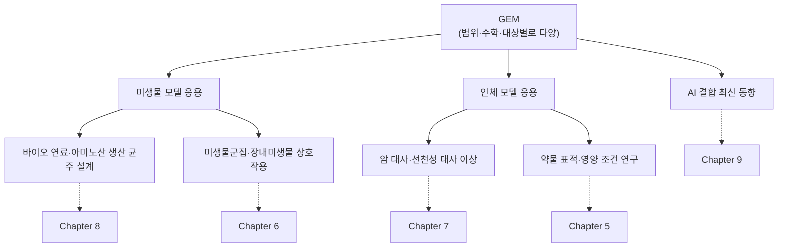

# 7. 미생물·인체 모델의 응용: 전체 지형 개관

**왜 이걸 배우나요?** §6에서 우리는 GEM이 지난 35년간 "어떻게" 발전해 왔는지를 보았습니다. 그런데 이 모델들은 단지 학술적 호기심을 위해서만 만들어진 것이 아닙니다 — 실제로 신약 개발, 바이오 연료 생산, 질병 진단 등 구체적인 문제에 쓰이고 있습니다. 이번 절은 이 책의 나머지 부분(Chapter 5~9)이 각각 어떤 실전 문제를 다루는지 미리 지도를 그려, 여러분이 "이 개념을 배워서 결국 어디에 쓰는가"를 놓치지 않도록 돕습니다. 상세 내용은 각 응용을 전담하는 장에서 다루므로, 이 절에서는 깊이 들어가지 않고 전체 지형만 조망합니다.

앞서 §5에서 배운 "생물학적 대상" 축(미생물 vs 인체 vs 미생물군집)을 기억하시나요? 이번 절은 바로 그 축을 따라 응용 사례를 정리한 것입니다.

## 7.1 미생물 모델 응용

*E. coli*와 *S. cerevisiae*는 대사 모델의 "실험용 쥐"로서 가장 성숙한 예측 정확도를 보유합니다. 이들 모델은 바이오 연료(에탄올, 부탄올, 이소부탄올), 항생제 전구체, 아미노산(글루탐산, 라이신, 트립토판) 등 산업 생산 균주 설계에 활용되며, 대표적으로 OptKnock과 같은 유전자 결실 최적화 알고리듬이 사용됩니다. 이러한 균주 설계 전략과 미생물군집 모델링의 상세는 **[Chapter 8. 미생물·세포공장·합성생물학 응용](../chapter-8/README.md)**에서 다룹니다.

왜 미생물이 산업적 응용에서 특히 유리할까요? 이유는 두 가지입니다. 첫째, *E. coli*와 *S. cerevisiae*는 실험적 유전자 조작(형질전환, CRISPR 등)이 잘 확립되어 있어 모델의 예측을 실제로 검증·구현하기 쉽습니다. 둘째, §6에서 보았듯 이 두 생명체의 GEM은 가장 오래, 가장 많이 검증되어 왔기 때문에 예측 신뢰도가 높습니다. 즉 "모델의 성숙도"와 "실험적 구현 가능성"이 함께 갖춰진 생명체가 산업적으로 먼저 활용되는 경향이 있습니다.

## 7.2 인체 모델 응용

Recon 계열과 Human1/Human2는 암 대사 재프로그래밍, 선천성 대사 이상의 바이오마커, 약물 표적, 영양 조건 등을 연구하는 범용 기반 모델입니다. 이 계보는 Recon1→Recon2→Recon3D→Human1→Human2라는 단일 직선이 아니라 HMR2·iHsa 등을 합친 **fork/merge 역사**이며, 범용 Human2 자체와 그로부터 만든 조직·기관·전신 모델을 구분해야 합니다. AGORA2 기반 미생물군집 모델은 장내 미생물군과 숙주 사이 대사 교환을 연구하는 데 쓰입니다. 질병 모델링·약물 표적 발굴은 **[Chapter 7](../chapter-7/README.md)**에서, 조건 특이적 모델은 **[Chapter 6](../chapter-6/README.md)**에서, 정확한 인체 모델 계보와 품질관리는 **[Chapter 5](../chapter-5/README.md)**에서 각각 다룹니다.

인체 모델은 미생물 모델보다 다루기가 훨씬 까다롭습니다. 사람의 세포는 조직(간, 근육, 신경 등)에 따라 서로 다른 유전자를 발현하며, 같은 유전자라 하더라도 조직마다 전혀 다른 대사 역할을 수행할 수 있기 때문입니다. 그래서 "범용 인체 모델"(Human1/Human2) 하나만으로는 부족하고, 특정 조직·특정 환자의 오믹스 데이터를 결합해 "맥락 특이적(context-specific)" 모델을 추출하는 절차가 필요합니다 — 이것이 바로 [Chapter 6](../chapter-6/README.md)의 핵심 주제입니다.

## 7.3 최신 동향: AI와의 결합

효소 제약, 커뮤니티 모델링에 이어 최근에는 머신러닝/딥러닝을 GEM 구축·예측에 결합하는 시도가 활발합니다. 예를 들어 그래프 신경망(GNN)으로 유전자 필수성을 예측하거나, 대규모 언어 모델(LLM)로 재구축 큐레이션을 보조하는 시도(§6.4의 Human2 사례)가 여기 해당합니다. 이는 **[Chapter 9. 최신 동향: AI와 대사모델링](../chapter-9/README.md)**에서 다룹니다.

> 🤔 **잠깐, 생각해보기.** §7.1(미생물)과 §7.2(인체) 응용을 비교하면, 왜 미생물 균주 설계는 이미 산업적으로 널리 쓰이는 반면 인체 모델 기반 신약 개발은 아직 상대적으로 초기 단계일까요?

몇 가지 이유를 생각해 볼 수 있습니다. 첫째, 인체 모델은 조직 특이성이라는 추가 복잡성을 다뤄야 합니다(§7.2). 둘째, 미생물은 실험실에서 배양하고 유전자를 조작하며 결과를 몇 시간~며칠 안에 확인할 수 있지만, 인체 대사 예측의 검증(임상시험 등)은 훨씬 오래 걸리고 비용이 큽니다. 셋째, 미생물 GEM(iML1515 등)은 20년 넘게 반복적으로 정제되어 왔지만, 포괄적 인체 모델(Recon 계열)의 본격적 발전은 상대적으로 더 최근(2007년 이후)입니다. 이런 이유로 인체 모델 응용은 미생물 응용보다 발전 단계가 다소 늦지만, §6.4에서 본 Human2, AGORA2 같은 최신 발전은 이 격차가 빠르게 좁혀지고 있음을 보여줍니다.

---
