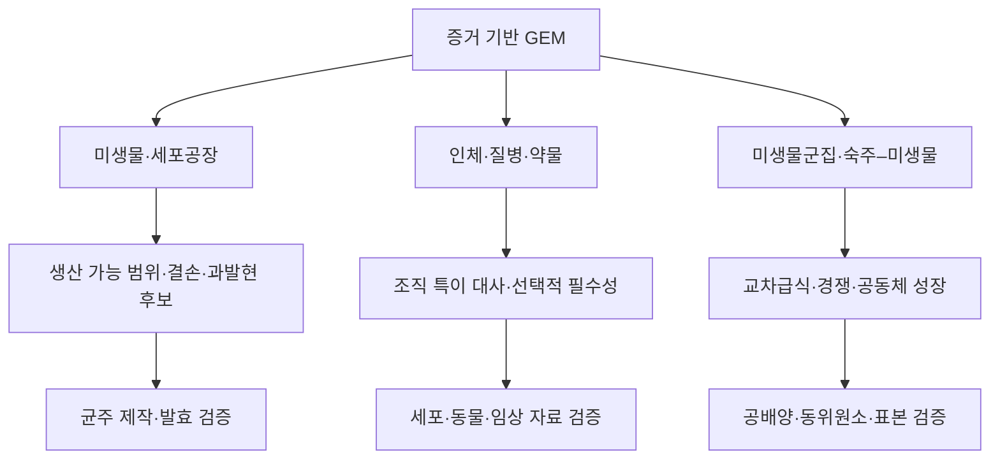

# 7. 미생물·인체·군집 모델의 응용 범위

GEM의 응용은 어떤 생물을 다루는가만으로 평가할 수 없다. **연구 질문, 시스템 경계, 사용한 자료, 검증 수준**을 함께 봐야 한다. 같은 FBA와 유전자 결손 연산이라도 쓰임새가 다르다. 미생물 세포공장에서는 생산과 성장이 함께 가는지를 찾고, 질병 모델에서는 병든 세포와 정상 세포 사이의 선택적 취약성을 찾는다. 계산 절차가 같다고 해서, 그에 필요한 실험적 근거나 해석 수준까지 같은 것은 아니다.

*그림 1.8. 생물학적 대상에 따른 GEM 응용과 대표 검증 단계. 계산 결과는 각 분야의 실험 검증을 거쳐야 하며, 화살표는 임상·산업 성과를 자동으로 보장하지 않는다. 위에서 아래로 GEM이 미생물·인체·군집 응용으로 갈라지고, 각 계산 후보가 균주 제작·발효, 세포·동물·임상 자료, 공배양·동위원소·표본 검증으로 각각 이어진다. 저자 작성.*

## 7.1 미생물과 세포공장

미생물 GEM은 여러 가지를 분석하는 데 쓴다. 기질 이용, 성장, 부산물 분비, 유전자 필수성, 그리고 목표 화합물을 어느 정도까지 생산할 수 있는지가 그것이다. *E. coli*와 *Saccharomyces cerevisiae*는 [재구축](../glossary.md), 결손 라이브러리, 발효 자료, 유전공학 도구가 비교적 풍부하다. 그래서 방법을 개발하고 검증하는 데 널리 쓰인다.

대표적인 계산 질문은 다음과 같다.

- 특정 배지에서 이론적으로 가능한 최대 수율은 얼마인가?
- 유전자 결손 후 성장과 목표 산물 생산이 결합되는가?
- 대안 최적해에서도 최소 생산량이 유지되는가?
- 효소 또는 단백질 자원 제약을 추가하면 병목이 어떻게 달라지는가?

**[OptKnock](../glossary.md)**은 이중수준 최적화의 대표 사례다([Burgard et al., 2003](https://doi.org/10.1002/bit.10803)). 성장 최적화는 세포가 푸는 안쪽 문제로, 목표 생산은 설계자가 푸는 바깥쪽 문제로 둔다. 그러나 계산으로 뽑은 후보는 그대로 믿을 수 없다. 균주 안정성, 실제 생산속도·수율·농도, 독성, 배양 공정, 진화적 escape를 따로 검증해야 한다. 알고리듬과 [production envelope](../glossary.md)(생산 포락선)는 [Chapter 8](../chapter-8/README.md)에서 다룬다.

여기서 **이론적 최대 수율**은 정한 기질 투입량, 배지, 반응 가역성, 유지 요구량, 목적함수와 flux bound 아래에서 계산한 산물/기질 비의 상한이다. 따라서 실제 발효의 수율·생산속도·농도를 대신하지 않는다. 또한 진화 과정에서 설계된 생산 경로를 우회하는 도피 변이(escape)가 생길 수 있으므로, 계산 후보의 검증에는 계대배양 또는 장기 안정성 평가가 별도로 필요하다.

| 단계 | 미생물 생산 후보 | 인체 취약성 후보 |
|---|---|---|
| 계산 | 정한 배지와 bound에서 수율·결손·생산 포락선을 계산한다. | 조직 맥락과 정상 비교군을 정한 뒤 선택적 필수성 후보를 계산한다. |
| 직접 확인 | 균주를 제작하고 성장, 수율, 생산속도, 농도를 측정한다. | 세포 또는 적절한 생물학적 계에서 표적 결합·선택성을 독립적으로 확인한다. |
| 적용 경계 | 독성, 공정 조건, 장기 안정성, 진화적 변화를 확인한다. | 약동학, 오프타깃(off-target) 독성, 이질성, in vivo 자료를 평가한다. |
| 결론 | 계산 후보는 공정 성과를 보장하지 않는다. | 계산 취약성은 약물 표적이나 치료 유효성을 뜻하지 않는다. |

이 표는 검증 단계를 생략한 결론을 허용하지 않는 증거 사다리의 예다. 각 단계의 endpoint와 통과 기준은 대상 균주·질환·실험계에 맞추어 사전에 명시해야 한다.

## 7.2 인체 대사와 질병 모델

Human1 같은 범용 인체 재구축은 인체가 가진 대사 능력을 모아 둔 지식베이스다. 이것으로 특정 조직·세포형·환자를 분석하려면 맥락을 구체화해야 한다. 전사체·단백질체, 영양 조건, 알려진 대사 작업, 질병 상태를 넣어 조건을 좁히는 것이다. Human1 발표판은 여러 기존 재구축을 통합하고 화학식·전하·GPR을 대규모로 정비했다([Robinson et al., 2020](https://doi.org/10.1126/scisignal.aaz1482)). Human2는 이후의 지식에 LLM 보조 검토를 결합했다. 다만 LLM이 혼자 완성 모델을 만든 것이 아니라, 전문가 큐레이션과 회귀 검사를 포함한 절차의 일부였다([Luo et al., 2026](https://doi.org/10.1073/pnas.2516511123)).

인체 모델의 대표 질문은 다음과 같다.

- 특정 조직이 수행해야 하는 [대사 작업](../glossary.md)과 경로는 무엇인가?
- 암 세포와 대응 정상 세포의 [필수 반응](../glossary.md)이 어떻게 다른가?
- 선천성 효소 결핍이 대사물 생산·분해 가능성에 어떤 영향을 주는가?
- 환자별 자료를 통합했을 때 예측의 불확실성이 얼마나 달라지는가?

모델이 예측한 [유전자 필수성](../glossary.md)이 곧 약물 표적인 것은 아니다. 정상 조직에 대한 선택성, 단백질 구조와 결합 부위, 약동학, 오프타깃(off-target) 독성, 종양 이질성을 더 평가해야 한다. 조직 특이 모델은 [Chapter 6](../chapter-6/README.md), 질병·표적 분석은 [Chapter 7](../chapter-7/README.md), 인체 재구축 계보는 [Chapter 5](../chapter-5/README.md)에서 상세히 다룬다.

## 7.3 미생물군집과 숙주–미생물 상호작용

군집 모델은 종마다의 세포 구획과 공통 세포외 풀을 연결한다. 이렇게 하면 기질 경쟁, 부산물 교환, 교차급식을 나타낼 수 있다. 숙주–미생물 모델에서는 여기에 숙주 구획과 미생물의 공동 환경을 분리하고, 두 구획 사이에서 허용한 교환 대사물과 방향을 명시한다. AGORA2는 장내 미생물 균주 재구축 7,302개를 담은 자원으로 보고되었다([Heinken et al., 2023](https://doi.org/10.1038/s41587-022-01628-0)). 특정 표본의 군집을 예측하려면 종 조성, 상대 풍부도, 배지, 군집 목적에 대한 가정을 더 붙여야 한다.

두 구성원 A와 B의 작은 군집을 예로 들면, 다음 계약을 먼저 기록한다.

| 항목 | 명세 |
|---|---|
| 구획 | A, B, 그리고 두 종이 공유하는 세포외 풀을 분리한다. |
| 입력과 목적 | 배지에서 들어오는 기질, 종별 biomass 목적함수, 군집 목적함수를 각각 적는다. |
| 조성 가정 | 상대 풍부도는 초기량 또는 biomass 결합의 가정으로만 쓰며, 교환 flux로 치환하지 않는다. |
| 정상 상태 점검 | 공유 대사물 M에 대해 `A의 분비 + B의 분비 + 배지 유입 − A의 흡수 − B의 흡수 = 0`을 확인한다. |
| 검증 자료 | 공배양 성장, 대사체 변화, 안정동위원소 추적을 모델 구성에 쓰지 않은 자료와 비교한다. |

군집 결과는 몇 가지 선택에 민감하다. 잘 섞인(well-mixed) 정상 상태를 가정하는지, 공간 구조와 시간 변화를 넣는지, 종별 성장률을 어떻게 결합하는지에 따라 달라진다. 또 16S나 메타유전체(metagenomic) 상대 풍부도는 실제 교환 플럭스를 직접 관찰한 값이 아니다. 그러므로 공배양, 대사체, 안정동위원소 추적으로 검증하는 것이 중요하다. 군집 모델링 방법은 [Chapter 8 §9](../chapter-8/09.md)에서 비교한다.

## 7.4 AI 결합의 역할

머신러닝과 대형 언어 모델은 후보를 만들거나 우선순위를 정하는 보조 도구다. 기능마다 출력과 확인 항목이 다르다.

| AI 보조 기능 | 후보 출력 | 자동으로 확정하지 않는 항목 |
|---|---|---|
| 누락 반응 | 추가 검토할 반응 후보 | 원소·전하 수지, 열역학, 생물종 근거 |
| 효소 기능 | 주석 또는 반응 연결 후보 | 기질 특이성, 반응 방향, 해당 생물종의 실험 기능 |
| 동역학 값 | `kcat` 등 값의 후보 | isoform, pH, 온도, assay 조건이 맞는 측정값 |
| 유전자 필수성 | 조건부 분류 후보 | 균주·배지·생존 판정 기준을 넘는 보편 필수성 |
| 계산 대리모델 | 특정 GEM 분석의 근사 출력 | 학습 범위 밖 feasibility, 물질수지, solver 동등성 |
| 문헌 근거 | 큐레이션 근거 후보 | 인용 식별자, 지지 문장, 원 주장 범위 |

따라서 AI 제안, 사람의 큐레이션 판정, 모델 변경, 회귀 검사, 외부 검증과 불확실성 평가는 서로 다른 provenance 단계로 남긴다. 예를 들어 AI가 제안한 반응은 먼저 근거와 화학량론을 검토하고, 승인한 변경에는 이유·변경 전후 모델 식별자·회귀 검사 결과를 연결한다. AI가 제안한 반응을 검증 없이 추가하면 원소 불균형, 열역학적 순환, 잘못된 GPR이 모델에 섞여 들어올 수 있다. 구체적인 방법과 검증 기준은 [Chapter 9](../chapter-9/README.md)에서 다룬다.

---
