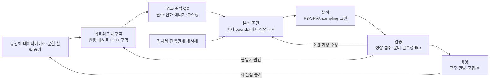

# 8. 대사모델링의 반복적 연구 절차

대사모델링은 게놈 서열을 넣으면 표현형이 한 번에 튀어나오는 일자형 파이프라인이 아니다. [재구축](../glossary.md), 형식화, 품질관리, 조건 설정, 분석, 실험 검증이 여러 번 돌고 돈다. 그래서 각 단계의 판단과 버전을 추적해야 한다. 특히 예측과 실험이 어긋날 때는, 목적함수나 bounds만 손봐서 없앨 문제가 아니다. 오히려 반응 근거와 실험 조건을 다시 살펴보라는 신호다.

*그림 1.9. GEM 재구축과 분석의 반복적 절차. 오믹스 맥락화는 모든 모델의 필수 단계가 아니라 특정 조건 모델을 만들기 위한 선택적 입력이며, 품질관리는 재구축 이후 한 번만 수행하는 단계가 아니다. 왼쪽에서 오른쪽으로 증거, 재구축, QC, 조건, 분석, 검증, 응용이 이어지고, 검증 불일치는 재구축 또는 조건 단계로 되돌아간다. 화살표는 자동 승인이나 인과를 뜻하지 않는다. 저자 작성; 재구축 절차: Thiele & Palsson (2010), [doi:10.1038/nprot.2009.203](https://doi.org/10.1038/nprot.2009.203); 표준 품질검사: Lieven et al. (2020), [doi:10.1038/s41587-020-0446-y](https://doi.org/10.1038/s41587-020-0446-y).*

## 8.1 증거와 판정 기록이 재구축을 연결한다

게놈 주석과 상동성은 후보 효소 기능을 알려 줄 뿐, 그것만으로 반응을 넣을지 말지가 정해지지는 않는다. 반응식, 보조인자 특이성, 세포 [구획](../glossary.md), 방향성, [GPR](../chapter-3/README.md)은 생물종 특이적 문헌과 데이터베이스를 서로 대조하며 큐레이션한다. 각 반응에는 데이터베이스 식별자, 근거 문헌, 유전자 좌위, confidence 정보를 가능한 만큼 기록한다.

이 단계의 산출물은 “성장률을 예측하는 파일” 그 이상이다. 넓은 의미의 재구축이다. 네트워크는 알려진 대사 능력만이 아니라 아직 모르는 부분까지 함께 담아, 계산 모델을 만드는 근거 자료가 된다. 구체적인 자동 초안과 수동 재구축 절차는 [Chapter 5](../chapter-5/README.md)에서 다룬다.

반복 workflow에서는 각 단계의 산출물을 다음 단계의 입력으로 연결한다.

| 단계 | 입력과 산출물 | 판정과 provenance | 불일치의 되돌림 |
|---|---|---|---|
| 증거·재구축 | 문헌·DB·실험 → 반응식, 구획, GPR, confidence | 큐레이터가 근거와 보류 사유를 기록한다. | 근거 또는 주석으로 되돌아간다. |
| 형식화·QC | 재구축 → 검사 결과와 실패 목록 | 모델 버전, 검사 명령, 검사 범위를 기록한다. | 반응식, 수송, 경계 또는 GPR로 되돌아간다. |
| 조건·분석 | 모델과 배지·bounds → 방법별 원시 출력·solver 상태 | 분석자가 모델 hash, 환경, 목적, tolerance를 기록한다. | 조건 또는 가정으로 되돌아간다. |
| 독립 검증·갱신 | 구성에 쓰지 않은 자료 → 일치·불일치와 갱신 후보 | 검증 자료 ID와 비교 endpoint를 기록한다. | 근거·재구축·조건 중 판별 가능한 원인으로 되돌아간다. |

## 8.2 품질검사는 생물학적 정확성을 대신하지 않는다

재구축을 계산 형식으로 옮길 때 다음 항목을 검사한다.

| 검사 영역 | 대표 질문 | 실패 시 가능한 원인 |
|:---|:---|:---|
| [화학량론](../glossary.md) | 반응의 원소와 전하가 보존되는가 | 반응식·양성자화·구획 오류 |
| 구조 | 막힌 대사물·반응과 연결되지 않은 부분이 있는가 | 누락 수송·누락 생합성 반응 |
| 에너지 | 외부 기질 없이 ATP·환원력이 생성되는가 | 잘못된 방향성·내부 순환 |
| GPR·주석 | 유전자와 근거를 추적할 수 있는가 | 자동 주석 전파·ID 불일치 |
| [대사 작업](../glossary.md) | 알려진 필수 기능을 수행할 수 있는가 | 네트워크 누락·경계조건 오류 |
| 버전 | 동일 입력으로 변경을 재현할 수 있는가 | 모델·DB·코드 버전 누락 |

**[MEMOTE](../glossary.md)** 점수는 여러 구조·주석 검사를 표준화한 지표다. 다만 점수가 높다고 해서 생물학적 예측 정확도까지 보장되지는 않는다. 모델이 풀리는지, 생물량 플럭스가 양수인지도 마찬가지다. 이는 최소한의 실행 조건일 뿐 검증의 종착점이 아니다.

예를 들어 glucose 배지에서 성장 예측이 관찰과 어긋났다고 해서 즉시 반응을 추가하지 않는다. 먼저 (1) 교환 반응과 섭취 bound가 실험 배지와 같은지, (2) 반응식의 원소·전하와 양성자화가 맞는지, (3) 수송 반응과 구획 연결이 있는지, (4) GPR과 유전자 ID가 맞는지, (5) biomass와 목적함수가 질문에 맞는지를 순서대로 검사한다. 각 검사에서 관찰된 실패와 다음 판별 자료를 기록하며, 근거 없는 gap-filling은 보류한다.

## 8.3 분석법마다 조건과 추가 가정을 명시한다

계산 전에는 시스템 경계와 조건을 명시해야 한다.

- 어떤 교환 반응을 열고 닫는가?
- 섭취·분비 상한은 측정값인가, 관례적 값인가?
- 어떤 내부 반응의 방향성과 용량을 제한하는가?
- 목적함수 또는 보호할 대사 작업은 무엇인가?
- 근최적 상태, 대안 최적해 및 내부 순환을 어떻게 다룰 것인가?

공통 기록에는 model hash, 배지와 exchange bounds, 목적함수, solver·tolerance, 상태(status), 그리고 모델 구축에 쓰지 않은 validation dataset의 식별자를 포함한다. 여기에 분석법별 추가 계약을 붙인다.

| 분석법 | 추가로 기록할 가정·설정 | 출력 해석의 경계 |
|---|---|---|
| [FBA](../chapter-4/README.md) | 정상상태 가정, 선형 목적, bounds | 한 목적의 최적해이며 대안 최적해를 배제하지 않는다. |
| [FVA](../glossary.md) | objective fraction, 반응별 최소·최대화, loop 처리 | 지정한 목적 수준에서의 허용 범위다. |
| [pFBA](../chapter-4/README.md) | 1차 목적 수준, 2차 flux measure | 선택한 최소-flux 가정을 반영한 해다. |
| sampling | 알고리듬, seed, 전처리, sample 수, 수렴 점검 | 정한 feasible region의 표본이며 분포의 실험 관찰값이 아니다. |
| [MOMA](../glossary.md)·[ROOM](../glossary.md) | reference flux, norm 또는 변화 threshold·tolerance, formulation | 기준 상태에서의 조정 가정을 반영한다. |
| strain design | 허용 intervention 집합, 성장·생산 목적, 제약, 검증 endpoint | 설계 후보이며 균주 성능을 보장하지 않는다. |

## 8.4 독립 검증은 갱신 가설을 좁힌다

검증은 모델을 만들거나 큐레이션할 때 쓰지 않은 자료로 하는 것이 바람직하다. 대표 자료는 다음과 같다.

1. 다양한 탄소·질소원에서의 성장 여부와 성장률
2. 기질 섭취 및 부산물 분비 속도
3. 단일·이중 유전자 결손의 생존·성장 표현형
4. $$^{13}$$C 대사 플럭스 분석으로 얻은 내부 플럭스
5. 특정 조직·질병의 독립 오믹스 또는 기능 자료

예측과 실험이 어긋나면, 반응 하나를 함부로 추가하기 전에 원인부터 나눠서 따진다. 실험 조건, 모델 경계, GPR, 방향성, 바이오매스 조성, [목적함수](../glossary.md)를 하나씩 살피는 것이다. **[Gap-filling](../glossary.md)**은 원하는 표현형을 만들 수 있는 최소 반응 집합을 제안한다. 그러나 그 반응이 실제로 생물학적으로 존재한다는 것까지 입증하지는 않는다.

## 8.5 `textbook` 기준값은 환경 종속 회귀 기록이다

이 책의 실행 예제는 [COBRApy](https://opencobra.github.io/cobrapy/) 0.30.0의 `textbook` 모델과 [GLPK](https://www.gnu.org/software/glpk/)를 기준 환경으로 삼도록 설계되었다. 다음 항목은 생물학적 기준값이 아니다. 고정한 모델 artifact와 실행 환경에서 코드가 같은 결과를 내는지 확인하는 회귀 기준이다. artifact checksum, dependency lock, solver build와 원시 실행 출력이 없으면 수치는 재현 확인 전의 기대값으로만 취급한다.

| 기록 항목 | 기준 설정 | 해석 |
|:---|:---|:---|
| 모델 구조 | 반응 95, 대사물 72, 유전자 137 | 고정 artifact에서 재확인해야 하는 교육용 core 모델의 객체 수 |
| 기본 목적 | 모델에 저장된 biomass 반응 | 조건부 성장 목적 |
| 기본 배지 | 모델 파일에 저장된 exchange bounds | 실험 배지의 보편적 표준이 아님 |
| 최적 목적값 | 약 $$0.874\ \mathrm{h^{-1}}$$ | artifact·solver·bounds를 고정한 뒤에만 비교할 회귀값 |
| 검산 | $$\|\mathbf S\mathbf v\|_\infty$$와 solver 상태 | $$\mathbf S$$는 화학량론 행렬, $$\mathbf v$$는 flux 벡터다. mass-balanced 대사물에 대한 잔차의 단위는 flux와 같으며 tolerance와 함께 기록한다. |

분석 기록에는 최소한 모델 ID 또는 파일 hash, COBRApy와 solver 버전, 활성 목적함수, 바꾼 bounds, 허용오차, 코드 버전, solver status, 원시 목적값과 잔차를 남긴다. [Chapter 10](../chapter-10/README.md)은 이 정보를 JSON provenance와 [SBML](https://sbml.org/) round-trip 검사로 저장하는 절차를 제공한다.

## 8.6 후속 장은 workflow의 세부 결정을 다룬다

| 연구 단계 | 후속 장 |
|:---|:---|
| 반응·대사물·화학량론 행렬 | [Chapter 2](../chapter-2/README.md) |
| GPR·구획·경계·바이오매스 | [Chapter 3](../chapter-3/README.md) |
| FBA·pFBA·FVA·대안 최적해 | [Chapter 4](../chapter-4/README.md) |
| 재구축·gap-filling·MEMOTE | [Chapter 5](../chapter-5/README.md) |
| 오믹스 맥락화 | [Chapter 6](../chapter-6/README.md) |
| 질병·약물 표적 | [Chapter 7](../chapter-7/README.md) |
| 결손·균주 설계·군집 | [Chapter 8](../chapter-8/README.md) |
| AI 보조 구축·예측 | [Chapter 9](../chapter-9/README.md) |
| 재현 가능한 통합 실행 | [Chapter 10](../chapter-10/README.md) |

---
