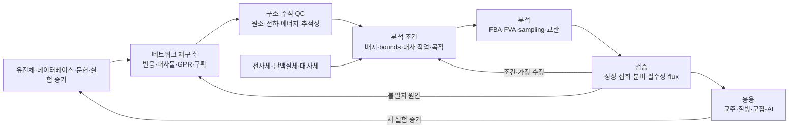

# 8. 대사모델링의 반복적 연구 절차

대사모델링은 게놈 서열을 입력하여 표현형을 한 번에 출력하는 선형 파이프라인이 아니다. [재구축](../glossary.md), 형식화, 품질관리, 조건 설정, 분석 및 실험 검증이 반복되며, 각 단계의 판단과 버전을 추적해야 한다. 특히 표현형 불일치는 목적함수나 bounds만 조정하여 제거할 문제가 아니라, 반응 근거와 실험 조건을 다시 검토할 신호이다.

*그림 1.9. GEM 재구축과 분석의 반복적 절차. 오믹스 맥락화는 모든 모델의 필수 단계가 아니라 특정 조건 모델을 만들기 위한 선택적 입력이며, 품질관리는 재구축 이후 한 번만 수행하는 단계가 아니다. 저자 작성; 재구축 절차: Thiele & Palsson (2010), [doi:10.1038/nprot.2009.203](https://doi.org/10.1038/nprot.2009.203); 표준 품질검사: Lieven et al. (2020), [doi:10.1038/s41587-020-0446-y](https://doi.org/10.1038/s41587-020-0446-y).*

## 8.1 증거 수집과 네트워크 재구축

게놈 주석과 상동성은 후보 효소 기능을 제공하지만 반응 포함 여부를 단독으로 확정하지 않는다. 반응식, 보조인자 특이성, 세포 [구획](../glossary.md), 방향성 및 [GPR](../chapter-3/README.md)은 생물종 특이적 문헌과 데이터베이스를 교차 검토하여 큐레이션한다. 각 반응에는 데이터베이스 식별자, 근거 문헌, 유전자 좌위 및 confidence 정보를 가능한 범위에서 기록한다.

이 단계의 산출물은 “성장률을 예측하는 파일”보다 넓은 의미의 재구축이다. 네트워크는 알려진 대사 능력과 지식의 공백을 함께 표현하며, 계산 모델을 만들기 위한 근거 자료가 된다. 구체적인 자동 초안과 수동 재구축 절차는 [Chapter 5](../chapter-5/README.md)에서 다룬다.

## 8.2 형식화와 품질관리

재구축을 계산 형식으로 옮길 때 다음 항목을 검사한다.

| 검사 영역 | 대표 질문 | 실패 시 가능한 원인 |
|:---|:---|:---|
| [화학량론](../glossary.md) | 반응의 원소와 전하가 보존되는가 | 반응식·양성자화·구획 오류 |
| 구조 | 막힌 대사물·반응과 연결되지 않은 부분이 있는가 | 누락 수송·누락 생합성 반응 |
| 에너지 | 외부 기질 없이 ATP·환원력이 생성되는가 | 잘못된 방향성·내부 순환 |
| GPR·주석 | 유전자와 근거를 추적할 수 있는가 | 자동 주석 전파·ID 불일치 |
| [대사 작업](../glossary.md) | 알려진 필수 기능을 수행할 수 있는가 | 네트워크 누락·경계조건 오류 |
| 버전 | 동일 입력으로 변경을 재현할 수 있는가 | 모델·DB·코드 버전 누락 |

**[MEMOTE](../glossary.md)** 점수는 여러 구조·주석 검사를 표준화하지만, 높은 점수만으로 생물학적 예측 정확도가 보장되지는 않는다. 모델이 풀리는지, 생물량 플럭스가 양수인지 여부 역시 최소한의 실행 조건일 뿐 검증의 종착점이 아니다.

## 8.3 조건부 모델과 분석

계산 전에는 시스템 경계와 조건을 명시해야 한다.

- 어떤 교환 반응을 열고 닫는가?
- 섭취·분비 상한은 측정값인가, 관례적 값인가?
- 어떤 내부 반응의 방향성과 용량을 제한하는가?
- 목적함수 또는 보호할 대사 작업은 무엇인가?
- 근최적 상태, 대안 최적해 및 내부 순환을 어떻게 다룰 것인가?

[FBA](../chapter-4/README.md)는 한 목적값을 최적화하고, [FVA](../glossary.md)는 지정한 목적 수준에서 반응별 허용 범위를 계산한다. [pFBA](../chapter-4/README.md), sampling, [MOMA](../glossary.md), [ROOM](../glossary.md) 및 strain-design 알고리듬은 서로 다른 가정을 추가한다. 따라서 “GEM 결과”라는 단일 범주 대신 분석법과 조건을 함께 보고해야 한다.

## 8.4 실험 검증과 모델 갱신

검증은 모델이 학습 또는 큐레이션에 사용하지 않은 자료로 수행하는 것이 바람직하다. 대표 자료에는 다음이 포함된다.

1. 다양한 탄소·질소원에서의 성장 여부와 성장률
2. 기질 섭취 및 부산물 분비 속도
3. 단일·이중 유전자 결손의 생존·성장 표현형
4. $$^{13}$$C 대사 플럭스 분석으로 얻은 내부 플럭스
5. 특정 조직·질병의 독립 오믹스 또는 기능 자료

불일치가 나타나면 반응 하나를 임의로 추가하기 전에 실험 조건, 모델 경계, GPR, 방향성, 바이오매스 조성 및 [목적함수](../glossary.md)를 구분하여 원인을 분석한다. **[Gap-filling](../glossary.md)**은 원하는 표현형을 만들 수 있는 최소 반응 집합을 제안하지만, 추가 반응의 생물학적 존재를 입증하지 않는다.

## 8.5 `textbook` 모델로 보는 분석 기록

이 책의 실행 예제는 [COBRApy](https://opencobra.github.io/cobrapy/) 0.30.0의 `textbook` 모델과 [GLPK](https://www.gnu.org/software/glpk/)를 기준으로 한다. 다음 항목은 생물학적 기준값이 아니라 코드와 환경이 동일하게 작동하는지 확인하는 회귀 기준이다.

| 기록 항목 | 기준 설정 | 해석 |
|:---|:---|:---|
| 모델 구조 | 반응 95, 대사물 72, 유전자 137 | 교육용 core 모델의 객체 수 |
| 기본 목적 | 모델에 저장된 biomass 반응 | 조건부 성장 목적 |
| 기본 배지 | 모델 파일에 저장된 exchange bounds | 실험 배지의 보편적 표준이 아님 |
| 최적 목적값 | 약 $$0.874\ \mathrm{h^{-1}}$$ | 지정 버전·solver·bounds의 회귀값 |
| 검산 | $$\|\mathbf S\mathbf v\|_\infty$$와 solver 상태 | 수치적 정상 상태·최적화 성공 여부 |

분석 기록에는 최소한 모델 ID 또는 파일 hash, COBRApy와 solver 버전, 활성 목적함수, 변경한 bounds, 허용오차 및 코드 버전을 남긴다. [Chapter 10](../chapter-10/README.md)은 이 정보를 JSON provenance와 [SBML](https://sbml.org/) round-trip 검사로 저장하는 절차를 제공한다.

## 8.6 단계와 후속 장의 대응

| 연구 단계 | 후속 장 |
|:---|:---|
| 반응·대사물·화학량론 행렬 | [Chapter 2](../chapter-2/README.md) |
| GPR·구획·경계·바이오매스 | [Chapter 3](../chapter-3/README.md) |
| FBA·pFBA·FVA·대안 최적해 | [Chapter 4](../chapter-4/README.md) |
| 재구축·gap-filling·MEMOTE | [Chapter 5](../chapter-5/README.md) |
| 오믹스 맥락화 | [Chapter 6](../chapter-6/README.md) |
| 질병·약물 표적 | [Chapter 7](../chapter-7/README.md) |
| 결손·균주 설계·군집 | [Chapter 8](../chapter-8/README.md) |
| AI 보조 구축·예측 | [Chapter 9](../chapter-9/README.md) |
| 재현 가능한 통합 실행 | [Chapter 10](../chapter-10/README.md) |

---
