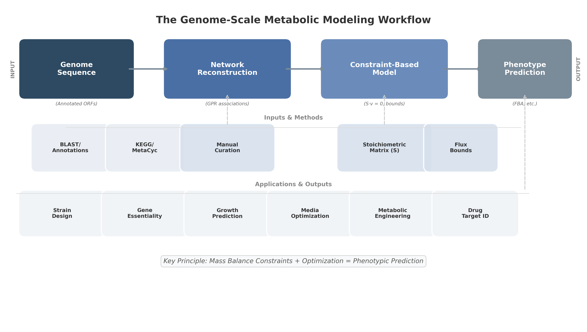

# 8. 대사모델링 전체 워크플로 개관

지금까지 살펴본 개념·역사·분류를 종합하면, 하나의 게놈 규모 대사 모델이 만들어지고 활용되기까지의 전체 워크플로는 대략 다음과 같은 단계로 이루어집니다.



*그림 8.1. GEM의 입력–재구축–수학적 모델–표현형 예측 흐름. 아래의 7단계 목록은 이 개념도를 품질관리와 맥락 특이화까지 확장한 것입니다.*

```
1단계. 대사 네트워크 재구축(Reconstruction)
        게놈 주석 + 데이터베이스(KEGG, MetaCyc) + 문헌 → 초안 네트워크
        [상세: Chapter 5]
              │
              ▼
2단계. 모델 구조화(Formalization)
        화학량론 행렬 S 구성, GPR 규칙 부여, 구획·수송 반응,
        생물량 목적함수(Biomass Objective Function) 정의
        [상세: Chapter 2, Chapter 3]
              │
              ▼
3단계. 제약 설정(Constraining)
        열역학적/용량적/환경적 bounds 설정 (배지 조성, 산소 조건 등)
        [상세: Chapter 2, Chapter 3]
              │
              ▼
4단계. 시뮬레이션(Simulation)
        FBA/pFBA/FVA를 통한 통량 분포 예측, 유전자 결실 스크리닝
        [상세: Chapter 4]
              │
              ▼
5단계. 검증과 정제(Validation & QC)
        실험 데이터(성장률, 필수성, 분비 프로파일)와 비교, MEMOTE 품질 평가
        [상세: Chapter 5]
              │
              ▼
6단계. 조건 특이화(Context-Specific Integration) — 선택적
        전사체/단백체 데이터를 통합하여 특정 세포·조직·조건에 맞는 모델 도출
        [상세: Chapter 6]
              │
              ▼
7단계. 응용(Application)
        균주 설계, 약물 표적 발굴, 질병 메커니즘 규명, AI 결합 예측 등
        [상세: Chapter 7, Chapter 8, Chapter 9]
```

각 단계를 아주 간단히 한 문장씩 풀어보면 다음과 같습니다.

- **1단계(재구축)**는 "이 생명체가 가진 대사 능력의 목록을 만드는" 단계입니다. 게놈을 읽고, 어떤 유전자가 어떤 효소를 만드는지 찾아, 그 효소가 촉매하는 반응들을 데이터베이스와 문헌에서 확인합니다.
- **2단계(구조화)**는 이렇게 모은 반응 목록을 컴퓨터가 계산할 수 있는 수학적 형태 — 화학량론 행렬, GPR 규칙, 생물량 반응 — 로 바꾸는 단계입니다.
- **3단계(제약 설정)**는 "이 세포가 어떤 환경에 있는가"를 반영하는 단계입니다. 배지에 포도당이 얼마나 있는지, 산소가 있는지 없는지 등을 각 반응의 상한·하한으로 표현합니다.
- **4단계(시뮬레이션)**는 이렇게 완성된 수학 문제를 실제로 풀어서, "이 조건에서 세포는 어떤 속도로 자라고, 각 반응은 얼마나 활발히 일어나는가"를 계산하는 단계입니다.
- **5단계(검증)**는 계산 결과를 실제 실험 데이터와 비교해서 모델이 믿을 만한지 확인하는 단계입니다.
- **6단계(조건 특이화)**는 선택적 단계로, "일반적인 세포"가 아니라 "이 환자의 이 조직 세포"처럼 더 구체적인 상황에 맞게 모델을 조정하는 단계입니다.
- **7단계(응용)**은 완성된 모델을 실제 문제 — 균주 설계, 신약 표적 탐색 등 — 에 사용하는 단계입니다.

이 워크플로는 선형적이라기보다 **반복적(Iterative)**입니다. 5단계에서 모델-실험 불일치가 발견되면 1~2단계로 되돌아가 네트워크를 정제하는 과정이 반복되며, 이는 §6.3에서 살펴본 96단계 프로토콜의 핵심 철학이기도 합니다.

---
