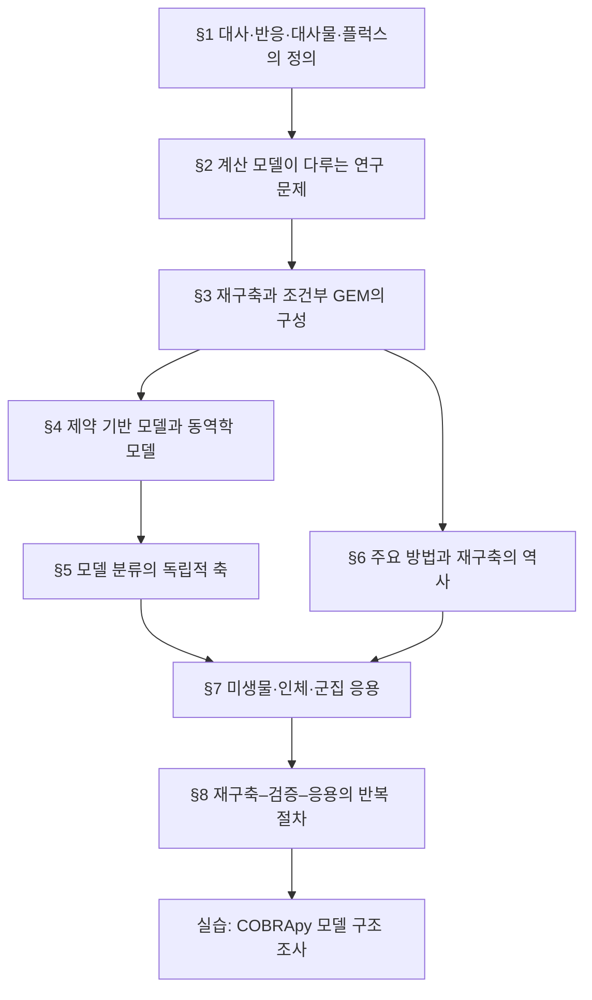

# Chapter 1. 대사모델링의 개요

게놈 규모 대사 모델링(genome-scale metabolic modeling)은 생화학 반응에 대한 지식을 화학량론적 네트워크로 재구축하고, 질량수지와 반응 경계조건을 이용하여 가능한 세포 대사 상태를 분석하는 방법론이다. 이 장은 대사 네트워크의 생물학적 대상, 계산 모델의 범위, 제약 기반 접근과 동역학적 접근의 차이, 주요 모델의 발전 과정 및 표준 연구 절차를 정의한다.

## 표기와 읽기 원칙

이 책은 한국어 용어를 먼저 쓰고, 처음 등장할 때 영어 원어와 약어를 함께 표기한다. 이후에는 같은 장 안에서 한 표기를 일관되게 사용한다.

- **플럭스**(flux; 대사 통량), **반응**(reaction), **대사물**(metabolite)은 각각 단위 시간당 반응 진행률, 화학량론적 변환, 구획을 포함한 화학종을 뜻한다.
- **경계조건**(bounds), **목적함수**(objective function), **솔버**(solver)는 생물학적 사실이 아니라 모델에 부여한 계산 조건이다.
- 조건·가정·절차는 번호 목록으로, 결과의 범위와 예외는 `해석상의 주의` 상자로 구분한다.


본문의 “예측”은 명시된 모델·배지·경계조건·목적함수 아래의 계산 결과다. 실험 관찰이나 인과적 효과와 혼용하지 않는다.


## 문제 설정과 분석 범위

유전자 결손, 배지 조성 변화 또는 효소 용량의 제한은 하나의 반응에만 영향을 주지 않는다. 대사물 공유, 보조인자 재생 및 대체 경로 때문에 국소 교란은 네트워크 전반의 플럭스 분배를 변화시킬 수 있다. 실험은 이러한 변화를 직접 측정하는 기준이지만, 가능한 유전적·환경적 조합을 모두 실험하는 것은 현실적으로 어렵다. 계산 모델은 실험을 대체하는 장치가 아니라, 물질수지에 부합하는 후보 상태를 체계적으로 열거하고 검증할 가설의 우선순위를 정하는 도구이다.

이 장에서 사용하는 **게놈 규모 대사 모델(GEM)**이라는 용어는 두 층위를 포함한다.

1. **대사 네트워크 재구축(reconstruction)**: 유전체 주석, 생화학 데이터베이스, 문헌 및 실험 증거를 통합한 추적 가능한 지식베이스
2. **조건부 계산 모델(model)**: 재구축에 배지, 반응 경계조건, 목적함수와 분석 가정을 부여하여 수치 계산이 가능하게 만든 표현

이 구분은 중요하다. 동일한 재구축이라도 배지와 목적함수가 달라지면 서로 다른 예측을 내며, 모델의 출력은 실험 관찰값이 아니라 명시된 가정 아래의 계산 결과이다.

## 장의 구성

*그림 1.1. Chapter 1의 개념 의존 관계. 절 번호는 시간 순서가 아니라 정의에서 방법과 응용으로 이어지는 논리적 순서를 나타낸다. 저자 작성.*

이 장의 실습은 COBRApy의 `textbook` 모델을 사용한다. 이 모델은 *E. coli* 중심탄소대사를 95개 반응, 72개 구획별 대사물, 137개 유전자로 축약한 교육용 네트워크이다. 게놈 전체를 포괄하는 iML1515와 구분해야 하며, 여기서 얻는 수치를 생물 종의 고정된 네트워크 크기로 해석해서는 안 된다. 동일한 모델을 뒤 장에서도 사용하여 화학량론 행렬, GPR, FBA, FVA 및 유전자 결손 분석을 단계적으로 검증한다.

## 대화형 도해: 핵심 가정과 결과 해석


아래 도해는 **교육용 개념·모의 데이터**를 조작하여 이 장의 핵심 가정과 해석 범위를 확인하는 보조 자료이다. 실제 GEM 결과로 인용할 수 없으며, 실제 계산은 모델 버전·배지·목적함수·solver·허용오차를 고정한 실습 코드로 재현해야 한다.




[새 창에서 대화형 도해 열기](https://jyryu3161.github.io/ebook_metabolic_modeling/interactive/index.html?chapter=1)

## 이 장을 읽는 방법

대사 모델링은 “세포가 실제로 무엇을 하는가”를 그대로 관찰하는 방법이 아니라, **명시한 네트워크와 조건 아래에서 어떤 플럭스 상태가 가능한지 계산하는 방법**이다. 이 장에서는 용어를 외우기보다 다음 순서로 읽는다.

1. **대사물·반응·플럭스**가 각각 무엇을 나타내는지 구분한다.
2. 모델에 반응이 *존재*하는 것, 경계 안에서 플럭스가 *허용*되는 것, 목적함수 아래에서 해가 *선택*되는 것을 구분한다.
3. 계산 결과를 실험적 사실로 바꾸기 전에 어떤 독립 검증이 필요한지 확인한다.


이 책에서 “예측”은 언제나 모델 릴리스, 배지, 반응 경계, 목적함수와 해결기 설정에 조건부인 계산 결과를 뜻한다.


## 학습 목표

이 장을 마친 뒤에는 다음을 수행할 수 있어야 한다.

1. 대사물, 반응, 화학량론 계수와 플럭스를 생화학적 대상 및 계산 객체의 관점에서 각각 정의한다.
2. 대사 네트워크 모델이 실험과 구별되는 역할을 설명하고, 모델이 직접 예측하지 않는 양을 판별한다.
3. 대사 네트워크 재구축과 조건·목적함수가 부여된 계산 모델을 구분한다.
4. 제약 기반 모델과 동역학 모델의 상태변수, 매개변수, 출력 및 적용 범위를 비교한다.
5. 모델을 범위, 수학적 형식, 생물학적 대상에 따라 분류하고 각 축을 혼동하지 않는다.
6. 주요 GEM의 발전을 모델 규모가 아니라 새로 도입된 표현·검증 방법을 기준으로 설명한다.
7. COBRApy 모델에서 반응·대사물·유전자 수와 목적함수, 구획 및 경계조건을 조사한다.

| 학습 목표 | 본 장 | 후속 심화 |
|:---|:---|:---|
| 용어와 네트워크 정의 | §1 | [Chapter 2](../chapter-2/README.md) |
| 모델의 연구 기능과 한계 | §2 | [Chapter 4](../chapter-4/README.md) |
| 재구축과 GEM 구성 | §3 | [Chapter 3](../chapter-3/README.md), [Chapter 5](../chapter-5/README.md) |
| 제약 기반·동역학 모델 비교 | §4 | [Chapter 4](../chapter-4/README.md) |
| 모델 분류 | §5 | Chapters 5–9 |
| 역사와 원 논문 | §6 | [대표 논문 가이드](../landmark-papers.md) |
| 계산 객체 조사 | 실습 | [Chapter 10](../chapter-10/README.md) |

## 선수 지식과 표기

행렬과 벡터의 기본 연산, 몰과 화학량론 계수, 함수와 부등식에 대한 기초 지식을 전제로 한다. 플럭스의 기본 단위는 별도 언급이 없으면 $$\mathrm{mmol\,gDW^{-1}\,h^{-1}}$$이며, $$\mathrm{gDW}$$는 건조 세포 질량(gram dry weight)을 뜻한다. 정상 상태, 반응 방향성 및 성장 최적화는 보편적 생물 법칙이 아니라 뒤 장에서 검토할 모델 가정으로 취급한다.

---
