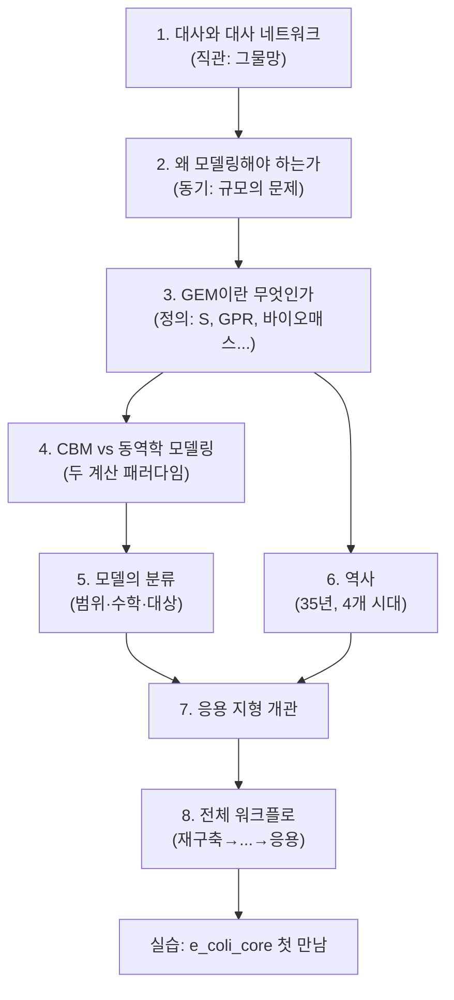

# Chapter 1. 대사모델링의 개요

> 게놈 규모 대사 모델링(Genome-scale Metabolic Modeling, GEM)은 생명체의 게놈 서열에 인코딩된 모든 대사 반응을 수학적으로 표현하여, 세포의 대사 행동을 정량적으로 예측하는 계산 생물학의 한 분야입니다. 이 장을 마치면 여러분은 "왜 대사를 굳이 수학으로 옮겨야 하는가"라는 질문에 스스로 답할 수 있고, COBRApy로 실제 *E. coli* 모델을 불러와 그 크기를 눈으로 확인할 수 있게 됩니다.


생장곡선, Monod 식, 배양 방식, 중심탄소대사와 효소 분류가 낯설다면 먼저 준비 학습 A를 읽으십시오. 이후 장의 `mmol gDW⁻¹ h⁻¹` 단위와 배지 제약을 훨씬 쉽게 해석할 수 있습니다.


---

## 이 장을 시작하며

여러분은 오늘 아침에 무엇을 드셨나요? 밥 한 공기, 계란 하나, 우유 한 잔이라고 해봅시다. 지금 이 문장을 읽고 있는 이 순간에도, 여러분의 몸속 수십조 개의 세포 하나하나에서는 그 밥과 계란과 우유가 수천 가지의 화학 반응을 거쳐 에너지로, 근육 단백질로, 신경전달물질로 바뀌고 있습니다. 이 반응들은 서로 완전히 독립적이지 않습니다. 한 반응의 생성물이 다음 반응의 원료가 되고, 그 다음 반응의 생성물이 또 다른 반응의 원료가 되는 식으로 거대한 사슬—아니, 사슬이라기보다는 그물망—을 이룹니다.

여기서 흥미로운 질문 하나를 던져보겠습니다.

> 대장균(*E. coli*)의 특정 유전자 하나를 인위적으로 망가뜨리면(유전자 결손, gene knockout), 이 세균은 죽을까요, 살아남을까요? 살아남는다면 성장 속도는 얼마나 느려질까요? 그리고 어떤 부산물을 새로 분비하게 될까요?

이 질문에 자신 있게 답할 수 있는 사람은 많지 않을 것입니다. 그 이유는 단순합니다 — 대장균만 해도 4,000개가 넘는 유전자와 수천 개의 대사 반응이 얽혀 있어서, 유전자 하나를 없앴을 때 그 파급 효과가 네트워크 전체로 어떻게 퍼져나가는지 사람의 머릿속 직관만으로는 도저히 추적할 수 없기 때문입니다. 그런데 실제로 이 질문에 **정확히, 몇 초 만에, 컴퓨터로** 답할 수 있는 방법이 있습니다. 그것이 바로 이 책 전체가 다룰 **게놈 규모 대사 모델링(GEM)**입니다.

이 장은 이 책의 출발점입니다. 아직 화학량론 행렬도, GPR도, FBA 수식도 등장하지 않습니다. 대신 다음 질문들에 대한 큰 그림을 그립니다: 대사란 무엇인가? 왜 이것을 "모델링"해야 하는가? GEM이란 정확히 무엇인가? 그리고 이 분야는 지난 35년간 어떻게 발전해 왔는가? 이 장을 다 읽고 나면, 여러분은 왜 다음 장부터 화학량론 행렬이라는 다소 낯선 수학적 도구를 배워야 하는지 스스로 납득하게 될 것입니다.

이 책은 하나의 출판사가 흔히 그러하듯 각 장을 독립된 섬처럼 다루지 않습니다. 대신 처음부터 끝까지 **하나의 실행 예제**를 반복해서 사용합니다. 바로 §9(실습)에서 처음 만날 `e_coli_core` 모델(반응 95개·대사물 72개·유전자 137개)입니다. 이 장에서는 이 모델을 "몇 개로 이루어져 있는지" 세어보는 첫걸음만 뗍니다. Chapter 2에서는 이 모델의 화학량론 행렬을 직접 구성하고, Chapter 3에서는 이 모델의 GPR과 구획 구조를 열어보고, Chapter 4에서는 이 모델로 실제 FBA를 실행해 성장률을 계산합니다. 즉 이 장에서 얻는 "95, 72, 137"이라는 세 숫자는 앞으로 여러 장에 걸쳐 계속 되돌아올 기준점입니다.


📊 **이 장의 로드맵.** 아래 그림은 이 장의 8개 절이 어떤 순서로 큰 그림을 완성해 가는지 보여줍니다. 화살표는 "이 절의 결론이 다음 절의 출발점이 된다"는 논리적 의존 관계입니다.



---
## 학습 목표 (Learning Objectives)

이 장을 마치면 학습자는 다음을 할 수 있습니다:

1. 대사(Metabolism)와 대사 네트워크(Metabolic Network)의 기본 개념을 비유를 들어 설명할 수 있다.
2. 대사를 왜 "모델링"해야 하는지 — 즉 직관적 이해만으로는 부족한 이유 — 를 구체적 사례로 설명할 수 있다.
3. 게놈 규모 대사 모델(GEM)의 정의와 그 핵심 가정(의사-정상 상태)을 설명할 수 있다.
4. 제약 기반 모델링(CBM)과 동역학 모델링(Kinetic Modeling)의 원리를 비교하고, 각각이 적합한 상황을 판단할 수 있다.
5. 대사 모델을 범위·수학적 틀·생물학적 대상에 따라 분류(Taxonomy)할 수 있다.
6. 대사 모델링의 역사를 4개 시대로 구분하여 대표 모델과 핵심 혁신을 설명할 수 있다.
7. COBRApy로 대사 모델을 불러오고 기본 구성 요소(반응·대사물·유전자)의 개수를 확인하는 첫걸음을 뗄 수 있다.

아래 표는 각 학습 목표가 이 장의 어느 절에서 다뤄지고, 이후 어느 장에서 더 깊이 확장되는지를 보여줍니다. 지금 당장 모든 세부 사항을 이해하지 못해도 괜찮습니다 — 이 표는 "지금은 개관만, 자세한 것은 나중에"라는 이 책의 설계 원칙을 미리 보여주는 지도입니다.

| 학습 목표 | 이 장에서 다루는 절 | 더 깊이 배우는 장 |
|:---|:---|:---|
| 1. 대사·네트워크 직관 | §1 | [Chapter 2](../chapter-2/README.md)(S행렬) |
| 2. 모델링의 필요성 | §2 | — (본 장이 종착점) |
| 3. GEM 정의·의사-정상 상태 | §3 | [Chapter 2](../chapter-2/README.md), [Chapter 3](../chapter-3/README.md) |
| 4. CBM vs 동역학 | §4 | [Chapter 4](../chapter-4/README.md)(FBA 수식) |
| 5. 모델 분류 | §5 | [Chapter 5](../chapter-5/README.md)~[Chapter 9](../chapter-9/README.md) 전체 |
| 6. 역사 4개 시대 | §6 | [부록: 대표 논문](../landmark-papers.md) |
| 7. COBRApy 첫걸음 | 실습 | [Chapter 4](../chapter-4/README.md)(FBA 실행) |


❓ **흔한 오해:** "개요(Chapter 1)니까 대충 훑고 넘어가도 되겠지"라고 생각하기 쉽습니다. 그러나 이 장에서 확립하는 두 가지 — (1) 의사-정상 상태 가정 $$\frac{d\mathbf{x}}{dt}=\mathbf{0}$$, (2) 제약 기반 모델링의 네 가지 제약 종류 — 는 이후 모든 장에서 "당연히 알고 있다"고 전제하고 넘어가는 기초입니다. 특히 §3.3과 §4.1은 반드시 손으로 한 번 짚고 넘어가시길 권합니다.


---
