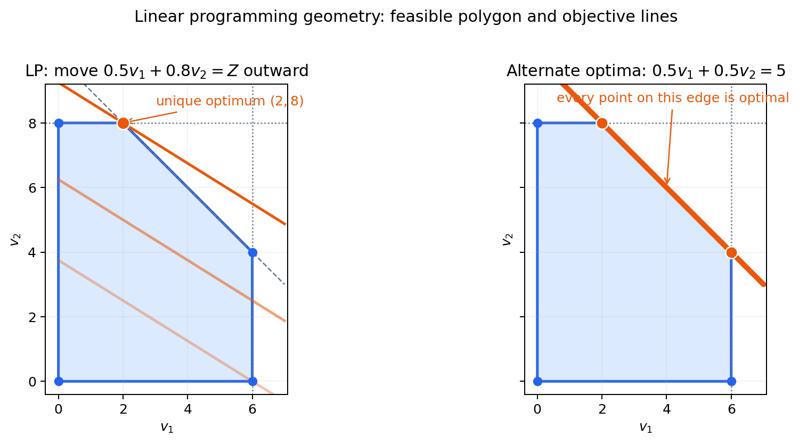
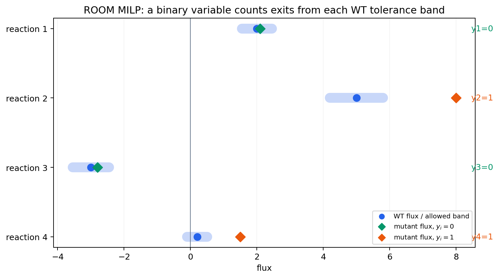

# Chapter 10. COBRApy 완전 실행 튜토리얼

> 지금까지 배운 FBA·pFBA·FVA·유전자 결손·MOMA·ROOM·gap-filling을 하나의 재현 가능한 노트북 흐름으로 연결합니다. 모든 기준값은 **COBRApy 0.30.0 + GLPK + `textbook`(`e_coli_core`) 모델**에서 검산했습니다. 이 장을 위에서 아래로 실행하면 모델을 불러오는 데서 시작해 결과와 환경 정보를 JSON으로 남기는 데까지 한 번에 도달합니다.

이 장의 목적은 API 이름을 외우는 것이 아닙니다. 각 계산에서 다음 네 질문에 답하는 습관을 만드는 것이 목적입니다.

1. 지금 바꾼 것은 모델, 배지, 목적함수 중 무엇인가?
2. solver가 반환한 상태는 정말 `optimal`인가?
3. 목적함수 값 외에 질량보존과 수치 유한성도 확인했는가?
4. 다른 사람이 같은 모델과 조건을 복원할 기록을 남겼는가?

## 학습 목표

이 장을 마치면 다음을 할 수 있습니다.

- COBRApy 객체 모델과 GPR 규칙을 탐색하고 exchange flux의 부호를 해석한다.
- `model.medium`과 context manager로 조건을 안전하게 바꾼다.
- FBA 결과의 solver 상태와 $$\mathbf{S}\mathbf{v}=\mathbf{0}$$ 잔차를 검산한다.
- pFBA와 FVA가 각각 답하는 질문을 구분한다.
- infeasible/`NaN`을 안전하게 처리하며 유전자 결손을 분류한다.
- `tpiA` 결손을 FBA, 선형 MOMA, 선형 ROOM으로 비교한다.
- `optlang`으로 작은 GLPK MILP를 만들고 binary variable의 역할을 설명한다.
- 장난감 모델에서 gap-filling, production envelope, SBML 왕복 검증을 수행한다.
- Plotly와 ipywidgets로 조건을 대화형으로 탐색하고 실행 기록을 저장한다.

---

## 0. 노트북 실행 규칙

코드 블록 위의 배지는 실행 조건을 뜻합니다.

| 배지 | 의미 |
|:---|:---|
| **✅ 독립 실행** | 필요한 import와 입력을 셀 안에서 준비하므로 단독 실행 가능 |
| **🔗 선행 셀 필요** | 이 장의 앞선 셀에서 만든 `model`, `results` 등의 변수를 사용 |
| **📦 외부 자산 필요** | 사용자가 준비한 SBML 같은 로컬 파일이 있어야 실행 가능 |
| **🧭 의사코드** | 알고리듬의 생각 순서를 보여 주는 설명이며 실행 대상이 아님 |

핵심 경로는 **✅와 🔗 셀을 위에서 아래로 실행**하는 것입니다. 📦 셀은 자신의 모델로 확장할 때만, 🧭 블록은 구현 전에 논리를 확인할 때만 사용합니다.

### 0.1 한 번만 설치하기

> ✅ **독립 실행 · 터미널**

```bash
python3 -m venv .venv
source .venv/bin/activate              # Windows PowerShell: .venv\Scripts\Activate.ps1
python -m pip install --upgrade pip
python -m pip install "cobra==0.30.0" swiglpk numpy pandas \
  jupyterlab ipykernel plotly ipywidgets
python -m pip check
```

`python -m pip` 형태를 쓰면 지금 선택한 Python에 설치한다는 뜻이 분명해집니다. 설치 후 Jupyter 커널의 `sys.executable`이 `.venv` 안을 가리키는지도 확인하십시오. 더 자세한 환경 분리는 [재현 가능한 실습 환경](supplements/reproducible-environment.md)을 참고합니다.


`load_model("textbook")`은 처음 실행할 때 원격 저장소에서 모델을 내려받아 로컬 캐시에 보관할 수 있습니다. 첫 실행에는 네트워크가 필요할 수 있으며, 엄밀한 재현이 필요하면 §12처럼 실제 분석 모델을 SBML로 저장하고 checksum을 함께 기록하십시오.


---

## 1. Preflight: 버전·solver·모델을 먼저 고정하기

### 1.1 시작 셀

> ✅ **독립 실행**

```python
import sys
import numpy as np
import pandas as pd
import cobra

from cobra import Configuration
from cobra.io import load_model

assert cobra.__version__ == "0.30.0", (
    f"이 장의 기준 버전은 0.30.0입니다. 현재 버전: {cobra.__version__}"
)

# 교육용 예제는 단일 프로세스로 실행 순서와 출력을 재현한다.
configuration = Configuration()
configuration.solver = "glpk"
configuration.processes = 1

model = load_model("textbook")
active_solver = model.solver.interface.__name__

assert active_solver.endswith("glpk_interface")
assert (len(model.reactions), len(model.metabolites), len(model.genes)) == (95, 72, 137)
assert model.reactions.has_id("Biomass_Ecoli_core")

# 뒤의 셀에서 숫자와 provenance를 모을 사전이다.
results = {}

print("Python:", sys.version.split()[0])
print("COBRApy:", cobra.__version__)
print("solver:", active_solver)
print("model:", model.id)
print("reactions / metabolites / genes:",
      len(model.reactions), len(model.metabolites), len(model.genes))
```

기준 환경에서는 모델 ID `e_coli_core`, 반응 95개, 대사물 72개, 유전자 137개가 출력됩니다. `processes=1`은 수치해를 바꾸기 위한 설정이 아니라, 작은 교육 예제에서 운영체제별 multiprocessing 차이를 줄이기 위한 설정입니다.

### 1.2 내 SBML 모델로 바꾸기(선택)

> 📦 **외부 자산 필요 · 핵심 순차 실습에는 포함하지 않음**

```python
from pathlib import Path
from cobra.io import read_sbml_model

model_path = Path("models/my_model.xml")
assert model_path.exists(), f"파일을 찾을 수 없습니다: {model_path}"
user_model = read_sbml_model(model_path)
print(user_model.id, len(user_model.reactions))
```

자체 모델을 쓰면 이 장의 반응 ID(`EX_glc__D_e`, `Biomass_Ecoli_core` 등)를 그대로 가정하면 안 됩니다. 먼저 exchange, biomass, compartment, GPR ID를 모델 문서와 함께 확인해야 합니다.

---

## 2. COBRApy 객체 모델 읽기

COBRApy의 중심 객체는 `Model`, `Reaction`, `Metabolite`, `Gene`입니다. 객체들은 단순한 표의 행이 아니라 서로 연결되어 있습니다. 예를 들어 반응에서 기질·생성물과 유전자로, 유전자에서 그 유전자가 관여하는 모든 반응으로 이동할 수 있습니다.

### 2.1 반응식과 GPR 살펴보기

> 🔗 **선행 셀 필요: §1.1의 `model`**

```python
for reaction_id in ["PGI", "ACALD", "ATPS4r"]:
    reaction = model.reactions.get_by_id(reaction_id)
    print(f"\n[{reaction.id}] {reaction.name}")
    print("reaction:", reaction.reaction)
    print("bounds:", reaction.bounds)
    print("GPR:", reaction.gene_reaction_rule or "(빈 규칙)")
    print("genes:", sorted(gene.id for gene in reaction.genes))

pgi_gene = model.genes.get_by_id("b4025")
print("\nb4025가 관여하는 반응:", sorted(r.id for r in pgi_gene.reactions))
```

- `PGI`의 GPR `b4025`는 단일 유전자 규칙입니다.
- `ACALD`의 `b0351 or b1241`은 둘 중 하나의 isozyme이 남으면 반응이 유지될 수 있다는 뜻입니다.
- `ATPS4r`의 긴 `and`/`or` 조합은 여러 subunit으로 이루어진 복합체와 대체 조합을 함께 표현합니다.

GPR이 비어 있다는 사실만으로 반응이 잘못되었다고 단정해서는 안 됩니다. exchange·demand·spontaneous reaction일 수도 있고, 아직 유전자 주석이 부족한 반응일 수도 있습니다.

### 2.2 Exchange 부호와 `model.medium`

BiGG 형식 모델의 전형적인 exchange 반응은 $$-M_e \rightleftharpoons \varnothing$$처럼 정의됩니다. 이때 **음의 exchange flux는 uptake**, 양의 flux는 secretion입니다. 그러나 `model.medium`은 사람이 읽기 쉽게 **섭취 용량의 양수 크기**를 반환합니다.

> 🔗 **선행 셀 필요: §1.1의 `model`**

```python
glucose_exchange = model.reactions.get_by_id("EX_glc__D_e")
oxygen_exchange = model.reactions.get_by_id("EX_o2_e")
medium = model.medium.copy()

print("glucose equation:", glucose_exchange.reaction)
print("glucose bounds:", glucose_exchange.bounds)
print("medium glucose capacity:", medium["EX_glc__D_e"])
print("oxygen bounds:", oxygen_exchange.bounds)
print("medium oxygen capacity:", medium["EX_o2_e"])

assert glucose_exchange.lower_bound == -medium["EX_glc__D_e"]
assert medium["EX_glc__D_e"] == 10.0
```

따라서 `model.medium["EX_glc__D_e"] = 5`는 "glucose flux를 +5로 고정"한다는 뜻이 아닙니다. 최대 섭취량을 5로 제한하여 해당 exchange의 lower bound를 `-5`로 만든다는 뜻입니다. `textbook`의 기본 산소 섭취 용량은 1000으로 사실상 느슨합니다. 산소 제한을 연구하려면 그 값을 반드시 명시해야 합니다.

---

## 3. FBA를 풀고 $$\mathbf{S}\mathbf{v}=\mathbf{0}$$ 검산하기

### 3.1 상태와 목적함수 값 확인

> 🔗 **선행 셀 필요: §1.1의 `model`, `results`**

```python
solution = model.optimize()

assert solution.status == "optimal"
assert np.isfinite(solution.objective_value)

wt_growth = float(solution.objective_value)
results["wt_growth"] = wt_growth

print("status:", solution.status)
print("objective value:", f"{wt_growth:.9f} h^-1")
print("biomass flux:", f"{solution.fluxes['Biomass_Ecoli_core']:.9f}")

assert abs(wt_growth - 0.873921507) < 1e-6
```

`optimize()`는 flux 전체가 필요할 때 사용합니다. 목적함수 값만 빠르게 필요하다면 `model.slim_optimize(error_value=np.nan)`가 가볍습니다. 실패 가능성이 있는 반복 계산에서는 반환값이 `None`일 것이라고 가정하지 말고 `np.isfinite`로 검사해야 합니다.

### 3.2 질량보존 잔차 계산

> 🔗 **선행 셀 필요: §3.1의 `model`, `solution`, `results`**

```python
from cobra.util.array import create_stoichiometric_matrix

S = create_stoichiometric_matrix(model, array_type="DataFrame")
ordered_fluxes = solution.fluxes.reindex(S.columns)
mass_balance_residual = S.dot(ordered_fluxes)
max_abs_residual = float(mass_balance_residual.abs().max())

results["max_abs_Sv_residual"] = max_abs_residual

print("S shape:", S.shape)
print("max |S v|:", f"{max_abs_residual:.3e}")
assert max_abs_residual < 1e-9
```

`status == "optimal"`은 solver가 주어진 수학 문제를 풀었다는 뜻이고, $$\max_i |(\mathbf{S}\mathbf{v})_i|$$ 검사는 반환 flux가 steady-state 질량보존을 수치 허용오차 안에서 만족하는지 확인합니다. 둘은 서로 대체할 수 없는 검사입니다.


같은 최대 성장률을 만드는 flux 벡터가 여러 개일 수 있습니다. 따라서 회귀 테스트에서 **95개 flux 전체를 한 벡터와 완전히 같다고 검사하지 마십시오.** 목적함수 값, 필수 제약, 질량보존, 관심 반응의 FVA 범위를 검사하는 편이 대안 최적해에 강합니다.


---

## 4. Context manager로 배지와 목적함수 바꾸기

`Model`은 가변 객체입니다. 한 셀에서 바꾼 bound나 목적함수가 다음 실험으로 새어 나가면 비교 자체가 틀어집니다. `with model:` 안에서 수정하면 블록을 벗어날 때 원래 상태로 복원됩니다.

### 4.1 Glucose 제한과 무산소 조건

> 🔗 **선행 셀 필요: §1.1의 `model`, `results`**

```python
baseline_medium = model.medium.copy()

glucose_limited_medium = baseline_medium.copy()
glucose_limited_medium["EX_glc__D_e"] = 5.0
with model:
    model.medium = glucose_limited_medium
    glucose_5_growth = model.slim_optimize(error_value=np.nan)

anaerobic_medium = baseline_medium.copy()
anaerobic_medium["EX_o2_e"] = 0.0
with model:
    model.medium = anaerobic_medium
    anaerobic_growth = model.slim_optimize(error_value=np.nan)

assert np.isfinite(glucose_5_growth)
assert np.isfinite(anaerobic_growth)
assert model.medium == baseline_medium  # 두 실험 뒤 원상 복구

glucose_5_growth = float(glucose_5_growth)
anaerobic_growth = float(anaerobic_growth)
results["glucose_5_growth"] = glucose_5_growth
results["anaerobic_growth"] = anaerobic_growth

print("glucose uptake capacity 5:", f"{glucose_5_growth:.9f}")
print("oxygen uptake capacity 0:", f"{anaerobic_growth:.9f}")

assert abs(glucose_5_growth - 0.415597775) < 1e-6
assert abs(anaerobic_growth - 0.211662950) < 1e-6
```

두 숫자는 각각 다른 한 가지 조건만 바꾼 결과입니다. glucose 제한과 무산소 조건을 동시에 적용한 값이 아닙니다. 조건 비교표에는 이처럼 바꾸지 않은 나머지 조건도 함께 기록해야 합니다.

### 4.2 Biomass 대신 ATP maintenance 최대화

> 🔗 **선행 셀 필요: §1.1의 `model`, `results`; §3.1의 `wt_growth`**

```python
with model:
    model.objective = "ATPM"
    max_atp_maintenance = model.slim_optimize(error_value=np.nan)

assert np.isfinite(max_atp_maintenance)
max_atp_maintenance = float(max_atp_maintenance)
restored_growth = float(model.slim_optimize(error_value=np.nan))

results["max_ATPM"] = max_atp_maintenance

print("max ATPM:", f"{max_atp_maintenance:.6f}")
print("restored biomass objective:", f"{restored_growth:.9f}")

assert abs(max_atp_maintenance - 175.0) < 1e-6
assert abs(restored_growth - wt_growth) < 1e-9
```

가능 영역이 같아도 목적함수가 달라지면 선택되는 해가 달라집니다. "모델 예측"을 보고할 때는 모델 이름만이 아니라 **목적함수와 방향(max/min)**을 함께 적어야 하는 이유입니다.

---

## 5. 하나의 최적해를 넘어: pFBA와 FVA

### 5.1 pFBA: 최대 성장 뒤 총 flux 최소화

pFBA는 먼저 최대 성장을 구한 뒤, 그 성장을 유지하면서 총 절대 flux를 최소화합니다. 이 사전식(lexicographic) 목적은 "같은 성장을 낼 수 있다면 효소 사용이 덜 필요한 경로를 선호한다"는 가정을 추가합니다.

> 🔗 **선행 셀 필요: §1.1의 `model`, `results`; §3.1의 `wt_growth`**

```python
from cobra.flux_analysis import pfba

pfba_solution = pfba(model)
pfba_growth = float(pfba_solution.fluxes["Biomass_Ecoli_core"])
pfba_total_absolute_flux = float(pfba_solution.fluxes.abs().sum())

results["pfba_growth"] = pfba_growth
results["pfba_total_absolute_flux"] = pfba_total_absolute_flux

print("pFBA biomass flux:", f"{pfba_growth:.9f}")
print("pFBA sum |v|:", f"{pfba_total_absolute_flux:.6f}")

assert pfba_solution.status == "optimal"
assert abs(pfba_growth - wt_growth) < 1e-6
```

COBRApy 0.30.0의 `pfba_solution.objective_value`는 이 경우 biomass가 아니라 **2단계 목적함수인 총 flux** 약 `518.422086`입니다. 생장률은 반드시 `pfba_solution.fluxes["Biomass_Ecoli_core"]`에서 읽어야 합니다.

### 5.2 FVA: 최적에 가까운 해들의 반응별 범위

> 🔗 **선행 셀 필요: §1.1의 `model`, `results`**

```python
from cobra.flux_analysis import flux_variability_analysis

fva = flux_variability_analysis(
    model,
    reaction_list=["PGI", "PFK", "TPI"],
    fraction_of_optimum=0.90,
    processes=1,
)
fva["width"] = fva["maximum"] - fva["minimum"]

results["fva_PGI_min"] = float(fva.loc["PGI", "minimum"])
results["fva_PGI_max"] = float(fva.loc["PGI", "maximum"])

print(fva.round(6).to_string())
```

기준 실행에서 `PGI` 범위는 약 `[-14.299039, 9.838761]`입니다. 부호가 양쪽에 걸친다는 것은 최대 성장의 90% 이상을 유지하는 해들 중 PGI를 정방향으로 쓰는 해와 역방향으로 쓰는 해가 모두 있다는 뜻입니다.

FVA의 각 행은 해당 반응만 최소화·최대화한 별도 LP의 결과입니다. 따라서 모든 반응의 minimum을 한꺼번에 모은 벡터가 하나의 실현 가능한 flux distribution이라고 해석해서는 안 됩니다.

---

## 6. 안전한 단일 유전자 결손 스크리닝

먼저 알고리듬의 흐름을 말로 확인합니다.

> 🧭 **의사코드 · 실행하지 않음**

```text
wild-type 생장률을 계산한다
for 각 gene:
    context manager 안에서 gene을 knock out 한다
    생장률과 solver status를 계산한다
    값이 NaN/무한대/infeasible이면 분류용 생장률을 0으로 둔다
    wild-type 대비 비율로 essential / growth-reduced / non-essential을 분류한다
```

실제로는 COBRApy의 `single_gene_deletion`이 GPR Boolean 평가와 반복 최적화를 수행합니다. 중요한 부분은 반환값의 수치 유한성을 직접 확인하는 것입니다.

> 🔗 **선행 셀 필요: §1.1의 `model`, `results`; §3.1의 `wt_growth`**

```python
from cobra.flux_analysis import single_gene_deletion

deletions = single_gene_deletion(model, processes=1).copy()

# COBRApy 0.30.0에서 infeasible 생장률은 None이 아니라 NaN일 수 있다.
raw_growth = deletions["growth"].to_numpy(dtype=float)
finite_growth = np.isfinite(raw_growth)
nonfinite_rows = deletions.loc[~finite_growth, ["ids", "growth", "status"]]

# NaN을 0으로 치환하기 전에 원인이 실제 infeasible인지 먼저 감사한다.
print("non-finite rows before classification:")
print(nonfinite_rows.to_string(index=False))
assert nonfinite_rows["status"].eq("infeasible").all()

deletions["growth_safe"] = np.where(
    finite_growth,
    raw_growth,
    0.0,
)
deletions["growth_ratio"] = deletions["growth_safe"] / wt_growth
deletions["class"] = np.select(
    [
        deletions["growth_ratio"] < 0.01,
        deletions["growth_ratio"] < 0.90,
    ],
    ["essential", "growth-reduced"],
    default="non-essential",
)

class_order = ["essential", "growth-reduced", "non-essential"]
class_counts = deletions["class"].value_counts().reindex(class_order, fill_value=0)

results["gene_deletion_counts"] = {
    name: int(class_counts[name]) for name in class_order
}
results["gene_deletion_nonfinite"] = int((~finite_growth).sum())
results["gene_deletion_nonfinite_statuses"] = sorted(
    nonfinite_rows["status"].astype(str).unique().tolist()
)

print(class_counts.to_string())
print("non-finite raw growth values:", int((~finite_growth).sum()))

assert class_counts.to_dict() == {
    "essential": 7,
    "growth-reduced": 24,
    "non-essential": 106,
}
```

이 `7/24/106` 분류는 `textbook` 기본 배지, biomass 목적함수, 1%·90% 임계값에서 얻은 **in silico 분류**입니다. 실험적 essentiality ground truth가 아니며, 배지와 임계값이 바뀌면 분류도 바뀝니다. `NaN`을 무조건 0으로 바꾸는 것도 일반 데이터 정제 규칙이 아니라, solver status가 infeasible인 결손을 필수성 분류에 포함하기 위한 이 실습의 명시적 정책입니다.

---

## 7. `tpiA` 결손: FBA·선형 MOMA·선형 ROOM

FBA는 돌연변이도 즉시 biomass를 최대화한다고 가정합니다. MOMA는 wild-type flux에 가까운 해를, ROOM은 허용 범위를 벗어나 크게 바뀌는 반응이 적은 해를 선호합니다. 같은 feasible space에서도 **세포가 어느 해를 선택한다고 가정하는지**가 다릅니다.

> 🔗 **선행 셀 필요: §1.1의 `model`, `results`**

```python
from cobra.flux_analysis import moma, room

# MOMA/ROOM의 기준이 되는 하나의 wild-type flux distribution이다.
wt_reference = model.optimize()
assert wt_reference.status == "optimal"

with model:
    tpiA = model.genes.get_by_id("b3919")
    assert tpiA.name == "tpiA"
    tpiA.knock_out()

    tpiA_fba_growth = model.slim_optimize(error_value=np.nan)
    linear_moma_solution = moma(model, solution=wt_reference, linear=True)
    linear_room_solution = room(model, solution=wt_reference, linear=True)

tpiA_fba_growth = float(tpiA_fba_growth)
linear_moma_growth = float(
    linear_moma_solution.fluxes["Biomass_Ecoli_core"]
)
linear_room_growth = float(
    linear_room_solution.fluxes["Biomass_Ecoli_core"]
)

comparison = pd.DataFrame(
    {
        "growth": [
            tpiA_fba_growth,
            linear_moma_growth,
            linear_room_growth,
        ],
        "method_objective": [
            np.nan,
            float(linear_moma_solution.objective_value),
            float(linear_room_solution.objective_value),
        ],
    },
    index=["FBA", "linear MOMA", "linear ROOM"],
)

results["tpiA_fba_growth"] = tpiA_fba_growth
results["tpiA_linear_moma_growth"] = linear_moma_growth
results["tpiA_linear_moma_objective"] = float(
    linear_moma_solution.objective_value
)
results["tpiA_linear_room_growth"] = linear_room_growth
results["tpiA_linear_room_objective"] = float(
    linear_room_solution.objective_value
)

print(comparison.round(6).to_string())
assert linear_moma_solution.status == "optimal"
assert linear_room_solution.status == "optimal"
```

COBRApy 0.30.0 + GLPK의 기준 실행은 다음과 같습니다.

| 방법 | `tpiA` 결손 생장률 | 방법 고유 목적함수 값 |
|:---|---:|---:|
| FBA | 0.704037 | biomass 최대화이므로 별도 표기 생략 |
| 선형 MOMA | 0.000000 | 280.563602 |
| 선형 ROOM | 0.239732 | 2.461787 |

MOMA/ROOM solution의 `objective_value`는 생장률이 아닙니다. 각각 기준 flux와의 거리, 허용 범위 밖 변화의 완화된 개수를 나타내므로 biomass flux를 따로 읽었습니다. 선형 MOMA가 0 생장을 택한 것은 infeasible이라는 뜻이 아니라, 이 L1 거리 목적 아래에서 wild-type에 가장 가까운 feasible 해가 0 생장을 가진다는 뜻입니다.

또한 이 결과는 `wt_reference`로 선택된 **하나의 대안 최적해**에 의존할 수 있습니다. 재현성 기록에는 wild-type 기준해를 만든 방법과 solver를 포함해야 하며, 전체 flux 벡터를 고정된 기준 벡터와 일치시키는 assert는 피합니다.


- 원 논문의 MOMA는 제곱 Euclidean 거리의 **QP**입니다. `linear=True`는 GLPK에서 풀 수 있도록 L1 거리로 바꾼 **LP**입니다.
- 원래 ROOM은 binary variable을 쓰는 **MILP**입니다. `linear=True`는 binary를 연속값으로 완화한 LP라서 목적함수가 정수가 아닐 수 있습니다.
- COBRApy에서 `moma(..., linear=False)`를 실행하려면 QP를 지원하는 solver가 필요합니다. GLPK는 QP solver가 아닙니다.


---

## 8. `optlang`으로 직접 만드는 작은 GLPK MILP

ROOM·OptKnock·gap-filling에서 "반응을 선택했는가?"를 표현하려면 0 또는 1만 갖는 binary variable이 필요합니다. 아래 모델은 느린 경로와 빠른 경로 중 하나를 고릅니다.

$$
\max\; v_{fast}+v_{slow}
$$

$$
0\le v_{fast}\le 8y,\qquad
0\le v_{slow}\le 4(1-y),\qquad y\in\{0,1\}
$$

`y=0`이면 느린 경로만 최대 4, `y=1`이면 빠른 경로만 최대 8까지 흐를 수 있습니다. 이처럼 충분히 큰 상수와 binary variable을 곱해 경로를 여닫는 제약을 흔히 **big-M formulation**이라고 부릅니다.

> ✅ **독립 실행**

```python
from optlang import glpk_interface as glpk

milp = glpk.Model(name="pathway_switch")
v_fast = glpk.Variable("v_fast", lb=0, ub=8)
v_slow = glpk.Variable("v_slow", lb=0, ub=4)
y_fast = glpk.Variable("y_fast", type="binary")

milp.add([v_fast, v_slow, y_fast])
milp.add(
    [
        glpk.Constraint(v_fast - 8 * y_fast, ub=0, name="fast_gate"),
        glpk.Constraint(v_slow + 4 * y_fast, ub=4, name="slow_gate"),
    ]
)
milp.objective = glpk.Objective(v_fast + v_slow, direction="max")

milp_status = milp.optimize()
milp_objective = float(milp.objective.value)

print("status:", milp_status)
print("objective:", milp_objective)
print("v_fast / v_slow / y_fast:",
      v_fast.primal, v_slow.primal, y_fast.primal)

assert milp_status == "optimal"
assert abs(milp_objective - 8.0) < 1e-9
assert abs(float(y_fast.primal) - 1.0) < 1e-9
```

> 🔗 **선행 셀 필요: §1.1의 `results`; §8의 MILP 셀**

```python
results["toy_milp_objective"] = milp_objective
results["toy_milp_binary_choice"] = int(round(float(y_fast.primal)))
```

이 예제에서는 8과 4가 실제 경로 용량이라 tight한 big-M입니다. 근거 없이 지나치게 큰 M을 쓰면 LP relaxation이 약해지고 수치 조건이 나빠져 큰 MILP가 느려질 수 있습니다.

### 8.1 LP·QP·MILP를 Plotly dropdown으로 비교하기

세 문제 유형의 차이를 "어떤 해를 허용하고 무엇을 최적화하는가"로 비교해 봅시다.

| 문제 | 이 시각화의 목적함수 | 허용되는 해 | 선택되는 해 |
|:---|:---|:---|:---|
| LP | $$\max\;3x+2y$$ | 연속 다각형 | 보통 꼭짓점의 최적해 |
| QP | $$\min\;(x-4)^2+(y-4)^2$$ | 연속 선분 $$x+y=4$$ | 기준점 $$(4,4)$$의 직교 투영 $$(2,2)$$ |
| MILP | $$\max\;v_{fast}+v_{slow}$$ | 연속 flux + $$y\in\{0,1\}$$ | 두 이산 경로 선택 중 빠른 경로 |

아래 Plotly의 dropdown에서 문제 유형을 바꾸면 표시되는 feasible set과 optimum이 함께 바뀝니다.

> ✅ **독립 실행 · 선택 사항(`plotly`)**

```python
import numpy as np
import plotly.graph_objects as go

comparison_figure = go.Figure()
trace_groups = []

def add_group_trace(group, trace):
    trace.visible = group == "LP"
    comparison_figure.add_trace(trace)
    trace_groups.append(group)

# LP: x >= 0, y >= 0, x + y <= 6, 2x + y <= 8.
add_group_trace(
    "LP",
    go.Scatter(
        x=[0, 4, 2, 0, 0],
        y=[0, 0, 4, 6, 0],
        mode="lines",
        fill="toself",
        name="LP feasible region",
        line=dict(color="#3182bd"),
        fillcolor="rgba(49,130,189,0.22)",
    ),
)
for objective_value, dash in [(6, "dot"), (10, "dash"), (14, "solid")]:
    x_line = np.linspace(0, objective_value / 3, 80)
    y_line = (objective_value - 3 * x_line) / 2
    add_group_trace(
        "LP",
        go.Scatter(
            x=x_line,
            y=y_line,
            mode="lines",
            name=f"3x+2y={objective_value}",
            line=dict(color="#6baed6", dash=dash),
        ),
    )
add_group_trace(
    "LP",
    go.Scatter(
        x=[2], y=[4], mode="markers+text", text=[" optimum (2,4)"],
        textposition="middle right", name="LP optimum",
        marker=dict(size=12, color="#08519c"),
    ),
)

# QP: WT 기준점에서 mutant feasible line x+y=4까지 제곱거리를 최소화한다.
q_x = np.linspace(0, 4, 100)
add_group_trace(
    "QP",
    go.Scatter(
        x=q_x, y=4 - q_x, mode="lines", name="QP feasible line x+y=4",
        line=dict(color="#31a354", width=5),
    ),
)
add_group_trace(
    "QP",
    go.Scatter(
        x=[4], y=[4], mode="markers+text", text=[" reference (4,4)"],
        textposition="top left", name="WT reference",
        marker=dict(size=12, color="#756bb1", symbol="diamond"),
    ),
)
add_group_trace(
    "QP",
    go.Scatter(
        x=[4, 2], y=[4, 2], mode="lines", name="minimum-distance path",
        line=dict(color="#756bb1", dash="dash"),
    ),
)
add_group_trace(
    "QP",
    go.Scatter(
        x=[2], y=[2], mode="markers+text", text=[" projection (2,2)"],
        textposition="bottom right", name="QP optimum",
        marker=dict(size=12, color="#006d2c"),
    ),
)

# MILP: binary y가 0 또는 1인 두 경로 선택만 허용한다.
add_group_trace(
    "MILP",
    go.Scatter(
        x=[0, 1], y=[4, 8], mode="lines", name="LP relaxation 연결선",
        line=dict(color="#fdae6b", dash="dot"),
    ),
)
add_group_trace(
    "MILP",
    go.Scatter(
        x=[0, 1], y=[4, 8], mode="markers+text",
        text=[" slow", " fast optimum"], textposition="top center",
        name="integer feasible choices",
        marker=dict(size=[11, 14], color=["#fd8d3c", "#a63603"]),
    ),
)

def visible_for(group):
    return [trace_group == group for trace_group in trace_groups]

buttons = [
    dict(
        label="LP: linear objective",
        method="update",
        args=[
            {"visible": visible_for("LP")},
            {
                "title": "LP — maximize 3x + 2y over a continuous polygon",
                "xaxis": {"title": "x", "range": [-0.2, 6.2]},
                "yaxis": {
                    "title": "y", "range": [-0.2, 6.2],
                    "scaleanchor": "x", "scaleratio": 1,
                },
            },
        ],
    ),
    dict(
        label="QP: squared distance",
        method="update",
        args=[
            {"visible": visible_for("QP")},
            {
                "title": "QP — minimize squared distance to the reference",
                "xaxis": {"title": "flux coordinate x", "range": [-0.2, 5.2]},
                "yaxis": {
                    "title": "flux coordinate y", "range": [-0.2, 5.2],
                    "scaleanchor": "x", "scaleratio": 1,
                },
            },
        ],
    ),
    dict(
        label="MILP: binary choice",
        method="update",
        args=[
            {"visible": visible_for("MILP")},
            {
                "title": "MILP — maximize pathway flux with y in {0,1}",
                "xaxis": {
                    "title": "binary choice y",
                    "range": [-0.25, 1.25],
                    "tickmode": "array",
                    "tickvals": [0, 1],
                },
                "yaxis": {
                    "title": "maximum pathway flux", "range": [0, 9],
                    "scaleanchor": None,
                },
            },
        ],
    ),
]

comparison_figure.update_layout(
    title="LP — maximize 3x + 2y over a continuous polygon",
    xaxis=dict(title="x", range=[-0.2, 6.2]),
    yaxis=dict(title="y", range=[-0.2, 6.2], scaleanchor="x", scaleratio=1),
    template="plotly_white",
    updatemenus=[dict(buttons=buttons, direction="down", x=0, y=1.16)],
    legend=dict(orientation="h", y=-0.18),
    margin=dict(t=110, b=120),
)
comparison_figure.show()
```

여기서 LP와 QP의 변수 `x`, `y`, MILP의 두 경로는 **문제 유형을 설명하기 위한 교육용 기하·선택 예제**입니다. 실제 GEM의 95개 flux를 계산한 것이 아닙니다. 실제 모델 계산은 §3의 FBA(LP), §7의 선형 MOMA/ROOM(LP), §8의 `optlang` MILP에서 수행했습니다. 원형 MOMA(QP)는 GLPK로 실행하지 않았습니다.

GitBook에서는 dropdown이 실행되지 않아도 다음 정적 fallback 세 장으로 같은 핵심을 읽을 수 있습니다.

| LP: 선형 목적함수와 꼭짓점 | QP: 기준 flux의 투영 | MILP: 허용 범위와 이산 선택 |
|:---:|:---:|:---:|
|  |  |  |

*그림 10.1. LP·QP·MILP의 정적 기하 직관. 정적 그림과 위 interactive toy는 개념 설명용이며, 수치 GEM 결과와 구분해야 합니다.*

---

## 9. 장난감 네트워크 gap-filling

다음 모델은 `A` 공급과 `B` 소비(biomass)는 있지만 `A → B` 연결 반응이 빠져 있어 생장할 수 없습니다. universal reaction pool에 `R_AB`를 제공하고, 최소한의 후보를 추가해 목표 flux를 복구합니다.

> 🔗 **선행 셀 필요: §1.1의 `results`**

```python
from cobra import Model, Reaction, Metabolite
from cobra.flux_analysis.gapfilling import GapFiller

# 불완전한 모델: -> A, B -> biomass 사이가 끊겨 있다.
a_c = Metabolite("a_c", compartment="c")
b_c = Metabolite("b_c", compartment="c")

source_a = Reaction("SOURCE_A")
source_a.bounds = (0, 10)
source_a.add_metabolites({a_c: 1})

toy_biomass = Reaction("BIOMASS")
toy_biomass.bounds = (0, 1000)
toy_biomass.add_metabolites({b_c: -1})

toy_model = Model("toy_gap_model")
toy_model.add_reactions([source_a, toy_biomass])
toy_model.objective = toy_biomass

pre_gap_growth = float(toy_model.slim_optimize(error_value=np.nan))

# 후보 풀은 같은 metabolite ID를 가진 별도 객체로 만든다.
universal = Model("toy_universal")
u_a_c = Metabolite("a_c", compartment="c")
u_b_c = Metabolite("b_c", compartment="c")
r_ab = Reaction("R_AB")
r_ab.bounds = (0, 1000)
r_ab.add_metabolites({u_a_c: -1, u_b_c: 1})
universal.add_reactions([r_ab])

gap_filler = GapFiller(
    toy_model,
    universal=universal,
    demand_reactions=False,
    exchange_reactions=False,
    lower_bound=0.1,
)
gap_solutions = gap_filler.fill(iterations=1)
selected_reactions = [reaction.id for reaction in gap_solutions[0]]

for reaction in gap_solutions[0]:
    toy_model.add_reactions([reaction.copy()])

post_gap_growth = float(toy_model.slim_optimize(error_value=np.nan))

results["gapfill_pre_growth"] = pre_gap_growth
results["gapfill_selected_reactions"] = selected_reactions
results["gapfill_post_growth"] = post_gap_growth

print("before:", pre_gap_growth)
print("selected:", selected_reactions)
print("after:", post_gap_growth)

assert abs(pre_gap_growth) < 1e-12
assert selected_reactions == ["R_AB"]
assert abs(post_gap_growth - 10.0) < 1e-9
```

gap-filling은 "생물학적으로 참인 반응"을 증명하지 않습니다. 주어진 후보·방향·penalty 안에서 목표를 만족시키는 수학적으로 싼 반응을 고를 뿐입니다. 실제 모델에서는 유전체 주석, thermodynamics, subcellular localization, 문헌 근거로 후보를 다시 큐레이션해야 합니다.

---

## 10. Production envelope와 대화형 Plotly

Production envelope는 생산물 flux를 여러 값에 고정하고, 각 지점에서 가능한 성장률의 최소·최대를 계산합니다. 한 번의 FBA 곡선이 아니라 생산-생장 feasible region의 경계를 보여 줍니다.

### 10.1 Acetate 생산 포락선 계산

> 🔗 **선행 셀 필요: §1.1의 `model`, `configuration`, `results`**

```python
from cobra.flux_analysis import production_envelope

configuration.processes = 1
envelope = production_envelope(
    model,
    reactions=["EX_ac_e"],
    carbon_sources="EX_glc__D_e",
    points=21,
)

peak_row = envelope.loc[envelope["flux_maximum"].idxmax()]
peak_growth = float(peak_row["flux_maximum"])
acetate_at_peak_growth = float(peak_row["EX_ac_e"])

results["envelope_peak_growth"] = peak_growth
results["envelope_acetate_at_peak_growth"] = acetate_at_peak_growth
results["envelope_max_acetate"] = float(envelope["EX_ac_e"].max())

print(envelope[["EX_ac_e", "flux_minimum", "flux_maximum"]]
      .head().round(6).to_string(index=False))
print("peak growth / acetate at peak:", peak_growth, acetate_at_peak_growth)

assert abs(peak_growth - 0.873921507) < 1e-6
assert abs(acetate_at_peak_growth) < 1e-9
```

기본 `e_coli_core` 조건에서 최대 성장 지점의 acetate secretion은 0이고, acetate를 더 많이 강제할수록 가능한 최대 성장이 감소합니다. 이것만으로 생산과 생장이 성장 결합(growth-coupled)되었다고 말할 수는 없습니다. 성장 결합이라면 양의 생장 구간에서 생산물의 **최소 flux**도 양수인지 확인해야 합니다.

GitBook에는 다음 정적 그림을 fallback으로 유지합니다.


*그림 10.2. `e_coli_core`의 acetate 생산-생장 포락선. 정적 그림은 JavaScript나 노트북 kernel이 없는 GitBook에서도 보입니다.*

### 10.2 Plotly로 hover·zoom·범례 토글하기

> 🔗 **선행 셀 필요: §10.1의 `envelope`; 선택 사항(`plotly`)**

```python
import plotly.graph_objects as go

fig = go.Figure()
fig.add_trace(
    go.Scatter(
        x=envelope["EX_ac_e"],
        y=envelope["flux_minimum"],
        mode="lines+markers",
        name="minimum growth",
        line=dict(color="#9ecae1"),
        hovertemplate="acetate=%{x:.2f}<br>min growth=%{y:.3f}<extra></extra>",
    )
)
fig.add_trace(
    go.Scatter(
        x=envelope["EX_ac_e"],
        y=envelope["flux_maximum"],
        mode="lines+markers",
        name="maximum growth",
        line=dict(color="#08519c"),
        fill="tonexty",
        fillcolor="rgba(49, 130, 189, 0.20)",
        hovertemplate="acetate=%{x:.2f}<br>max growth=%{y:.3f}<extra></extra>",
    )
)
fig.update_layout(
    title="Acetate production envelope",
    xaxis_title="Acetate secretion flux (mmol gDW⁻¹ h⁻¹)",
    yaxis_title="Growth rate (h⁻¹)",
    template="plotly_white",
    hovermode="x unified",
)
fig.show()
```

Jupyter에서 점 위에 마우스를 올리면 정확한 좌표를 읽고, 드래그로 확대하고, 범례를 눌러 경계를 숨길 수 있습니다. GitBook의 Markdown 페이지는 Jupyter kernel과 widget state를 실행하지 않으므로, 위 코드는 복사해 노트북에서 실행하고 공개 문서에는 그림 10.2 같은 정적 PNG를 함께 둡니다.

---

## 11. ipywidgets로 배지 조건 탐색하기

아래 두 slider는 glucose와 oxygen의 **양수 섭취 용량**을 조절합니다. 함수 안에서는 이를 exchange lower bound의 음수로 변환하고, context manager를 빠져나올 때 모델을 복원합니다.

GitBook 정적 fallback은 다음 그림입니다.


*그림 10.3. glucose 섭취 용량에 따른 최대 성장률. 대화형 노트북에서는 아래 slider로 glucose와 oxygen을 함께 바꿀 수 있습니다.*

> 🔗 **선행 셀 필요: §1.1의 `model`; 선택 사항(`ipywidgets`, Jupyter)**

```python
import ipywidgets as widgets
from IPython.display import display

glucose_slider = widgets.FloatSlider(
    value=10.0,
    min=0.5,
    max=20.0,
    step=0.5,
    description="glucose",
    continuous_update=False,
)
oxygen_slider = widgets.FloatSlider(
    value=20.0,
    min=0.0,
    max=40.0,
    step=1.0,
    description="oxygen",
    continuous_update=False,
)

def report_growth(glucose, oxygen):
    with model:
        condition = model.medium.copy()
        condition["EX_glc__D_e"] = float(glucose)
        condition["EX_o2_e"] = float(oxygen)
        model.medium = condition
        growth = model.slim_optimize(error_value=np.nan)

    if np.isfinite(growth):
        print(f"growth = {float(growth):.6f} h^-1")
    else:
        print("이 조건은 infeasible이거나 유한한 목적함수 값을 반환하지 않았습니다.")

widget_output = widgets.interactive_output(
    report_growth,
    {"glucose": glucose_slider, "oxygen": oxygen_slider},
)
display(widgets.HBox([glucose_slider, oxygen_slider]), widget_output)
```

slider를 움직인 결과는 탐색적 관찰입니다. 최종 분석에 채택한 조건은 숫자로 다시 고정하고, §13의 결과 기록처럼 JSON이나 표로 남겨야 합니다.

---

## 12. SBML 임시 왕복 검증과 SHA-256

SBML 파일을 썼다는 사실만으로 재현성이 확보되지는 않습니다. 다시 읽었을 때 반응·대사물 수, 목적함수, 최적화 결과가 유지되는지 확인하고, 정확히 어느 바이트의 파일을 사용했는지 SHA-256 checksum으로 식별합니다.

> 🔗 **선행 셀 필요: §1.1의 `model`, `results`; §3.1의 `wt_growth`**

```python
import hashlib
from pathlib import Path
from tempfile import TemporaryDirectory

from cobra.io import read_sbml_model, write_sbml_model
from cobra.util.solver import linear_reaction_coefficients

def objective_coefficients(a_model):
    return {
        reaction.id: float(coefficient)
        for reaction, coefficient in linear_reaction_coefficients(a_model).items()
        if abs(float(coefficient)) > 1e-12
    }

with TemporaryDirectory() as temporary_directory:
    sbml_path = Path(temporary_directory) / "textbook_snapshot.xml"
    write_sbml_model(model, sbml_path)

    sbml_sha256 = hashlib.sha256(sbml_path.read_bytes()).hexdigest()
    restored_model = read_sbml_model(sbml_path)
    restored_solution = restored_model.optimize()

roundtrip_growth = float(restored_solution.objective_value)
results["sbml_sha256"] = sbml_sha256
results["sbml_roundtrip_growth"] = roundtrip_growth

print("SHA-256:", sbml_sha256)
print("roundtrip growth:", f"{roundtrip_growth:.9f}")

assert restored_solution.status == "optimal"
assert len(restored_model.reactions) == len(model.reactions)
assert len(restored_model.metabolites) == len(model.metabolites)
assert objective_coefficients(restored_model) == objective_coefficients(model)
assert abs(roundtrip_growth - wt_growth) < 1e-6
```

임시 디렉터리는 셀이 끝난 뒤 삭제되므로 이 예제의 checksum은 검증 절차를 보여 주기 위한 것입니다. 실제 프로젝트에서는 snapshot SBML과 checksum을 결과 디렉터리에 함께 보존하십시오. 같은 생물학적 모델이라도 serializer나 라이브러리 버전이 바뀌면 XML 바이트 배열과 checksum이 달라질 수 있으므로, checksum 자체를 이 장의 고정 기준값으로 assert하지 않습니다.

---

## 13. 실행 결과와 provenance를 JSON으로 남기기

마지막으로 핵심 숫자, 패키지 버전, solver, 배지, 목적함수를 한 파일에 기록합니다. timestamp는 결과를 만든 시점이지 모델 release 시점이 아닙니다.

> 🔗 **선행 셀 필요: §1~12의 `model`, `results`**

```python
import json
import platform
from datetime import datetime, timezone
from importlib.metadata import PackageNotFoundError, version
from pathlib import Path

def installed_version(distribution_name):
    try:
        return version(distribution_name)
    except PackageNotFoundError:
        return None

run_record = {
    "created_at_utc": datetime.now(timezone.utc).isoformat(),
    "python": platform.python_version(),
    "packages": {
        name: installed_version(name)
        for name in ["cobra", "optlang", "swiglpk", "numpy", "pandas"]
    },
    "solver_interface": model.solver.interface.__name__,
    "model": {
        "source": "cobra.io.load_model('textbook')",
        "id": model.id,
        "reactions": len(model.reactions),
        "metabolites": len(model.metabolites),
        "genes": len(model.genes),
        "objective_direction": model.objective.direction,
        "objective_coefficients": objective_coefficients(model),
        "medium_uptake_capacities": {
            reaction_id: float(capacity)
            for reaction_id, capacity in sorted(model.medium.items())
        },
    },
    "benchmarks": results,
    "interpretation_policy": {
        "essential_ratio_below": 0.01,
        "growth_reduced_ratio_below": 0.90,
        "nonfinite_deletion_growth": "classified as zero only after status review",
    },
}

record_path = Path("cobrapy_tutorial_results.json")
record_path.write_text(
    json.dumps(run_record, ensure_ascii=False, indent=2),
    encoding="utf-8",
)

print("saved:", record_path.resolve())
print(json.dumps(run_record["benchmarks"], ensure_ascii=False, indent=2))
```

버전 기록만으로는 충분하지 않습니다. 실제 연구에서는 Git commit, 입력 데이터 DOI/checksum, 모델 release, solver tolerance, 사용한 스크립트와 seed도 함께 기록합니다.

### 13.1 기준값 체크리스트

COBRApy 0.30.0 + GLPK의 기준 출력은 다음과 같습니다. 마지막 몇 자리는 수치 허용오차 안에서 비교하십시오.

| 검사 | 기준값 |
|:---|---:|
| WT 최대 성장률 | 0.873921507 |
| glucose uptake capacity 5 성장률 | 0.415597775 |
| oxygen uptake capacity 0 성장률 | 0.211662950 |
| ATPM 최대값 | 175.000000 |
| pFBA 총 $$\sum |v|$$ | 518.422086 |
| 단일 결손 essential / reduced / non-essential | 7 / 24 / 106 |
| `tpiA` 결손 FBA 성장률 | 0.704036948 |
| `tpiA` 선형 MOMA: 목적값 / 성장률 | 280.563602 / 0.000000 |
| `tpiA` 선형 ROOM: 목적값 / 성장률 | 2.461787 / 0.239731806 |
| toy MILP 목적값 | 8.000000 |
| gap-filling 전 / 선택 / 후 | 0 / `R_AB` / 10 |
| SBML roundtrip 성장률 | 0.873921507 |

MOMA와 ROOM의 거리 목적값은 선택된 wild-type 기준 flux에 민감할 수 있습니다. 기준값은 환경 점검에 유용하지만, 논문 수준 비교에서는 solver status, 목적함수 정의, 기준해 생성법과 생물학적 관심 flux를 함께 검토해야 합니다.

---

## 14. 미니 프로젝트: 한 조건을 완결된 분석으로 만들기

다음 순서로 탄소원 하나 또는 유전자 하나를 선택해 이 장의 흐름을 반복해 보십시오.

1. 조건을 자연어와 수치 bound로 함께 적습니다.
2. context manager 안에서 조건을 적용하고 `status`, 목적함수, $$\max|Sv|$$를 검사합니다.
3. pFBA와 관심 반응 3개의 FVA를 계산합니다.
4. 유전자 perturbation이라면 FBA와 선형 MOMA/ROOM의 가정을 구분해 결과를 비교합니다.
5. Plotly 그림에는 축 단위와 조건을 적고, GitBook용 정적 그림도 보존합니다.
6. 모델 SBML, SHA-256, 환경·결과 JSON을 함께 저장합니다.

최종 보고서에는 "성장률이 얼마였다"만 적지 말고, **어떤 모델의 어떤 버전에서, 어떤 배지와 목적함수로, 어떤 solver 상태를 얻었으며, 질량보존과 불확실성을 어떻게 확인했는지**를 한 문단으로 설명하십시오. 그것이 실행 가능한 코드를 재현 가능한 계산 실험으로 바꾸는 마지막 단계입니다.
