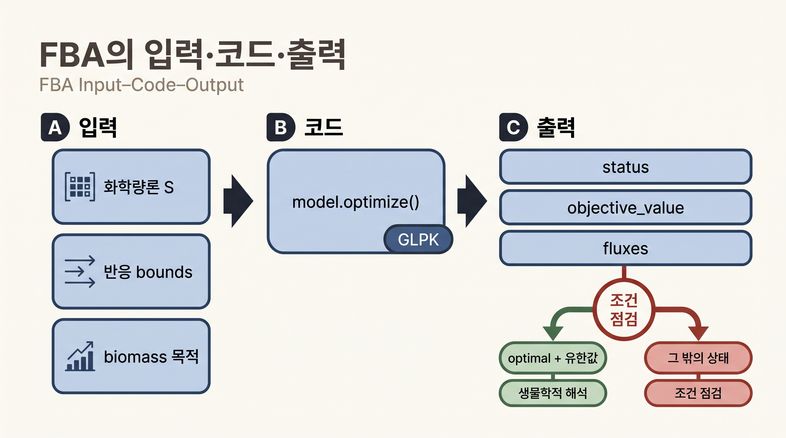
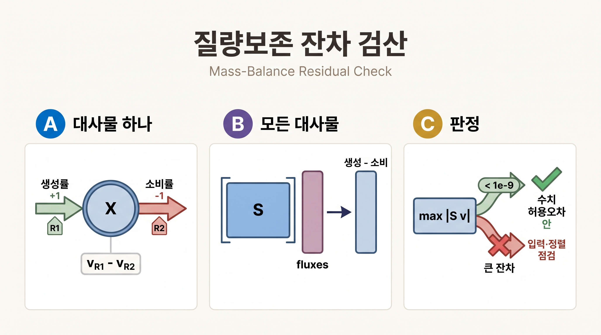

# 3. FBA를 풀고 $$\mathbf{S}\mathbf{v}=\mathbf{0}$$ 검산하기

## 3.0 목적함수 값만으로는 부족한 이유

[Chapter 4](../chapter-4/README.md)에서 배운 FBA(Flux Balance Analysis)는 다음 선형계획법 문제를 푸는 것이었습니다.

$$
\max_{\mathbf{v}} \; \mathbf{c}^{\top}\mathbf{v}
\quad \text{subject to} \quad
\mathbf{S}\mathbf{v} = \mathbf{0}, \quad v_j^{lb} \le v_j \le v_j^{ub}
$$

여기서 $$\mathbf{S}$$는 $$m \times n$$ 화학량론 행렬($$m$$개 대사물, $$n$$개 반응), $$\mathbf{v}$$는 flux 벡터, $$\mathbf{c}$$는 목적계수(대개 biomass 반응에만 1을 두고 나머지는 0)입니다. solver는 이 문제를 풀어 "목적함수 값"과 "그 값을 달성하는 flux 벡터 하나"를 함께 반환합니다.

그런데 실무에서 자주 발생하는 실수는 목적함수 값만 확인하고 넘어가는 것입니다. 이는 시험 답안지의 "최종 점수"만 보고 "풀이 과정에 계산 실수가 없었는지"는 확인하지 않는 것과 같습니다. 이 절에서는 두 가지를 확인합니다 — (1) solver 상태가 정말 `optimal`인지, (2) 반환된 flux 벡터가 실제로 질량보존 $$\mathbf{S}\mathbf{v}=\mathbf{0}$$을 만족하는지. 후자는 $$\mathbf{S}$$의 각 행(대사물 하나)에 대해 그 대사물을 생산하는 flux의 합과 소비하는 flux의 합이 정확히 상쇄된다는 뜻이며, 자세한 유도와 정상상태 가정의 의미는 [Chapter 2](../chapter-2/README.md)에서 다루었습니다.

## 3.1 상태와 목적함수 값 확인

> **선행 셀 필요: §1.1의 `model`, `results`**

```python
solution = model.optimize()    # 기본 목적함수(biomass)를 최대화하는 LP를 풀고 전체 flux를 반환.

assert solution.status == "optimal"          # solver가 실현 가능한 최적해를 찾았다는 상태 문자열.
assert np.isfinite(solution.objective_value)  # 목적함수 값이 유한한 실수인지(NaN·inf가 아닌지) 확인.

wt_growth = float(solution.objective_value)
results["wt_growth"] = wt_growth

print("status:", solution.status)
print("objective value:", f"{wt_growth:.9f} h^-1")
print("biomass flux:", f"{solution.fluxes['Biomass_Ecoli_core']:.9f}")

assert abs(wt_growth - 0.873921507) < 1e-6
```

```text
# 기대 출력:
status: optimal
objective value: 0.873921507 h^-1
biomass flux: 0.873921507
```



_그림 10.8:_ FBA는 화학량론, 반응 경계와 목적함수를 입력으로 받아 `model.optimize()`로 풀고 `status`, 목적값과 반응별 flux를 반환합니다. `optimal` 상태와 유한한 수치를 먼저 확인한 뒤 생물학적으로 해석하며, 최적 상태만으로 실험적 사실이 확정되지는 않습니다. 실제 GEM 결과값이나 solver 내부 알고리듬을 표시하지 않은 교육용 실행 모식도입니다. 저자 작성; 개념 근거: [Orth et al. (2010)](https://doi.org/10.1038/nbt.1614), 구현 근거: [COBRApy 공식 문서](https://opencobra.github.io/cobrapy/).

`optimize()`는 flux 전체가 필요할 때 사용합니다. 목적함수 값만 빠르게 필요하다면 `model.slim_optimize(error_value=np.nan)`가 가볍습니다(수백~수천 번 반복할 §6의 유전자 결손 스크리닝처럼 속도가 중요할 때 유용합니다). 실패 가능성이 있는 반복 계산에서는 반환값이 `None`일 것이라고 가정하지 말고 `np.isfinite`로 검사해야 합니다.


**해석상의 주의: "objective value가 숫자로 나왔으니 결과가 맞을 것이다"**

`solution.status`가 `"optimal"`이 아니라 `"infeasible"`이거나 `"unbounded"`인데도 `solution.objective_value`에 `None`이나 `NaN`이 아닌 이상한 값이 남아 있는 라이브러리 버전·조합이 존재할 수 있습니다. **status를 먼저 확인하지 않고 objective_value만 읽는 습관은 위험합니다.** 이 장의 모든 코드가 `assert solution.status == "optimal"`을 먼저 확인하는 이유입니다.



**흔한 에러**: `model.optimize()`가 `OptimizationError` 계열 예외를 던지는 경우(COBRApy 버전에 따라 예외를 던지거나 `status="infeasible"`인 solution을 반환하는 방식이 다를 수 있습니다) — 배지나 목적함수를 §4에서처럼 실수로 바꾼 채 복원하지 않았는지 먼저 의심하십시오. `model.medium`을 출력해 현재 상태를 점검하는 것이 가장 빠른 진단입니다.


## 3.2 질량보존 잔차 계산

이제 §3.1에서 구한 flux 벡터가 실제로 $$\mathbf{S}\mathbf{v}=\mathbf{0}$$을 만족하는지 직접 계산으로 확인합니다. 대사물 $$X$$가 반응 $$R_1$$로 생성되고(계수 $$+1$$) 반응 $$R_2$$로 소비된다면, $$X$$에 대한 정상상태 조건은 $$v_{R_1} - v_{R_2} = 0$$, 즉 생성률과 소비률이 같다는 뜻입니다. 행렬 곱셈을 손으로 전개할 필요는 없습니다. 아래 셀의 입력은 화학량론 표 `S`와 반응별 flux이고, 출력은 72개 대사물 각각의 "생성률−소비률" 잔차입니다. 가장 큰 절댓값이 `1e-9`보다 작으면 이 실행의 수치 허용오차 안에서 질량보존을 만족한다고 해석합니다.

> **선행 셀 필요: §3.1의 `model`, `solution`, `results`**

```python
from cobra.util.array import create_stoichiometric_matrix

# S: 행=대사물(72개), 열=반응(95개)인 화학량론 행렬을 DataFrame으로 취득.
S = create_stoichiometric_matrix(model, array_type="DataFrame")
# solution.fluxes는 Series이므로 S의 열 순서(reaction 순서)에 맞춰 재정렬.
ordered_fluxes = solution.fluxes.reindex(S.columns)
# 행렬-벡터 곱 S @ v : 결과는 대사물별 "생성 - 소비" 잔차(residual) 벡터.
mass_balance_residual = S.dot(ordered_fluxes)
max_abs_residual = float(mass_balance_residual.abs().max())

results["max_abs_Sv_residual"] = max_abs_residual

print("S shape:", S.shape)
print("max |S v|:", f"{max_abs_residual:.3e}")
assert max_abs_residual < 1e-9
```



_그림 10.9:_ 대사물 하나에서는 생성 반응 flux와 소비 반응 flux의 차이가 잔차이며, 전체 모델에서는 화학량론 표 `S`와 반응별 flux를 곱해 모든 대사물의 생성률−소비률을 동시에 계산합니다. 최대 절댓값이 `1e-9`보다 작다는 판정은 이 실행의 수치 허용오차 안에서 질량보존을 만족한다는 뜻이며 열역학적 평형을 뜻하지 않습니다. 실제 계산값을 표시하지 않은 교육용 검산 모식도입니다. 저자 작성; 개념 근거: [Orth et al. (2010)](https://doi.org/10.1038/nbt.1614).

```text
# 기대 출력:
S shape: (72, 95)
max |S v|: 1.705e-13     (solver·플랫폼에 따라 1e-9보다 훨씬 작은 부동소수점 반올림 오차 수준의 값)
```

`status == "optimal"`은 solver가 주어진 수학 문제를 풀었다는 뜻이고, $$\max_i |(\mathbf{S}\mathbf{v})_i|$$ 검사는 반환 flux가 steady-state 질량보존을 수치 허용오차 안에서 만족하는지 확인합니다. 둘은 서로 대체할 수 없는 검사입니다 — solver가 "최적"이라고 보고했더라도, 소프트웨어 버그나 모델 파일 손상으로 반환된 flux가 실제로는 질량을 보존하지 않는 경우를 잡아낼 수 있는 것은 오직 두 번째 검사뿐입니다.


같은 최대 성장률을 만드는 flux 벡터가 여러 개일 수 있습니다. 따라서 회귀 테스트에서 **95개 flux 전체를 한 벡터와 완전히 같다고 검사하지 마십시오.** 목적함수 값, 필수 제약, 질량보존, 관심 반응의 FVA 범위를 검사하는 편이 [대안 최적해](../glossary.md)에 강합니다. 대안 최적해가 왜 생기는지, FVA([Mahadevan & Schilling, 2003](https://doi.org/10.1016/j.ymben.2003.09.002))로 그 범위를 어떻게 특정하는지는 [§5](06.md)와 [Chapter 4](../chapter-4/README.md)에서 더 다룹니다.



**흔한 에러**: `S.dot(ordered_fluxes)`에서 `ValueError: matrices are not aligned` 같은 오류가 난다면 `reindex(S.columns)`를 빠뜨렸을 가능성이 큽니다. `solution.fluxes`와 `S`의 열은 겉보기엔 "같은 반응들"이지만 저장 순서가 다를 수 있으므로, 순서를 맞추지 않고 곱하면 완전히 틀린 반응끼리 짝지어 계산됩니다.


---
