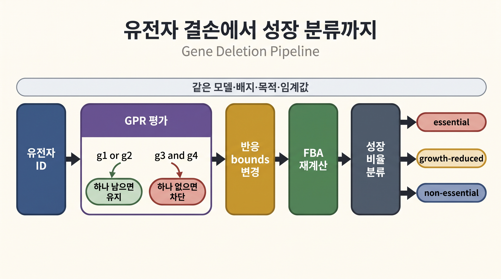
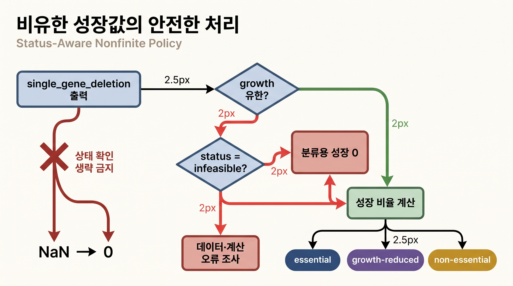

# 6. 안전한 단일 유전자 결손 스크리닝

## 6.0 "결손 스크리닝"이 필요한 이유

지금까지는 하나의 조건(§4)이나 하나의 목적함수(§4.2)만 바꿔 보았습니다. 이제 그 실험을 137개 유전자 각각에 대해 반복해, "이 유전자가 없으면 이 모델 조건에서 성장이 얼마나 남는가"를 자동으로 분류합니다. 이는 [Chapter 4 §5](../chapter-4/05.md)의 조건부 유전자 필수성 분석을 전체 유전자에 적용한 실습입니다. 입력은 모델·배지·목적함수와 분류 임계값이고, 출력은 유전자별 solver 상태·성장률·분류입니다.

여기서 다루는 핵심 난제는 "속도"가 아니라 "안전성"입니다. 137개 LP 중 일부는 `infeasible`(실현 불가능)로 끝날 수 있는데, 이런 경우를 부주의하게 처리하면 파이프라인 전체가 예외로 멈추거나, 반대로 조용히 잘못된 값(0 아니면 무한대)을 필수성 분류에 섞어 넣을 수 있습니다. 먼저 알고리듬의 흐름을 말로 확인합니다.

> **의사코드 · 실행하지 않음**

```text
wild-type 성장률을 계산한다
for 각 gene:
    context manager 안에서 gene을 knock out 한다
    성장률과 solver status를 계산한다
    값이 NaN/무한대/infeasible이면 분류용 성장률을 0으로 둔다
    wild-type 대비 비율로 essential / growth-reduced / non-essential을 분류한다
```



_그림 10.14:_ 단일 유전자 결손은 유전자 ID에서 GPR을 평가해 관련 반응 경계를 바꾸고, 같은 배지·목적함수에서 FBA를 다시 풀어 wild-type 대비 성장 비율을 분류합니다. `or`는 한 유전자가 남으면 반응이 유지될 수 있고 `and`는 필요한 소단위 하나가 없으면 반응이 차단될 수 있음을 뜻합니다. 실제 필수 유전자나 실험 생존을 표시하지 않은 교육용 파이프라인입니다. 저자 작성; 개념 근거: [Orth et al. (2010)](https://doi.org/10.1038/nbt.1614), 구현 근거: [COBRApy deletion 문서](https://cobrapy.readthedocs.io/en/latest/deletions.html).

## 6.1 NaN을 안전하게 처리하는 코드

실제로는 [COBRApy](https://opencobra.github.io/cobrapy/)의 `single_gene_deletion`이 [GPR](../chapter-3/README.md) Boolean 평가와 반복 최적화를 수행합니다. 중요한 부분은 반환값의 수치 유한성을 직접 확인하는 것입니다.

> **선행 셀 필요: §1.1의 `model`, `results`; §3.1의 `wt_growth`**

```python
from cobra.flux_analysis import single_gene_deletion

# 137개 유전자를 하나씩 knock-out하며 각각 FBA를 다시 풀어 growth를 기록한 DataFrame.
deletions = single_gene_deletion(model, processes=1).copy()

# COBRApy 0.30.0에서 infeasible 성장률은 None이 아니라 NaN일 수 있음.
raw_growth = deletions["growth"].to_numpy(dtype=float)
finite_growth = np.isfinite(raw_growth)
nonfinite_rows = deletions.loc[~finite_growth, ["ids", "growth", "status"]]

# NaN을 0으로 치환하기 전에 원인이 실제 infeasible인지 먼저 감사.
# (만약 status가 "optimal"인데 growth가 NaN이라면 그것은 데이터 문제이지 생물학적 infeasible이 아니다.)
print("non-finite rows before classification:")
print(nonfinite_rows.to_string(index=False))
assert nonfinite_rows["status"].eq("infeasible").all()

deletions["growth_safe"] = np.where(
    finite_growth,
    raw_growth,
    0.0,      # infeasible 결손은 "생장 불가"로 간주해 0으로 치환 — 아래 본문의 명시적 정책 참고.
)
deletions["growth_ratio"] = deletions["growth_safe"] / wt_growth
deletions["class"] = np.select(
    [
        deletions["growth_ratio"] < 0.01,   # wild-type 대비 1% 미만 -> essential.
        deletions["growth_ratio"] < 0.90,   # 1~90% 사이 -> growth-reduced.
    ],
    ["essential", "growth-reduced"],
    default="non-essential",                # 90% 이상 유지 -> non-essential.
)

class_order = ["essential", "growth-reduced", "non-essential"]
class_counts = deletions["class"].value_counts().reindex(class_order, fill_value=0)

results["gene_deletion_counts"] = {
    name: int(class_counts[name]) for name in class_order
}
results["gene_deletion_nonfinite"] = int((~finite_growth).sum())
results["gene_deletion_nonfinite_statuses"] = sorted(
    nonfinite_rows["status"].astype(str).unique().tolist()
)

print(class_counts.to_string())
print("non-finite raw growth values:", int((~finite_growth).sum()))

assert class_counts.to_dict() == {
    "essential": 7,
    "growth-reduced": 24,
    "non-essential": 106,
}
```

```text
# 기대 출력:
non-finite rows before classification:
    ids  growth      status
{b2415}     NaN  infeasible
{b2416}     NaN  infeasible

class
essential          7
growth-reduced     24
non-essential     106

non-finite raw growth values: 2
```



_그림 10.15:_ 결손 성장값이 유한하면 성장 비율을 계산하고, 비유한 값이면 먼저 solver 상태가 `infeasible`인지 확인한 뒤에만 이 실습의 분류 정책에 따라 0으로 바꿉니다. `optimal`인데 값이 비유한 경우에는 생물학적 필수성으로 분류하지 않고 데이터·계산 오류를 조사합니다. 실제 결손 수나 유전자 ID를 표시하지 않은 교육용 안전 처리 모식도입니다. 저자 작성; 구현 근거: [COBRApy deletion 문서](https://cobrapy.readthedocs.io/en/latest/deletions.html).

이 `7/24/106` 분류는 `textbook` 기본 배지, biomass 목적함수, 1%·90% 임계값에서 얻은 **in silico 분류**입니다. 실험적 essentiality ground truth가 아니며, 배지와 임계값이 바뀌면 분류도 바뀝니다. `NaN`을 무조건 0으로 바꾸는 것도 일반 데이터 정제 규칙이 아니라, solver status가 infeasible인 결손을 필수성 분류에 포함하기 위한 이 실습의 명시적 정책입니다.


**해석상의 주의: "NaN은 항상 계산이 잘못됐다는 뜻이다"**

이 문맥에서 `NaN`은 계산 오류가 아니라 **solver가 "이 유전자를 지운 조건에서는 실현 가능한 flux 분포 자체가 존재하지 않는다"고 정직하게 보고한 결과**입니다(`status == "infeasible"`). 문제는 `NaN`을 그대로 이후 계산(`growth_ratio` 나눗셈 등)에 흘려보내면 전체 결과가 `NaN`으로 오염된다는 점입니다. 그래서 분류 직전에 명시적으로 0으로 치환하되, 그 전에 `status`가 정말 `infeasible`인지 감사(assert)해 두는 것입니다.



**흔한 에러**: Windows에서 `single_gene_deletion(model, processes=4)`처럼 `processes`를 1보다 크게 두면 멀티프로세싱 시작 방식(spawn) 차이로 `PicklingError`나 예상치 못한 멈춤이 발생할 수 있습니다. 교육용 예제에서는 §1.1에서 이미 `processes=1`로 고정해 두었으므로 이 문제를 피할 수 있습니다. 대규모 모델에서 속도가 필요하다면 스크립트를 `if __name__ == "__main__":` 블록 안에서 실행하는 것이 안전합니다.


## 6.2 이 분류를 다음 분석에 연결하기

여기서 얻은 `essential`/`growth-reduced`/`non-essential` 분류는 그 자체로 끝이 아니라 단일 유전자 후보를 조건별로 비교하는 입력입니다. [유전자 필수성](../glossary.md)이 배지·목적함수·임계값에 의존한다는 사실을 기억하고, [Chapter 4 §5.5](../chapter-4/05.md)처럼 조건을 하나씩 바꾸어 같은 유전자의 분류가 유지되는지 확인합니다. 이 계산은 해당 모델 조건에서 예측한 성장 영향의 우선순위이며, 약물 효과나 선택성을 확정하지 않습니다.

---
