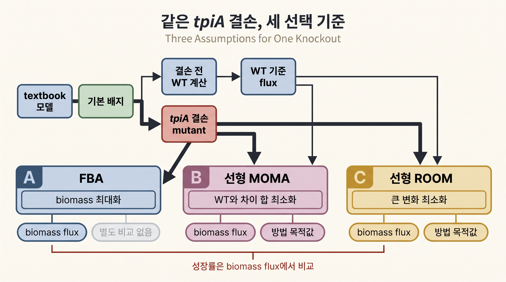
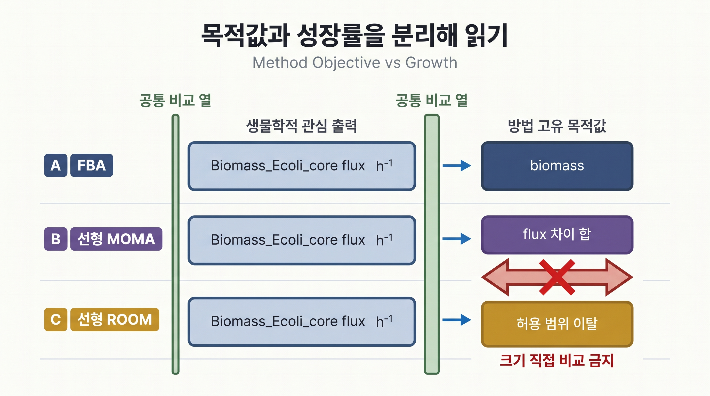

# 7. `tpiA` 결손: FBA·선형 MOMA·선형 ROOM

## 7.0 세 방법이 서로 다른 질문에 답한다

FBA는 돌연변이도 즉시 biomass를 최대화한다고 가정합니다. 이는 "결손 직후 세포가 순식간에 최적의 대사 재배선을 완료한다"는, 다소 강한 가정입니다. 실제 세포는 갑작스러운 유전자 결손에 그렇게 즉각 적응하지 못할 수 있습니다. 이 직관에서 출발한 두 대안이 [Chapter 4의 MOMA](../chapter-4/11.md)와 [ROOM](../chapter-4/12.md)입니다.

- **MOMA**(Minimization of Metabolic Adjustment; [Segrè, Vitkup & Church, 2002](https://doi.org/10.1073/pnas.232349399))는 "세포가 갑작스러운 변화에 적응할 시간이 없었다"고 가정하고, wild-type flux 벡터와 유클리드(또는 이 장처럼 L1) 거리가 가장 가까운 해를 찾습니다.
- **ROOM**(Regulatory On/Off Minimization; [Shlomi, Berkman & Ruppin, 2005](https://doi.org/10.1073/pnas.0406346102))은 "세포가 조절 유전자 발현을 통해 일부 반응만 켜고 끈다"고 가정하고, 허용 범위(tolerance)를 벗어나 크게 바뀌는 반응의 **개수**가 가장 적은 해를 찾습니다.

세 방법은 같은 모델·배지·`tpiA` 결손을 입력으로 받지만 선택 기준이 다릅니다. FBA는 biomass를 최대화하고, MOMA는 결손 전 기준 flux와의 차이를 줄이며, ROOM은 크게 달라지는 반응을 줄입니다. 내부 최적화 유도는 생략하고, 이 절에서는 삼탄당인산 이성질화효소(triose phosphate isomerase)를 인코딩하는 `tpiA`(b3919) 유전자를 결손시켜 **코드가 반환한 성장률과 방법 고유 목적값을 구분해 읽는 데** 집중합니다. 개념 비교는 [Chapter 4 §13](../chapter-4/13.md), 별도 실행 예시는 [Chapter 11 §4](../chapter-11/04.md)에서 이어집니다.



_그림 10.16:_ 같은 `textbook` 모델·기본 배지에서 결손 전 wild-type flux를 먼저 계산하고, 이 기준은 선형 MOMA와 선형 ROOM에만 참조 입력으로 사용합니다. 별도로 만든 `tpiA` 결손 mutant는 FBA·선형 MOMA·선형 ROOM에 공통 적용되며, FBA는 biomass 최대화, MOMA는 WT와의 flux 차이 합 최소화, ROOM은 큰 변화 최소화를 선택 기준으로 사용합니다. 세 방법의 성장률은 biomass flux에서 비교하고 방법 고유 목적값은 직접 비교하지 않습니다. 실제 실행 수치를 표시하지 않은 교육용 방법 비교 모식도입니다. 저자 작성; 개념 근거: [Segrè et al. (2002)](https://doi.org/10.1073/pnas.232349399), [Shlomi et al. (2005)](https://doi.org/10.1073/pnas.0406346102).

## 7.1 세 방법을 나란히 실행하기

> **선행 셀 필요: §1.1의 `model`, `results`**

```python
from cobra.flux_analysis import moma, room

# MOMA/ROOM의 기준이 되는 하나의 wild-type flux distribution.
# (대안 최적해가 여러 개일 수 있으므로 "그중 하나"를 기준으로 고정한다는 점에 유의.)
wt_reference = model.optimize()
assert wt_reference.status == "optimal"

with model:
    tpiA = model.genes.get_by_id("b3919")
    assert tpiA.name == "tpiA"
    tpiA.knock_out()   # 이 유전자와 관련된 반응의 bound를 (0, 0)으로 강제.

    tpiA_fba_growth = model.slim_optimize(error_value=np.nan)          # 가정: 즉시 재최적화.
    linear_moma_solution = moma(model, solution=wt_reference, linear=True)  # 가정: wt와 거리 최소화.
    linear_room_solution = room(model, solution=wt_reference, linear=True)  # 가정: 변화 반응 개수 최소화.

tpiA_fba_growth = float(tpiA_fba_growth)
linear_moma_growth = float(
    linear_moma_solution.fluxes["Biomass_Ecoli_core"]
)
linear_room_growth = float(
    linear_room_solution.fluxes["Biomass_Ecoli_core"]
)

comparison = pd.DataFrame(
    {
        "growth": [
            tpiA_fba_growth,
            linear_moma_growth,
            linear_room_growth,
        ],
        "method_objective": [
            np.nan,
            float(linear_moma_solution.objective_value),
            float(linear_room_solution.objective_value),
        ],
    },
    index=["FBA", "linear MOMA", "linear ROOM"],
)

results["tpiA_fba_growth"] = tpiA_fba_growth
results["tpiA_linear_moma_growth"] = linear_moma_growth
results["tpiA_linear_moma_objective"] = float(
    linear_moma_solution.objective_value
)
results["tpiA_linear_room_growth"] = linear_room_growth
results["tpiA_linear_room_objective"] = float(
    linear_room_solution.objective_value
)

print(comparison.round(6).to_string())
assert linear_moma_solution.status == "optimal"
assert linear_room_solution.status == "optimal"
```

COBRApy 0.30.0 + GLPK의 기준 실행은 다음과 같습니다.

| 방법 | `tpiA` 결손 성장률 | 방법 고유 목적함수 값 |
|:---|---:|---:|
| FBA | 0.704037 | biomass 최대화이므로 별도 표기 생략 |
| 선형 MOMA | 0.000000 | 280.563602 |
| 선형 ROOM | 0.239732 | 2.461787 |



_그림 10.17:_ FBA·선형 MOMA·선형 ROOM 결과에서 생물학적 관심 출력인 `Biomass_Ecoli_core` flux는 공통 열에서 비교하고, biomass 목적값·flux 차이 합·허용 범위 이탈은 방법별 정의와 단위를 붙여 별도로 기록합니다. MOMA와 ROOM 목적값의 숫자 크기는 방법의 우열을 뜻하지 않습니다. 실제 수치를 포함하지 않은 교육용 결과 읽기 모식도입니다. 저자 작성; 개념 근거: [Segrè et al. (2002)](https://doi.org/10.1073/pnas.232349399), [Shlomi et al. (2005)](https://doi.org/10.1073/pnas.0406346102).

MOMA/ROOM solution의 `objective_value`는 성장률이 아닙니다. 각각 기준 flux와의 거리, 허용 범위 밖 변화의 완화된 개수를 나타내므로 biomass flux를 따로 읽었습니다. 선형 MOMA가 0 성장을 택한 것은 infeasible이라는 뜻이 아니라, 이 L1 거리 목적 아래에서 wild-type에 가장 가까운 feasible 해가 0 성장을 가진다는 뜻입니다. 세 방법의 예측이 이렇게 갈린다는 사실 자체가 중요한 교훈입니다 — "tpiA 결손 뒤 성장률이 얼마인가"라는 질문에는 **어떤 세포 적응 가정을 쓰느냐에 따라 다른 답**이 나옵니다.

또한 이 결과는 `wt_reference`로 선택된 **하나의 대안 최적해**에 의존할 수 있습니다. 재현성 기록에는 wild-type 기준해를 만든 방법과 solver를 포함해야 하며, 전체 flux 벡터를 고정된 기준 벡터와 일치시키는 assert는 피합니다.

## 7.2 실행 가능한 선형 옵션과 출력 읽기


- 이 장은 무료 GLPK로 위에서 아래까지 실행하기 위해 MOMA와 ROOM 모두 `linear=True`를 사용합니다.
- 선형 MOMA의 목적값은 결손 전 기준 flux와의 절댓값 차이 합이고, 선형 ROOM의 목적값은 허용 범위 이탈을 연속값으로 센 결과입니다. 두 수치는 단위와 의미가 달라 서로 크기를 비교하지 않습니다.
- 원 논문의 MOMA처럼 제곱 거리를 쓰는 옵션은 [QP](../glossary.md)를 지원하는 solver가 필요합니다. 이 선택은 [설치 가이드](../installation.md)와 [Chapter 11 §1.3](../chapter-11/01.md)에서 확인합니다.



**흔한 에러**: `moma(model, solution=wt_reference, linear=False)`를 GLPK로 실행하면 `OptimizationError`나 solver interface 관련 예외가 발생합니다. GLPK는 이차 목적함수(quadratic objective)를 지원하지 않기 때문입니다. 원형(비선형) MOMA가 꼭 필요하다면 CPLEX나 [Gurobi](https://www.gurobi.com/)처럼 QP를 지원하는 상용 solver로 `Configuration().solver`를 바꿔야 합니다(설치·학술 라이선스는 [설치 가이드](../installation.md) 참고). 이 장은 무료·오픈소스 GLPK만으로 실행 가능하도록 `linear=True` 완화판을 사용합니다.



**잠깐, 생각해보기**: 왜 선형 MOMA의 목적값(약 280.6)이 선형 ROOM의 목적값(약 2.46)보다 훨씬 큰 숫자일까요? 이것이 "MOMA가 ROOM보다 더 나쁜 해를 찾았다"는 뜻일까요?

풀이 방향: §7.0에 적힌 두 방법의 목적함수 정의로 돌아가, 각 목적값이 무엇을 더하거나 센 값이며 어떤 단위를 갖는지 적어 봅니다. 두 값이 같은 척도 위에 있는지 먼저 판정한 뒤, 방법 사이의 비교에 쓸 수 있는 다른 지표가 위 표에 있는지 찾아봅니다. 답안은 [§14 말미의 답안 절](15.md)에 있습니다.


---
