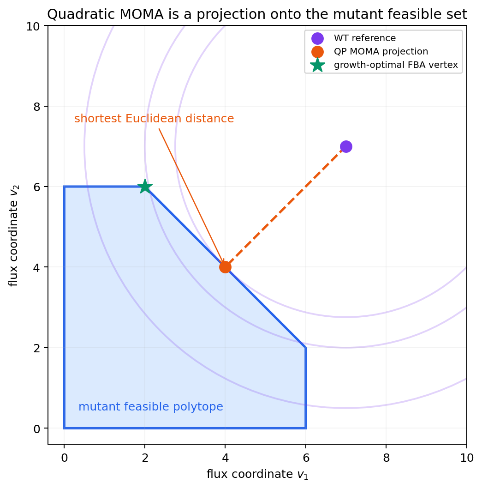
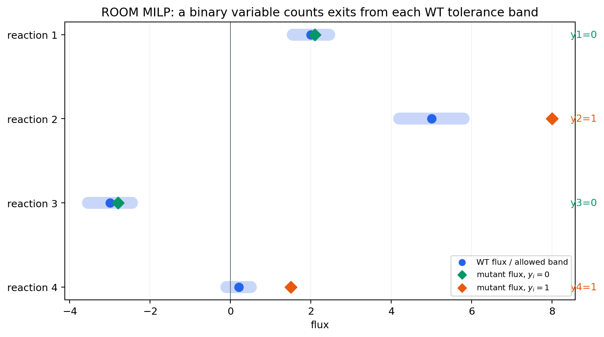

# 8. optlang으로 직접 만드는 작은 GLPK MILP

## 8.0 LP에는 없는 것: "예/아니오" 결정

지금까지 풀었던 문제(FBA, pFBA, FVA, 선형 MOMA/ROOM)는 모두 연속적인 flux 값을 계산했습니다. 반면 OptKnock([Burgard, Pharkya & Maranas, 2003](https://doi.org/10.1002/bit.10803))이나 [§9](10.md)의 gap-filling은 "이 반응을 knockout 목록에 넣는가", "이 후보 반응을 모델에 추가하는가"라는 **예/아니오 결정**도 함께 다룹니다.

0 또는 1만 갖는 binary variable과 연속 flux를 함께 쓰는 문제를 [혼합정수선형계획법(Mixed-Integer Linear Programming, MILP)](../glossary.md)이라고 부릅니다. [COBRApy](https://opencobra.github.io/cobrapy/)는 이런 문제를 직접 조립할 때 [`optlang`](https://optlang.readthedocs.io/)을 사용합니다. 이 절은 내부 해법을 유도하지 않고, **경로 용량과 선택 변수 입력 → 모델 코드 → 선택된 경로와 flux 출력 → 생물학적 선택의 의미** 순서로 읽습니다.

ROOM·OptKnock·gap-filling에서 "반응을 선택했는가?"를 표현하려면 0 또는 1만 갖는 binary variable이 필요합니다. 아래 모델은 느린 경로와 빠른 경로 중 하나를 고릅니다.

$$
\max\; v_{fast}+v_{slow}
$$

$$
0\le v_{fast}\le 8y,\qquad
0\le v_{slow}\le 4(1-y),\qquad y\in\{0,1\}
$$

`y=0`이면 느린 경로만 최대 4, `y=1`이면 빠른 경로만 최대 8까지 흐를 수 있습니다. 아래 코드의 입력은 두 경로의 상한 `8`과 `4`, 선택 변수 `y_fast`, 그리고 총 flux 최대화 목적입니다. 기대 출력은 `y_fast=1`, `v_fast=8`, `v_slow=0`이며, 이는 주어진 용량과 목적 아래 빠른 경로가 선택되었다는 뜻입니다. 숫자는 교육용이며 실제 대사경로의 측정값이 아닙니다.

> **독립 실행**

```python
from optlang import glpk_interface as glpk

milp = glpk.Model(name="pathway_switch")
v_fast = glpk.Variable("v_fast", lb=0, ub=8)           # 빠른 경로의 flux, 0~8 범위의 연속 변수.
v_slow = glpk.Variable("v_slow", lb=0, ub=4)           # 느린 경로의 flux, 0~4 범위의 연속 변수.
y_fast = glpk.Variable("y_fast", type="binary")        # 0 또는 1만 가능한 정수 변수.

milp.add([v_fast, v_slow, y_fast])   # 세 변수를 모델에 등록.
milp.add(
    [
        # v_fast - 8*y <= 0  =>  y=0이면 v_fast<=0(차단), y=1이면 v_fast<=8(개방).
        glpk.Constraint(v_fast - 8 * y_fast, ub=0, name="fast_gate"),
        # v_slow + 4*y <= 4  =>  y=0이면 v_slow<=4(개방), y=1이면 v_slow<=0(차단).
        glpk.Constraint(v_slow + 4 * y_fast, ub=4, name="slow_gate"),
    ]
)
milp.objective = glpk.Objective(v_fast + v_slow, direction="max")

milp_status = milp.optimize()
milp_objective = float(milp.objective.value)

print("status:", milp_status)
print("objective:", milp_objective)
print("v_fast / v_slow / y_fast:",
      v_fast.primal, v_slow.primal, y_fast.primal)

assert milp_status == "optimal"
assert abs(milp_objective - 8.0) < 1e-9
assert abs(float(v_fast.primal) - 8.0) < 1e-9
assert abs(float(v_slow.primal)) < 1e-9
assert abs(float(y_fast.primal) - 1.0) < 1e-9
assert abs(float(y_fast.primal) - round(float(y_fast.primal))) < 1e-9
assert float(v_fast.primal) - 8.0 * float(y_fast.primal) <= 1e-9
assert float(v_slow.primal) + 4.0 * float(y_fast.primal) - 4.0 <= 1e-9
```

```
# 기대 출력:
status: optimal
objective: 8.0
v_fast / v_slow / y_fast: 8.0 0.0 1.0
```

> **선행 셀 필요: §1.1의 `results`; §8의 MILP 셀**

```python
results["toy_milp_objective"] = milp_objective
results["toy_milp_binary_choice"] = int(round(float(y_fast.primal)))
```

이 예제에서 8과 4는 각 경로에 허용한 실제 상한입니다. 다른 모델로 바꿀 때에도 임의의 큰 수를 넣지 말고, 반응 경계처럼 설명 가능한 상한을 입력해야 합니다.


**해석상의 주의: "M은 크면 클수록 안전하다"**

필요 이상으로 큰 상한은 모델이 허용하지 않아야 할 큰 flux까지 잠시 허용하고 계산을 불안정하게 만들 수 있습니다. 이 예제처럼 경로의 설명 가능한 최대 용량을 사용하고, 결과에서 `v_fast <= 8*y_fast`와 `v_slow <= 4*(1-y_fast)`가 실제로 지켜지는지 확인합니다.



**흔한 에러**: `glpk.Variable("y_fast", type="binary")`에서 `type` 대신 `lb=0, ub=1`만 주고 정수형을 지정하지 않으면, solver가 `y_fast=0.5` 같은 연속값을 "최적"이라고 반환할 수 있습니다. binary/integer 결정을 표현하려면 반드시 `type="binary"` 또는 `type="integer"`를 명시해야 LP relaxation이 아니라 진짜 MILP로 풀립니다.


## 8.1 LP·QP·MILP의 허용 해와 목적 비교

세 문제 유형의 차이를 "어떤 해를 허용하고 무엇을 최적화하는가"로 비교해 봅시다.

| 문제   | 이 시각화의 목적함수                 | 허용되는 해                    | 선택되는 해                         |
| ---- | --------------------------- | ------------------------- | ------------------------------ |
| LP   | $$\max\;3x+2y$$             | 연속 다각형                    | 이 예제에서는 꼭짓점 $$(2,4)$$; 일반적으로 최적 변도 가능 |
| QP   | $$\min\;(x-4)^2+(y-4)^2$$   | 연속 선분 $$x+y=4$$           | 기준점 $$(4,4)$$의 직교 투영 $$(2,2)$$ |
| MILP | $$\max\;v_{fast}+v_{slow}$$ | 연속 flux + $$y\in\{0,1\}$$ | 두 이산 경로 선택 중 빠른 경로             |

아래 Plotly 예제는 세 문제의 내부 알고리듬이 아니라 **입력과 출력의 차이**를 비교합니다. LP는 연속 좌표와 선형 목적을 받아 $$(2,4)$$를, QP 예시는 기준점과 제곱거리를 받아 $$(2,2)$$를, MILP는 두 경로 용량과 이진 선택을 받아 빠른 경로를 표시합니다. 이 좌표와 경로는 설명용이며 실제 GEM 계산값이 아닙니다.

아래 Plotly의 dropdown에서 문제 유형을 바꾸면 표시되는 feasible set과 optimum이 함께 바뀝니다. 이 상호작용은 GitBook 지면이 아니라 [Jupyter](https://jupyter.org/) 노트북이나 대화형 탐색기에서 코드를 직접 실행할 때만 작동합니다.

> **독립 실행 · 선택 사항(`plotly`)**

```python
import numpy as np
import plotly.graph_objects as go

comparison_figure = go.Figure()
trace_groups = []

def add_group_trace(group, trace):
    trace.visible = group == "LP"
    comparison_figure.add_trace(trace)
    trace_groups.append(group)

# LP: x >= 0, y >= 0, x + y <= 6, 2x + y <= 8.
add_group_trace(
    "LP",
    go.Scatter(
        x=[0, 4, 2, 0, 0],
        y=[0, 0, 4, 6, 0],
        mode="lines",
        fill="toself",
        name="LP feasible region",
        line=dict(color="#3182bd"),
        fillcolor="rgba(49,130,189,0.22)",
    ),
)
for objective_value, dash in [(6, "dot"), (10, "dash"), (14, "solid")]:
    x_line = np.linspace(0, objective_value / 3, 80)
    y_line = (objective_value - 3 * x_line) / 2
    add_group_trace(
        "LP",
        go.Scatter(
            x=x_line,
            y=y_line,
            mode="lines",
            name=f"3x+2y={objective_value}",
            line=dict(color="#6baed6", dash=dash),
        ),
    )
add_group_trace(
    "LP",
    go.Scatter(
        x=[2], y=[4], mode="markers+text", text=[" optimum (2,4)"],
        textposition="middle right", name="LP optimum",
        marker=dict(size=12, color="#08519c"),
    ),
)

# QP: WT 기준점에서 mutant feasible line x+y=4까지 제곱거리 최소화.
q_x = np.linspace(0, 4, 100)
add_group_trace(
    "QP",
    go.Scatter(
        x=q_x, y=4 - q_x, mode="lines", name="QP feasible line x+y=4",
        line=dict(color="#31a354", width=5),
    ),
)
add_group_trace(
    "QP",
    go.Scatter(
        x=[4], y=[4], mode="markers+text", text=[" reference (4,4)"],
        textposition="top left", name="WT reference",
        marker=dict(size=12, color="#756bb1", symbol="diamond"),
    ),
)
add_group_trace(
    "QP",
    go.Scatter(
        x=[4, 2], y=[4, 2], mode="lines", name="minimum-distance path",
        line=dict(color="#756bb1", dash="dash"),
    ),
)
add_group_trace(
    "QP",
    go.Scatter(
        x=[2], y=[2], mode="markers+text", text=[" projection (2,2)"],
        textposition="bottom right", name="QP optimum",
        marker=dict(size=12, color="#006d2c"),
    ),
)

# MILP: binary y가 0 또는 1인 두 경로 선택만 허용.
add_group_trace(
    "MILP",
    go.Scatter(
        x=[0, 1], y=[4, 8], mode="lines", name="LP relaxation 연결선",
        line=dict(color="#fdae6b", dash="dot"),
    ),
)
add_group_trace(
    "MILP",
    go.Scatter(
        x=[0, 1], y=[4, 8], mode="markers+text",
        text=[" slow", " fast optimum"], textposition="top center",
        name="integer feasible choices",
        marker=dict(size=[11, 14], color=["#fd8d3c", "#a63603"]),
    ),
)

def visible_for(group):
    return [trace_group == group for trace_group in trace_groups]

buttons = [
    dict(
        label="LP: linear objective",
        method="update",
        args=[
            {"visible": visible_for("LP")},
            {
                "title": "LP — maximize 3x + 2y over a continuous polygon",
                "xaxis": {"title": "x", "range": [-0.2, 6.2]},
                "yaxis": {
                    "title": "y", "range": [-0.2, 6.2],
                    "scaleanchor": "x", "scaleratio": 1,
                },
            },
        ],
    ),
    dict(
        label="QP: squared distance",
        method="update",
        args=[
            {"visible": visible_for("QP")},
            {
                "title": "QP — minimize squared distance to the reference",
                "xaxis": {"title": "flux coordinate x", "range": [-0.2, 5.2]},
                "yaxis": {
                    "title": "flux coordinate y", "range": [-0.2, 5.2],
                    "scaleanchor": "x", "scaleratio": 1,
                },
            },
        ],
    ),
    dict(
        label="MILP: binary choice",
        method="update",
        args=[
            {"visible": visible_for("MILP")},
            {
                "title": "MILP — maximize pathway flux with y in {0,1}",
                "xaxis": {
                    "title": "binary choice y",
                    "range": [-0.25, 1.25],
                    "tickmode": "array",
                    "tickvals": [0, 1],
                },
                "yaxis": {
                    "title": "maximum pathway flux", "range": [0, 9],
                    "scaleanchor": None,
                },
            },
        ],
    ),
]

comparison_figure.update_layout(
    title="LP — maximize 3x + 2y over a continuous polygon",
    xaxis=dict(title="x", range=[-0.2, 6.2]),
    yaxis=dict(title="y", range=[-0.2, 6.2], scaleanchor="x", scaleratio=1),
    template="plotly_white",
    updatemenus=[dict(buttons=buttons, direction="down", x=0, y=1.16)],
    legend=dict(orientation="h", y=-0.18),
    margin=dict(t=110, b=120),
)
comparison_figure.show()
```

여기서 LP와 QP의 변수 `x`, `y`, MILP의 두 경로는 **문제 유형을 설명하기 위한 교육용 기하·선택 예제**입니다. 실제 GEM의 95개 flux를 계산한 것이 아닙니다. 실제 모델 계산은 §3의 FBA(LP), §7의 선형 MOMA/ROOM(LP), §8의 `optlang` MILP에서 수행했습니다. 원형 MOMA(QP)는 GLPK로 실행하지 않았습니다.


**흔한 에러**: `import plotly.graph_objects as go`에서 `ModuleNotFoundError`가 나면 §0.1에서 `plotly`를 설치했는지 확인하십시오. 또한 JupyterLab에서 그림이 빈 칸으로만 보인다면 `jupyterlab`과 `plotly`의 버전 조합에서 렌더러 확장이 필요할 수 있습니다 — `pip install "jupyterlab>=4" "plotly>=5"`처럼 최신 버전으로 맞추면 대개 해결됩니다. GitBook 같은 정적 문서 사이트에서는 애초에 이 JavaScript 기반 그림이 실행되지 않으므로, 핵심 기하를 보존한 그림 10.18의 정적 PNG를 함께 둡니다.


GitBook에서는 dropdown이 실행되지 않아도 다음 정적 fallback 세 장으로 같은 핵심을 읽을 수 있습니다.

|                         LP: 선형 목적함수와 꼭짓점                         |                          QP: 기준 flux의 투영                         |                         MILP: 허용 범위와 이산 선택                         |
| :--------------------------------------------------------------: | :--------------------------------------------------------------: | :----------------------------------------------------------------: |
|  |  |  |

_그림 10.18:_ LP·QP·MILP의 정적 개념 비교. (왼쪽) 선형 목적함수의 등고선이 허용 다각형의 꼭짓점 또는 최적 변에 닿는 LP, (가운데) 야생형 기준점을 돌연변이 허용 선분에 투영하는 quadratic MOMA QP, (오른쪽) 야생형 tolerance 구간 이탈을 이진 변수로 세는 ROOM MILP입니다. 세 패널과 위 Plotly 예제는 문제 유형을 설명하는 임의 수치 모식도이며 서로 수치가 같은 실행 화면이나 실제 GEM 계산 결과가 아닙니다. 출처: 저자 자체 제작; 생성: [_`scripts/generate_optimization_figures.py`_](../scripts/generate_optimization_figures.py)의 `draw_lp_geometry()`, `draw_moma_projection()`, `draw_room_tolerance()`; 개념 근거: MOMA([_Segrè et al., 2002_](https://doi.org/10.1073/pnas.232349399))와 ROOM([_Shlomi et al., 2005_](https://doi.org/10.1073/pnas.0406346102)). 원 논문의 그림은 복제하거나 변형하지 않은 교육용 독립 도식이며, MOMA는 [Chapter 4 §11](../chapter-4/11.md), ROOM은 [§12](../chapter-4/12.md)에서 확인할 수 있습니다.

***
