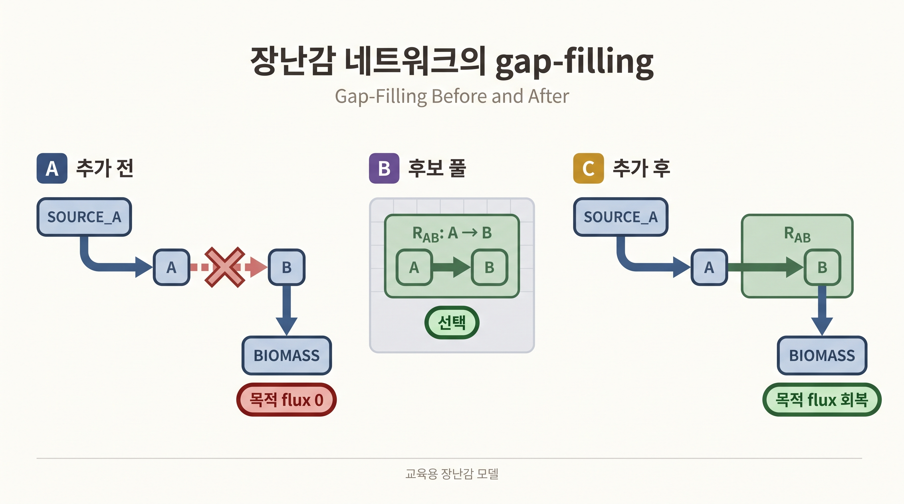
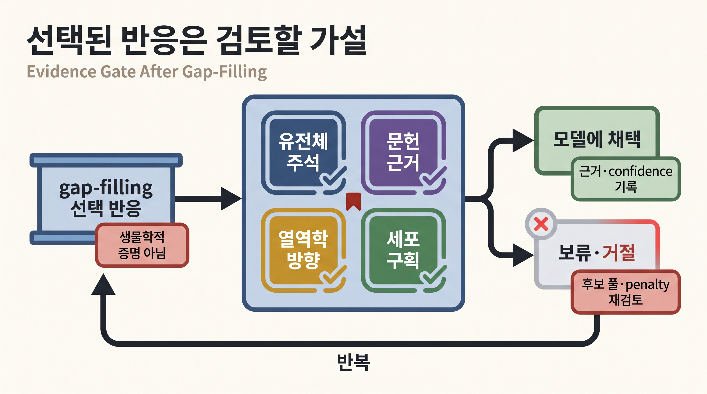

# 9. 장난감 네트워크 gap-filling

## 9.0 "빈 구멍"이 생기는 원인과 자동으로 메우려는 이유

[Chapter 5](../chapter-5/README.md)에서 다루었듯, 게놈 규모 대사 모델을 재구축하는 과정에서 유전체 주석이 불완전하거나 특정 반응의 촉매 유전자가 아직 알려지지 않아 "대사경로 중간에 연결이 빠진" 상태가 자주 발생합니다. 예를 들어 대사물 A가 세포 안으로 들어오고 대사물 B가 biomass를 만드는 데 쓰이는데, A를 B로 바꿔 주는 반응이 모델에 없다면 biomass 생산 자체가 불가능(flux 0)해집니다. [Gap-filling](../glossary.md)은 "universal reaction pool"(다른 생물종 모델이나 [BiGG](http://bigg.ucsd.edu/)·[KEGG](https://www.kegg.jp/) 같은 데이터베이스에서 가져온 후보 반응 목록)에서 최소한의 반응을 추가해 이 구멍을 메우는 알고리듬입니다.

gap-filling의 입력은 불완전한 모델, 후보 반응 목록, 목표 flux 문턱값과 후보별 비용입니다. 코드는 [§8](09.md)의 [MILP](../glossary.md)를 내부적으로 사용해 목표를 회복하는 값싼 후보 집합을 반환합니다. 이 절에서는 내부 정수 최적화보다 **선택 전 성장 0 → 후보 `R_AB` 선택 → 선택 후 성장 10**이라는 실행 결과와, 선택된 반응이 생물학적 증거가 아니라 검토할 가설이라는 점에 집중합니다.

## 9.1 장난감 모델로 gap-filling 실행하기

다음 모델은 `A` 공급과 `B` 소비(biomass)는 있지만 `A → B` 연결 반응이 빠져 있어 성장할 수 없습니다. universal reaction pool에 `R_AB`를 제공하고, 최소한의 후보를 추가해 목표 flux를 복구합니다.

> **선행 셀 필요: §1.1의 `results`**

```python
from cobra import Model, Reaction, Metabolite
from cobra.flux_analysis.gapfilling import GapFiller

# 불완전한 모델: -> A, B -> biomass 사이가 끊긴 상태.
a_c = Metabolite("a_c", compartment="c")
b_c = Metabolite("b_c", compartment="c")

source_a = Reaction("SOURCE_A")     # A를 세포 안으로 최대 10까지 공급하는 가상 반응.
source_a.bounds = (0, 10)
source_a.add_metabolites({a_c: 1})

toy_biomass = Reaction("BIOMASS")   # B를 소비해야만 flux가 흐르는 목표(biomass 대용) 반응.
toy_biomass.bounds = (0, 1000)
toy_biomass.add_metabolites({b_c: -1})

toy_model = Model("toy_gap_model")
toy_model.add_reactions([source_a, toy_biomass])
toy_model.objective = toy_biomass

# A -> B로 바꿔 주는 반응이 아직 없어 목적함수는 0에 묶인 상태.
pre_gap_growth = float(toy_model.slim_optimize(error_value=np.nan))

# 후보 풀(universal)은 같은 metabolite ID(a_c, b_c)를 가진 "별도 객체"로 생성.
# GapFiller가 이름으로 두 모델의 대사물을 짝지으므로 ID만 같으면 충분.
universal = Model("toy_universal")
u_a_c = Metabolite("a_c", compartment="c")
u_b_c = Metabolite("b_c", compartment="c")
r_ab = Reaction("R_AB")             # 후보 반응: A -> B.
r_ab.bounds = (0, 1000)
r_ab.add_metabolites({u_a_c: -1, u_b_c: 1})
universal.add_reactions([r_ab])

gap_filler = GapFiller(
    toy_model,
    universal=universal,
    demand_reactions=False,   # demand 반응(임의 배출구)은 후보에서 제외.
    exchange_reactions=False, # exchange 반응은 후보에서 제외.
    lower_bound=0.1,          # 목표(biomass) flux가 최소 0.1 이상이 되도록 요구.
)
gap_solutions = gap_filler.fill(iterations=1)   # MILP를 풀어 최소 반응 집합 탐색.
selected_reactions = [reaction.id for reaction in gap_solutions[0]]

for reaction in gap_solutions[0]:
    toy_model.add_reactions([reaction.copy()])  # 선택된 후보를 실제 모델에 반영.

post_gap_growth = float(toy_model.slim_optimize(error_value=np.nan))

results["gapfill_pre_growth"] = pre_gap_growth
results["gapfill_selected_reactions"] = selected_reactions
results["gapfill_post_growth"] = post_gap_growth

print("before:", pre_gap_growth)
print("selected:", selected_reactions)
print("after:", post_gap_growth)

assert abs(pre_gap_growth) < 1e-12
assert selected_reactions == ["R_AB"]
assert abs(post_gap_growth - 10.0) < 1e-9
```

```text
# 기대 출력:
before: 0.0
selected: ['R_AB']
after: 10.0
```



_그림 10.19:_ 장난감 모델은 `SOURCE_A`와 `BIOMASS` 사이의 `A → B` 반응이 빠져 목적 flux가 0이고, 후보 풀의 `R_AB`를 선택해 추가하면 공급 상한 안에서 목적 flux가 회복됩니다. 이는 본문 코드의 입력·선택·출력 관계를 보여 주는 교육용 네트워크이며 실제 생물의 성장이나 반응 증거를 나타내지 않습니다. 저자 작성; 구현 근거: [COBRApy gap-filling 문서](https://cobrapy.readthedocs.io/en/latest/gapfilling.html).

gap-filling 전 목적함수 값이 정확히 0인 이유는 §3의 $$\mathbf{S}\mathbf{v}=\mathbf{0}$$ 논리로도 설명됩니다 — B를 생성하는 반응이 모델에 전혀 없으므로 `BIOMASS` 반응(B를 소비)이 흐르는 순간 B의 질량보존이 깨지고, 이를 막는 유일한 방법은 flux를 0으로 두는 것뿐입니다. 반응을 추가한 뒤 성장이 정확히 `10.0`(공급 상한과 같은 값)으로 회복된 것은, `SOURCE_A`의 상한이 이 장난감 네트워크에서 유일한 병목이기 때문입니다.

## 9.2 gap-filling이 증명하지 않는 것

gap-filling은 "생물학적으로 참인 반응"을 증명하지 않습니다. 주어진 후보·방향·penalty 안에서 목표를 만족시키는 수학적으로 싼 반응을 고를 뿐입니다. 실제 모델에서는 유전체 주석, thermodynamics, subcellular localization, 문헌 근거로 후보를 다시 큐레이션해야 합니다. 실제 GEM에서 gap-filling을 적용하는 전체 재구축 파이프라인, 후보 pool 구성, penalty 설계는 [Chapter 5](../chapter-5/README.md)에서 자세히 다룹니다.



_그림 10.20:_ gap-filling이 선택한 반응은 목표 flux를 회복하는 계산 후보이며, 유전체 주석·문헌 근거·열역학적 방향·세포 구획을 검토한 뒤 근거와 confidence를 기록해 채택하거나 후보 풀과 penalty를 바꾸어 다시 계산합니다. 네 검토 항목을 통과했다는 사실만으로 생물학적 진실이 증명되는 것은 아닙니다. 실제 큐레이션 결과를 표시하지 않은 교육용 근거 관문입니다. 저자 작성; 개념 근거: [Thiele & Palsson (2010)](https://doi.org/10.1038/nprot.2009.203).

이 장난감 예제에서 채워진 gap은 대사물 `b_c`를 생산하는 반응이 전혀 없던 **root gap**(no-production)이었고, `R_AB`는 그 원인을 직접 해소합니다. 실제 재구축에서는 이렇게 직접 근거 없이 기능을 위해서만 추가한 반응을 **confidence score 1(모델링 가설)**로 표시하고, root gap과 그로 인해 굶어 생긴 downstream gap(상류 root gap을 채우면 대개 자동으로 해소되는 이차 증상)을 구분해 기록하며, 반응을 추가한 뒤에는 새 gap이 생기지 않았는지·실제 생물에는 없는 기능을 부여하는 과잉 능력이 생기지 않았는지 다시 점검합니다. 이 신뢰도 표기와 root/downstream 구분, 재점검 절차는 [Chapter 5 §5](../chapter-5/05.md)에서 다룹니다.


**해석상의 주의: "gap-filling이 반응을 하나만 골랐으니 이 네트워크에 필요한 반응은 그것뿐이다"**

이 장난감 예제에서는 후보가 `R_AB` 하나뿐이어서 선택의 여지가 없었습니다. 실제 GEM에서는 여러 후보 조합이 같은 목표 flux를 복구할 수 있습니다. `iterations`를 1보다 크게 주면 서로 다른 최소 후보 집합을 찾아 문헌·유전체·열역학 근거로 비교할 수 있습니다.



**흔한 에러**: `universal` 모델의 대사물 ID가 `toy_model`의 ID와 철자 하나라도 다르면(`a_c` vs `A_c`), GapFiller가 두 반응을 같은 대사물로 인식하지 못해 gap을 메우지 못하고 빈 해를 반환합니다. 두 모델 간 명명 규칙을 통일하는 것이 gap-filling 성공의 전제 조건입니다.


---
