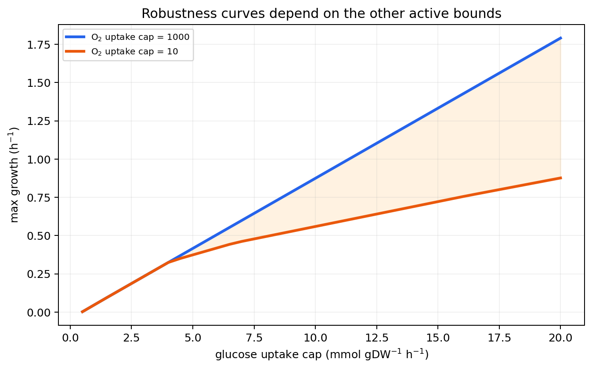

# 11. ipywidgets로 배지 조건 탐색하기

## 11.0 슬라이더 하나가 대신해 주는 것

§4에서는 glucose 5, 무산소(oxygen 0)라는 딱 두 가지 조건을 각각 손으로 지정해 실행했습니다. 하지만 실제로 "glucose를 얼마나 줄이면 성장률이 급격히 떨어지기 시작하는가"처럼 **연속적인 범위에서 경향을 탐색**하고 싶을 때는 값을 하나씩 바꿔 가며 셀을 반복 실행하는 것이 번거롭습니다. ipywidgets는 슬라이더를 움직일 때마다 자동으로 함수를 다시 호출해 주는 대화형 위젯을 제공해, 이 반복 작업을 마우스 드래그 하나로 대신합니다.

아래 두 slider는 glucose와 oxygen의 **양수 섭취 용량**을 조절합니다(§2.2에서 배운 `model.medium`의 양수 표기 규약을 그대로 따릅니다). 함수 안에서는 이를 exchange lower bound의 음수로 변환하고, context manager를 빠져나올 때 모델을 복원합니다(§4의 `with model:` 원리를 그대로 재사용합니다).

GitBook 정적 fallback은 다음 그림입니다.



*그림 10.3. glucose 섭취 용량에 따른 최대 성장률. 대화형 노트북에서는 아래 slider로 glucose와 oxygen을 함께 바꿀 수 있습니다.*

> 🔗 **선행 셀 필요: §1.1의 `model`; 선택 사항(`ipywidgets`, Jupyter)**

```python
import ipywidgets as widgets
from IPython.display import display

glucose_slider = widgets.FloatSlider(
    value=10.0,
    min=0.5,
    max=20.0,
    step=0.5,
    description="glucose",
    continuous_update=False,   # 슬라이더를 놓을 때만 재계산(드래그 중 매 프레임 계산 방지).
)
oxygen_slider = widgets.FloatSlider(
    value=20.0,
    min=0.0,
    max=40.0,
    step=1.0,
    description="oxygen",
    continuous_update=False,
)

def report_growth(glucose, oxygen):
    with model:                                  # 이 함수가 끝나면 model은 항상 원래대로 복원.
        condition = model.medium.copy()
        condition["EX_glc__D_e"] = float(glucose)
        condition["EX_o2_e"] = float(oxygen)
        model.medium = condition
        growth = model.slim_optimize(error_value=np.nan)

    if np.isfinite(growth):
        print(f"growth = {float(growth):.6f} h^-1")
    else:
        print("이 조건은 infeasible이거나 유한한 목적함수 값을 반환하지 않았습니다.")

widget_output = widgets.interactive_output(
    report_growth,
    {"glucose": glucose_slider, "oxygen": oxygen_slider},
)
display(widgets.HBox([glucose_slider, oxygen_slider]), widget_output)
```

slider를 움직인 결과는 탐색적 관찰입니다. 최종 분석에 채택한 조건은 숫자로 다시 고정하고, §13의 결과 기록처럼 JSON이나 표로 남겨야 합니다. 예를 들어 슬라이더를 `glucose=10.0, oxygen=20.0`에 두면 §4에서 확인한 기본 조건과 다른 산소 제한값이므로 §4.1의 `0.873921507`과는 다른 성장률이 나타납니다 — 이 절의 목적은 새로운 고정 기준값을 만드는 것이 아니라 조건 공간을 감으로 익히는 것입니다.


❓ **흔한 에러**: JupyterLab에서 슬라이더는 보이는데 값을 움직여도 출력이 갱신되지 않는다면, `ipywidgets`와 JupyterLab 버전이 맞지 않아 위젯 확장이 활성화되지 않았을 가능성이 큽니다. `pip install --upgrade ipywidgets jupyterlab`으로 두 패키지를 함께 업그레이드하고 JupyterLab을 재시작하십시오. VS Code의 Jupyter 확장이나 Google Colab처럼 렌더링 방식이 다른 환경에서는 별도 활성화 단계가 필요할 수 있습니다.



❓ **흔한 에러**: `oxygen_slider`를 0까지 내렸는데 `growth`가 `NaN`으로 나오지 않고 어떤 유한한 값이 나온다면 — 이것은 버그가 아니라 §4.1에서 이미 확인한 "무산소 조건에서도 발효로 낮은 성장이 가능하다"는 사실과 일치합니다. `report_growth` 함수의 else 분기는 정말로 solver가 infeasible을 반환하거나 목적함수 값이 없는 극단적 조건(예: glucose와 oxygen을 모두 0으로)에서만 실행됩니다.


---
