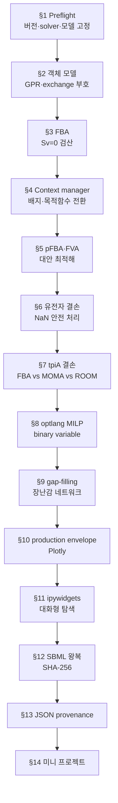

# Chapter 10. COBRApy 완전 실행 튜토리얼

> 지금까지 배운 FBA·pFBA·FVA·유전자 결손·MOMA·ROOM·gap-filling을 하나의 재현 가능한 노트북 흐름으로 연결합니다. 모든 기준값은 **COBRApy 0.30.0 + GLPK + `textbook`(`e_coli_core`) 모델**에서 검산했습니다. 이 장을 위에서 아래로 실행하면 모델을 불러오는 데서 시작해 결과와 환경 정보를 JSON으로 남기는 데까지 한 번에 도달합니다.

## 이 장을 시작하며

[Chapter 1](../chapter-1/README.md)부터 [Chapter 9](../chapter-9/README.md)까지 우리는 대사모델링의 개념을 층층이 쌓아 왔다. 대사 네트워크가 무엇인지([Chapter 1](../chapter-1/README.md)), 그것을 화학량론 행렬 $$\mathbf{S}$$로 어떻게 표현하는지([Chapter 2](../chapter-2/README.md)), 그 행렬에 GPR·구획·바이오매스로 생물학적 정체성을 부여하는 법([Chapter 3](../chapter-3/README.md)), 그렇게 완성된 모델로 세포의 행동을 예측하는 FBA([Chapter 4](../chapter-4/README.md)), 모델 자체를 만들고 검증하는 절차([Chapter 5](../chapter-5/README.md)), omics 데이터 통합([Chapter 6](../chapter-6/README.md)), 질병·표적 발굴([Chapter 7](../chapter-7/README.md)), 균주 설계([Chapter 8](../chapter-8/README.md)), 그리고 이 모든 것 위에 얹히는 머신러닝([Chapter 9](../chapter-9/README.md))까지, 아홉 개 장에 걸쳐 이론과 응용을 서술했다.

계산 결과는 solver, 모델 버전, flux bound, 목적함수 방향에 의존한다. 예를 들어 [Chapter 4](../chapter-4/README.md)의 기본 `e_coli_core` 조건에서 `model.optimize()`는 약 `0.873921507 h^-1`의 성장률을 반환하지만, 이 값은 실행 환경과 조건을 함께 기록해야 재현·비교할 수 있다.

이 장은 새로운 이론을 소개하지 않는다. 대신 앞선 아홉 개 장에서 각각 다른 절에 흩어져 있던 계산 — FBA, pFBA, FVA, 유전자 결손, MOMA, ROOM, MILP, gap-filling, production envelope, SBML — 을 **하나의 노트북 흐름**으로 이어 붙인다. 각 절은 독립적으로도 읽을 수 있지만, §1부터 §13까지 순서대로 실행하면 `model`과 `results`라는 두 변수가 계속 자라나면서 장 전체가 하나의 재현 가능한 실험 기록이 된다. 다음은 그 흐름을 요약한 다이어그램이다.

*그림 10.1. 제10장의 재현 가능한 노트북 흐름. 버전·solver·모델을 기록한 뒤 COBRApy 객체와 경계조건을 확인하고, FBA 계열 분석·섭동·MILP·gap-filling·production envelope를 순서대로 실행하며, 마지막에는 SBML 왕복·해시와 JSON provenance로 계산 상태를 보존합니다. 화살표는 셀의 데이터 의존성을 뜻합니다. 출처: 저자 자체 제작; 이 저장소의 튜토리얼 구조를 요약한 도식이며 외부 그림을 재사용하지 않았습니다.*

이 장의 목적은 API 이름을 외우는 것이 아니다. 각 계산에서 다음 네 질문에 답하는 습관을 만드는 것이 목적이다. 이 네 질문은 이 장 안에서만 유효한 규칙이 아니라, [Chapter 4](../chapter-4/README.md)의 FBA든 [Chapter 8](../chapter-8/README.md)의 균주 설계든 어떤 제약 기반 계산에도 적용되는 일반적인 습관이다.

1. 지금 바꾼 것은 모델, 배지, 목적함수 중 무엇인가?
2. solver가 반환한 상태는 정말 `optimal`인가?
3. 목적함수 값 외에 질량보존과 수치 유한성도 확인했는가?
4. 다른 사람이 같은 모델과 조건을 복원할 기록을 남겼는가?


**왜 매번 `e_coli_core`인가?** 이 책 전체가 하나의 실행 예제 스레드로 `e_coli_core`(반응 95개·대사물 72개·유전자 137개, 기본 조건 최대 성장률 μ≈0.874 h⁻¹)를 사용한다. 작은 모델이기 때문에 노트북 하나로 몇 초 안에 모든 계산을 반복 실행할 수 있고, 동시에 GPR·구획·biomass 반응을 모두 갖춘 "축소판 진짜 GEM"이라서 배운 개념이 헛돌지 않는다. 사람 대사 모델(Human1, Recon3D)이나 산업 규모 대장균 모델(iML1515: 유전자 1,516개·반응 2,712개·대사물 1,877개)로 같은 코드를 확장하는 방법은 각 절의 본문에서 안내한다.


## 학습 목표

이 장을 마치면 다음을 할 수 있습니다.

- COBRApy 객체 모델과 GPR 규칙을 탐색하고 exchange flux의 부호를 해석한다 ([Chapter 3](../chapter-3/README.md)의 GPR·구획 개념).
- `model.medium`과 context manager로 조건을 안전하게 바꾼다.
- FBA 결과의 solver 상태와 $$\mathbf{S}\mathbf{v}=\mathbf{0}$$ 잔차를 검산한다 ([Chapter 2](../chapter-2/README.md)의 질량보존, [Chapter 4](../chapter-4/README.md)의 FBA).
- pFBA와 FVA가 각각 답하는 질문을 구분한다 ([Chapter 4](../chapter-4/README.md)).
- infeasible/`NaN`을 안전하게 처리하며 유전자 결손을 분류한다 ([Chapter 8](../chapter-8/README.md)의 필수성 매핑).
- `tpiA` 결손을 FBA, 선형 MOMA, 선형 ROOM으로 비교한다 ([Chapter 8](../chapter-8/README.md)).
- `optlang`으로 작은 GLPK MILP를 만들고 binary variable의 역할을 설명한다 (MILP·optlang의 이론은 [균주 설계 보충 자료](../supplements/perturbation-analysis.md)).
- 장난감 모델에서 gap-filling, production envelope, SBML 왕복 검증을 수행한다 (gap-filling 이론은 [Chapter 5](../chapter-5/README.md), SBML은 [SBML 실무 보충 자료](../supplements/sbml-practical.md)).
- Plotly와 ipywidgets로 조건을 대화형으로 탐색하고 실행 기록을 저장한다.

이 장을 마치면 이 책의 본문 서술은 끝난다. 부록의 [랜드마크 논문 가이드](../landmark-papers.md)와 [핵심 용어집](../glossary.md)은 이후에도 참고 자료로 남는다.

---
