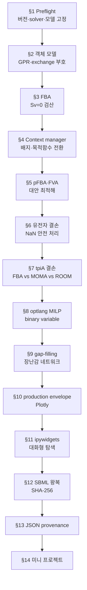

# Chapter 10. COBRApy 완전 실행 튜토리얼

> 지금까지 배운 [FBA](../chapter-4/README.md)·pFBA·FVA·유전자 결손·[MOMA·ROOM](../chapter-8/README.md)·[gap-filling](../chapter-5/README.md)을 하나의 재현 가능한 노트북 흐름으로 연결합니다. 모든 기준값은 **[COBRApy](https://opencobra.github.io/cobrapy/) 0.30.0 + [GLPK](https://www.gnu.org/software/glpk/) + `textbook`([BiGG](http://bigg.ucsd.edu/) `e_coli_core`) 모델**에서 검산했습니다. 이 장을 위에서 아래로 실행하면 모델을 불러오는 데서 시작해 결과와 환경 정보를 JSON으로 남기는 데까지 한 번에 도달합니다.

## 표기와 읽기 원칙

이 책은 한국어 용어를 먼저 쓰고, 처음 등장할 때 영어 원어와 약어를 함께 표기한다. 이후에는 같은 장 안에서 한 표기를 일관되게 사용한다.

- **플럭스**(flux; 대사 통량), **반응**(reaction), **대사물**(metabolite)은 각각 단위 시간당 반응 진행률, 화학량론적 변환, 구획을 포함한 화학종을 뜻한다.
- **경계조건**(bounds), **목적함수**(objective function), **솔버**(solver)는 생물학적 사실이 아니라 모델에 부여한 계산 조건이다.
- 조건·가정·절차는 번호 목록으로, 결과의 범위와 예외는 `해석상의 주의` 상자로 구분한다.


본문의 “예측”은 명시된 모델·배지·경계조건·목적함수 아래의 계산 결과다. 실험 관찰이나 인과적 효과와 혼용하지 않는다.


## 이 장을 시작하며

이 장은 앞선 장의 분석을 하나의 재현 가능한 실행 흐름으로 묶는다. 화학량론 행렬과 GPR, FBA·pFBA·FVA, 유전자 결손, MOMA·ROOM, 혼합정수선형계획법(MILP), 간극 채우기(gap-filling), 생산 포락선(production envelope), SBML 입출력을 순서대로 실행한다.

계산값은 모델 버전, 배지, 경계조건, 목적함수, 솔버(solver)와 허용오차에 따라 달라진다. 예를 들어 기본 `e_coli_core` 조건에서 `model.optimize()`가 약 `0.873921507 h^-1`의 성장률을 반환하더라도, 이 숫자는 해당 실행 조건과 함께 기록해야 비교할 수 있다.

각 절은 독립적으로 읽을 수 있다. 다만 §1부터 §13까지 순서대로 실행하면 `model`과 `results` 객체에 분석 상태가 누적되므로, 하나의 계산 기록으로도 사용할 수 있다. 아래 그림은 데이터 의존 관계를 요약한다.

*그림 10.1. 제10장의 재현 가능한 노트북 흐름. 버전·solver·모델을 기록한 뒤 COBRApy 객체와 경계조건을 확인하고, FBA 계열 분석·섭동·MILP·gap-filling·production envelope를 순서대로 실행하며, 마지막에는 SBML 왕복·해시와 JSON provenance로 계산 상태를 보존합니다. 화살표는 셀의 데이터 의존성을 뜻합니다. 출처: 저자 자체 제작; 이 저장소의 튜토리얼 구조를 요약한 도식이며 외부 그림을 재사용하지 않았습니다.*

이 장의 목적은 API 이름을 외우는 것이 아니다. 각 계산에서 다음 네 질문에 답하는 습관을 만드는 것이 목적이다. 이 네 질문은 이 장 안에서만 유효한 규칙이 아니라, [Chapter 4](../chapter-4/README.md)의 FBA든 [Chapter 8](../chapter-8/README.md)의 균주 설계든 어떤 제약 기반 계산에도 적용되는 일반적인 습관이다.

1. 지금 바꾼 것은 모델, 배지, 목적함수 중 무엇인가?
2. solver가 반환한 상태는 정말 `optimal`인가?
3. 목적함수 값 외에 질량보존과 수치 유한성도 확인했는가?
4. 다른 사람이 같은 모델과 조건을 복원할 기록을 남겼는가?


**왜 매번 `e_coli_core`인가?** 이 책 전체가 하나의 실행 예제 스레드로 `e_coli_core`(반응 95개·대사물 72개·유전자 137개, 기본 조건 최대 성장률 μ≈0.874 h⁻¹)를 사용한다. 작은 모델이기 때문에 노트북 하나로 몇 초 안에 모든 계산을 반복 실행할 수 있고, 동시에 GPR·구획·biomass 반응을 모두 갖춘 "축소판 진짜 GEM"이라서 배운 개념이 헛돌지 않는다. 사람 대사 모델(Human1, Recon3D)이나 산업 규모 대장균 모델(iML1515: 유전자 1,516개·반응 2,712개·대사물 1,877개)로 같은 코드를 확장하는 방법은 각 절의 본문에서 안내한다.


## 대화형 도해: 핵심 가정과 결과 해석


아래 도해는 **교육용 개념·모의 데이터**를 조작하여 이 장의 핵심 가정과 해석 범위를 확인하는 보조 자료이다. 실제 GEM 결과로 인용할 수 없으며, 실제 계산은 모델 버전·배지·목적함수·solver·허용오차를 고정한 실습 코드로 재현해야 한다.




[새 창에서 대화형 도해 열기](https://jyryu3161.github.io/ebook_metabolic_modeling/interactive/index.html?chapter=10)

대화형 조작(슬라이더·드롭다운)은 GitBook 지면이 아니라 위 링크나 Jupyter 노트북(§11 ipywidgets, §8·§10의 Plotly)에서만 실제로 동작한다. 이 페이지에서는 값을 바꿔도 그림이 갱신되지 않는다.

이 장이 반복 계산하는 [FVA](../chapter-4/README.md)와 [pFBA](../chapter-4/README.md) 범위가 실제로 어떤 모양인지, 정적 그림으로 먼저 감을 잡을 수 있다.

_참고 그림. `e_coli_core`에서 계산한 pFBA 해와 몇몇 반응의 FVA 최소–최대 구간. 이 장의 [§5](06.md)에서 `PGI`·`PFK`·`TPI`에 대해 같은 종류의 계산을 직접 실행하며 재현한다. 출처: 저자 계산; 조건과 생성 스크립트는 그림 4.6(Chapter 4)과 동일 파일을 재사용([FIGURE_SOURCES.md](../FIGURE_SOURCES.md) 참고). 개념 근거: FVA([Mahadevan & Schilling, 2003](https://doi.org/10.1016/j.ymben.2003.09.002)), pFBA([Lewis et al., 2010](https://doi.org/10.1038/msb.2010.47))._

## 이 장을 읽는 방법

이 장에서는 코드를 “한 번 실행”하는 것과 분석을 “재현 가능하게 남기는 것”을 구분한다. 각 실습은 다음 네 질문으로 마무리한다.

1. 어떤 모델 파일·버전·checksum을 사용했는가?
2. 배지, 목적함수, 플럭스 경계, solver와 허용오차는 무엇인가?
3. solver 상태, $$\max|\mathbf S\mathbf v|$$, 경계 위반을 확인했는가?
4. 결과·그림·환경·실행 명령을 다른 사람이 다시 실행할 수 있게 남겼는가?


노트북의 셀 출력만 저장하는 것으로는 재현성이 확보되지 않는다. 입력 파일 해시, 패키지 lockfile, 난수 seed와 실행 순서를 함께 기록한다.


## 학습 목표

이 장을 마치면 다음을 할 수 있습니다.

- COBRApy 객체 모델과 GPR 규칙을 탐색하고 exchange flux의 부호를 해석한다 ([Chapter 3](../chapter-3/README.md)의 GPR·구획 개념).
- `model.medium`과 context manager로 조건을 안전하게 바꾼다.
- FBA 결과의 solver 상태와 $$\mathbf{S}\mathbf{v}=\mathbf{0}$$ 잔차를 검산한다 ([Chapter 2](../chapter-2/README.md)의 질량보존, [Chapter 4](../chapter-4/README.md)의 FBA).
- pFBA와 FVA가 각각 답하는 질문을 구분한다 ([Chapter 4](../chapter-4/README.md)).
- infeasible/`NaN`을 안전하게 처리하며 유전자 결손을 분류한다 ([Chapter 8](../chapter-8/README.md)의 필수성 매핑).
- `tpiA` 결손을 FBA, 선형 MOMA, 선형 ROOM으로 비교한다 ([Chapter 8](../chapter-8/README.md)).
- `optlang`으로 작은 GLPK MILP를 만들고 binary variable의 역할을 설명한다 (MILP·optlang의 이론은 [균주 설계 보충 자료](../supplements/perturbation-analysis.md)).
- 장난감 모델에서 gap-filling, production envelope, SBML 왕복 검증을 수행한다 (gap-filling 이론은 [Chapter 5](../chapter-5/README.md), SBML은 [SBML 실무 보충 자료](../supplements/sbml-practical.md)).
- Plotly와 ipywidgets로 조건을 대화형으로 탐색하고 실행 기록을 저장한다.

이 장을 마치면 이 책의 본문 서술은 끝난다. 부록의 [랜드마크 논문 가이드](../landmark-papers.md)와 [핵심 용어집](../glossary.md)은 이후에도 참고 자료로 남는다.

---
