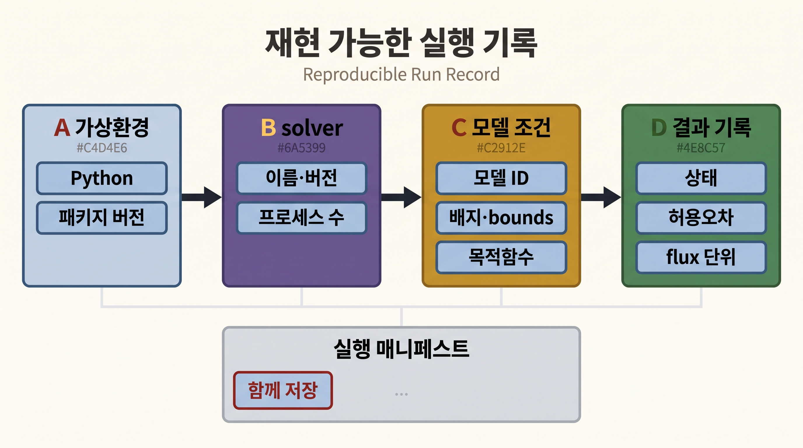
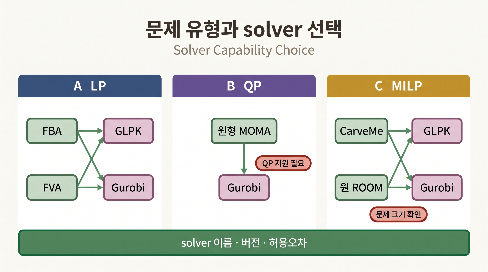

# 1. 환경·솔버·Gurobi 라이선스

## 1.1 격리된 가상환경

실습 패키지는 기존 파이썬 설치와 버전이 충돌할 수 있으므로, 이 장 전용 가상환경을 하나 만들어 그 안에만 설치합니다. 아래는 실제로 이 장을 실행한 환경을 만든 명령입니다.

```bash
python3 -m venv .venv-gem
source .venv-gem/bin/activate          # Windows PowerShell: .venv-gem\Scripts\Activate.ps1
python -m pip install --upgrade pip
python -m pip install "cobra==0.30.0" matplotlib pandas numpy plotly python-libsbml osqp
```

설치가 끝나면 버전을 고정해 기록합니다. 이 장의 모든 숫자는 아래 버전에서 얻은 것입니다.

```python
import cobra, matplotlib, pandas, numpy
print(cobra.__version__, matplotlib.__version__, pandas.__version__, numpy.__version__)
```

```
0.30.0 3.10.9 2.3.3 2.2.6
```

## 1.2 기본 solver 확인(GLPK)과 재현성 설정

COBRApy는 GLPK를 기본 LP·MILP solver로 포함하므로 별도 설치 없이 FBA·FVA를 풀 수 있습니다. macOS에서 FVA를 여러 프로세스로 돌리면 실행 순서에 따라 출력이 미세하게 흔들릴 수 있으므로, 이 장에서는 단일 프로세스로 고정합니다.

```python
import cobra
cfg = cobra.Configuration()
cfg.solver = "glpk"      # 재현 가능한 오픈소스 solver
cfg.processes = 1        # 단일 프로세스(재현성)
```



_그림 11.2:_ 재현 가능한 모델 실행은 가상환경의 Python·패키지 버전, solver와 프로세스 설정, 모델 ID·배지·반응 bounds·목적함수, 결과 상태·허용오차·flux 단위를 한 기록으로 묶습니다. 어느 한 항목만 같다고 같은 계산 조건이 보장되지는 않습니다. 특정 프로그램 실행값이나 성능을 나타내지 않은 교육용 기록 모식도입니다. 저자 작성; 개념 근거: [Sandve et al. (2013)](https://doi.org/10.1371/journal.pcbi.1003285), [Carey et al. (2020)](https://doi.org/10.1038/s41598-020-66483-2).

## 1.3 QP·대형 MILP를 위한 Gurobi 학술 라이선스(선택)

MOMA의 원형(2차) 목적함수나 게놈 규모 후보 집합을 다루는 carving MILP는, QP와 대형 MILP를 빠르게 푸는 상용 solver에서 유리합니다. Gurobi는 학술 이메일로 무료 학술 라이선스를 제공합니다. 라이선스는 개인 계정에 귀속되므로 각자 발급해야 하며, 아래 절차는 사용자 환경에서 직접 실행합니다.

```bash
# 1) https://portal.gurobi.com 에서 학술 계정 등록 후
#    Named-User Academic 또는 WLS Academic 라이선스 발급

# 2) gurobipy 설치(가상환경 안)
python -m pip install gurobipy

# 3) 라이선스 활성화 — Named-User는 grbgetkey 필요
#    (전체 Gurobi 설치 또는 conda 패키지 `gurobi`에 grbgetkey 포함)
#    대학 네트워크 또는 VPN에서 실행
grbgetkey <YOUR-LICENSE-KEY>

# 4) 확인
python -c "import gurobipy; m=gurobipy.Model(); print('Gurobi', gurobipy.gurobi.version())"
```



_그림 11.3:_ FBA·FVA는 LP, 원형 MOMA는 QP, CarveMe와 원 ROOM은 MILP 지원을 확인한 뒤 solver를 선택합니다. GLPK는 LP·MILP를, Gurobi는 LP·QP·MILP를 지원하지만 실제 선택에는 문제 크기와 라이선스 조건도 포함됩니다. 속도나 정확도 순위를 표시하지 않은 교육용 선택 모식도입니다. 저자 작성; 구현 근거: [COBRApy solver interface](https://cobrapy.readthedocs.io/en/latest/solvers.html), [Gurobi Optimizer reference](https://docs.gurobi.com/projects/optimizer/en/current/).

pip로 설치되는 `gurobipy`에는 크기 제한 체험판 라이선스가 포함되어, `e_coli_core` 같은 소형 모델의 QP·MILP는 별도 라이선스 없이도 실행됩니다. 그러나 5절의 carving처럼 게놈 규모 후보 집합을 다루면 문제 크기가 커져 체험판의 제한에 걸릴 수 있으므로, 정식 학술 라이선스를 받아 두는 편이 안전합니다. 이 장의 2–4절은 GLPK와 체험판만으로 실행됩니다.

## 1.4 재현성 점검표

각 절의 실행 결과를 기록할 때 다음을 함께 남깁니다. 이는 [Chapter 5](../chapter-5/README.md)의 provenance 원칙을 실습 수준으로 옮긴 것입니다.

1. 모델 ID와 릴리스(예: `e_coli_core`, BiGG)
2. 소프트웨어·solver 버전(COBRApy 0.30.0, GLPK/Gurobi)
3. 배지와 반응 bound(어떤 교환을 열고 닫았는가)
4. 목적함수(어떤 반응을 최대·최소화했는가)
5. 허용오차와 flux 단위(`mmol gDW⁻¹ h⁻¹`)
