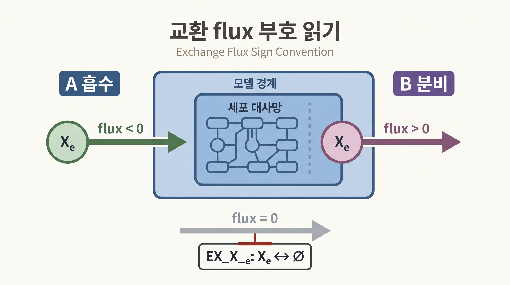
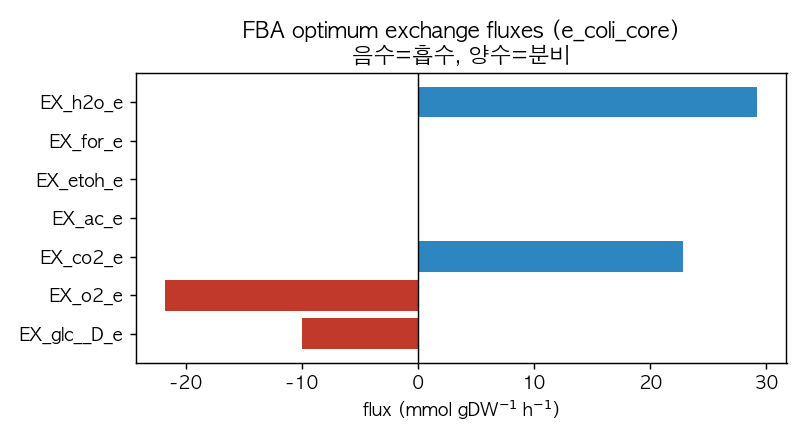

# 2. COBRApy 기초와 FBA

## 2.1 모델 적재

이 장의 범용 예제는 교육용 대장균 코어 모델 `e_coli_core`입니다. COBRApy는 이 모델을 `textbook`이라는 이름으로 내장 제공합니다([Chapter 3](../chapter-3/README.md), [Chapter 4](../chapter-4/README.md)).

```python
from cobra.io import load_model

model = load_model("textbook")   # BiGG e_coli_core
print(model.id, len(model.reactions), len(model.metabolites), len(model.genes))
```

```
e_coli_core 95 72 137
```

반응 95, 대사물 72, 유전자 137은 이 릴리스의 속성이며, 대장균이라는 종의 고정 특성이 아닙니다. 게놈 규모 모델 `iML1515`는 같은 종을 반응 2,712·대사물 1,877·유전자 1,516 규모로 기술합니다.

## 2.2 FBA 실행

플럭스 균형 분석(flux balance analysis, FBA)은 정상상태에서 내부 대사물이 쌓이지 않는 조건 $$\mathbf{S}\mathbf{v}=\mathbf{0}$$과 반응 bound를 만족하면서 목적함수(기본값: 바이오매스)를 최대화합니다([Chapter 4의 FBA 조건 설정](../chapter-4/README.md)). 여기서는 행렬 계산보다 출력의 상태, 성장 목적값과 교환 flux의 방향을 생물학적으로 읽는 데 초점을 둡니다.

```python
sol = model.optimize()
print("status:", sol.status)
print("growth mu (1/h):", round(sol.objective_value, 6))
import numpy as np
print("doubling time (h):", round(np.log(2) / sol.objective_value, 3))
```

```
status: optimal
growth mu (1/h): 0.873922
doubling time (h): 0.793
```

성장률 0.8739는 절대 예측이 아니라 **기본 배지·목적함수·bound에서의 최적값**입니다. 배지를 바꾸면 값이 달라집니다.

## 2.3 교환 flux 읽기

경계에서 무엇이 드나드는지는 교환 반응의 flux 부호로 읽습니다. `EX_` 반응은 $$X_e\rightleftharpoons\emptyset$$ 방향으로 저장되어, 음수는 흡수, 양수는 분비를 뜻합니다([Chapter 3](../chapter-3/README.md)).

```python
for r in ["EX_glc__D_e", "EX_o2_e", "EX_co2_e", "EX_ac_e", "EX_etoh_e", "EX_for_e", "EX_h2o_e"]:
    print(f"{r:14s} {sol.fluxes[r]: .4f}")
```

```
EX_glc__D_e    -10.0000
EX_o2_e        -21.7995
EX_co2_e        22.8098
EX_ac_e          0.0000
EX_etoh_e        0.0000
EX_for_e         0.0000
EX_h2o_e        29.1758
```



_그림 11.5:_ COBRA 모델의 교환 반응을 `EX_X_e: X_e ↔ ∅` 방향으로 저장했을 때 음의 flux는 외부 대사물의 흡수, 양의 flux는 분비, 0은 순 교환이 없음을 뜻합니다. 이 부호는 반응식의 저장 방향에 의존하므로 다른 모델에서도 반응식을 먼저 확인해야 합니다. 실제 GEM 계산값을 사용하지 않은 교육용 부호 모식도입니다. 저자 작성; 개념 근거: [Orth et al. (2010)](https://doi.org/10.1038/nbt.1614).



_그림 11.4:_ `e_coli_core`의 FBA 최적해에서의 주요 교환 flux(GLPK, 기본 배지, 바이오매스 최대화). 음수(붉은색)는 흡수, 양수(파란색)는 분비입니다. 포도당 10, 산소 21.8을 흡수해 이산화탄소 22.8과 물 29.2를 분비하며, 아세테이트·에탄올·포름산 분비는 0입니다. 즉 호기적 포도당 조건에서 탄소가 완전히 산화되는 상태입니다. 저자 계산·시각화; COBRApy 0.30.0, GLPK.

포도당을 흡수하되 아세테이트를 분비하지 않는 이 상태는 호기 조건의 완전 산화에 해당합니다. 산소를 제한하거나 포도당 흡수를 높이면 아세테이트 분비가 나타나는데, 이 전환은 4절의 production envelope에서 정량적으로 다룹니다.
