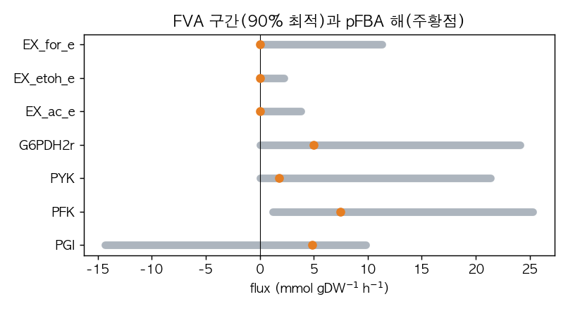

# 3. pFBA와 FVA

## 3.1 절약형 플럭스 균형 분석(parsimonious FBA, pFBA)

FBA의 최적 flux 분포는 하나가 아닐 수 있습니다. pFBA는 먼저 주 목적함수를 최적화한 뒤, 그 최적성을 유지하는 해 가운데 총 절대 flux를 줄이는 계층적 최적화로 대표 해를 선택합니다([Lewis et al., 2010](https://doi.org/10.1038/msb.2010.47), [COBRApy API](https://cobrapy.readthedocs.io/en/latest/autoapi/cobra/flux_analysis/index.html)). 여기서 총 절대 flux는 다음과 같이 정의합니다.

$$
\sum_j |v_j|
$$

여기서 $v_j$는 반응 $j$의 순 flux이며 단위는 `mmol gDW⁻¹ h⁻¹`입니다. COBRApy 0.30.0의 pFBA 이차 목적은 각 반응의 비음수 forward·reverse solver 변수를 합합니다. 아래 해에서는 이 값과 순 flux의 절댓값 합이 수치적으로 같지만, 두 표현을 모든 모델에서 자동으로 같은 양이라고 가정하지 않습니다. pFBA 해는 이 기준으로 선택한 계산상 대표 해이며 실험에서 관찰한 유일한 세포 상태가 아닙니다.

이 절의 계산은 2절에서 적재한 `e_coli_core`(`cobra/data/textbook.xml.gz`, SHA-256 `c674befd7a8199f037fd851c4f8ea8502730d0328ef51b1c46946f19fb44f72a`)를 변경하지 않고 사용합니다. 목적함수는 `Biomass_Ecoli_core`, solver는 GLPK 5.0, feasibility tolerance는 `1e-7`입니다.

```python
import pandas as pd
from cobra.flux_analysis import pfba

sol = model.optimize()
p = pfba(model, fraction_of_optimum=1.0)

comparison = pd.DataFrame([
    {
        "solution": "FBA", "status": sol.status,
        "primary_objective": sol.objective_value,
        "secondary_objective": float("nan"),
        "sum_abs_net_flux": sol.fluxes.abs().sum(),
    },
    {
        "solution": "pFBA", "status": p.status,
        "primary_objective": p.fluxes["Biomass_Ecoli_core"],
        "secondary_objective": p.objective_value,
        "sum_abs_net_flux": p.fluxes.abs().sum(),
    },
]).set_index("solution")
print(comparison.round(6).to_string())
```

```
           status  primary_objective  secondary_objective  sum_abs_net_flux
solution
FBA       optimal           0.873922                  NaN        518.422086
pFBA      optimal           0.873922           518.422086        518.422086
```

`primary_objective`는 성장 목적값(`h⁻¹`)이고, pFBA의 `secondary_objective`는 이차 최소화 값입니다. 이 모델·solver·조건에서는 GLPK가 반환한 기본 FBA 해의 총 절대 순 flux가 이미 pFBA 해와 같습니다. 0.873922와 518.422086의 일치는 **항상 성립하는 성질이 아니라** 이 고정 조건에서 계산된 결과입니다. 모델, bounds, 목적함수 또는 solver가 바뀌면 기본 FBA 해와 pFBA 해의 총 flux가 달라질 수 있습니다([Chapter 4](../chapter-4/README.md) 8절).

## 3.2 플럭스 변동성 분석(flux variability analysis, FVA)

FVA는 주 목적함수의 하한을 만족하는 영역에서 각 반응을 따로 최소화하고 최대화해 flux 구간을 계산합니다([Mahadevan and Schilling, 2003](https://doi.org/10.1016/j.ymben.2003.09.002), [COBRApy API](https://cobrapy.readthedocs.io/en/latest/autoapi/cobra/flux_analysis/index.html)). 최적 목적값을 $z^*$, 목적 계수를 $\mathbf{c}$, flux 벡터를 $\mathbf{v}$, `fraction_of_optimum`을 $f$라고 하면 목적 하한은 다음과 같습니다.

$$
\mathbf{c}^{\mathsf T}\mathbf{v} \ge fz^*
$$

$f=1.0$은 최적 목적값을 유지하는 최적면을, $f=0.90$은 최적값의 90% 이상을 허용하는 근최적 영역을 뜻합니다. 각 minimum과 maximum은 별도의 최적화에서 얻으므로 표의 모든 끝점을 동시에 갖는 하나의 flux 분포가 존재한다고 해석하지 않습니다.

```python
from cobra.flux_analysis import flux_variability_analysis

reaction_ids = ["PGI", "PFK", "PYK", "G6PDH2r", "EX_ac_e", "EX_etoh_e", "EX_for_e"]

def run_fva(fraction):
    result = flux_variability_analysis(
        model, reaction_list=reaction_ids,
        fraction_of_optimum=fraction, processes=1,
    )
    result["width"] = result["maximum"] - result["minimum"]
    return result

fva100 = run_fva(1.0)
fva90 = run_fva(0.90)
tolerance = model.tolerance  # 1e-7
fva90.loc[fva90["width"].abs() <= tolerance, "width"] = 0.0
print(fva90.round(4).to_string())
```

```
           minimum  maximum    width
PGI       -14.2990   9.8388  24.1378
PFK         1.1717  25.2906  24.1189
PYK         0.0000  21.3830  21.3830
G6PDH2r    -0.0000  24.1378  24.1378
EX_ac_e     0.0000   3.8136   3.8136
EX_etoh_e   0.0000   2.2143   2.2143
EX_for_e    0.0000  11.3223  11.3223
```

같은 반응의 100% 최적면과 90% 근최적 영역을 비교하려면 폭을 나란히 계산합니다. 허용오차 이내의 폭은 0으로 표시합니다.

```python
widths = pd.DataFrame({
    "width@1.00": fva100["width"],
    "width@0.90": fva90["width"],
})
widths = widths.mask(widths.abs() <= tolerance, 0.0)
print(widths.round(4).to_string())
```

```
           width@1.00  width@0.90
PGI               0.0     24.1378
PFK               0.0     24.1189
PYK               0.0     21.3830
G6PDH2r           0.0     24.1378
EX_ac_e           0.0      3.8136
EX_etoh_e         0.0      2.2143
EX_for_e          0.0     11.3223
```

선택한 일곱 반응은 $f=1.0$에서 허용오차를 넘는 폭이 없지만 $f=0.90$에서는 모두 양의 폭을 보입니다. 따라서 이 결과는 **90% 근최적 영역의 변동성**을 보여 주며, 이 일곱 반응에서 대안 최적해가 존재한다는 증거로 사용할 수 없습니다. 반대로 일곱 반응의 폭이 0이라는 사실만으로 모델 전체의 최적해가 유일하다고 결론 내릴 수도 없습니다.



*그림 11.3. 최적 성장의 90% 이상을 허용한 근최적 영역에서 선택 반응의 FVA 최소–최대 구간(회색 막대)과 pFBA 해(주황 점)를 비교합니다. PGI 구간은 음수와 양수를 모두 포함하고, 아세테이트·에탄올·포름산 분비 exchange의 상한은 각각 3.81·2.21·11.32입니다. 이 폭은 목적값이 최적값보다 최대 10% 낮아질 수 있는 영역의 변동성이며 대안 최적해의 충분조건이 아닙니다. 저자 계산·시각화; COBRApy 0.30.0, GLPK, `fraction_of_optimum=0.90`.*

FVA는 [blocked reaction](../glossary.md) 후보를 판정하는 데도 사용합니다. 고정한 모델·배지·bounds·목적 하한에서 `abs(minimum) <= tolerance`와 `abs(maximum) <= tolerance`를 모두 만족하면 그 실행가능 영역에서는 해당 반응이 0이 아닌 flux를 가질 수 없습니다. 다음 표는 이 조건별 판정이며 전역 blocked 판정이 아닙니다.

```python
def zero_interval(frame):
    return (
        frame["minimum"].abs().le(tolerance)
        & frame["maximum"].abs().le(tolerance)
    )

blocked_check = pd.DataFrame({
    "candidate@1.00": zero_interval(fva100),
    "candidate@0.90": zero_interval(fva90),
})
print(blocked_check.to_string())
```

```
           candidate@1.00  candidate@0.90
PGI                 False           False
PFK                 False           False
PYK                 False           False
G6PDH2r             False           False
EX_ac_e              True           False
EX_etoh_e            True           False
EX_for_e             True           False
```

세 분비 exchange는 최적 성장면($f=1.0$)에서는 0에 고정되지만 90% 근최적 영역에서는 양의 flux를 가질 수 있습니다. 따라서 “최적 성장면에서 0”과 “주어진 교환 조건 전체에서 blocked”를 구분해야 합니다. 더 넓은 blocked 진단에서는 목적 하한을 제거하고(`fraction_of_optimum=0.0`) exchange를 현재 배지대로 둘지 열어 둘지도 함께 기록합니다.
