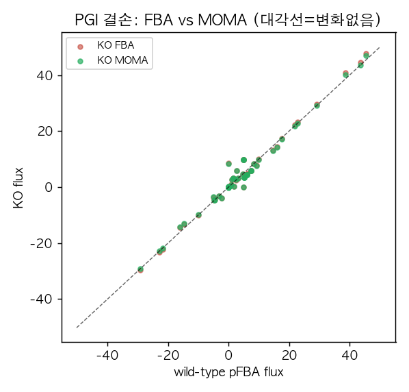
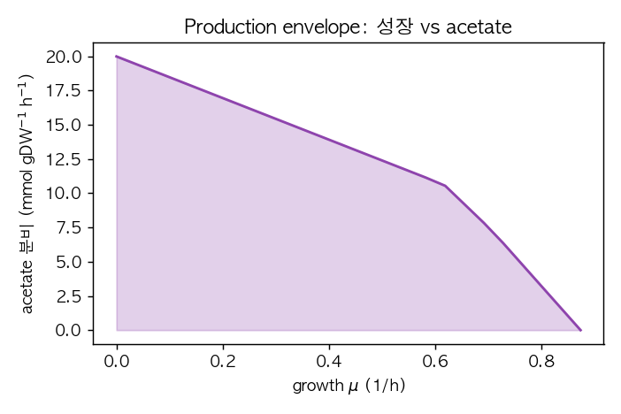

# 4. 유전자·반응 결손과 MOMA

## 4.1 반응 결손과 FBA

반응이나 유전자를 결손하면 그 반응의 flux가 0으로 고정되고, 세포는 남은 네트워크로 재최적화합니다. FBA는 결손 후에도 목적함수를 다시 최대화하므로, 결손 균주가 **새 최적 상태를 이미 찾았다고 가정한 상한 예측**을 줍니다([Chapter 8](../chapter-8/README.md)).

```python
from cobra.flux_analysis import pfba, moma

wt = pfba(model)                    # 야생형 대표 flux
with model:
    model.reactions.PGI.knock_out()   # phosphoglucose isomerase 결손
    print("KO(PGI) FBA growth:", round(model.slim_optimize(), 6))
```

```
KO(PGI) FBA growth: 0.863160
```

## 4.2 MOMA: 조정 최소화 가정

MOMA(minimization of metabolic adjustment)는 결손 직후의 세포가 야생형 flux 분포에서 **최소한으로만 벗어난다**고 가정하고, 야생형과의 거리를 최소화하는 flux를 찾습니다. 원형 MOMA는 유클리드 거리(2차 목적함수, QP)를 최소화하고, 선형 MOMA는 절댓값 합(LP)을 최소화합니다([Chapter 8](../chapter-8/README.md), [핵심 방법 보충](../supplements/perturbation-analysis.md)).

```python
with model:
    model.reactions.PGI.knock_out()
    lin = moma(model, solution=wt, linear=True)        # 선형 MOMA(LP, GLPK)
    print("KO(PGI) linear MOMA:", round(lin.fluxes["Biomass_Ecoli_core"], 6))

with model:
    model.solver = "gurobi"                              # QP는 QP solver 필요
    model.reactions.PGI.knock_out()
    qp = moma(model, solution=wt, linear=False)          # 원형 MOMA(QP)
    print("KO(PGI) QP MOMA:", round(qp.fluxes["Biomass_Ecoli_core"], 6))
```

```
KO(PGI) linear MOMA: 0.842570
KO(PGI) QP MOMA: 0.817844
```

세 값을 비교하면 방법의 가정 차이가 드러납니다.

| 방법 | PGI 결손 성장률 (1/h) | 가정 |
|:---|---:|:---|
| 야생형(참고) | 0.873922 | — |
| FBA(재최적화) | 0.863160 | 결손 후 새 최적을 즉시 달성 |
| 선형 MOMA | 0.842570 | 야생형 flux에 $$L_1$$ 거리로 근접 |
| 원형 MOMA(QP) | 0.817844 | 야생형 flux에 $$L_2$$ 거리로 근접 |

MOMA가 FBA보다 낮은 성장률을 예측하는 것은, 아직 적응하지 못한 세포가 옛 flux 패턴에 묶여 최적이 아닌 상태에 머문다는 가정 때문입니다. 이는 보편 법칙이 아니라 **검증 대상 가설**이며, 결손·균주·적응 여부에 따라 어느 방법이 실제에 가까운지가 달라집니다.



*그림 11.4. PGI 결손 후 각 반응 flux를 야생형 pFBA flux(가로축)에 대해 그린 산점도. 대각선은 “야생형과 동일”을 뜻한다. 대부분의 점이 대각선 근처에 있어, PGI 결손이 이 조건에서 비교적 완만한 재배선을 유발함을 보여 준다. QP MOMA는 그림에 표시하지 않았으나 성장률은 세 방법 중 가장 낮다. 저자 계산·시각화; COBRApy 0.30.0, GLPK/Gurobi.*

## 4.3 Production envelope

균주 설계에서는 성장과 목적 산물 사이의 절충을 봅니다. Production envelope는 성장률을 여러 값으로 고정했을 때 얻을 수 있는 산물 flux의 범위를 그립니다([Chapter 8](../chapter-8/README.md)).

```python
from cobra.flux_analysis import production_envelope

env = production_envelope(model, reactions=["Biomass_Ecoli_core"],
                          objective="EX_ac_e", carbon_sources="EX_glc__D_e", points=25)
```



*그림 11.5. `e_coli_core`의 성장률(가로축) 대비 아세테이트 분비(세로축) production envelope. 성장을 포기할수록 아세테이트를 최대 20까지 분비할 수 있고, 최대 성장(약 0.87)에서는 아세테이트 분비가 0이다. 약 0.6 부근의 꺾임은 대사 상태 전환에 해당한다. 저자 계산·시각화; COBRApy 0.30.0, GLPK, 25점.*

성장과 생산이 상충하는 이 곡선은 균주 설계에서 “성장 결합 생산(growth-coupled production)”을 설계할 때의 출발점입니다. 특정 산물의 분비가 성장의 필연적 부산물이 되도록 네트워크를 바꾸는 방법은 [Chapter 8](../chapter-8/README.md)의 OptKnock 등에서 다룹니다.
