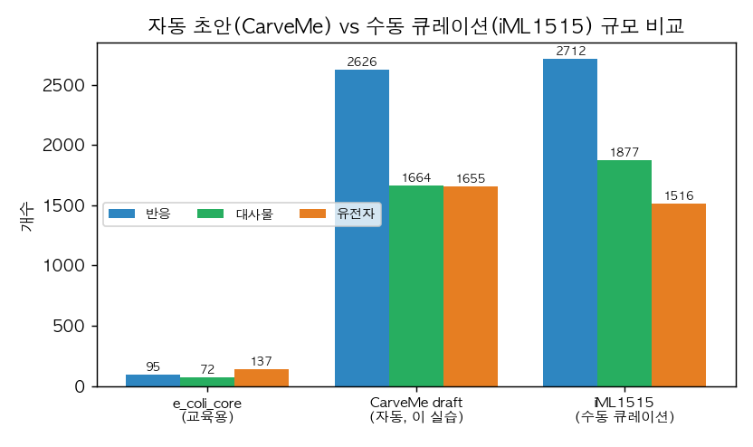

# 5. CarveMe: 게놈에서 초안 GEM

[Chapter 5](../chapter-5/README.md)에서 다룬 자동 재구축을 실제로 실행합니다. **CarveMe**는 하나의 큰 범용 반응 데이터베이스(universe)에서 출발해, 대상 게놈이 지지하지 않는 반응을 깎아 내는 **top-down** 방식으로 초안 게놈 규모 대사 모델(genome-scale metabolic model, GEM)을 만듭니다. 이 실습의 모든 숫자는 실제 실행 결과입니다.

## 5.1 준비물

```bash
# 정렬기 diamond (Homebrew)와 CarveMe 설치
brew install diamond          # diamond 2.2.3
python -m pip install carveme  # carveme 1.6.6
```

CarveMe가 반응을 깎아 내는 대상인 범용 모델(BiGG universe)의 규모를 먼저 확인합니다.

```python
import cobra, carveme, os
uni = os.path.join(os.path.dirname(carveme.__file__), "data/generated/bigg_universe.xml.gz")
u = cobra.io.read_sbml_model(uni)
print("BiGG universe:", len(u.reactions), "reactions |", len(u.metabolites), "metabolites")
```

```
BiGG universe: 25348 reactions | 15638 metabolites
```

이 25,348개의 반응 풀에서, 대상 게놈의 단백질과 서열이 일치하는 반응만 남기는 것이 carving의 핵심입니다.

## 5.2 대상 게놈과 carving 실행

대상은 이 책의 running example인 대장균 K-12 MG1655의 단백질체입니다(UniProt proteome UP000000625).

```bash
# 단백질 FASTA 내려받기 (4,403개 서열)
curl -s "https://rest.uniprot.org/uniprotkb/stream?query=proteome:UP000000625&format=fasta" \
  -o ecoli.faa

# diamond로 universe에 정렬한 뒤 MILP로 반응을 깎아 초안 GEM 생성
carve ecoli.faa -o ecoli_draft.xml.gz
```

`carve`는 내부적으로 (1) diamond로 입력 단백질을 universe의 유전자 서열에 정렬해 반응별 증거 점수를 매기고, (2) 그 점수를 목적으로 하는 혼합정수계획(MILP)을 풀어 flux를 흘릴 수 있는 최소 규모의 일관된 네트워크를 남깁니다. 이 MILP는 25,348개 반응을 후보로 하므로, GLPK보다 Gurobi·CPLEX 같은 solver에서 안정적으로 풀립니다([1절](01.md)).

출력의 끝에서 초안 모델의 규모를 확인합니다(중간의 경계 반응 추가 로그는 생략).

```python
import cobra
m = cobra.io.read_sbml_model("ecoli_draft.xml.gz")
print("draft:", len(m.reactions), "reactions |",
      len(m.metabolites), "metabolites |", len(m.genes), "genes")
```

```
draft: 2626 reactions | 1664 metabolites | 1655 genes
```

## 5.3 자동 초안과 수동 큐레이션 모델의 비교

CarveMe가 25,348개 후보에서 깎아 낸 초안은 반응 2,626개입니다. 같은 종을 여러 해에 걸쳐 수동 큐레이션한 iML1515는 반응 2,712개로, 규모가 비슷합니다.



*그림 11.6. 세 대장균 모델의 규모 비교. 교육용 `e_coli_core`(반응 95), 이 실습에서 자동 생성한 CarveMe 초안(반응 2,626), 수동 큐레이션한 iML1515(반응 2,712). 자동 초안이 게놈 규모 큐레이션 모델과 비슷한 규모에 도달하지만, 규모가 같다고 품질이 같다는 뜻은 아닙니다. 저자 계산·시각화; CarveMe 1.6.6, diamond 2.2.3, BiGG universe.*

규모가 비슷하다는 사실이 두 모델이 동등하다는 뜻은 아닙니다. 자동 초안은 [Chapter 5](../chapter-5/README.md)에서 강조한 수동 정제(반응별 근거·방향성·GPR·confidence 기록, 질량·전하 균형 점검, 표현형 시험)를 아직 거치지 않았습니다. 초안은 큐레이션의 **출발점**이며, 초안의 반응들은 대부분 서열 근거(confidence 2 수준)에 해당합니다.

## 5.4 초안의 한계 확인

방금 만든 초안을 기본 설정으로 최적화하면 비현실적으로 큰 값이 나옵니다.

```python
print("기본(모든 교환 열림) 최대 목적값:", round(m.slim_optimize(), 4))
```

```
기본(모든 교환 열림) 최대 목적값: 65.9999
```

이 값은 성장률이 아니라, **모든 교환 반응이 열린 상태에서의 목적함수 상한**입니다. 의미 있는 성장률을 얻으려면 [Chapter 3](../chapter-3/README.md)의 배지 정의처럼 특정 탄소원·무기 이온만 열고 나머지 흡수를 닫아야 하며, 정의된 배지에서 성장하지 못하면 [gap-filling](../glossary.md)으로 누락 경로를 보완합니다(`carve --gapfill <medium>`). 즉 자동 초안은 “실행 가능한 첫 모델”이지 “검증된 모델”이 아니며, 이후의 배지 정의·gap-filling·품질 관리가 반드시 뒤따릅니다.
