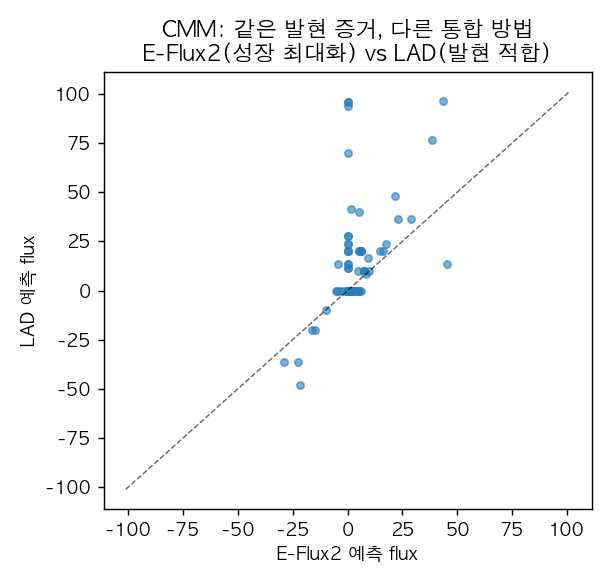
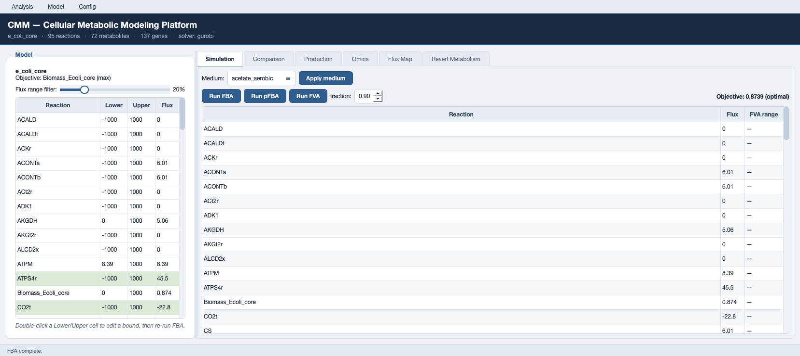

# 6. CMM: 발현 통합과 조건별 flux(LAD·E-Flux2)

**CMM(Cellular Metabolic Modeling Platform)**은 제약 기반 대사 모델링을 파이썬 API와 Qt 데스크톱 GUI로 함께 제공하는 도구입니다([github.com/jyryu3161/CMM](https://github.com/jyryu3161/CMM), MIT). FBA·pFBA·FVA, 발현 통합(LAD, 2단계 E-Flux2), 교란(MOMA·ROOM), 생산(FSEOF·FVSEOF), 균주 설계(OptKnock·RobustKnock), 정상화(MTA·rMTA)를 하나의 solver-중립 서비스로 묶습니다. 이 절은 6장의 발현-제약 통합([Chapter 6](../chapter-6/README.md))을 실제로 실행합니다.

## 6.1 설치와 확인

```bash
git clone https://github.com/jyryu3161/CMM.git
python -m pip install -e "./CMM"          # 코어(헤드리스). GUI는 ./install.sh
python -c "import cmm; print(cmm.__version__)"
```

```
0.3.0
```

## 6.2 발현을 반응 가중치로 변환

발현값은 [GPR](../chapter-3/README.md) 규칙(AND=min, OR=max)으로 반응 수준 증거로 집약됩니다([Chapter 6](../chapter-6/README.md) 2절의 [RAS](../glossary.md)). 여기서는 재현 가능한 합성 발현을 사용합니다(실제 연구에서는 RNA-seq 표를 넣습니다).

```python
import numpy as np, pandas as pd
from cobra.io import load_model
from cmm.core import apply_medium, fba
import cmm.omics as omics

model = load_model("textbook")
apply_medium(model, "glucose_aerobic")

genes = [g.id for g in model.genes]
expr = pd.Series(np.random.default_rng(0).uniform(5, 100, len(genes)), index=genes)
weights = omics.gene_to_reaction_weights(model, expr)   # 반응→가중치
print(len(weights), "reactions weighted")
```

```
69 reactions weighted
```

## 6.3 E-Flux2와 LAD: 같은 증거, 다른 가정

```python
base = fba(model)
ef = omics.eflux2(model, weights)   # 2단계 QP: 발현으로 flux 상한을 스케일 후 목적 최대화
la = omics.lad(model, weights)      # LP: 발현 목표 flux 크기에 최소절대편차로 적합

print("FBA     biomass: %.6f" % base.objective_value)
print("E-Flux2 biomass: %.6f  (%s)" % (ef.fluxes["Biomass_Ecoli_core"], ef.status))
print("LAD     biomass: %.6f  | LAD objective(sum|dev|): %.2f"
      % (la.fluxes["Biomass_Ecoli_core"], la.objective_value))
```

```
FBA     biomass: 0.873922
E-Flux2 biomass: 0.873922  (optimal)
LAD     biomass: 0.000000  | LAD objective(sum|dev|): 3196.30
```

두 방법은 같은 발현 증거를 쓰지만 목적이 다릅니다. **E-Flux2**는 발현으로 각 반응의 flux 상한을 스케일한 뒤 여전히 목적함수(성장)를 최대화하므로, 이 조건에서는 FBA와 같은 성장률을 냅니다. **LAD**는 예측 flux의 크기를 발현 목표에 최소절대편차로 맞추는 것이 목적이며 성장을 강제하지 않으므로, 발현 패턴을 따르다 보면 바이오매스 flux가 0이 될 수도 있습니다. 어느 쪽이 실제에 가까운지는 질문과 데이터에 달려 있습니다.



*그림 11.7. 같은 발현 증거로 CMM의 E-Flux2(가로축)와 LAD(세로축)가 예측한 반응별 flux 산점도. 두 축 모두 반응 flux이며 단위는 `mmol gDW⁻¹ h⁻¹`입니다. 대각선에서 벗어난 점은 두 통합 방법이 서로 다른 flux를 예측함을 보여 줍니다. 합성 발현을 사용했으므로 개별 수치가 아니라 방법 간 차이가 요점입니다. 저자 계산·시각화; CMM 0.3.0, BiGG `e_coli_core`, 배지 `glucose_aerobic`, Gurobi.*

## 6.4 조건 간 flux 변화

여러 조건의 발현을 한 번에 예측하고 로그 변화를 비교할 수 있습니다.

```python
expr2 = pd.DataFrame({"aerobic": ..., "stressed": ...}, index=genes)
pred = omics.predict_condition_fluxes(model, expr2, method="eflux2")
lc = omics.flux_log_change(pred.fluxes("aerobic"), pred.fluxes("stressed"))
```

두 조건 사이에서 변화가 큰 반응(예: PFL·EX_for_e·FORti·THD2·GND)이 상위에 오르며, 이는 조건 특이적 대사 재배선의 후보를 가리킵니다. 실제 해석은 발현 데이터의 출처·정규화와 함께 보고합니다([Chapter 6](../chapter-6/README.md)).

## 6.5 데스크톱 GUI

CMM은 동일한 서비스를 Qt 데스크톱 앱으로도 제공합니다(`python -m cmm.app`). 코드를 쓰지 않고 배지·목적함수·발현 통합을 조작하며 결과 표와 flux map을 확인할 수 있습니다.



*그림 11.8. CMM 데스크톱 GUI. `e_coli_core`(반응 95·대사물 72·유전자 137, solver Gurobi)를 불러와 배지(acetate_aerobic)를 적용하고 FBA를 실행한 화면으로, 반응별 flux와 bound 편집, Comparison·Production·Omics·Flux Map 탭을 제공합니다. 출처: CMM GUI, [github.com/jyryu3161/CMM](https://github.com/jyryu3161/CMM)(MIT).*
