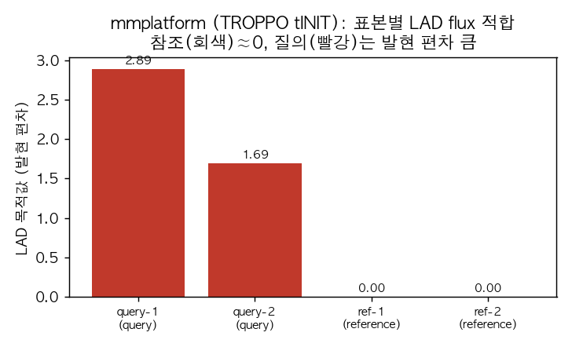

# 6. mmplatform: tINIT 맥락 특이적 재구축

**mmplatform**은 발현 데이터를 이용해 시료 특이적(sample-specific) 대사 모델을 만들고, 그 모델에서 유전자 교란의 영향을 평가하는 워크플로입니다([github.com/jyryu3161/mmplatform](https://github.com/jyryu3161/mmplatform)). 이 절에서는 먼저 수정한 TROPPO 기반 [tINIT](../glossary.md)으로 맥락 특이적 모델을 만듭니다. 다음으로 LAD(least absolute deviation, 최소절대편차)로 발현 정보를 반영한 플럭스 대리값을 맞추고, 선형 MOMA로 유전자 교란을 평가합니다([Chapter 5](../chapter-5/README.md), [Chapter 6](../chapter-6/README.md), [Chapter 7](../chapter-7/README.md)).

저자가 명시하듯 이 파이프라인의 산출물은 **계산적 우선순위화**이며, 정식 tINIT·실험 근거·치료적 주장과 동일시하지 않습니다. 모든 결과는 검증 게이트를 통과한 뒤에만 사용합니다.

## 6.1 설치

핵심 런타임은 pip로 설치하고, tINIT에 쓰는 **정확한 커밋의 TROPPO/COBAMP**는 재현성을 위해 `--no-deps`로 고정 설치합니다. `--no-deps`로 빠지는 순수 파이썬 의존성(`pathos`, `boolean.py`, `indexed`)은 별도로 설치합니다.

```bash
git clone https://github.com/jyryu3161/mmplatform.git
python -m pip install -e "./mmplatform[gui]"                 # 코어 + FastAPI GUI
python -m pip install --no-deps -r mmplatform/env/requirements-troppo.txt
python -m pip install pathos "boolean.py" indexed            # TROPPO 런타임 보조 의존성
python -c "import troppo, cobamp; print('tINIT 런타임 준비 완료')"
```

`cobamp`/`troppo`가 `scipy==1.7.3` 같은 옛 버전을 요구한다는 pip 경고가 뜨지만, mmplatform의 호환 계층은 최신 스택에서 이 고정 커밋과 함께 동작하도록 시험되어 있으므로 경고는 무시합니다.

## 6.2 자체 완결 데모로 tINIT 실행

`make-demo`는 외부 모델·데이터 없이 실행되는 작은 fixture를 만듭니다. 인체 모델을 준비하기 전에 파이프라인 전체를 tINIT 경로로 점검하는 데 씁니다. 생성된 설정에서 재구축 방법을 `troppo_tinit`으로 지정합니다.

```bash
python -m mmplatform make-demo --output-dir demo
sed -i 's/method: expression_only/method: troppo_tinit/' demo/config.yaml   # tINIT 경로 사용
python -m mmplatform run --config demo/config.yaml
```

```json
{
  "run_id": "mmplatform_demo",
  "status": "analysis_complete",
  "claim_ceiling": "Computational prioritization using pinned TROPPO tINIT context reconstruction, explicit validated medium, sparse LAD flux fitting, and full-context linear-MOMA. Not therapeutic or experimental validation."
}
```

파이프라인은 순서대로 (1) 발현 식별자를 모델 유전자에 매핑하고, (2) [GPR](../chapter-3/README.md)을 OR=max·AND=min으로 평가해 (3) **tINIT**으로 맥락 반응 집합을 추출하며, (4) 정상상태 LAD flux 대리값을 적합하고, (5) 참조 flux 대비 선형 MOMA로 유전자 교란을 시뮬레이션합니다. 산출 디렉터리에는 각 단계의 QC·결과 CSV와 provenance 매니페스트가 남습니다.

## 6.3 tINIT 맥락 재구축과 LAD 적합 결과

데모의 네 표본(참조 2, 질의 2)이 모두 tINIT으로 재구축되었습니다. `n_tinit_retained`는 tINIT이 유지한 반응 수입니다.

| 표본 | 역할 | 방법 | tINIT 유지 반응 | LAD 목적값(발현 편차) | solver |
|:---|:---|:---|---:|---:|:---|
| ref-1 | reference | troppo_tinit | 4 | 0.00 | scipy-highs |
| ref-2 | reference | troppo_tinit | 4 | 0.00 | scipy-highs |
| query-1 | query | troppo_tinit | 4 | 2.891 | scipy-highs |
| query-2 | query | troppo_tinit | 4 | 1.691 | scipy-highs |

*표 11.1. mmplatform 데모의 tINIT 재구축·LAD 적합 결과. `method`가 `troppo_tinit`이면 정확한 커밋의 TROPPO tINIT이 실제로 실행된 것이다.*



*그림 11.7. mmplatform tINIT 데모의 표본별 LAD flux 적합 목적값(발현 편차 항). 참조 표본(회색)은 기준이므로 편차가 0에 가깝고, 질의 표본(빨강)은 발현 조건이 달라 편차가 크다. 저자 계산·시각화; mmplatform 0.3.0, TROPPO tINIT 경로, scipy-highs.*

## 6.4 유전자 교란(선형 MOMA)

각 표적에 대해 두 모드로 교란을 평가합니다. `reference_clamp`은 참조 상태로 되돌렸을 때의 회복 점수(rescue score)를 주고, `inhibit_KO`는 결손을 시뮬레이션합니다. 데모에서는 두 표적 모두 `reference_clamp` 회복 점수 중앙값이 0.889로 나왔습니다.

```
target  mode             n_success  median_rescue_score
TGT1    reference_clamp  2          0.889
TGT3    reference_clamp  2          0.889
```

작은 데모에서는 일부 결손이 infeasible로 나오는데, 이는 축소된 장난감 네트워크의 구조적 한계이지 방법의 오류가 아닙니다. 실제 인체 모델에서는 표적 유전자·조건에 따라 회복 점수의 분포가 의미를 갖습니다.

## 6.5 인체 모델(Human-GEM) tINIT

위 데모를 인체 규모로 옮기려면 (1) 6.1의 TROPPO 고정 설치, (2) Human-GEM SBML, (3) 시료별 발현표가 필요합니다. Human-GEM은 공개 저장소에서 받을 수 있습니다.

```bash
curl -sL "https://raw.githubusercontent.com/SysBioChalmers/Human-GEM/main/model/Human-GEM.xml" \
  -o Human-GEM.xml     # 약 43 MB SBML Level 3
```

이후 `configs/example.yaml`의 `model` 경로를 `Human-GEM.xml`로, `reconstruction.method`를 `troppo_tinit`으로 두고, 발현표·배지·필수 flux·표적을 Human-GEM의 식별자(유전자 ID, exchange 반응 ID)에 맞추어 채운 뒤 `python -m mmplatform run --config <config>`를 실행합니다. 대형 tINIT MILP는 이 환경에 이미 활성화된 Gurobi 라이선스로 처리됩니다([1절](01.md)). 발현표는 시료별 유전자 발현이 필요하므로, 사용자의 실제 발현 데이터를 넣으면 이 절에 인체 tINIT 결과를 실제 출력으로 덧붙일 수 있습니다. 발현 데이터의 출처·정규화는 결과와 함께 반드시 기록합니다([Chapter 6](../chapter-6/README.md)).

## 6.6 웹 GUI

mmplatform은 동일한 파이프라인을 로컬 웹 GUI(`mmplatform Studio`)로도 제공합니다.

```bash
python -m mmplatform gui --host 127.0.0.1 --port 8899
```

실행하면 브라우저에서 대시보드가 열립니다. 왼쪽에 Dashboard·Workflow·Jobs·Results·Guide 메뉴가 있고, 상단 카드에 현재 런타임(Python 3.10.9)과 사용 가능한 solver(glpk·scipy-highs), R 렌더러 상태가 표시됩니다. 화면 중앙의 "Workflow contract"는 파이프라인을 다섯 개의 명시적 게이트, 곧 **Create(자체 완결 데모) → Validate(설정·입력 검증) → Analyze(모델·교란) → Render(R 원고 그림) → Finalize(해시·provenance)** 로 보여 줍니다. GUI와 CLI는 같은 과학 연산을 공유하므로 결과가 일치하며, GUI는 기록된 상태를 조용히 변경하거나 확정하지 않습니다. 최종 검증 게이트를 통과해야만 그림이 완결된 실행으로 승격되므로, 화면의 결과를 그대로 최종 결과로 오해하지 않도록 설계되어 있습니다.
