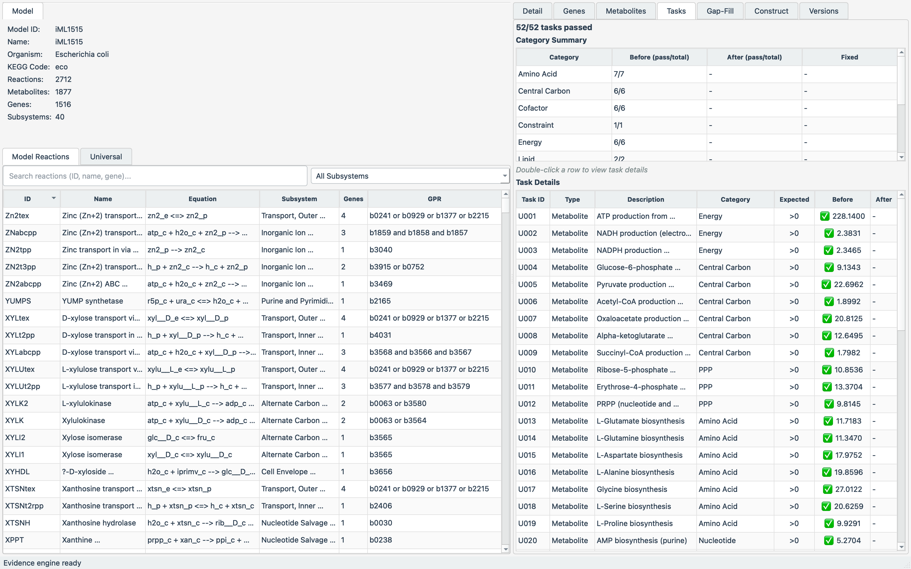

# 7. TRACE-GEM: 근거 기반 gap-filling

**TRACE-GEM**(Task-guided Reconstruction And Curation with Evidence)은 단백질 FASTA에서 [CarveMe](https://carveme.readthedocs.io) 초안을 만든 뒤, **대사 task 통과 여부**를 품질 기준으로 삼아 gap-filling으로 모델을 수리합니다([github.com/jyryu3161/TRACE-GEM](https://github.com/jyryu3161/TRACE-GEM)). gap-filling 후보 반응은 KEGG 근거로 가중되어, 근거가 분명한 반응이 우선 선택됩니다([Chapter 5](../chapter-5/README.md)). 5절의 CarveMe가 초안 생성이라면, 이 절은 그 초안을 **기능 시험으로 검증·수리**하는 단계입니다.

## 7.1 설치와 입력

```bash
git clone https://github.com/jyryu3161/TRACE-GEM.git
python -m pip install -e "./TRACE-GEM"   # cobra, carveme, biopython 등
```

저장소에는 예제 단백질체(대장균 `eco`, *C. glutamicum* `cgb`), BiGG 범용 모델, 그리고 **52개의 필수 대사 task**(`data/universal_essential_tasks.csv`)가 포함되어 바로 실행됩니다.

## 7.2 초안 생성(build)

```bash
metatask-gapfill-cli --build data/eco_protein.faa --organism eco \
    --carveme-solver gurobi --build-output eco_model.xml
```

```
Loaded model 'eco_model': 2660 reactions, 1675 metabolites, 1643 genes
Built model: eco_model (2660 reactions, 1675 metabolites, 1643 genes)
```

CarveMe로 만든 초안은 반응 2,660개입니다(5절의 초안과 규모가 비슷하며, universe 설정·버전에 따라 세부 수는 달라집니다).

## 7.3 task 기반 gap-filling(refine)

초안을 52개 필수 task에 대해 검증하고, 실패한 task를 KEGG 근거 가중 gap-filling으로 수리합니다. 아래는 build한 초안을 입력으로 하는 설정 실행입니다.

```yaml
# refine 설정(요약)
models: [{path: eco_model.xml, kegg_code: eco}]
refine:
  enabled: true
  universal: data/bigg_universal_model_fixed.json
  tasks: data/universal_essential_tasks.csv
  skip_evaluation: true
```

```
Gap-Fill Summary
  Reactions Added : 0
  Tasks Fixed     : 0
  Tasks Broken    : 0
  Total Tasks     : 52
Pipeline complete: 1 resolved, 0 failed, 1 refined
```

이 초안은 **52개 필수 task를 모두 통과**했으므로 추가된 반응이 없습니다. task 결과 표는 각 task의 전·후 통과 여부와 값을 남깁니다.

| Task | 대상 | 범주 | 전 통과 | 값 | 후 통과 | 상태 |
|:---|:---|:---|:---:|---:|:---:|:---:|
| U001 | atp_c | Energy | True | 235.00 | True | OK |
| U002 | nadh_c | Energy | True | 2.48 | True | OK |
| U003 | nadph_c | Energy | True | 2.45 | True | OK |
| U004 | g6p_c | Central Carbon | True | 9.42 | True | OK |
| U005 | pyr_c | Central Carbon | True | 22.06 | True | OK |

*표 11.2. TRACE-GEM task 결과의 일부(전체 52개). 모두 통과하므로 gap-filling이 반응을 추가하지 않는다.*

여기서 핵심은 **품질을 per-reaction 점수가 아니라 task 통과로 판정**한다는 점입니다([Chapter 5](../chapter-5/README.md)의 Stage 4 기능 시험). task가 실패할 때에만 gap-filling이 작동하며, 그때 후보 반응은 KEGG 근거로 가중되어 근거가 강한 반응이 우선 선택됩니다. 근거가 없어도 task 충족에 필요하면 추가하되, [confidence](../glossary.md)는 낮게 기록합니다.

## 7.4 데스크톱 GUI

TRACE-GEM은 build·refine·검증을 데스크톱 GUI(PySide6/Qt6)로도 제공합니다.



*그림 11.8. TRACE-GEM 그래픽 인터페이스. iML1515 모델과 52개 대사 task의 통과/실패 결과를 함께 표시한다. 출처: TRACE-GEM GUI, [github.com/jyryu3161/TRACE-GEM](https://github.com/jyryu3161/TRACE-GEM).*
