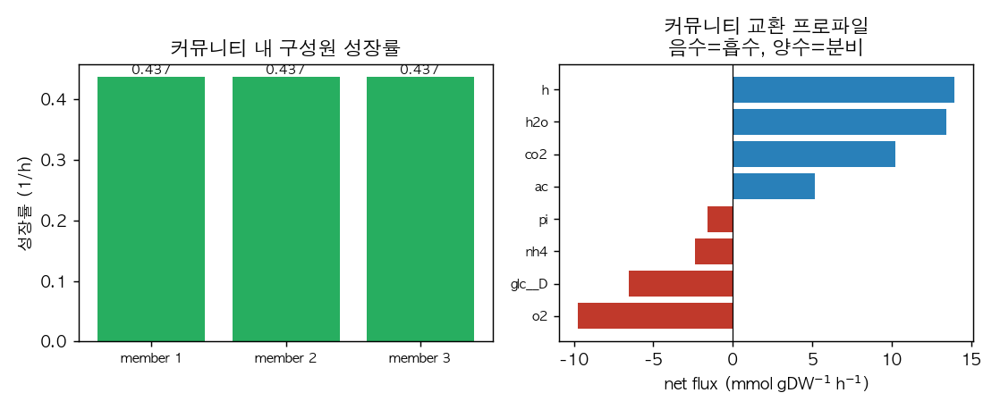
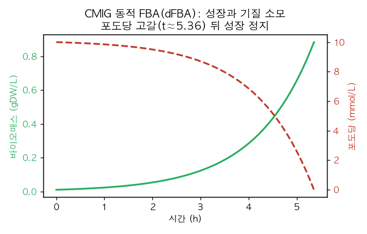
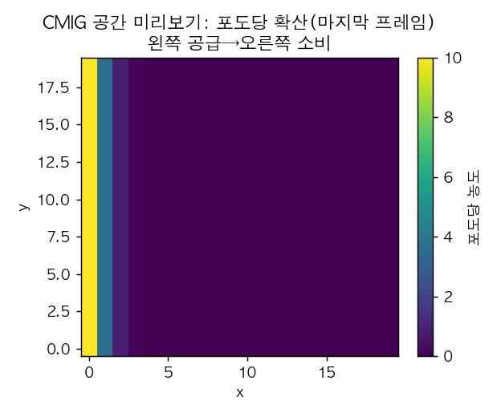

# 7. CMIG: 미생물 군집 모델링

**CMIG**(Community Metabolic Interaction GUI)는 미생물 군집의 대사 상호작용을 분석하는 도구로, 군집 FBA는 [MICOM 공식 문서](https://micom-dev.github.io/micom/)의 엔진에 위임하고 그 위에 모델 풀 탐색, 숙주-미생물 결합, 재현 가능한 매니페스트, 그림 산출을 얹습니다([CMIG 공식 저장소](https://github.com/jyryu3161/CMIG)). 이 절은 군집 결과를 구성원 GEM의 품질([Chapter 5의 품질 관리](../chapter-5/06.md))과 조건별 경계 설정([Chapter 6의 맥락 특이적 모델](../chapter-6/04.md))에 의존하는 예측으로 해석합니다.

## 7.1 설치와 solver 확인

```bash
git clone https://github.com/jyryu3161/CMIG.git
python -m pip install -e "./CMIG[engine]"   # MICOM 엔진 포함(micom 0.39.0)
python -m pip install "gurobipy>=12,<13" osqp highspy
cmig solvers
```

```
Solver capability matrix
  solver    LP    QP    MILP  available
  gurobi   True  True  True   True
  highs    True  False True   True
  osqp     True  True  False  True
```

## 7.2 군집 solve

번들 fixture(3-구성원 합성 군집)로 군집 FBA를 실행합니다. 외부 GEM 없이도 파이프라인을 검증할 수 있습니다.

```bash
cmig solve-fixture --solver gurobi --out solve/ --targets scfa
```

산출물은 노드(구성원 성장), 엣지(종간 대사물 교환), 프로파일(군집 교환), target 요약을 각각 parquet/JSON으로 남깁니다. 세 구성원의 성장률과 군집 교환 프로파일은 다음과 같습니다.

| 구성원 | 존재비 | 군집 내 성장률(1/h) |
|:---|---:|---:|
| Escherichia_coli_1 | 0.333 | 0.436964 |
| Escherichia_coli_2 | 0.333 | 0.436959 |
| Escherichia_coli_3 | 0.333 | 0.436959 |

_표 11.1:_ 3-구성원 합성 군집의 MICOM 군집 solve 결과(solver Gurobi). 세 구성원이 공유 환경에서 균형 있게 성장합니다.



_그림 11.14:_ (왼쪽) 군집 내 세 구성원의 성장률(각 ≈0.437). (오른쪽) 군집 교환 프로파일: 포도당(−6.52)과 암모늄(−2.38)을 흡수하고 아세테이트(+5.15)·이산화탄소(+10.23)·물·양성자를 분비합니다. 음수=흡수, 양수=분비. 저자 계산·시각화; CMIG 0.1.0, MICOM 0.39.0, Gurobi.

각 구성원의 아세테이트·CO$$_2$$ 분비는 종간 교차 급식(cross-feeding)이 **가능할 수 있는 조건**입니다. 실제 교차 급식이라고 말하려면 같은 대사물을 다른 구성원이 흡수했고, 그 흡수 경로가 성장 또는 목적함수에 기여했는지를 엣지 표와 조건 비교로 확인해야 합니다. 이 판정에서도 [Chapter 5의 독립 표현형 검증](../chapter-5/06.md)과 같은 원칙을 적용합니다.

## 7.3 숙주-미생물 결합

CMIG는 숙주(Recon/Human-GEM 유형)와 미생물 모델을 BiGG ID로 직접 결합해 상호작용을 분석합니다.

```bash
cmig host-fixture --solver gurobi --out host/
```

합성 숙주-미생물 fixture는 `host_summary.json`으로 결합 solve 결과를 남깁니다. 실제 연구에서는 사용자가 준비한 숙주·미생물 SBML을 넣어, 숙주 목적함수와 표적 대사물 전달을 기준으로 미생물 조합을 순위화할 수 있습니다(`cmig host-search-bigg`).

## 7.4 동적 FBA(dFBA): 시간에 따른 성장과 기질 소모

정적 FBA가 한 시점의 최적 상태를 본다면, 동적 FBA(dFBA)는 배지 농도가 시간에 따라 변하는 회분식(batch) 배양을 모사합니다. 기질이 줄면서 성장이 달라지는 과정을 시간 순으로 계산합니다.

```bash
cmig dfba-fixture --solver gurobi --t-end 10 --dt 0.1 \
    --initial-biomass 0.01 --glucose 10 --out dfba/
```

```
FBA status=infeasible at t=5.3602   # 포도당이 고갈된 시점
final_biomass = 0.8836
final glucose ≈ 0.0003
```



_그림 11.15:_ CMIG 동적 FBA. 포도당(빨강 점선)이 소모되며 바이오매스(초록)가 증가하다가, 포도당이 고갈되는 t≈5.36에서 성장이 멈춥니다. 저자 계산·시각화; CMIG 0.1.0, Gurobi, dt=0.1.

이 fixture에서는 포도당이 거의 고갈된 뒤, 유지 에너지와 질량수지 제약을 동시에 만족하는 해가 없어 `infeasible`이 됩니다. 따라서 이 상태는 “성장할 탄소원이 부족하다”는 해석과 일치합니다. 다만 다른 모델에서 `infeasible`은 경계조건·유지 요구량·모델 오류 때문에도 생길 수 있으므로 status만으로 원인을 단정하지 않습니다.

## 7.5 공간 명시 미리보기(COMETS 영감)

실제 군집은 잘 섞인 반응기가 아니라 공간적으로 이질적입니다. CMIG는 Java COMETS 의존성 없이 2D 격자에서 대사물 확산을 미리 볼 수 있는 경량 도구를 제공합니다.

```bash
cmig spatial-preview --metabolite glc --width 20 --height 20 --steps 60 \
    --diffusion 0.1 --source-edge left --source-value 10 --sink-edge right --out spatial/
```



_그림 11.16:_ CMIG 공간 미리보기. 20×20 격자의 왼쪽 경계에서 공급값 10으로 주어진 포도당이 확산계수 0.1로 60단계 동안 퍼지고 오른쪽 경계에서 소비되어 농도 기울기가 생깁니다. 공간적으로 떨어진 구성원은 서로 다른 농도 경계를 경험할 수 있으므로, 잘 섞인 군집 모델과 같은 flux 상태를 자동으로 가정하지 않습니다. 저자 계산·시각화; CMIG 0.1.0.

## 7.6 재현성과 그 밖의 기능

CMIG는 존재비 스윕(`abundance-impact`), 출판용 그림 렌더(`render-figure`) 등도 제공하며, 모든 실행은 run hash와 매니페스트로 재현성을 기록합니다. 구성원 모델의 반응 근거·품질 시험은 [Chapter 5](../chapter-5/README.md), 조건별 모델 경계와 자료 통합은 [Chapter 6](../chapter-6/README.md)의 원칙을 적용합니다. MICOM의 균형 성장 가정과 공간 명시 계산은 이 절의 실행 조건으로 별도 기록하며, 어느 결과도 종간 상호작용의 실험 관찰로 자동 확정하지 않습니다.
