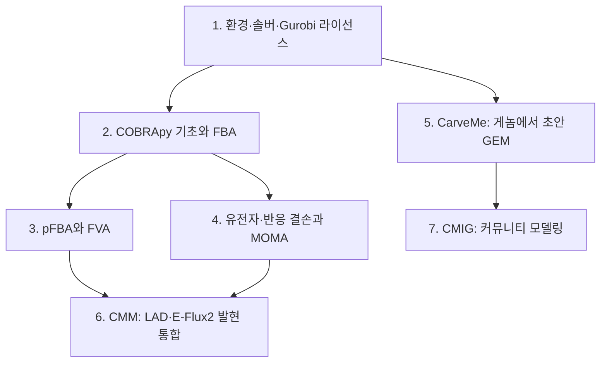

# Chapter 11. 실습 워크벤치: 설치부터 군집 모델링까지

이 장은 앞선 장에서 정의한 개념을 하나의 연속된 실습으로 재현합니다. 각 장에 이미 있는 `실습` 절은 그대로 두고, 이 장은 **환경 설치 → 범용 모델 분석 → 초안 재구축 → 발현 통합과 군집 모델링**으로 이어지는 도구 사용의 전체 흐름을 한곳에 모읍니다. 목표는 코드를 읽는 것이 아니라, 같은 명령을 직접 실행해 동일한 숫자와 그림을 얻는 것입니다.

## 학습 목표

이 장을 마치면 다음을 할 수 있습니다.

- 격리된 가상환경과 solver를 설치하고 COBRApy·GLPK·Gurobi의 버전을 재현 가능한 형태로 기록합니다(1절).
- `e_coli_core`를 적재해 FBA를 풀고, 교환 flux의 부호를 흡수·분비로 해석합니다(2절, [Chapter 4](../chapter-4/README.md)).
- pFBA와 FVA가 각각 답하는 질문을 구분하고, 최적면과 근최적 영역의 flux 폭을 비교합니다(3절, [Chapter 4](../chapter-4/README.md)).
- 같은 반응 결손을 FBA·선형 MOMA·QP MOMA로 계산하고, 세 방법의 상태 가정 차이를 비교합니다(4절, [Chapter 8](../chapter-8/README.md)).
- CarveMe로 게놈에서 초안 GEM을 생성하고, 자동 초안과 수동 큐레이션 모델의 규모·품질 차이를 비판적으로 평가합니다(5절, [Chapter 5](../chapter-5/README.md)).
- 같은 발현 증거에 E-Flux2와 LAD를 적용해 두 통합 방법이 서로 다른 flux를 예측하는 이유를 설명합니다(6절, [Chapter 6](../chapter-6/README.md)).
- MICOM 기반 군집 solve와 동적 FBA를 실행하고, 교차 급식을 주장하려면 어떤 추가 근거가 필요한지 판별합니다(7절, [Chapter 8](../chapter-8/README.md)).

## 이 장의 실행 환경

이 장의 모든 터미널 출력과 그림은 아래 환경에서 **실제로 실행한 결과**입니다. 모식도가 아니라 계산 결과이므로, 같은 버전을 맞추면 숫자가 재현됩니다.

| 항목 | 값 |
|:---|:---|
| OS | macOS (darwin) |
| Python | 3.10 |
| COBRApy | 0.30.0 |
| LP·MILP solver | GLPK(기본), Gurobi(선택, QP·대형 MILP) |
| 예제 모델 | BiGG `e_coli_core`(COBRApy `textbook`), BiGG `iML1515`, CarveMe 초안 |
| 그림 | matplotlib로 계산 결과를 직접 렌더한 PNG |

솔버·모델 릴리스가 바뀌면 숫자가 달라질 수 있으므로, 각 절은 모델 ID·버전, solver, 배지, 목적함수, 허용오차를 함께 기록합니다. flux는 항상 `mmol gDW⁻¹ h⁻¹` 단위의 반응 진행률로 해석합니다([Chapter 1](../chapter-1/README.md)).

## 장의 구성과 의존 흐름

*그림 11.1. 제11장 실습의 의존 흐름. 환경 준비(1)를 마친 뒤 범용 모델 분석(2–4)과 초안 재구축(5)이 갈라지고, 발현 통합(6)은 범용 모델 분석을, 군집 모델링(7)은 초안 재구축을 각각 이어받습니다. 화살표는 절 사이의 논리적 선행 관계이며 계산 결과가 아닙니다. 저자 제작 모식도이며 재구축–분석 워크플로의 개념 근거로 [Thiele & Palsson (2010)](https://doi.org/10.1038/nprot.2009.203)과 [Orth et al. (2010)](https://doi.org/10.1038/nbt.1614)을 인용합니다.*

- **1. 환경·솔버·Gurobi 라이선스** — 격리된 가상환경, COBRApy 설치, GLPK 확인, Gurobi 학술 라이선스 발급·활성화.
- **2. COBRApy 기초와 FBA** — 모델 적재, 정상상태 최적화, 교환 flux 해석([Chapter 4](../chapter-4/README.md)).
- **3. pFBA와 FVA** — 대안 최적해와 flux 범위, blocked 반응([Chapter 4](../chapter-4/README.md)).
- **4. 유전자·반응 결손과 MOMA** — 결손 예측과 MOMA의 조정 최소화 가정, production envelope([Chapter 8](../chapter-8/README.md)).
- **5. CarveMe** — 게놈 주석에서 top-down으로 초안 GEM을 만드는 자동 재구축([Chapter 5](../chapter-5/README.md)).
- **6. CMM** — 발현-제약 통합(LAD·E-Flux2)과 교란·생산·정상화 분석([Chapter 6](../chapter-6/README.md), [Chapter 8](../chapter-8/README.md)).
- **7. CMIG** — MICOM 기반 미생물 군집·숙주-미생물 상호작용 모델링([Chapter 8](../chapter-8/README.md) 9절).

이 장의 6–7절은 저자가 개발·공개한 도구([CMM](https://github.com/jyryu3161/CMM), [CMIG](https://github.com/jyryu3161/CMIG))를 실제로 실행한 결과입니다.

## 이 장을 읽는 법

각 절은 `실행 → 출력 → 해석`의 순서를 따릅니다. 코드 블록은 실제로 입력한 명령이고, 그 아래 회색 출력 블록은 그 명령이 실제로 낸 출력입니다. 숫자가 다르게 나오면 먼저 모델 버전과 solver, 배지 설정을 점검합니다. 개념의 근거가 필요할 때는 각 절이 가리키는 본문 장을 참조합니다.
