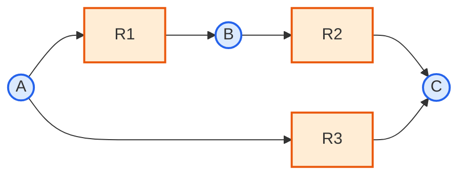

# Chapter 2. 생화학 반응과 대사 네트워크 표현

> 대사 네트워크를 이루는 반응과 대사물을 정의하고, 이를 하나의 거대한 화학량론 행렬(stoichiometric matrix, $$\mathbf{S}$$)로 압축하는 방법을 손으로 직접 계산하며 배웁니다. 이 행렬과 질량 보존·정상 상태 가정 $$\mathbf{S}\cdot\mathbf{v} = \mathbf{0}$$은 이후 모든 챕터([GEM 구조](chapter-3.-genome-scale-metabolic-model-gem.md), [FBA](chapter-4.-flux-balance-analysis-fba.md))가 딛고 서는 수학적 지반입니다.


행렬 곱, rank, null space가 처음이라면 [준비 학습 B: GEM을 읽기 위한 선형대수](supplements/linear-algebra.md)를 먼저 보십시오. 이 장의 계산과 Chapter 4의 자유도 해석을 연결해 줍니다.


## 이 장을 시작하며

[Chapter 1](chapter-1..md)에서 우리는 게놈 규모 대사 모델(genome-scale metabolic model, GEM)이 수천 개의 반응으로 이루어진 거대한 "지도"라는 것을 확인했습니다. *E. coli*의 core 모델만 해도 95개 반응, 최신 iML1515 모델은 2,712개 반응을 가지고 있습니다.

여기서 자연스러운 질문이 떠오릅니다.

> **잠깐, 생각해보기:** 종이 위에 그려진 수천 개의 화학 반응식 목록을, 컴퓨터가 1초 만에 계산할 수 있는 형태로 바꾸려면 어떻게 해야 할까요? 반응식을 문자열 그대로 저장해서 하나씩 읽어가며 계산하면 될까요?

문자열을 하나씩 파싱해서 계산하는 방식은 반응이 10개 정도일 때는 통하겠지만, 반응이 수천 개가 되는 순간 감당할 수 없습니다. 다행히 화학 반응식에는 우리가 이미 알고 있는 강력한 수학적 도구—**선형대수학(linear algebra)**—를 그대로 적용할 수 있는 구조가 숨어 있습니다. 바로 반응식이 "대사물의 개수를 세는 방정식"이라는 점입니다. 이 장에서는 이 관찰을 발전시켜, 대사 네트워크 전체를 **화학량론 행렬(stoichiometric matrix)** $$\mathbf{S}$$라는 단 하나의 행렬로 압축하는 방법을 배웁니다. 이 행렬이 갖춰지면 "세포가 정상적으로 살아있다"는 생물학적 사실조차 $$\mathbf{S}\mathbf{v} = \mathbf{0}$$이라는 간단한 선형 방정식으로 표현할 수 있게 됩니다.

이 장을 마치고 나면, 여러분은 대사 네트워크의 "언어"—반응·대사물·화학량론 행렬—를 자유롭게 읽고 쓸 수 있게 됩니다. 다만 아직 그 행렬에 "누가 이 반응을 수행하는가"(유전자·효소)와 "이 반응이 세포의 어디에서 일어나는가"(구획)에 대한 정보는 담기지 않은 상태입니다. 그 부분은 [Chapter 3](chapter-3.-genome-scale-metabolic-model-gem.md)에서 이어집니다.

---

## 학습 목표 (Learning Objectives)

이 챕터를 마치면 다음을 할 수 있습니다.

1. 반응(reaction)과 대사물(metabolite)이 가지는 속성과 이 둘의 관계, 그리고 그 뒤에 있는 효소(enzyme)의 역할을 설명할 수 있다.
2. 반응식 표기법과 방향성·가역성(reversibility)이 통량 하한/상한($$v^{lb}, v^{ub}$$)으로 수치화되는 원리를 이해한다.
3. 대사물 ID의 구획(compartment) 접미사 규칙을 읽고 해석할 수 있다.
4. **작은 장난감 네트워크를 손으로 직접 계산**하여 화학량론 행렬 $$\mathbf{S}$$를 구성하고, 실제 게놈 규모 모델에서 나타나는 희소성(sparsity)과 허브 대사물(hub metabolite)의 의미를 설명할 수 있다.
5. 대사 네트워크를 이분 그래프(bipartite graph)와 행렬이라는 두 가지 동등한 방식으로 표현할 수 있음을 이해한다.
6. 대사물 농도 변화식 $$d\mathbf{x}/dt = \mathbf{S}\mathbf{v}$$로부터 의사-정상 상태 가정(pseudo-steady-state assumption, PSSA)을 유도하고, 손으로 만든 장난감 네트워크에서 $$\mathbf{S}\mathbf{v} = \mathbf{0}$$을 직접 풀어 왜 이 시스템이 과소결정(underdetermined)인지, 왜 교환 반응이 없으면 아무 것도 흐를 수 없는지 설명할 수 있다.
7. COBRApy로 모델의 반응·대사물 객체와 $$\mathbf{S}$$ 행렬에 직접 접근하고, 희소성·계수(rank)·자유도를 실제 수치로 확인할 수 있다.

---

## 1. 대사 네트워크의 구성 요소: 반응과 대사물

세포 안에서 일어나는 수천 가지의 화학 변환을 컴퓨터가 다룰 수 있는 형태로 바꾸려면, 가장 먼저 그 변환의 "단어"에 해당하는 두 가지 개체 — **반응(reaction)**과 **대사물(metabolite)** — 를 명확히 정의해야 합니다. [Chapter 1](chapter-1..md)에서 살펴본 대사(metabolism)라는 거대한 현상은, 결국 이 두 개체가 관계 맺는 방식을 촘촘하게 기록한 목록으로 환원됩니다.

### 1.1 반응(Reaction)이란 무엇인가

**비유로 먼저 생각해 봅시다.** 반응(reaction)은 요리 레시피와 비슷합니다. 레시피는 "재료(기질) 얼마를 넣으면 요리(생성물) 얼마가 나온다"는 변환 규칙이고, 그 변환을 실제로 수행하는 것은 요리사(효소)입니다. 대사 네트워크의 "반응"도 똑같습니다 — 특정 대사물(기질, substrate)을 다른 대사물(생성물, product)로 바꾸는 규칙이며, 그 규칙을 실행하는 "요리사"가 바로 **효소(Enzyme)**입니다.

> **핵심 개념 · 용어(English):** **반응(Reaction)**은 대사 네트워크의 기본 변환 단위입니다. 하나의 반응은 하나 이상의 대사물(기질, substrate)을 다른 대사물(생성물, product)로 바꾸는 화학적 사건이며, 대부분의 경우 특정 **효소(Enzyme)**가 이를 촉매합니다.

효소는 다시 **유전자(Gene)**에 의해 인코딩되므로, "유전자 → 효소 → 반응"이라는 사슬이 성립합니다. 이 사슬을 불(Boolean) 논리로 공식화한 것이 **유전자-단백질-반응 연관(Gene-Protein-Reaction, GPR)**이며, AND(효소 복합체)와 OR(동위 효소, isozyme) 규칙의 상세한 파싱은 [Chapter 3](chapter-3.-genome-scale-metabolic-model-gem.md)에서 다룹니다. 이 챕터에서는 "반응에는 그것을 가능케 하는 효소와 유전자가 대응된다"는 관계 자체에만 집중합니다.

모델 안에서 각 반응 객체는 다음과 같은 속성을 가집니다.

| 속성 | 설명 | 예시 |
|:---|:---|:---|
| **ID** | 고유 식별자 | `GLCpts`, `PYK`, `CS` |
| **이름** | 사람이 읽을 수 있는 이름 | `Glucose-6-phosphate isomerase` |
| **화학량론** | 참여 대사물과 계수 | `G6P <=> F6P` |
| **하한 (lb, lower bound)** | 최소 통량 | −1000 (가역) 또는 0 (비가역) |
| **상한 (ub, upper bound)** | 최대 통량 | 1000 |
| **EC 번호** | 효소 위원회(Enzyme Commission) 분류 | `5.3.1.9` |
| **GPR 연관** | 촉매 효소를 인코딩하는 유전자 | `(pgi)` |
| **구획** | 반응이 일어나는 세포 내 위치 | `c` (cytosol) |

즉 반응은 화학량론(stoichiometry)·방향성(directionality)·통량 범위(flux bounds)·촉매 유전자(GPR)라는 네 가지 정보를 하나로 묶은 데이터 객체입니다. GEM에서 "반응을 안다"는 것은 이 네 가지를 모두 안다는 뜻입니다.

반응은 세포 내에서 수행하는 역할에 따라 다음과 같이 분류됩니다.

| 유형 | 설명 | 예시 |
|:---|:---|:---|
| **내부 반응(Internal reaction)** | 세포 내 대사 변환 | 해당과정(glycolysis), TCA 회로 |
| **교환 반응(Exchange reaction)** | 세포-환경 간 물질 교환 | 포도당 흡수, 아세테이트 분비 |
| **수송 반응(Transport reaction)** | 세포 구획 간 물질 이동 | 미토콘드리아-세포질 수송 |
| **생물량 반응(Biomass reaction)** | 세포 증식을 위한 전구체 소비 | `BIOMASS_Ecoli_core_w_GAM` |
| **유지 에너지 반응(Maintenance reaction)** | 비성장 관련 ATP 소비 | `ATPM` |

이 챕터의 초점은 **내부 반응의 화학량론적 표현**입니다. 교환·수송·생물량 반응의 생물학적 설계 원리(경계 조건, 목적함수 구성 등)는 [Chapter 3](chapter-3.-genome-scale-metabolic-model-gem.md)에서 자세히 다룹니다. 다만 이 반응들 역시 $$\mathbf{S}$$ 행렬 안에서는 내부 반응과 동일한 방식 — 하나의 열(column)로 — 표현된다는 점만 2.4절에서 미리 짚고 넘어갑니다.


💡 **팁:** 반응 ID(`GLCpts`, `PGI`, `PYK`...)는 대부분 효소나 경로 이름의 약어입니다. 처음에는 암호처럼 보이지만, BiGG(Biochemical, Genetic and Genomic knowledge base) 데이터베이스에서 ID를 검색하면 전체 이름과 화학량론을 바로 확인할 수 있습니다.


### 1.2 반응식 표기법과 방향성·가역성(Reversibility)

반응은 화학식 형태로 표기됩니다. 예를 들어 헥소키나제(Hexokinase, 여러 생물종의 해당과정 첫 단계를 촉매하는 잘 알려진 효소)가 촉매하는 반응은 다음과 같이 씁니다.

$$\text{ATP} + \text{Glucose} \rightarrow \text{ADP} + \text{Glucose-6-phosphate}$$

화살표의 형태가 곧 반응의 방향성을 나타냅니다. 일상적인 비유를 들자면, 반응의 화살표는 도로의 통행 방향 표지판과 같습니다.

- 단방향 화살표($$\rightarrow$$): **비가역 반응(Irreversible reaction)**. 일방통행로처럼 한 방향으로만 진행됩니다.
- 양방향 화살표($$\leftrightarrow$$ 또는 `<=>`): **가역 반응(Reversible reaction)**. 양방향 도로처럼 조건에 따라 정반응·역반응 모두 가능합니다.

이 방향성은 모델 안에서 통량 하한/상한 $$v^{lb} \leq v_j \leq v^{ub}$$ 값으로 코딩됩니다.

- **비가역 반응**: $$v_j^{lb} = 0$$ (예: $$0 \leq v_j \leq 1000$$)
- **가역 반응**: $$v_j^{lb} < 0 < v_j^{ub}$$ (예: $$-1000 \leq v_j \leq 1000$$)

즉 통량 $$v_j$$의 부호가 곧 반응이 진행되는 방향을 의미합니다. $$v_j > 0$$이면 화학량론식에 쓰인 방향(정반응), $$v_j < 0$$이면 반대 방향(역반응)으로 흐른다는 뜻입니다.

> **잠깐, 생각해보기:** 만약 어떤 반응의 하한과 상한이 둘 다 0이라면($$v^{lb}=v^{ub}=0$$) 어떤 의미일까요? 정답은 "이 반응은 강제로 꺼져 있다(차단, blocked)"는 뜻입니다. 특정 조건(예: 특정 유전자 결손)을 흉내 낼 때 실제로 이렇게 bound를 0으로 고정합니다. 이 기법은 [Chapter 8](chapter-8..md)의 유전자 결손 시뮬레이션에서 본격적으로 사용됩니다.

반응의 방향성은 임의로 정해지는 것이 아니라 **열역학(Thermodynamics)**에 근거합니다. 반응의 자발성은 실제 깁스 자유 에너지 변화로 결정됩니다.

$$\Delta_r G' = \Delta_r G'^{\circ} + RT \ln \left(\frac{\prod [\text{products}]}{\prod [\text{substrates}]}\right) < 0 \quad \text{(자발적 반응)}$$

정확한 $$\Delta_r G'$$ 값을 세포 내 모든 조건에서 알기는 어렵기 때문에, 실제 모델 구축에서는 다음과 같은 근사적 규칙을 사용합니다.

- $$\Delta_r G'^{\circ} \ll 0$$: 비가역 반응으로 모델링 ($$v_j \geq 0$$)
- $$\Delta_r G'^{\circ} \approx 0$$: 가역 반응으로 모델링 ($$v_j^{lb} < 0 < v_j^{ub}$$)


⚠️ **주의:** 이 챕터에서 다루는 반응 통량 부호와 하한/상한은 어디까지나 개별 반응의 화학량론적·열역학적 성질을 기술하는 정적인 속성입니다. 표준 FBA는 이 부호 제약 외에는 열역학을 명시적으로 고려하지 않기 때문에, 여러 가역 반응이 맞물려 순환하며 외부와 물질 교환 없이 ATP를 "공짜로" 만들어내는 것처럼 보이는 열역학 위반 순환(제3형 경로, Type-III pathway)이 수학적으로는 허용될 수 있습니다. 이를 막는 Loopless FBA 등의 확장 기법은 [Chapter 4](chapter-4.-flux-balance-analysis-fba.md)에서 다룹니다.


### 1.3 대사물(Metabolite)과 구획 표기 규칙

**대사물(Metabolite)**은 반응에서 생성되거나 소비되는 화학 종(chemical species)입니다. 포도당, ATP, 피루브산 등이 모두 대사물입니다. 모델 안에서 각 대사물 객체는 다음과 같은 속성을 가집니다.

| 속성 | 설명 | 예시 |
|:---|:---|:---|
| **ID** | 고유 식별자 | `glc__D`, `pyr`, `atp_c` |
| **이름** | 사람이 읽을 수 있는 이름 | `D-Glucose`, `Pyruvate` |
| **분자식** | 화학식 | `C6H12O6`, `C3H3O3` |
| **전하(Charge)** | 전하 상태 | 0, −1, −2, −3, −4 |
| **구획** | 존재하는 세포 내 위치 | `c`, `e`, `m` |
| **KEGG ID** | KEGG 데이터베이스 식별자 | `C00031` |
| **ChEBI ID** | ChEBI 데이터베이스 식별자 | `CHEBI:4167` |

**비유로 생각해 봅시다.** 같은 사람이라도 회사 건물 안에 있을 때와 집에 있을 때는 서로 다른 출입 카드가 필요하고, 할 수 있는 일(회의 참여 vs. 휴식)도 다릅니다. 대사물도 마찬가지입니다 — 같은 화학종이라도 세포 내 위치(구획, compartment)가 다르면 서로 다른 대사물 객체로 취급됩니다. 세포질의 피루브산(`pyr_c`)과 미토콘드리아의 피루브산(`pyr_m`)은 화학적으로 완전히 동일한 분자이지만, 모델에서는 별개의 노드이며 그 사이를 잇는 수송 반응(transport reaction)이 별도로 존재해야 두 위치를 오갈 수 있습니다. 이를 위해 대사물 ID는 관용적으로 구획을 나타내는 접미사를 붙입니다.

| 접미사 | 구획 (English) |
|:---:|:---|
| `_c` | cytosol (세포질) |
| `_e` | extracellular (세포외) |
| `_m` | mitochondria (미토콘드리아) |
| `_p` | periplasm (주막) |
| `_n` | nucleus (핵) |
| `_r` | endoplasmic reticulum (소포체) |
| `_g` | Golgi apparatus (골지체) |
| `_l` | lysosome (리소좀) |
| `_x` | peroxisome (퍼옥시좀) |

> **핵심 개념 · 용어(English):** **구획화(Compartmentalization)**는 같은 분자라도 위치가 다르면 다른 노드로 표현한다는 규칙입니다. 이 규칙이 왜 필요한지, 그리고 원핵생물(3개 구획)과 진핵생물(8개 이상의 구획)의 구조적 차이는 [Chapter 3](chapter-3.-genome-scale-metabolic-model-gem.md)에서 자세히 다룹니다. 여기서는 대사물 ID를 읽는 표기 규칙만 익혀 둡니다.


❓ **흔한 오해:** "`glc__D_c`와 `glc__D_e`는 결국 같은 포도당 아닌가요? 왜 굳이 나눠서 세나요?" — 화학적으로는 같은 분자가 맞습니다. 하지만 계산 모델에서 중요한 것은 화학종 자체가 아니라 **그 분자가 관여하는 반응의 집합이 위치에 따라 다르다는 사실**입니다. 세포외 포도당은 교환 반응·수송 반응에만 관여하고, 세포질 포도당은 해당과정 반응들에 관여합니다. 이 둘을 하나로 합치면 "세포 밖의 포도당 농도가 줄면 해당과정이 즉시 느려진다"는 잘못된 관계가 생겨버립니다. 구획을 나누는 것은 대사물의 화학적 정체성이 아니라 **반응 참여 관계**를 정확히 기록하기 위함입니다.


---

## 2. 화학량론 행렬(Stoichiometric Matrix, S)

반응과 대사물이라는 두 종류의 개체, 그리고 그 사이의 화학량론적 관계를 게놈 규모로 확장하면 반응 수는 수천, 대사물 수는 수천에 이릅니다. 이 방대한 관계망을 다루기 위한 핵심 데이터 구조가 바로 **화학량론 행렬(Stoichiometric Matrix)** $$\mathbf{S}$$입니다. 이는 모든 게놈 규모 대사 모델(GEM)의 중심에 있는 단일 객체이며, 이후 배울 [FBA](chapter-4.-flux-balance-analysis-fba.md)의 모든 계산이 이 행렬 위에서 이루어집니다.

### 2.1 왜 행렬이 필요한가

앞서 던진 질문으로 돌아가 봅시다 — 반응식을 수천 개 늘어놓은 목록을 어떻게 계산 가능한 형태로 바꿀까요? 관찰해야 할 핵심은 이것입니다. 모든 반응식은 결국 "어떤 대사물을 몇 개 소비하고, 어떤 대사물을 몇 개 생성하는가"라는 **숫자(계수)의 나열**에 불과합니다. 그렇다면 "대사물 목록"을 행(row)으로, "반응 목록"을 열(column)로 놓고, 각 칸에 해당 계수를 채워 넣으면 어떨까요? 이렇게 하면 수천 개의 반응식이 단 하나의 행렬로 압축되고, 이후의 모든 계산(질량 보존 확인, 최적화 등)은 문자열 파싱이 아니라 **행렬 곱셈**이라는 우리에게 익숙한 선형대수 연산으로 바뀝니다. 이것이 화학량론 행렬을 도입하는 근본적인 이유입니다.

### 2.2 S 행렬의 정의

$$m$$개 대사물과 $$n$$개 반응으로 구성된 네트워크가 있다고 합시다. 화학량론 행렬 $$\mathbf{S} \in \mathbb{R}^{m \times n}$$은 각 반응에서 각 대사물의 화학량론적 계수를 다음과 같이 인코딩합니다.

$$S_{ij} = \begin{cases} +p & \text{대사물 } i \text{가 반응 } j \text{에서 } p \text{분자 생성됨} \\ -c & \text{대사물 } i \text{가 반응 } j \text{에서 } c \text{분자 소비됨} \\ 0 & \text{대사물 } i \text{가 반응 } j \text{에 참여하지 않음} \end{cases}$$

즉 각 열(column) $$\mathbf{S}_{\cdot j}$$은 반응 $$j$$ 하나에 대응하고, 각 행(row) $$\mathbf{S}_{i \cdot}$$은 대사물 $$i$$ 하나에 대응합니다. 반응식을 "행렬의 한 열"로 옮겨 적는 연습을 헥소키나제 예시로 해봅니다.

$$\text{ATP} + \text{Glucose} \rightarrow \text{ADP} + \text{Glucose-6-phosphate}$$

이 반응은 $$\mathbf{S}$$의 한 열에 다음과 같은 항목을 기여합니다.

| 대사물 | 화학량론 계수 ($$S_{ij}$$) | 의미 |
|:---|:---:|:---|
| ATP | −1 | 1분자 소비 |
| Glucose | −1 | 1분자 소비 |
| ADP | +1 | 1분자 생성 |
| Glucose-6-phosphate | +1 | 1분자 생성 |
| 기타 모든 대사물 | 0 | 참여하지 않음 |

게놈 규모 재구축에서는 이 과정을 모든 반응에 대해 반복하여 하나의 거대한 행렬을 만듭니다. 대부분의 반응은 소수(보통 2~4개)의 대사물만 관여하므로, 전체 대사물 목록을 기준으로 보면 각 열에서 0이 아닌 항목은 극소수입니다. 그 결과 $$\mathbf{S}$$는 매우 **희소한(sparse) 행렬**이 됩니다. 이 희소 패턴 자체가 생물학적 정보를 담고 있다는 점은 2.4절에서 다시 다룹니다.


💡 **팁:** 화학량론 계수가 항상 $$\pm 1$$인 것은 아닙니다. 예를 들어 $$2\,\text{A} \rightarrow \text{B}$$라는 반응이 있다면, A의 계수는 $$-2$$, B의 계수는 $$+1$$입니다. 대사물이 실제로 "몇 개 단위로" 소비·생성되는지를 반드시 반응식 그대로 옮겨야 합니다.


### 2.3 손으로 직접 만들어보기: 장난감 네트워크의 S 행렬

지금까지 이야기한 규칙을 실제로 손으로 적용해 봅시다. 이 절의 목표는 "S 행렬은 어떻게 만드는가"라는 질문에 여러분이 종이와 연필만으로 답할 수 있게 되는 것입니다.

**Step 1 — 네트워크 정의.** 3개 반응과 3개 대사물로 이루어진 아주 작은 네트워크를 생각해 봅시다.

- $$R_1: A \rightarrow B$$ (A를 B로 전환)
- $$R_2: B \rightarrow C$$ (B를 C로 전환)
- $$R_3: A \rightarrow C$$ (A를 C로 직접 전환)

**Step 2 — 행과 열의 뼈대 만들기.** 대사물 $$\{A, B, C\}$$를 행으로, 반응 $$\{R_1, R_2, R_3\}$$을 열로 놓으면, 아직 숫자가 채워지지 않은 $$3 \times 3$$ 크기의 빈 표가 생깁니다.

| | $$R_1$$ | $$R_2$$ | $$R_3$$ |
|:---:|:---:|:---:|:---:|
| **A** | ? | ? | ? |
| **B** | ? | ? | ? |
| **C** | ? | ? | ? |

**Step 3 — 반응을 하나씩 읽으며 열을 채우기.** $$R_1: A \rightarrow B$$부터 봅시다. A는 소비되므로 $$-1$$, B는 생성되므로 $$+1$$, C는 참여하지 않으므로 $$0$$입니다. 같은 방식으로 $$R_2$$, $$R_3$$ 열을 채우면 다음 화학량론 행렬을 얻습니다.

$$\mathbf{S} = \begin{bmatrix} -1 & 0 & -1 \\ +1 & -1 & 0 \\ 0 & +1 & +1 \end{bmatrix}$$

**Step 4 — 검산.** 각 항목을 반응식과 하나씩 대조해 봅시다.

- $$S_{11} = -1$$: $$R_1$$에서 A가 1분자 소비 ✓
- $$S_{21} = +1$$: $$R_1$$에서 B가 1분자 생성 ✓
- $$S_{22} = -1$$: $$R_2$$에서 B가 1분자 소비 ✓
- $$S_{32} = +1$$: $$R_2$$에서 C가 1분자 생성 ✓
- $$S_{13} = -1$$, $$S_{33} = +1$$: $$R_3$$에서 A가 소비되고 C가 생성 ✓

D라는 네 번째 대사물이 있지만 세 반응 어디에도 관여하지 않는다면, $$\mathbf{S}$$에 4번째 행이 추가되고 그 값은 모두 0이 됩니다. 이처럼 "참여하지 않음 = 0"이라는 규칙이 대규모 희소 행렬을 만드는 근본 원인입니다.

> **잠깐, 생각해보기:** 만약 $$R_2$$가 가역 반응 $$B \leftrightarrow C$$였다면 $$\mathbf{S}$$의 숫자 자체(2번째 열)는 바뀔까요? 답은 "아니오"입니다. 화학량론 계수는 반응식의 좌변/우변 배치로 결정되며, 가역성은 $$\mathbf{S}$$가 아니라 그 반응의 하한 $$v^{lb}$$가 음수인지 여부(1.2절)로 결정됩니다. $$\mathbf{S}$$는 "무엇이 무엇으로 바뀌는가"만 담고, "어느 방향으로 갈 수 있는가"는 별도의 bound 벡터가 담당합니다.

이 장난감 네트워크는 이 장 전체에서 계속 재사용됩니다. 4장에서는 바로 이 $$\mathbf{S}$$를 가지고 $$\mathbf{S}\mathbf{v}=\mathbf{0}$$을 손으로 직접 풀어 볼 것입니다.

### 2.4 실제 GEM에서 S 행렬의 규모와 희소성(Sparsity)

실제 게놈 규모 모델에서 $$\mathbf{S}$$의 크기는 다음과 같습니다.

| 모델 | 대사물 수 ($$m$$) | 반응 수 ($$n$$) | 비영 요소 비율 | $$n - m$$ (자유도, 참고용) |
|:---|---:|---:|---:|---:|
| *E. coli* core model | 72 | 95 | **5.26%** (실습에서 직접 계산) | 23 |
| *E. coli* iML1515 | 1,877 | 2,712 | ~0.3%(추정) | 835 |
| *S. cerevisiae* Yeast8 | ~1,400 | ~1,700 | ~0.2%(추정) | ~300 |
| *H. sapiens* Recon3D[^recon3d] | 4,140 | 13,543 | ~0.05%(추정) | 9,403 |

[^recon3d]: Recon3D 논문은 전체 reconstruction(반응 13,543개, 유전자/ORF 3,288개, unique 대사물 4,140개)과 그 안의 flux·stoichiometrically consistent model subset(반응 10,600개, 구획화 대사물 5,835개)을 함께 보고합니다. 두 수치는 단순한 논문판–데이터베이스판 차이가 아니라 세는 대상이 다릅니다. 이 표는 전체 reconstruction 수치를 사용합니다.

이 표에서 두 가지를 눈여겨봐야 합니다.

1. **희소성은 모델이 커질수록 심해집니다.** 대사물·반응 수가 늘어나도 하나의 반응이 관여하는 대사물 수는 여전히 소수에 머물기 때문에, 비영 요소 비율은 오히려 감소합니다. *E. coli* core 모델(72×95)의 비영 비율 5.26%는 실습에서 COBRApy로 직접 계산해 확인합니다.
2. **모든 경우에서 $$n > m$$입니다.** 반응(미지수) 수가 대사물(방정식) 수보다 많다는 뜻이며, 이는 4.3절에서 다룰 "정상 상태 제약이 왜 무한히 많은 해를 허용하는가"의 출발점이 됩니다. (다만 4.4절에서 보듯, 진짜 자유도는 $$n-m$$이 아니라 $$n-r$$이며 $$r$$은 $$\mathbf{S}$$의 계수(rank)입니다 — 이 구분은 뒤에서 매우 중요해집니다.)

**희소성의 이면 — 허브 대사물(Hub Metabolites):** $$\mathbf{S}$$의 대부분의 행(대사물)은 소수의 반응에만 관여하지만, ATP, NADH, H$$_2$$O, H$$^+$$ 같은 소수의 **허브 대사물**은 예외적으로 수백 개의 반응에 나타나며 네트워크의 연결 중심점 역할을 합니다. 예를 들어 iML1515 규모의 네트워크 위상(topology) 분석에서 ATP는 300개 이상의 반응에 참여하는 것으로 보고되며, 이런 허브 대사물이 제거되면 네트워크 대부분이 기능하지 않게 됩니다. 이런 비균질한 연결 분포는 대사 네트워크가 무작위 네트워크가 아니라 **스케일-프리(scale-free) 특성**(연결 정도, degree의 분포가 멱법칙을 따름)을 가짐을 보여주며, 임의의 두 대사물 사이 평균 최단 경로가 짧게 유지되는 **좁은 세상(small-world) 특성**과 함께 나타납니다. 네트워크의 전반적 연결 밀도는 다음과 같이 정량화할 수 있습니다.

$$\text{Density} = \frac{2 \times |E|}{|V| \times (|V| - 1)}$$

여기서 $$|E|$$는 반응 수(엣지), $$|V|$$는 대사물 수(노드)입니다. 이 값 자체는 작지만(예: 0.003 수준), 무작위 네트워크와 달리 소수의 허브에 연결이 집중된 비균질한 분포 위에서 나타난다는 점이 생물학적으로 중요합니다 — 이는 유전적 교란에 대한 **강건성(robustness)**과 허브 손상에 대한 **선택적 취약성(selective vulnerability)**이 공존하는 구조입니다.


💡 **팁:** 허브 대사물의 개념을 직관적으로 이해하려면 공항 네트워크를 떠올려 보세요. 대부분의 지방 공항(비허브 대사물)은 몇 개의 노선만 가지지만, 인천·나리타 같은 허브 공항(허브 대사물)은 수백 개의 노선이 몰려 있습니다. 지방 공항 하나가 문을 닫아도 전체 항공망은 크게 흔들리지 않지만, 허브 공항이 마비되면 네트워크 전체가 타격을 입습니다. ATP나 NADH도 대사 네트워크의 "허브 공항"입니다.


### 2.5 교환 반응(Exchange Reaction)의 표현

교환 반응은 세포와 환경 사이의 물질 흐름을 나타내는 **의사-반응(Pseudo-reaction)**입니다. 다른 반응과 마찬가지로 $$\mathbf{S}$$의 한 열로 표현되지만, 구조가 훨씬 단순합니다 — 단 하나의 대사물만 관여하며 계수는 항상 $$\pm 1$$입니다.

- 포도당 입력: $$\text{GLC}_{ext} \rightarrow \emptyset$$ (열에서 $$-1$$ 하나만 존재; 세포 밖으로 "사라지는" 것으로 표현되지만 실제로는 세포 안으로 흡수됨을 의미)
- 아세테이트 출력: $$\emptyset \rightarrow \text{ACE}_{ext}$$ (열에서 $$+1$$ 하나만 존재)

이 표현 방식은 실제 COBRApy 모델에서 그대로 확인할 수 있습니다. 예를 들어 *E. coli* core 모델의 포도당 교환 반응 `EX_glc__D_e`는 `glc__D_e <=>`로 쓰여 있고, 세포외 포도당(`glc__D_e`) 딱 하나에 대해서만 계수 $$-1$$을 가집니다.

세포 밖 환경(배지)은 통상 매우 크거나(플라스크 안의 배양액) 사실상 무한한 저장고로 취급되므로, 교환 반응이 마주하는 세포외 대사물 풀은 실질적으로 누적되거나 고갈되는 효과가 없다고 간주합니다. 반면 내부 대사물은 뒤에서 다룰 정상 상태 제약 $$\mathbf{S}\mathbf{v} = \mathbf{0}$$이 실질적인 구속력을 갖습니다 — 내부 대사물의 생산과 소비는 네트워크 안의 다른 반응들에 의해서만 결정되기 때문입니다. 교환 반응의 생물학적 설계(배지 조성 설정, 경계 조건)와 생물량 반응의 구성은 [Chapter 3](chapter-3.-genome-scale-metabolic-model-gem.md)에서 자세히 다룹니다.

---

## 3. 대사 네트워크의 그래프 표현: 이분 그래프(Bipartite Graph)

지금까지 $$\mathbf{S}$$라는 **행렬** 관점에서 네트워크를 봤다면, 같은 정보를 **그래프(graph)**로도 표현할 수 있습니다. 두 표현은 서로 동등하며, 다루려는 문제에 따라 더 편한 쪽을 선택하면 됩니다.

대사 네트워크는 본질적으로 **이분 그래프(Bipartite Graph)**입니다. 즉 노드(node)가 대사물과 반응이라는 두 개의 서로 다른 집합으로 나뉘고, 간선(edge)은 항상 서로 다른 집합 사이에만 존재합니다 — 대사물과 대사물이 직접 연결되거나 반응과 반응이 직접 연결되는 경우는 없습니다.

**비유로 생각해 봅시다.** 이분 그래프는 학생-과목 등록 시스템과 비슷합니다. 학생(대사물)은 과목(반응)에 등록할 수 있지만, 학생끼리 직접 연결되지는 않습니다(같은 과목을 듣는 두 학생이 그래프상 직접 이어지지 않는 것처럼). 대사물도 마찬가지로, 두 대사물이 "직접" 연결되는 일은 없고 항상 반응이라는 매개체를 통해서만 이어집니다.

앞서 2.3절에서 손으로 만든 장난감 네트워크($$R_1: A\to B$$, $$R_2: B\to C$$, $$R_3: A\to C$$)를 이분 그래프로 그리면 다음과 같습니다. 원은 대사물, 사각형은 반응이며 화살표 방향은 소비와 생성을 구분합니다.



이 그림을 바로 위의 행렬과 함께 읽어보십시오. 예를 들어 `A → R1`은 $$S_{A,R_1}<0$$, `R1 → B`는 $$S_{B,R_1}>0$$이고, A와 R2 사이에 선이 없다는 것은 $$S_{A,R_2}=0$$입니다. 즉 시각적 연결 하나가 $$\mathbf S$$의 비영 원소 하나에 대응합니다.

- 대사물 노드에서 반응 노드로 향하는 간선: 그 대사물이 해당 반응의 **기질(substrate)**임을 의미 ($$S_{ij} < 0$$)
- 반응 노드에서 대사물 노드로 향하는 간선: 그 대사물이 해당 반응의 **생성물(product)**임을 의미 ($$S_{ij} > 0$$)

이 그림과 $$\mathbf{S}$$ 행렬은 정확히 같은 정보를 담고 있습니다. $$\mathbf{S}$$의 $$(i,j)$$번째 항목이 0이 아니라는 것은, 이분 그래프에서 대사물 노드 $$i$$와 반응 노드 $$j$$ 사이에 간선이 존재한다는 것과 완전히 동일한 진술입니다. 즉 $$\mathbf{S}$$는 이분 그래프의 **부호화된 인접 행렬(signed incidence matrix)**로 볼 수 있습니다.

| 관점 | 표현 방식 | 강점 |
|:---|:---|:---|
| **그래프(Graph)** | 대사물 노드·반응 노드·간선 | 연결성·경로·허브·모듈 구조 등 네트워크 위상(topology) 분석에 직관적 |
| **행렬(Matrix)** | $$\mathbf{S} \in \mathbb{R}^{m \times n}$$ | 선형대수 연산(계수, 영공간 등)과 최적화(LP) 정식화에 필수 |

2.4절에서 살펴본 스케일-프리 특성(허브 대사물), 좁은 세상 특성, 계층적 모듈성(hierarchical modularity) — 즉 탄수화물·아미노산·지질·뉴클레오타이드 대사 등 기능별로 반응들이 뭉쳐 있는 성질 — 은 모두 이 이분 그래프 관점에서 자연스럽게 정의되는 개념입니다. 반면 다음 절에서 다룰 질량 보존이나, [Chapter 4](chapter-4.-flux-balance-analysis-fba.md)에서 다룰 선형 계획법(LP) 정식화는 그래프가 아니라 행렬 $$\mathbf{S}$$ 위에서 이루어지는 연산입니다. 두 표현은 서로 대체재가 아니라, 같은 대상을 보는 두 개의 렌즈입니다.

> **잠깐, 생각해보기:** ATP처럼 수백 개 반응에 관여하는 허브 대사물을 이분 그래프로 그리면 어떤 모습일까요? 노드 하나(ATP)에서 수백 개의 간선이 사방으로 뻗어나가는 "별 모양(star)" 구조가 될 것입니다. 이것이 바로 $$\mathbf{S}$$ 행렬에서 ATP에 해당하는 행이 대부분의 열에서 비영(nonzero) 값을 가진다는 사실의 그래프적 표현입니다.

---

## 4. 질량 보존과 정상 상태 가정: $$\mathbf{S}\cdot\mathbf{v} = \mathbf{0}$$

### 4.1 대사물 농도의 시간 변화

대사물 농도 벡터 $$\mathbf{x} \in \mathbb{R}^m_{\geq 0}$$의 시간에 따른 변화는 상미분 방정식으로 지배됩니다.

$$\frac{d\mathbf{x}}{dt} = \mathbf{S} \cdot \mathbf{v}(\mathbf{x}, t)$$

여기서 $$\mathbf{v} \in \mathbb{R}^n$$은 반응 통량(flux) 벡터입니다. $$\mathbf{S} \cdot \mathbf{v}$$의 $$i$$번째 성분은 대사물 $$i$$가 순생산(양수)되는지 순소비(음수)되는지를 정확히 알려줍니다 — 이는 화학량론 행렬을 정의하는 방식 그대로, 모든 반응이 대사물 $$i$$에 기여하는 정도를 통량으로 가중합한 값이기 때문입니다.

### 4.2 의사-정상 상태 가정(Pseudo-Steady-State Assumption, PSSA)

[FBA](chapter-4.-flux-balance-analysis-fba.md)를 비롯한 제약 기반 모델링 전체는 **의사-정상 상태 가정(PSSA)**을 도입합니다.

$$\frac{d\mathbf{x}}{dt} = \mathbf{0} \quad \Longrightarrow \quad \mathbf{S} \cdot \mathbf{v} = \mathbf{0}$$

> **핵심 개념 · 용어(English):** 이 가정은 "대사가 멈춰 있다"는 뜻이 **아닙니다**. 내부 대사물 풀은 관심 시간 척도(보통 수 초~수 분)에서 누적되거나 고갈되지 않는다는 뜻입니다. 대사물은 끊임없이 상호 전환되지만, 각 대사물에 대해 **생성 속도 = 소비 속도**가 성립하여 순 변화가 0이 됩니다.

**생활 속 비유**: 물이 수도꼭지로 계속 들어오면서 동시에 배수구로 계속 나가는 욕조를 생각해 보세요. 물은 끊임없이 흐르고 있지만, 욕조 안의 물 높이(농도)는 일정하게 유지됩니다. 이것이 바로 정상 상태(steady state)입니다 — 흐름이 없는 것이 아니라, 유입과 유출이 정확히 균형을 이루는 상태입니다.

**생물학적 근거**: 세포 내 대사물의 회전 시간(turnover time)은 일반적으로 수 초에서 수 분입니다(예: ATP의 세포 내 반감기는 약 1초). 반면 세포 성장과 같은 생리학적 과정은 수 시간에서 수 일의 시간 척도를 가집니다. 이처럼 시간 척도가 몇 자릿수 차이가 나기 때문에, 성장이라는 느린 과정을 모델링할 때는 대사 네트워크가 그보다 훨씬 빠르게 "즉각적으로" 평형에 도달한다고 가정할 수 있습니다.


❓ **흔한 오해:** "정상 상태 = 세포가 아무것도 안 하고 있다"라고 오해하기 쉽습니다. 사실은 정반대입니다. 정상 상태에서도 통량 $$v_j$$는 대부분 0이 아닌 값을 가지며, 물질은 네트워크를 통해 계속 빠르게 흘러갑니다. "정상"이라는 말은 흐름의 **크기**가 아니라 각 대사물 **농도의 순 변화율**이 0이라는 뜻입니다.


### 4.3 장난감 네트워크로 직접 풀어보는 $$\mathbf{S}\mathbf{v} = \mathbf{0}$$

이제 2.3절의 장난감 네트워크로 돌아가, $$\mathbf{S}\mathbf{v}=\mathbf{0}$$을 실제로 손으로 풀어 봅니다. 이 절의 핵심 메시지는 두 가지입니다 — (1) 출입구가 없는 "닫힌" 네트워크는 정상 상태에서 아무 것도 흐를 수 없다는 것, (2) 출입구(교환 반응)를 열어주면 비로소 무한히 많은 정상 상태 해가 나타난다는 것입니다.

**(A) 닫힌 네트워크 — 아무 것도 흐르지 않는다.**

2.3절의 $$\mathbf{S}$$를 그대로 사용해 $$\mathbf{S}\mathbf{v}=\mathbf{0}$$을 성분별로 풀어 써 봅시다.

$$\mathbf{S}\mathbf{v} = \begin{bmatrix} -1 & 0 & -1 \\ +1 & -1 & 0 \\ 0 & +1 & +1 \end{bmatrix}\begin{bmatrix} v_1 \\ v_2 \\ v_3 \end{bmatrix} = \begin{bmatrix} 0 \\ 0 \\ 0 \end{bmatrix}$$

행(대사물)마다 하나씩 방정식을 세우면:

- 대사물 A: $$-v_1 - v_3 = 0 \;\Rightarrow\; v_3 = -v_1$$
- 대사물 B: $$v_1 - v_2 = 0 \;\Rightarrow\; v_2 = v_1$$
- 대사물 C: $$v_2 + v_3 = 0 \;\Rightarrow\; v_1 + (-v_1) = 0$$ (항상 참 — 새로운 정보 없음)

세 번째 방정식이 앞의 두 식으로부터 자동으로 성립한다는 것은, 이 세 방정식이 서로 독립적이지 않다는 뜻입니다(즉 $$\mathbf{S}$$의 계수 $$r=2$$이며 $$m=3$$보다 작습니다 — 4.4절에서 이 현상을 공식적으로 다룹니다). 어쨌든 이 결과로부터 모든 정상 상태 해는 $$v_2 = v_1$$, $$v_3=-v_1$$ 형태, 즉 $$v_1$$ 하나의 값만 정하면 나머지가 자동으로 정해지는 1차원 해 집합임을 알 수 있습니다.

그런데 이 네트워크의 세 반응은 모두 **비가역**($$R_1, R_2, R_3$$ 모두 단방향 화살표)이므로 $$v_1, v_2, v_3 \geq 0$$이어야 합니다. $$v_3=-v_1$$이 0 이상이려면 $$v_1 \leq 0$$이어야 하는데, $$v_1 \geq 0$$도 동시에 만족해야 하므로 유일하게 가능한 값은 $$v_1 = v_2 = v_3 = 0$$뿐입니다.

> **결론**: 출입구(교환 반응)가 없는 닫힌 네트워크는 정상 상태에서 오직 "아무 것도 흐르지 않는다"는 해만 허용합니다. 이는 당연한 결과이기도 합니다 — A를 계속 B나 C로 바꾸기만 하고 아무 데도 내보낼 수 없다면, C는 끝없이 쌓여야 하는데 그러면 애초에 정상 상태(농도 불변)가 성립할 수 없기 때문입니다.

**(B) 열린 네트워크 — 출입구를 열어주면 무한히 많은 해가 나타난다.**

이제 이 네트워크에 현실적인 "숨구멍"을 뚫어 봅시다. A가 외부에서 흡수되는 교환 반응 $$R_0: \emptyset \rightarrow A$$와, C가 외부로 분비되는 교환 반응 $$R_4: C \rightarrow \emptyset$$를 추가합니다. 이제 $$n=5$$개 반응, $$m=3$$개 대사물(A, B, C는 여전히 내부 대사물로서 질량 보존의 대상)이 됩니다.

$$\mathbf{S} = \begin{bmatrix} +1 & -1 & 0 & -1 & 0 \\ 0 & +1 & -1 & 0 & 0 \\ 0 & 0 & +1 & +1 & -1 \end{bmatrix} \quad (\text{열 순서: } R_0, R_1, R_2, R_3, R_4)$$

같은 방식으로 $$\mathbf{S}\mathbf{v}=\mathbf{0}$$을 행별로 풀어 봅니다.

- 대사물 A: $$v_0 - v_1 - v_3 = 0 \;\Rightarrow\; v_0 = v_1 + v_3$$
- 대사물 B: $$v_1 - v_2 = 0 \;\Rightarrow\; v_2 = v_1$$
- 대사물 C: $$v_2 + v_3 - v_4 = 0 \;\Rightarrow\; v_4 = v_2 + v_3 = v_1 + v_3$$

이번에는 세 방정식이 서로 독립적입니다($$\text{rank} = 3 = m$$). $$v_1$$과 $$v_3$$을 자유롭게 고르면(둘 다 0 이상인 임의의 값), 나머지 $$v_0, v_2, v_4$$가 자동으로 결정됩니다. 즉 **2개의 자유도**($$n - r = 5 - 3 = 2$$)를 가진 무한한 해 집합이 생깁니다.

숫자를 직접 대입해 검산해 봅시다. $$v_1 = 3$$, $$v_3 = 5$$ (단위: mmol·gDW$$^{-1}$$·h$$^{-1}$$)로 고르면:

| 반응 | $$v_0$$ (A 흡수) | $$v_1$$ ($$A\to B$$) | $$v_2$$ ($$B\to C$$) | $$v_3$$ ($$A\to C$$) | $$v_4$$ (C 분비) |
|:---:|:---:|:---:|:---:|:---:|:---:|
| 통량 | 8 | 3 | 3 | 5 | 8 |

검산: 대사물 A는 $$v_0 - v_1 - v_3 = 8 - 3 - 5 = 0$$ ✓, 대사물 B는 $$v_1 - v_2 = 3-3=0$$ ✓, 대사물 C는 $$v_2+v_3-v_4 = 3+5-8=0$$ ✓. 세 대사물 모두 "생성 속도 = 소비 속도"가 정확히 맞아떨어집니다.

이 예시에서 $$v_1=3$$은 "A → B → C"라는 경로(우회로)를, $$v_3=5$$는 "A → C" 직행 경로를 나타냅니다. 두 경로의 비율을 어떻게 조합해도(둘 다 0 이상이기만 하면) $$\mathbf{S}\mathbf{v}=\mathbf{0}$$을 만족하는 정상 상태가 됩니다 — 이것이 바로 4.4절과 4.5절에서 다룰 "대사 네트워크의 중복 경로"라는 추상적 개념을, 숫자로 직접 확인한 것입니다.

> **잠깐, 생각해보기:** 위 표에서 $$v_1=0, v_3=10$$으로 바꾸면 어떻게 될까요? 직접 계산해 보세요. ($$v_0=10, v_2=0, v_4=10$$이 되며, 이는 "우회로를 전혀 쓰지 않고 A→C 직행로만 사용하는" 극단적인 정상 상태입니다. 이렇게 두 극단 사이의 모든 조합이 전부 유효한 정상 상태입니다.)

### 4.4 실제 GEM에서의 자유도: $$n-m$$과 $$n-r$$의 차이

실제 게놈 규모 모델에서도 지금 손으로 확인한 것과 똑같은 논리가 적용됩니다. iML1515 모델을 예로 들면 $$m = 1{,}877$$, $$n = 2{,}712$$이므로:

$$\text{방정식 수} = 1{,}877 < 2{,}712 = \text{미지수 수}$$

즉 $$2{,}712 - 1{,}877 = 835$$개의 여유가 언뜻 계산됩니다. 그런데 4.3절의 (A) 예시에서 보았듯, $$\mathbf{S}$$의 행(방정식)들이 서로 완전히 독립적이지 않을 수 있습니다(닫힌 네트워크 예시에서 3개 방정식 중 2개만 독립적이었던 것을 기억하세요). 이 독립적인 방정식의 개수가 바로 $$\mathbf{S}$$의 **계수(rank)** $$r$$입니다. 따라서 진짜 자유도는 $$n-m$$이 아니라 $$n-r$$이며, 일반적으로 $$r \leq m$$이므로 $$n - r \geq n - m$$입니다 — 즉 naive하게 계산한 $$n-m$$은 실제 자유도의 **하한(최솟값)**에 불과합니다.

이 관계는 *E. coli* core 모델에서 실제로 확인할 수 있습니다. 실습에서 COBRApy로 직접 계산해 보면 $$m=72$$, $$n=95$$인데 실제 계수는 $$r=67$$입니다. 즉 naive한 자유도는 $$n-m=23$$이지만, 진짜 정상 상태 통량 공간의 차원(영공간의 차원)은 $$n-r=95-67=28$$로 더 큽니다. 이 차이($$m-r=72-67=5$$)가 무엇을 의미하는지는 4.6절에서 설명합니다.

**생물학적 해석**: 대사 네트워크에는 같은 목적지로 가는 중복 경로가 존재합니다. 4.3절 (B)의 장난감 예시에서 A에서 C로 가는 두 경로($$A\to B\to C$$와 $$A\to C$$ 직행)가 공존했듯, 실제 세포에서도 포도당에서 피루브산으로 가는 경로만 해도 여러 갈래이며, 말산 밸브(malate valve), 젖산 발효, 에탄올 발효 등 다양한 셔틀 시스템이 저마다 다른 방식으로 NAD$$^+$$를 재생합니다. 이러한 중복성은 유전적 교란에 대한 **강건성(robustness)**과 변화하는 영양 조건에 적응하는 **유연성(flexibility)**을 제공합니다. 수학적으로 보면, 최적화 목적함수나 추가 제약 없이는 $$\mathbf{S}\mathbf{v}=\mathbf{0}$$만으로 유일한 해를 구할 수 없다는 뜻이기도 합니다 — 이 무한한 해 집합 중에서 "가장 그럴듯한" 하나를 골라내는 방법이 바로 [Chapter 4](chapter-4.-flux-balance-analysis-fba.md)에서 다룰 FBA의 최적화 절차입니다.

### 4.5 S의 네 가지 기본 부분공간

화학량론 행렬 $$\mathbf{S}$$는 계수(rank) $$r$$을 가지며, 선형대수학의 **네 가지 기본 부분공간(fundamental subspaces)**으로 대사물 공간과 통량 공간을 생물학적으로 의미 있는 조각으로 나눌 수 있습니다.

| 부분공간 | 정의 | 차원 | 생물학적 해석 |
|:---|:---|:---:|:---|
| **영공간(Null space)** | $$\{\mathbf{v}: \mathbf{S}\mathbf{v} = \mathbf{0}\}$$ | $$n - r$$ | 모든 정상 상태 통량 분포의 공간; 대사 경로 포함 |
| **왼쪽 영공간(Left null space)** | $$\{\mathbf{p}: \mathbf{p}^\top\mathbf{S} = \mathbf{0}\}$$ | $$m - r$$ | 보존 화기(Conserved moieties)의 공간 |
| **열공간(Column space)** | $$\{\mathbf{S}\mathbf{v}: \mathbf{v} \in \mathbb{R}^n\}$$ | $$r$$ | 네트워크가 달성 가능한 모든 순 생산/소비 속도 벡터 |
| **행공간(Row space)** | $$\{\mathbf{S}^\top\mathbf{x}: \mathbf{x} \in \mathbb{R}^m\}$$ | $$r$$ | 질량 보존이 부과하는 통량 간 선형 의존성 |

**영공간(Null space)**은 차원 $$n-r$$을 가지며, 4.3~4.4절에서 손으로 확인한 모든 정상 상태 통량 벡터의 집합입니다. 영공간의 기저(basis)는 특이값 분해(SVD)나 가우스 소거법으로 계산할 수 있고, 각 기저 벡터는 네트워크를 관통하는 독립적인 정상 상태 경로 하나를 나타냅니다 — 4.3절 (B)에서 $$v_1$$과 $$v_3$$을 독립적으로 고를 수 있었던 것이 바로 2차원 영공간의 두 기저 방향에 해당합니다.

**왼쪽 영공간(Left null space)**은 차원 $$m-r$$을 가지며, 각 벡터 $$\mathbf{p}$$는 정상 상태에서 변하지 않는 대사물 농도의 선형 결합을 정의합니다.

$$\mathbf{p}^\top \cdot \frac{d\mathbf{x}}{dt} = \mathbf{p}^\top \mathbf{S}\mathbf{v} = \mathbf{0}$$

이 불변량이 바로 다음 절에서 다룰 **보존 화기(Conserved Moieties)**입니다.

### 4.6 보존 화기(Conserved Moieties)와 손으로 확인하기

왼쪽 영공간에서 유래하는 보존 화기는, 서로 다른 형태로 끊임없이 전환되지만 그 총합(농도의 합)은 일정하게 유지되는 대사물 풀에 해당합니다. 독립적인 보존 관계의 개수는 정확히 $$m-r$$개입니다.

**장난감 네트워크로 직접 확인해 봅시다.** 4.3절 (A)의 닫힌 네트워크는 $$m=3$$, $$r=2$$였으므로 $$m-r=1$$개의 보존 화기가 있어야 합니다. 벡터 $$\mathbf{p} = (1, 1, 1)^\top$$을 대입해 $$\mathbf{p}^\top \mathbf{S} = \mathbf{0}$$인지 확인해 보세요.

$$\mathbf{p}^\top \mathbf{S} = \begin{bmatrix} 1 & 1 & 1 \end{bmatrix} \begin{bmatrix} -1 & 0 & -1 \\ +1 & -1 & 0 \\ 0 & +1 & +1 \end{bmatrix} = \begin{bmatrix} (-1+1+0) & (0-1+1) & (-1+0+1) \end{bmatrix} = \begin{bmatrix} 0 & 0 & 0 \end{bmatrix}$$

정확히 0이 나옵니다! 이는 $$[A]+[B]+[C]$$라는 양이 시간에 따라 변하지 않는다는 뜻입니다 — 실제로 이 네트워크의 세 반응은 모두 "하나를 소비해서 하나를 생성"하는 단순 전환이므로, A·B·C 세 형태를 오갈 뿐 총량 자체는 어디로도 새지 않습니다. 이는 실제 세포에서 아데닌 뉴클레오타이드 풀이 보존되는 것과 정확히 같은 원리입니다.

가장 잘 알려진 실제 예시는 아데닌 뉴클레오타이드 풀입니다.

$$[\text{ATP}] + [\text{ADP}] + [\text{AMP}] = A_{\text{total}} = \text{상수}$$

이 보존 관계가 성립하는 이유는, 표준 대사 모델에 포함된 어떤 반응도 아데닌 화기(adenine moiety) 자체를 새로 합성하거나 분해하지 않고, ATP ↔ ADP ↔ AMP 사이의 인산기 교환만 일으키기 때문입니다. 유사한 보존 관계가 피리딘 뉴클레오타이드 풀에서도 성립합니다.

$$[\text{NAD}^+] + [\text{NADH}] = N_{\text{total}} = \text{상수}$$

$$[\text{NADP}^+] + [\text{NADPH}] = P_{\text{total}} = \text{상수}$$

이 관계들은 세포의 산화-환원(redox) 상태가 대사 통량만으로는 바뀔 수 없다는 사실을 설명합니다 — NAD$$^+$$/NADH의 총량 비율을 바꾸려면 보조 인자 생합성(표준 FBA 모델에는 보통 포함되지 않음)이나 세포 성장에 따른 희석이 필요합니다.

$$\mathbf{S}$$의 계수 결함(rank deficiency, 즉 $$r < m$$)은 유효한 독립 질량 보존 제약의 수가 대사물 수보다 적다는 뜻이며, 이는 정상 상태 통량 공간의 차원을 한층 더 키우는 방향으로 작용합니다. 실습에서 확인할 *E. coli* core 모델의 $$m-r=5$$는, 이 모델 안에 적어도 5개의 독립적인 보존 화기(아데닌 뉴클레오타이드 풀, 피리딘 뉴클레오타이드 풀 등)가 존재함을 시사합니다.

### 4.7 질량 보존 제약의 형식적 표현과 다른 제약들과의 관계

지금까지 살펴본 $$\mathbf{S}\mathbf{v} = \mathbf{0}$$을 성분 단위로 풀어 쓰면 다음과 같은 $$m$$개의 등식 제약이 됩니다.

$$\sum_{j=1}^{n} S_{ij} v_j = 0 \quad \text{for all } i = 1, \ldots, m$$

즉 대사물 $$i$$를 생산하는 모든 반응의 통량 기여분 합은, 그 대사물을 소비하는 모든 반응의 통량 기여분 합과 정확히 같아야 합니다. 이것이 제약 기반 모델링(Constraint-Based Modeling, CBM)의 첫 번째이자 가장 근본적인 제약 — **질량 보존 제약(mass balance constraint)** — 입니다.

실제 모델은 이 외에도 1.2절에서 다룬 방향성에 따른 부호 제약(열역학적 제약), 효소 포화나 수송 한계에서 오는 용량 제약($$v^{lb} \leq v \leq v^{ub}$$), 배지 조성 같은 환경적 제약을 함께 부과합니다. 이 네 가지 제약을 모두 교차시킨 집합이 바로 볼록 다면체(convex polyhedron) 형태의 **가능 영역(Feasible region)**이며, 이 가능 영역 위에서 특정 목적함수(예: 성장률 최대화)를 최적화하는 절차와 그 기하학적 구조(플럭스 원추, flux cone)는 [Chapter 4. Flux Balance Analysis (FBA)](chapter-4.-flux-balance-analysis-fba.md)에서 본격적으로 다룹니다.

---

## 💡 실습: COBRApy로 반응·대사물·S 행렬 탐색하기

> 아래 코드는 핵심 개념만 담은 발췌본입니다. 전체 실습(모델 로드, GPR 파싱, 구획·수송 반응 분석 등)은 `raw_data/GEM_lecture_notes/gem9_w02_lab.ipynb`와 `gem9_w03_lab.ipynb`에서 확인할 수 있습니다.

[Chapter 1](chapter-1..md)에서 불러온 `e_coli_core`를 다시 사용합니다. 먼저 반응·대사물·유전자 수를 확인하고, 개별 반응 객체의 화학량론 정보를 직접 조회해 봅니다. 이 챕터의 대표 반응으로는 **PGI(phosphoglucose isomerase, 포스포글루코스 이성질화효소)**를 사용합니다.

```python
from cobra.io import load_model

# 1장에서 불러온 것과 동일한 E. coli core 모델 (COBRApy 내장 예제 모델)
model = load_model("textbook")

print(f"Model: {model.id}")
print(f"Reactions: {len(model.reactions)}")
print(f"Metabolites: {len(model.metabolites)}")
print(f"Genes: {len(model.genes)}")

# 기대 출력:
# Model: e_coli_core
# Reactions: 95
# Metabolites: 72
# Genes: 137

# 개별 반응 객체의 화학량론 조회 (대표 반응 PGI: G6P <=> F6P)
rxn = model.reactions.get_by_id("PGI")
print(rxn.name)
print(rxn.reaction)                       # 화학량론식 문자열
print(rxn.lower_bound, rxn.upper_bound)   # 통량 하한/상한
for met, coef in rxn.metabolites.items():
    print(f"  {met.id}: {coef:+.0f}")     # 대사물별 화학량론 계수

# 기대 출력:
# glucose-6-phosphate isomerase
# g6p_c <=> f6p_c
# -1000.0 1000.0
#   g6p_c: -1
#   f6p_c: +1
```

`rxn.lower_bound`가 음수라는 것은 `<=>` 표기 그대로 가역 반응이라는 뜻이며(1.2절), `rxn.metabolites`는 이 반응이 $$\mathbf{S}$$ 행렬에 기여하는 한 개의 열(column)을 그대로 보여줍니다(2.2절).

다음으로, 모델 전체의 화학량론 행렬 $$\mathbf{S}$$를 numpy 배열로 직접 꺼내 크기와 희소성(sparsity)을 확인합니다.

```python
from cobra.util.array import create_stoichiometric_matrix
import numpy as np

S = create_stoichiometric_matrix(model, array_type="dense")

print("S matrix shape (m x n):", S.shape)
print("Nonzero entries:", np.count_nonzero(S))
print(f"Sparsity (0이 아닌 비율): {np.count_nonzero(S) / S.size:.2%}")

# 기대 출력:
# S matrix shape (m x n): (72, 95)
# Nonzero entries: 360
# Sparsity (0이 아닌 비율): 5.26%
```

`S.shape`가 `(72, 95)`로 나온다는 것은 곧 $$m=72$$, $$n=95$$라는 뜻이며, 이는 2.4절 표에서 확인한 *E. coli* core 모델의 수치와 정확히 일치합니다.

마지막으로, 4.4~4.6절에서 손으로 논한 "진짜 자유도($$n-r$$)"와 "보존 화기 개수($$m-r$$)"를 실제 모델에서 직접 계산해 봅니다.

```python
# S 행렬의 계수(rank) 계산 — 4.4절 "n-m ≠ n-r" 논의의 실제 검증
r = np.linalg.matrix_rank(S)
m, n = S.shape

print(f"m = {m}, n = {n}, rank(S) = r = {r}")
print(f"naive 자유도 (n - m): {n - m}")
print(f"실제 영공간 차원  (n - r): {n - r}")
print(f"왼쪽 영공간 차원  (m - r), 즉 독립 보존 화기 개수: {m - r}")

# 기대 출력:
# m = 72, n = 95, rank(S) = r = 67
# naive 자유도 (n - m): 23
# 실제 영공간 차원  (n - r): 28
# 왼쪽 영공간 차원  (m - r), 즉 독립 보존 화기 개수: 5
```

$$n-r=28$$이 naive한 $$n-m=23$$보다 크다는 사실은, *E. coli* core 모델 안에도 4.6절에서 논한 것과 같은 보존 화기(예: 아데닌·피리딘 뉴클레오타이드 풀)가 최소 5개 숨어 있다는 증거입니다.

---

## 한 장 요약

- 대사 네트워크는 **반응**과 **대사물**이라는 두 종류의 개체와 그 관계로 구성되며, 각 반응은 화학량론·방향성(가역성)·통량 범위·촉매 효소(GPR)라는 속성을 가진다.
- 반응의 방향성은 통량 하한/상한($$v^{lb}, v^{ub}$$)으로 코딩되며, 그 근거는 표준 깁스 자유 에너지 변화의 부호다.
- 대사물 ID의 구획 접미사(`_c`, `_e`, `_m` 등)는 같은 분자라도 위치가 다르면 서로 다른 노드로 다뤄야 함을 나타낸다.
- **화학량론 행렬 $$\mathbf{S} \in \mathbb{R}^{m\times n}$$**은 모든 반응의 화학량론 계수를 하나로 압축한 행렬이며, 2~3개 반응짜리 장난감 네트워크를 손으로 직접 구성해 봄으로써 그 구성 규칙을 확인했다.
- 실제 GEM에서 $$\mathbf{S}$$는 매우 희소한 구조를 가진다(*E. coli* core 모델은 5.26%). 이 희소성 이면에는 ATP, NADH 같은 소수의 허브 대사물이 존재한다.
- 대사 네트워크는 이 행렬과 동등하게 **이분 그래프**로도 표현할 수 있으며, 두 표현은 서로 다른 문제(위상 분석 vs. 선형대수/최적화)에 각각 유용하다.
- $$d\mathbf{x}/dt = \mathbf{S}\mathbf{v}$$에서 출발하여 **의사-정상 상태 가정**을 도입하면 $$\mathbf{S}\mathbf{v} = \mathbf{0}$$을 얻는다. 장난감 네트워크를 손으로 풀어 본 결과, 닫힌 네트워크(교환 반응 없음)는 오직 $$\mathbf{v}=\mathbf{0}$$만 허용하지만, 출입구를 열면(교환 반응 추가) 무한히 많은 정상 상태 해가 나타난다.
- 진짜 자유도는 naive한 $$n-m$$이 아니라 $$\mathbf{S}$$의 계수(rank) $$r$$을 반영한 $$n-r$$이다. $$\mathbf{S}$$의 네 가지 기본 부분공간(영공간, 왼쪽 영공간, 열공간, 행공간)은 각각 정상 상태 통량 공간과 보존 화기(예: ATP+ADP+AMP)라는 생물학적으로 의미 있는 구조에 대응하며, *E. coli* core 모델에서 이를 COBRApy로 직접 검증했다($$n-r=28$$, $$m-r=5$$).
- 이 무한한 해 집합에서 하나의 최적해를 골라내는 방법(목적함수, 선형계획법, 플럭스 원추)은 [Chapter 4](chapter-4.-flux-balance-analysis-fba.md)에서, GPR·구획·바이오매스·교환 반응의 상세한 설계는 [Chapter 3](chapter-3.-genome-scale-metabolic-model-gem.md)에서 이어진다.

---

## 스스로 점검

1. **(개념)** 세포질의 피루브산(`pyr_c`)과 미토콘드리아의 피루브산(`pyr_m`)은 화학적으로 동일한 분자입니다. 그런데도 모델에서 서로 다른 대사물 노드로 취급하는 이유는 무엇일까요? *(힌트: 1.3절 — 대사물의 정체성은 화학종 자체가 아니라 그것이 관여하는 반응 집합으로 정의됩니다.)*

2. **(계산)** 반응 $$2\text{A} + \text{B} \rightarrow \text{C}$$ 하나만 있는 네트워크를 생각해 봅시다. 대사물 $$\{A, B, C\}$$를 행으로, 이 반응 하나를 열로 하는 $$3\times 1$$ 화학량론 행렬 $$\mathbf{S}$$를 직접 써 보세요. *(정답: $$\mathbf{S} = (-2, -1, +1)^\top$$)*

3. **(계산)** 4.3절 (B)의 열린 장난감 네트워크에서 $$v_1 = 4$$, $$v_3 = 2$$로 두면 $$v_0, v_2, v_4$$는 각각 얼마여야 $$\mathbf{S}\mathbf{v}=\mathbf{0}$$이 성립할까요? *(정답: $$v_0=6, v_2=4, v_4=6$$)*

4. **(개념)** 실제 게놈 규모 모델에서는 항상 $$n>m$$이 성립합니다. 이 부등식의 생물학적 의미는 무엇이며, 왜 이것이 곧바로 "무한히 많은 해"를 보장하지는 않는지(4.3절의 닫힌 네트워크 예시를 떠올리며) 설명해 보세요.

5. **(사고)** 만약 어떤 모델의 $$\mathbf{S}$$가 풀랭크(full row rank, 즉 $$r=m$$)라면, 이 모델에는 보존 화기가 존재할까요? 왜 그런지 4.5절의 왼쪽 영공간 정의를 이용해 설명해 보세요. *(힌트: 왼쪽 영공간의 차원은 $$m-r$$입니다.)*

---

## 다음 장 예고

이 장에서 우리는 반응과 대사물이라는 두 개체를 화학량론 행렬 $$\mathbf{S}$$로 압축하고, $$\mathbf{S}\mathbf{v}=\mathbf{0}$$이라는 질량 보존 제약이 대사 네트워크에 어떤 자유도를 남기는지 손으로 직접 확인했습니다. 이제 우리는 네트워크의 "뼈대"를 갖췄습니다.

하지만 아직 빠진 것이 있습니다 — $$\mathbf{S}$$의 각 열(반응)이 **어떤 유전자·효소**에 의해 촉매되는지, 그 반응이 세포의 **어느 구획**에서 일어나는지, 그리고 세포와 환경의 **경계**는 어떻게 설정되는지에 대한 정보입니다. 이 정보들이 채워져야 비로소 $$\mathbf{S}$$가 "이름 없는 골격"에서 살아있는 세포의 완전한 모델로 거듭납니다. 다음 [Chapter 3. GEM의 구조](chapter-3.-genome-scale-metabolic-model-gem.md)에서는 GPR(Gene-Protein-Reaction) 규칙, 세포 구획과 수송 반응, 교환·생물량 반응의 설계를 다루며 이 골격에 생물학적 정체성을 입힙니다.

---

## 핵심 용어 정리

| 용어 (English) | 정의 |
|:---|:---|
| 반응 (Reaction) | 대사물을 변환하는 기본 단위. 화학량론·방향성·통량 범위·GPR로 구성됨 |
| 대사물 (Metabolite) | 반응에서 소비·생성되는 화학 종. ID에 구획 접미사가 붙음 |
| 가역성 (Reversibility) | 반응이 양방향으로 진행 가능한지 여부. $$v^{lb}<0<v^{ub}$$로 코딩 |
| 구획 (Compartment) | 대사물·반응이 위치하는 세포 내 구역 (`_c`, `_e`, `_m` 등) |
| 화학량론 행렬 (Stoichiometric Matrix, S) | $$m \times n$$ 크기로 모든 반응의 화학량론 계수를 인코딩한 행렬 |
| 희소성 (Sparsity) | 행렬에서 0이 아닌 항목의 비율이 매우 낮은 성질. *E. coli* core 모델은 5.26% |
| 허브 대사물 (Hub Metabolite) | ATP, NADH, H$$_2$$O 등 수백 개 반응에 관여하는 소수의 고연결 대사물 |
| 이분 그래프 (Bipartite Graph) | 대사물 노드와 반응 노드 두 집합으로만 구성되고, 같은 집합 내 간선이 없는 그래프 |
| 정상 상태 가정 (Pseudo-Steady-State Assumption, PSSA) | 내부 대사물 농도가 관심 시간 척도에서 변하지 않는다는 가정, $$d\mathbf{x}/dt=\mathbf{0}$$ |
| 자유도 (Degrees of Freedom) | 정상 상태 제약만으로 유일해가 결정되지 않는 미지수의 여유분. 진짜 값은 $$n-r$$ ($$r$$=계수) |
| 계수 (Rank) | 행렬의 독립적인 행(또는 열)의 개수 $$r$$. 실제 GEM에서는 보통 $$r<m$$ |
| 영공간 (Null Space) | $$\{\mathbf{v}: \mathbf{S}\mathbf{v}=\mathbf{0}\}$$, 차원 $$n-r$$. 가능한 모든 정상 상태 통량 분포의 공간 |
| 왼쪽 영공간 (Left Null Space) | $$\{\mathbf{p}: \mathbf{p}^\top\mathbf{S}=\mathbf{0}\}$$, 차원 $$m-r$$. 보존 화기의 공간 |
| 보존 화기 (Conserved Moiety) | 왼쪽 영공간에서 유래하는, 총합이 항상 일정한 대사물 풀 (예: ATP+ADP+AMP) |

---

## 참고문헌 / 더 읽을거리

- Monk, J. M. et al. (2017). *iML1515, a knowledgebase that computes Escherichia coli traits.* Nature Biotechnology, 35(10), 904–908.
- Orth, J. D., Thiele, I., & Palsson, B. Ø. (2010). *What is flux balance analysis?* Nature Biotechnology, 28(3), 245–248.
- Palsson, B. Ø. (2015). *Systems Biology: Constraint-based Reconstruction and Analysis.* Cambridge University Press.
- Ravasz, E. et al. (2002). *Hierarchical organization of modularity in metabolic networks.* Science, 297(5586), 1551–1555.
- Ebrahim, A. et al. (2013). *COBRApy: COnstraints-Based Reconstruction and Analysis for Python.* BMC Systems Biology, 7, 74.
- 본 챕터의 실습 코드 전체: `raw_data/GEM_lecture_notes/gem9_w02_lab.ipynb`, `gem9_w03_lab.ipynb`
