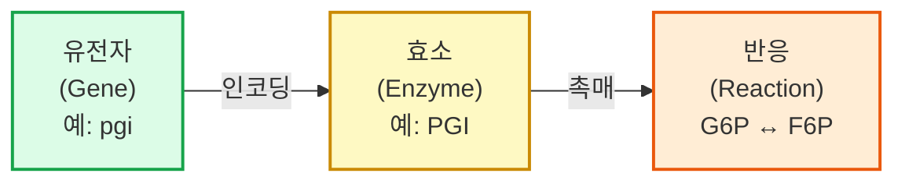

# 1. 대사 네트워크의 구성 요소: 반응과 대사물

세포 안에서 일어나는 수천 가지의 화학 변환을 컴퓨터가 다룰 수 있는 형태로 바꾸려면, 가장 먼저 그 변환의 "단어"에 해당하는 두 가지 개체 — **반응(reaction)**과 **대사물(metabolite)** — 를 명확히 정의해야 합니다. [Chapter 1](../chapter-1/README.md)에서 살펴본 대사(metabolism)라는 거대한 현상은, 결국 이 두 개체가 관계 맺는 방식을 촘촘하게 기록한 목록으로 환원됩니다.

## 1.1 반응(Reaction)이란 무엇인가

**비유로 먼저 생각해 봅시다.** 반응(reaction)은 요리 레시피와 비슷합니다. 레시피는 "재료(기질) 얼마를 넣으면 요리(생성물) 얼마가 나온다"는 변환 규칙이고, 그 변환을 실제로 수행하는 것은 요리사(효소)입니다. 대사 네트워크의 "반응"도 똑같습니다 — 특정 대사물(기질, substrate)을 다른 대사물(생성물, product)로 바꾸는 규칙이며, 그 규칙을 실행하는 "요리사"가 바로 **효소(Enzyme)**입니다.

> **핵심 개념 · 용어(English):** **반응(Reaction)**은 대사 네트워크의 기본 변환 단위입니다. 하나의 반응은 하나 이상의 대사물(기질, substrate)을 다른 대사물(생성물, product)로 바꾸는 화학적 사건이며, 대부분의 경우 특정 **효소(Enzyme)**가 이를 촉매합니다.

효소는 다시 **유전자(Gene)**에 의해 인코딩되므로, "유전자 → 효소 → 반응"이라는 사슬이 성립합니다.

이 사슬을 불(Boolean) 논리로 공식화한 것이 **유전자-단백질-반응 연관(Gene-Protein-Reaction, GPR)**이며, AND(효소 복합체)와 OR(동위 효소, isozyme) 규칙의 상세한 파싱은 [Chapter 3](../chapter-3/README.md)에서 다룹니다. 이 챕터에서는 "반응에는 그것을 가능케 하는 효소와 유전자가 대응된다"는 관계 자체에만 집중합니다.

모델 안에서 각 반응 객체는 다음과 같은 속성을 가집니다.

| 속성 | 설명 | 예시 |
|:---|:---|:---|
| **ID** | 고유 식별자 | `GLCpts`, `PYK`, `CS` |
| **이름** | 사람이 읽을 수 있는 이름 | `Glucose-6-phosphate isomerase` |
| **화학량론** | 참여 대사물과 계수 | `G6P <=> F6P` |
| **하한 (lb, lower bound)** | 최소 통량 | −1000 (가역) 또는 0 (비가역) |
| **상한 (ub, upper bound)** | 최대 통량 | 1000 |
| **EC 번호** | 효소 위원회(Enzyme Commission) 분류 | `5.3.1.9` |
| **GPR 연관** | 촉매 효소를 인코딩하는 유전자 | `(pgi)` |
| **구획** | 반응이 일어나는 세포 내 위치 | `c` (cytosol) |

즉 반응은 화학량론(stoichiometry)·방향성(directionality)·통량 범위(flux bounds)·촉매 유전자(GPR)라는 네 가지 정보를 하나로 묶은 데이터 객체입니다. GEM에서 "반응을 안다"는 것은 이 네 가지를 모두 안다는 뜻입니다.

이 중 이번 챕터가 다루는 것은 첫 두 가지(화학량론, 방향성)이며, 나머지 두 가지(통량 범위의 생물학적 근거, GPR)는 이 절 뒷부분과 [Chapter 3](../chapter-3/README.md)에서 각각 이어집니다. 왜 이렇게 역할을 나누어 배우는 것이 효율적일까요? 화학량론이라는 "무엇이 무엇으로 바뀌는가"를 먼저 확실히 익혀야, 그 위에 "어느 방향으로", "누구에 의해"라는 정보를 순서대로 얹을 수 있기 때문입니다. 이는 마치 건물을 지을 때 골조(화학량론)를 먼저 세우고 나서 배관·전기(방향성·GPR)를 배치하는 것과 비슷한 순서입니다.

반응은 세포 내에서 수행하는 역할에 따라 다음과 같이 분류됩니다.

| 유형 | 설명 | 예시 |
|:---|:---|:---|
| **내부 반응(Internal reaction)** | 세포 내 대사 변환 | 해당과정(glycolysis), TCA 회로 |
| **교환 반응(Exchange reaction)** | 세포-환경 간 물질 교환 | 포도당 흡수, 아세테이트 분비 |
| **수송 반응(Transport reaction)** | 세포 구획 간 물질 이동 | 미토콘드리아-세포질 수송 |
| **생물량 반응(Biomass reaction)** | 세포 증식을 위한 전구체 소비 | `BIOMASS_Ecoli_core_w_GAM` |
| **유지 에너지 반응(Maintenance reaction)** | 비성장 관련 ATP 소비 | `ATPM` |

> **잠깐, 생각해보기:** 반응 ID `EX_glc__D_e`, `PGI`, `GLCpts`, `BIOMASS_Ecoli_core_w_GAM`을 위 표의 다섯 유형에 각각 매칭해 보세요. *(정답: `EX_glc__D_e`는 이름 접두어 `EX_`가 암시하듯 교환 반응, `PGI`는 세포질 안에서 일어나는 내부 반응, `GLCpts`는 포도당을 세포 밖에서 안으로 들여오는 수송 반응(정확히는 인산화까지 겸하는 특수한 수송계), `BIOMASS_Ecoli_core_w_GAM`은 이름 그대로 생물량 반응입니다. 이렇게 ID의 접두어·접미어 관례만 알아도 반응의 역할을 대략 짐작할 수 있습니다.)*

이 챕터의 초점은 **내부 반응의 화학량론적 표현**입니다. 교환·수송·생물량 반응의 생물학적 설계 원리(경계 조건, 목적함수 구성 등)는 [Chapter 3](../chapter-3/README.md)에서 자세히 다룹니다. 다만 이 반응들 역시 $$\mathbf{S}$$ 행렬 안에서는 내부 반응과 동일한 방식 — 하나의 열(column)로 — 표현된다는 점만 2.4절에서 미리 짚고 넘어갑니다.


💡 **팁:** 반응 ID(`GLCpts`, `PGI`, `PYK`...)는 대부분 효소나 경로 이름의 약어입니다. 처음에는 암호처럼 보이지만, BiGG(Biochemical, Genetic and Genomic knowledge base) 데이터베이스에서 ID를 검색하면 전체 이름과 화학량론을 바로 확인할 수 있습니다.


**"반응을 안다"는 것을 수식으로 미리 맛보기.** 위 표의 네 가지 정보 중 마지막 세 가지(방향성·통량 범위·GPR)는 결국 하나의 숫자, 즉 그 반응이 실제로 흐르는 "속도"를 제약하는 역할을 합니다. 이 속도를 **통량(flux)** $$v_j$$라고 부르며, 반응 $$j$$ 하나마다 숫자 하나가 대응됩니다. 반응이 $$n$$개라면, 이 숫자들을 한 줄로 늘어놓은 벡터

$$
\mathbf{v} = (v_1, v_2, \ldots, v_n)^\top \in \mathbb{R}^n
$$

가 정의됩니다. 지금 이 시점에서는 $$v_j$$가 정확히 무엇을 의미하는지(단위: mmol·gDW$$^{-1}$$·h$$^{-1}$$, "세포 건조중량 1그램이 1시간 동안 처리하는 밀리몰 수")까지 몰라도 괜찮습니다. 중요한 것은 딱 하나 — **"반응 하나 = 숫자 하나"라는 대응 관계**($$v_j$$)가 이 장 전체를 관통하는 핵심 아이디어라는 점입니다. 2.2절에서 이 대응 관계가 화학량론 행렬의 "열(column)"로, 4.1절에서 "$$d\mathbf{x}/dt=\mathbf{S}\mathbf{v}$$"라는 식으로 구체화되는 과정을 차례로 볼 것입니다.

## 1.2 반응식 표기법과 방향성·가역성(Reversibility)

반응은 화학식 형태로 표기됩니다. 예를 들어 헥소키나제(Hexokinase, 여러 생물종의 해당과정 첫 단계를 촉매하는 잘 알려진 효소)가 촉매하는 반응은 다음과 같이 씁니다.

$$\text{ATP} + \text{Glucose} \rightarrow \text{ADP} + \text{Glucose-6-phosphate}$$

화살표의 형태가 곧 반응의 방향성을 나타냅니다. 일상적인 비유를 들자면, 반응의 화살표는 도로의 통행 방향 표지판과 같습니다.

- 단방향 화살표($$\rightarrow$$): **비가역 반응(Irreversible reaction)**. 일방통행로처럼 한 방향으로만 진행됩니다.
- 양방향 화살표($$\leftrightarrow$$ 또는 `<=>`): **가역 반응(Reversible reaction)**. 양방향 도로처럼 조건에 따라 정반응·역반응 모두 가능합니다.

이 방향성은 모델 안에서 통량 하한/상한 $$v^{lb} \leq v_j \leq v^{ub}$$ 값으로 코딩됩니다.

- **비가역 반응**: $$v_j^{lb} = 0$$ (예: $$0 \leq v_j \leq 1000$$)
- **가역 반응**: $$v_j^{lb} < 0 < v_j^{ub}$$ (예: $$-1000 \leq v_j \leq 1000$$)

즉 통량 $$v_j$$의 부호가 곧 반응이 진행되는 방향을 의미합니다. $$v_j > 0$$이면 화학량론식에 쓰인 방향(정반응), $$v_j < 0$$이면 반대 방향(역반응)으로 흐른다는 뜻입니다.

> **잠깐, 생각해보기:** 만약 어떤 반응의 하한과 상한이 둘 다 0이라면($$v^{lb}=v^{ub}=0$$) 어떤 의미일까요? 정답은 "이 반응은 강제로 꺼져 있다(차단, blocked)"는 뜻입니다. 특정 조건(예: 특정 유전자 결손)을 흉내 낼 때 실제로 이렇게 bound를 0으로 고정합니다. 이 기법은 [Chapter 8](../chapter-8/README.md)의 유전자 결손 시뮬레이션에서 본격적으로 사용됩니다.

반응의 방향성은 임의로 정해지는 것이 아니라 **열역학(Thermodynamics)**에 근거합니다. 반응의 자발성은 실제 깁스 자유 에너지 변화로 결정됩니다.

$$\Delta_r G' = \Delta_r G'^{\circ} + RT \ln \left(\frac{\prod [\text{products}]}{\prod [\text{substrates}]}\right) < 0 \quad \text{(자발적 반응)}$$

정확한 $$\Delta_r G'$$ 값을 세포 내 모든 조건에서 알기는 어렵기 때문에, 실제 모델 구축에서는 다음과 같은 근사적 규칙을 사용합니다.

- $$\Delta_r G'^{\circ} \ll 0$$: 비가역 반응으로 모델링 ($$v_j \geq 0$$)
- $$\Delta_r G'^{\circ} \approx 0$$: 가역 반응으로 모델링 ($$v_j^{lb} < 0 < v_j^{ub}$$)

**숫자로 감을 잡아 봅시다.** 아래는 어디까지나 방향성-부호 규칙을 보여주기 위한 **가상의 예시 수치**입니다(실제 열역학 데이터베이스 값이 아닙니다). 만약 반응 R이 표준 조건에서 $$\Delta_r G'^{\circ} = -30\ \text{kJ/mol}$$처럼 크게 음수라면 "사실상 한쪽으로만 흐른다"고 보고 $$0 \leq v_R \leq 1000$$으로 모델링하고, 반대로 $$\Delta_r G'^{\circ} \approx +2\ \text{kJ/mol}$$처럼 0에 가깝다면 세포 내 실제 대사물 농도 조건에 따라 정반응·역반응이 모두 가능하다고 보고 $$-1000 \leq v_R \leq 1000$$으로 모델링합니다. 아래 표는 이런 부호 규칙이 실제 bound 값으로 어떻게 코딩되는지 정리한 것입니다.

| 반응 유형 | 예시 $$v^{lb}$$ | 예시 $$v^{ub}$$ | 허용되는 $$v_j$$ | 의미 |
|:---|---:|---:|:---|:---|
| 비가역(정방향만) | 0 | 1000 | $$v_j \geq 0$$ | 일방통행 |
| 가역 | −1000 | 1000 | $$v_j \in \mathbb{R}$$ | 양방향 통행 |
| 차단(blocked) | 0 | 0 | $$v_j = 0$$ | 통행 금지 |
| 하한 고정(강제 소비) | 5 | 1000 | $$v_j \geq 5$$ | 최소 흐름 보장(예: 유지 에너지) |

이 표의 마지막 행은 앞으로 [Chapter 3](../chapter-3/README.md)에서 다룰 유지 에너지 반응(`ATPM`)처럼, 하한 자체가 0이 아닌 양수로 고정되어 "이 정도는 무조건 소비해야 한다"는 생리학적 강제 조건을 표현하는 데 사용됩니다. 이처럼 하한/상한 두 숫자만으로 "일방통행·양방향·차단·강제흐름"이라는 서로 다른 네 가지 생물학적 상황을 모두 표현할 수 있다는 점이 통량 bound라는 표기법의 강력함입니다.


⚠️ **주의:** 이 챕터에서 다루는 반응 통량 부호와 하한/상한은 어디까지나 개별 반응의 화학량론적·열역학적 성질을 기술하는 정적인 속성입니다. 표준 FBA는 이 부호 제약 외에는 열역학을 명시적으로 고려하지 않기 때문에, 여러 가역 반응이 맞물려 순환하며 외부와 물질 교환 없이 ATP를 "공짜로" 만들어내는 것처럼 보이는 열역학 위반 순환(제3형 경로, Type-III pathway)이 수학적으로는 허용될 수 있습니다. 이를 막는 Loopless FBA 등의 확장 기법은 [Chapter 4](../chapter-4/README.md)에서 다룹니다.


**화학량론 계수가 1이 아닐 때.** 지금까지 본 헥소키나제 예시는 모든 계수가 우연히 $$\pm 1$$이었습니다. 하지만 실제 반응 중에는 그렇지 않은 경우도 흔합니다. 순전히 계수 표기 규칙만 연습하기 위한 가상의 반응 R을 하나 만들어 봅시다.

$$\text{A} + 2\,\text{B} \rightarrow 3\,\text{C}$$

이 반응식을 말로 풀면 "A 1분자와 B 2분자가 반응하여 C 3분자가 생성된다"는 뜻입니다. 이때 화학량론 계수는 A가 $$-1$$, B가 $$-2$$, C가 $$+3$$입니다 — 계수의 부호는 소비(−)·생성(+) 여부를, 계수의 크기는 "몇 분자 단위로" 관여하는지를 나타냅니다. 이 규칙은 2.2절에서 $$\mathbf{S}$$ 행렬의 한 열을 채울 때 그대로 사용됩니다.

> **잠깐, 생각해보기:** 만약 이 반응이 통량 $$v_R = 4$$(mmol·gDW$$^{-1}$$·h$$^{-1}$$)로 흐른다면, A와 B는 각각 얼마의 속도로 소비되고, C는 얼마의 속도로 생성될까요? *(정답: A는 $$1 \times 4 = 4$$, B는 $$2 \times 4 = 8$$의 속도로 소비되고, C는 $$3\times 4=12$$의 속도로 생성됩니다. 즉 "화학량론 계수 × 통량"이 실제 소비·생성 속도입니다 — 이 곱셈 규칙이 바로 4.1절에서 다룰 $$d\mathbf{x}/dt = \mathbf{S}\mathbf{v}$$의 핵심 아이디어입니다.)*

## 1.3 대사물(Metabolite)과 구획 표기 규칙

**대사물(Metabolite)**은 반응에서 생성되거나 소비되는 화학 종(chemical species)입니다. 포도당, ATP, 피루브산 등이 모두 대사물입니다. 모델 안에서 각 대사물 객체는 다음과 같은 속성을 가집니다.

| 속성 | 설명 | 예시 |
|:---|:---|:---|
| **ID** | 고유 식별자 | `glc__D`, `pyr`, `atp_c` |
| **이름** | 사람이 읽을 수 있는 이름 | `D-Glucose`, `Pyruvate` |
| **분자식** | 화학식 | `C6H12O6`, `C3H3O3` |
| **전하(Charge)** | 전하 상태 | 0, −1, −2, −3, −4 |
| **구획** | 존재하는 세포 내 위치 | `c`, `e`, `m` |
| **KEGG ID** | KEGG 데이터베이스 식별자 | `C00031` |
| **ChEBI ID** | ChEBI 데이터베이스 식별자 | `CHEBI:4167` |

**비유로 생각해 봅시다.** 같은 사람이라도 회사 건물 안에 있을 때와 집에 있을 때는 서로 다른 출입 카드가 필요하고, 할 수 있는 일(회의 참여 vs. 휴식)도 다릅니다. 대사물도 마찬가지입니다 — 같은 화학종이라도 세포 내 위치(구획, compartment)가 다르면 서로 다른 대사물 객체로 취급됩니다. 세포질의 피루브산(`pyr_c`)과 미토콘드리아의 피루브산(`pyr_m`)은 화학적으로 완전히 동일한 분자이지만, 모델에서는 별개의 노드이며 그 사이를 잇는 수송 반응(transport reaction)이 별도로 존재해야 두 위치를 오갈 수 있습니다. 이를 위해 대사물 ID는 관용적으로 구획을 나타내는 접미사를 붙입니다.

| 접미사 | 구획 (English) |
|:---:|:---|
| `_c` | cytosol (세포질) |
| `_e` | extracellular (세포외) |
| `_m` | mitochondria (미토콘드리아) |
| `_p` | periplasm (주막) |
| `_n` | nucleus (핵) |
| `_r` | endoplasmic reticulum (소포체) |
| `_g` | Golgi apparatus (골지체) |
| `_l` | lysosome (리소좀) |
| `_x` | peroxisome (퍼옥시좀) |

> **핵심 개념 · 용어(English):** **구획화(Compartmentalization)**는 같은 분자라도 위치가 다르면 다른 노드로 표현한다는 규칙입니다. 이 규칙이 왜 필요한지, 그리고 원핵생물(3개 구획)과 진핵생물(8개 이상의 구획)의 구조적 차이는 [Chapter 3](../chapter-3/README.md)에서 자세히 다룹니다. 여기서는 대사물 ID를 읽는 표기 규칙만 익혀 둡니다.


❓ **흔한 오해:** "`glc__D_c`와 `glc__D_e`는 결국 같은 포도당 아닌가요? 왜 굳이 나눠서 세나요?" — 화학적으로는 같은 분자가 맞습니다. 하지만 계산 모델에서 중요한 것은 화학종 자체가 아니라 **그 분자가 관여하는 반응의 집합이 위치에 따라 다르다는 사실**입니다. 세포외 포도당은 교환 반응·수송 반응에만 관여하고, 세포질 포도당은 해당과정 반응들에 관여합니다. 이 둘을 하나로 합치면 "세포 밖의 포도당 농도가 줄면 해당과정이 즉시 느려진다"는 잘못된 관계가 생겨버립니다. 구획을 나누는 것은 대사물의 화학적 정체성이 아니라 **반응 참여 관계**를 정확히 기록하기 위함입니다.


**직접 읽어보기.** ID 표기 규칙에 익숙해지는 가장 빠른 방법은 몇 개를 직접 "번역"해 보는 것입니다.

| 대사물 ID | 분해 | 번역 |
|:---|:---|:---|
| `atp_c` | `atp` + `_c` | 세포질(cytosol)의 ATP |
| `pyr_e` | `pyr` + `_e` | 세포외(extracellular)의 피루브산 |
| `nadh_c` | `nadh` + `_c` | 세포질의 NADH |
| `accoa_m` | `accoa` + `_m` | 미토콘드리아(mitochondria)의 아세틸-CoA |

> **잠깐, 생각해보기:** `o2_e`와 `o2_c`가 모델에 함께 등장한다면, 이 둘을 연결하는 반응은 어떤 종류일까요? *(정답: 수송 반응(transport reaction)입니다. 서로 다른 구획에 있는 같은 화학종을 잇는 것이 바로 수송 반응의 정의이며, 이 반응이 없으면 `o2_e`가 아무리 풍부해도 `o2_c`를 필요로 하는 세포질 반응은 전혀 진행될 수 없습니다. 수송 반응의 화학량론 설계는 [Chapter 3](../chapter-3/README.md)에서 자세히 다룹니다.)*

*E. coli* core 모델처럼 비교적 단순한 원핵생물 모델은 보통 `_c`(세포질)와 `_e`(세포외) 두 구획만 사용하지만, 진핵생물 모델은 미토콘드리아·핵·소포체·골지체 등 훨씬 많은 구획을 가지며 그만큼 구획 간 수송 반응의 수도 늘어납니다. 이 구조적 차이는 [Chapter 3](../chapter-3/README.md)에서 본격적으로 비교합니다.

---
