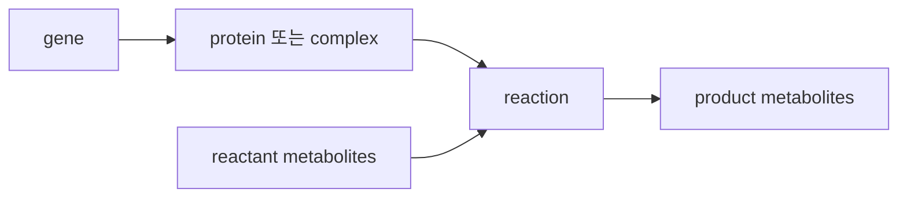

# 1. 반응, 대사물 및 플럭스(flux)

대사 네트워크는 **대사물(metabolite)**과 **반응(reaction)**으로 표현한다. 대사물은 반응에서 소비되거나 생성되는 물질이다. 예를 들어 포도당과 피루브산이 대사물이다. 반응은 대사물을 정해진 비율로 바꾸는 규칙이며, 대개 효소가 촉매한다. 다만 반응식·효소·유전자는 일대일로 대응하지 않는다. 여러 유전자가 함께 만드는 효소 복합체, 같은 반응을 담당하는 여러 동위효소(isoenzyme), 효소 없이 일어나는 자발 반응, 계산을 위해 넣는 의사반응(pseudo-reaction)이 있기 때문이다. 유전자–단백질–반응 대응(GPR)의 자세한 논리는 [Chapter 3](../chapter-3/README.md)에서 다룬다.

## 1.1 반응 기록(reaction record)


**직관**: 반응 기록은 요리 레시피 카드에 비유할 수 있다. 재료(reactant)와 분량(coefficient)이 있고, 조리법 식별자(ID)가 있으며, 이 요리를 만들 수 있는 조건(GPR: 누가 만들 수 있는가)과 어디서 조리하는지(compartment)가 함께 적혀 있다. 다만 레시피와 달리 반응 기록에는 "얼마나 빨리" 반응이 진행되는지(flux 크기)는 적혀 있지 않고, 그 값이 움직일 수 있는 범위(bounds)만 적혀 있다.


계산 모델의 반응에는 다음 정보가 필요하다.

| 필드 | 역할 | 예 |
|:---|:---|:---|
| ID | 안정 식별자 | `PGI`, `EX_glc__D_e` |
| Stoichiometry | reactant·product와 계수 | $$\mathrm{g6p_c}\rightleftharpoons\mathrm{f6p_c}$$ |
| Bounds | 허용 flux 범위 | $$-1000\le v_{PGI}\le1000$$ |
| GPR | 촉매 유전자 논리 | `pgi` 또는 `geneA and geneB` |
| Compartment | 각 metabolite species의 위치 | `_c`, `_e`, `_p` |
| Annotation | EC, database ID, evidence | Rhea·KEGG·BiGG·PMID |

*Figure 2.2: Reaction record에서 구분되는 유전자·단백질·반응·대사산물의 관계. GPR은 protein activity의 Boolean 가능성 관계이며 enzyme abundance나 kinetic rate를 직접 나타내지 않는다. 저자 작성.*

Reaction ID의 접두어는 도구나 모델이 정한 관례일 뿐, 보편 표준이 아니다. 예를 들어 `EX_`는 많은 COBRA 모델에서 exchange reaction을 뜻한다. 그러나 ID만 보고 reaction type을 단정해서는 안 된다. stoichiometry와 boundary annotation을 함께 확인한다.

| Reaction type | 구조적 역할 | 예 |
|:---|:---|:---|
| Internal reaction | 같은 system boundary 안의 chemical transformation | glycolysis, TCA cycle |
| [Transport reaction](../chapter-3/README.md) | 서로 다른 compartment species를 연결 | $$\mathrm{pyr_c}\rightleftharpoons\mathrm{pyr_m}$$ |
| [Exchange reaction](../glossary.md) | extracellular species와 환경을 연결 | glucose uptake, acetate secretion |
| Demand/sink | 특정 metabolite의 제거 또는 생성 가능성 시험 | task formulation |
| [Biomass reaction](../glossary.md) | 성장 조성을 집계한 pseudo-reaction | `Biomass_Ecoli_core` |
| [Maintenance reaction](../glossary.md) | 비성장 에너지 소비 | `ATPM` |

## 1.2 Flux와 방향성

Reaction $$j$$의 [flux](../glossary.md) $$v_j$$는 그 반응이 저장된 방향(stoichiometric direction)으로 진행되는 순반응 속도이다. 이 교재의 [COBRApy](https://opencobra.github.io/cobrapy/) 예제에서는 단위가 $$\mathrm{mmol\,gDW^{-1}\,h^{-1}}$$이다.

$$
\ell_j\le v_j\le u_j
$$

| Bound 설정 | 허용 flux | 해석 |
|:---|:---|:---|
| $$0\le v_j\le1000$$ | 양의 방향만 | 모델에서 비가역으로 취급 |
| $$-1000\le v_j\le1000$$ | 양·음 방향 | 모델에서 가역으로 취급 |
| $$v_j=0$$ | flux 없음 | **bound로 고정된 off** |
| $$a\le v_j\le a$$ | 고정 flux | 측정 constraint 또는 강제 조건 |

`bound로 고정된 off`와 `blocked reaction`은 구분한다. 전자는 $$\ell_j=u_j=0$$으로 명시적으로 막은 반응이다. 후자는 nonzero bound가 있어도 전체 네트워크 제약 아래 어떤 feasible flux state에서도 비영 flux를 가질 수 없는 반응이다.

Flux 부호는 저장된 reaction equation의 방향에 대한 convention이다. $$v_j<0$$은 반응식의 역방향 flux를 뜻하지만, 이를 실제 세포에서의 thermodynamic reversibility 증거로 해석하지 않는다.

## 1.3 열역학과 모델의 반응 방향

실제 반응의 Gibbs energy는 standard transformed Gibbs energy뿐 아니라 농도, pH, ionic strength 및 compartment에 의존한다.

$$
\Delta_rG'=\Delta_rG'^{\circ}+RT\ln Q
$$

따라서 $$\Delta_rG'^{\circ}$$가 작다고 항상 양방향 flux가 가능한 것도, 큰 음수라고 모든 세포 조건에서 역방향 flux가 불가능한 것도 아니다. GEM의 reversible/irreversible annotation은 thermodynamic data, enzyme mechanism, observed physiology 및 modeling convention을 통합한 제약이다. [FBA](../chapter-4/README.md)는 기본적으로 이 annotation을 사용하지만 모든 reaction의 $$\Delta_rG'$$를 직접 계산하지 않는다. [열역학 기반 flux 분석](../glossary.md)(Thermodynamic flux analysis, TFA)은 추가적인 metabolite concentration과 energy constraints를 사용한다.

## 1.4 화학량론 계수와 순생성률

가상의 반응

$$
\mathrm A+2\mathrm B\rightarrow3\mathrm C
$$

에서 coefficient vector는 $$(\nu_A,\nu_B,\nu_C)=(-1,-2,+3)$$이다. Flux가 $$v_R=4\ \mathrm{mmol\,gDW^{-1}\,h^{-1}}$$이면 이 반응이 각 metabolite에 기여하는 순생성률은

$$
\nu_Av_R=-4,\qquad
\nu_Bv_R=-8,\qquad
\nu_Cv_R=+12
$$

이다. 음수는 소비, 양수는 생성을 뜻한다. 모든 반응의 이러한 기여를 더한 것이 $$\mathbf S\mathbf v$$이며, 다음 절에서 행렬로 구성한다.

## 1.5 대사물 종과 구획 접미사


**비유**: 같은 화합물이라도 위치가 다르면 별도 species로 취급하는 것은, 같은 사람이라도 "사무실의 나"와 "집의 나"를 서로 다른 역할로 구분하는 것과 비슷하다. 세포질의 pyruvate와 미토콘드리아의 pyruvate는 같은 분자식을 공유하지만, 참여할 수 있는 반응 목록과 접근 가능한 효소가 다르기 때문에 모델에서는 별도 행으로 관리해야 한다.


모델에서 metabolite는 chemical identity와 [compartment](../chapter-3/README.md)를 함께 가진 species이다. `pyr_c`와 `pyr_m`은 같은 pyruvate chemical identity를 공유할 수 있지만, 각각 cytosol과 mitochondrion에서 참여 가능한 reaction set이 다르므로 별도 행으로 표현한다. 두 species를 연결하려면 transport reaction이 필요하다.

| suffix의 예 | 일반적 의미 | 주의점 |
|:---:|:---|:---|
| `_c` | cytosol | 모델별 약어를 확인 |
| `_e` | extracellular space | 환경과의 exchange 정의에 사용 |
| `_p` | periplasm | Gram-negative bacterial model에서 흔함 |
| `_m` | mitochondrion | human/yeast model에서 흔함 |
| `_r`, `_g`, `_l`, `_x` | ER, Golgi, lysosome, peroxisome | 모든 모델이 같은 suffix를 쓰지는 않음 |

구획 표기는 chemical formula를 바꾸지 않을 수 있지만, transport cost, redox cofactor, proton gradient 및 enzyme localization을 모델에 표현하기 위해 필요하다. 구획과 transport chemistry의 상세는 [Chapter 3](../chapter-3/README.md)에서 다룬다.

## 1.6 표현 범위

이 장의 $$\mathbf S$$는 chemical stoichiometry를 표현한다. 다음 정보는 별도 구조 또는 제약으로 추가된다.

- GPR와 유전자 결손: [Chapter 3](../chapter-3/README.md)
- compartment localization과 transport mechanism: [Chapter 3](../chapter-3/README.md)
- medium, uptake bound 및 system boundary: [Chapter 3](../chapter-3/README.md)
- biomass composition과 maintenance: [Chapter 3](../chapter-3/README.md)
- objective, LP 및 phenotype prediction: [Chapter 4](../chapter-4/README.md)

이 구분을 유지해야 화학량론 오류, 경계 조건 오류, GPR 오류와 objective 가정을 서로 다른 원인으로 진단할 수 있다.

---

### 해석상의 주의

- Reaction ID의 접두어(`EX_`, `DM_` 등)는 도구·모델의 관례일 뿐 보편 표준이 아니다. ID만으로 reaction type을 단정하지 않고 stoichiometry와 bounds를 함께 확인한다.
- Flux 부호는 저장된 반응식 방향에 대한 convention이다. $$v_j<0$$을 곧바로 세포 내 실제 역반응의 증거로 읽지 않는다.
- $$\Delta_rG'^{\circ}$$의 크기만으로 세포 내 반응 방향성을 단정할 수 없다. 실제 방향은 농도·pH·ionic strength에 의존하는 $$\Delta_rG'$$로 결정된다.
- 구획 접미사(`_c`, `_e`, `_p`, `_m` 등)의 의미는 모델마다 다를 수 있으므로 접미사만 보고 위치를 단정하지 말고 모델 문서를 확인한다.
- "bound로 고정된 off"(즉 $$\ell_j=u_j=0$$)와 "blocked reaction"(네트워크 전체 제약 아래 항상 flux가 0)은 서로 다른 개념이다.

---
