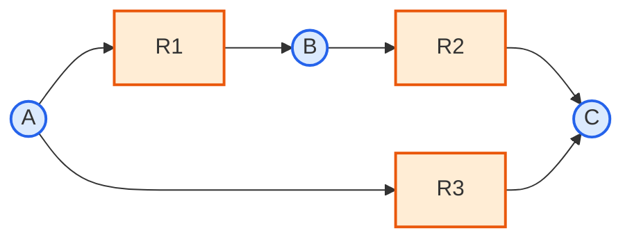

# 3. 대사 네트워크의 그래프 표현: 이분 그래프(Bipartite Graph)

지금까지 $$\mathbf{S}$$라는 **행렬** 관점에서 네트워크를 봤다면, 같은 정보를 **그래프(graph)**로도 표현할 수 있습니다. 두 표현은 서로 동등하며, 다루려는 문제에 따라 더 편한 쪽을 선택하면 됩니다.

대사 네트워크는 본질적으로 **이분 그래프(Bipartite Graph)**입니다. 즉 노드(node)가 대사물과 반응이라는 두 개의 서로 다른 집합으로 나뉘고, 간선(edge)은 항상 서로 다른 집합 사이에만 존재합니다 — 대사물과 대사물이 직접 연결되거나 반응과 반응이 직접 연결되는 경우는 없습니다.

**비유로 생각해 봅시다.** 이분 그래프는 학생-과목 등록 시스템과 비슷합니다. 학생(대사물)은 과목(반응)에 등록할 수 있지만, 학생끼리 직접 연결되지는 않습니다(같은 과목을 듣는 두 학생이 그래프상 직접 이어지지 않는 것처럼). 대사물도 마찬가지로, 두 대사물이 "직접" 연결되는 일은 없고 항상 반응이라는 매개체를 통해서만 이어집니다.

앞서 2.3절에서 손으로 만든 장난감 네트워크($$R_1: A\to B$$, $$R_2: B\to C$$, $$R_3: A\to C$$)를 이분 그래프로 그리면 다음과 같습니다. 원은 대사물, 사각형은 반응이며 화살표 방향은 소비와 생성을 구분합니다.

이 그림을 바로 위의 행렬과 함께 읽어보십시오. 예를 들어 `A → R1`은 $$S_{A,R_1}<0$$, `R1 → B`는 $$S_{B,R_1}>0$$이고, A와 R2 사이에 선이 없다는 것은 $$S_{A,R_2}=0$$입니다. 즉 시각적 연결 하나가 $$\mathbf S$$의 비영 원소 하나에 대응합니다.

- 대사물 노드에서 반응 노드로 향하는 간선: 그 대사물이 해당 반응의 **기질(substrate)**임을 의미 ($$S_{ij} < 0$$)
- 반응 노드에서 대사물 노드로 향하는 간선: 그 대사물이 해당 반응의 **생성물(product)**임을 의미 ($$S_{ij} > 0$$)

이 그림과 $$\mathbf{S}$$ 행렬은 정확히 같은 정보를 담고 있습니다. $$\mathbf{S}$$의 $$(i,j)$$번째 항목이 0이 아니라는 것은, 이분 그래프에서 대사물 노드 $$i$$와 반응 노드 $$j$$ 사이에 간선이 존재한다는 것과 완전히 동일한 진술입니다. 즉 $$\mathbf{S}$$는 이분 그래프의 **부호화된 인접 행렬(signed incidence matrix)**로 볼 수 있습니다.

| 관점 | 표현 방식 | 강점 |
|:---|:---|:---|
| **그래프(Graph)** | 대사물 노드·반응 노드·간선 | 연결성·경로·허브·모듈 구조 등 네트워크 위상(topology) 분석에 직관적 |
| **행렬(Matrix)** | $$\mathbf{S} \in \mathbb{R}^{m \times n}$$ | 선형대수 연산(계수, 영공간 등)과 최적화(LP) 정식화에 필수 |

2.4절에서 살펴본 스케일-프리 특성(허브 대사물), 좁은 세상 특성, 계층적 모듈성(hierarchical modularity) — 즉 탄수화물·아미노산·지질·뉴클레오타이드 대사 등 기능별로 반응들이 뭉쳐 있는 성질 — 은 모두 이 이분 그래프 관점에서 자연스럽게 정의되는 개념입니다. 반면 다음 절에서 다룰 질량 보존이나, [Chapter 4](../chapter-4/README.md)에서 다룰 선형 계획법(LP) 정식화는 그래프가 아니라 행렬 $$\mathbf{S}$$ 위에서 이루어지는 연산입니다. 두 표현은 서로 대체재가 아니라, 같은 대상을 보는 두 개의 렌즈입니다.

> **잠깐, 생각해보기:** ATP처럼 수백 개 반응에 관여하는 허브 대사물을 이분 그래프로 그리면 어떤 모습일까요? 노드 하나(ATP)에서 수백 개의 간선이 사방으로 뻗어나가는 "별 모양(star)" 구조가 될 것입니다. 이것이 바로 $$\mathbf{S}$$ 행렬에서 ATP에 해당하는 행이 대부분의 열에서 비영(nonzero) 값을 가진다는 사실의 그래프적 표현입니다.

---
