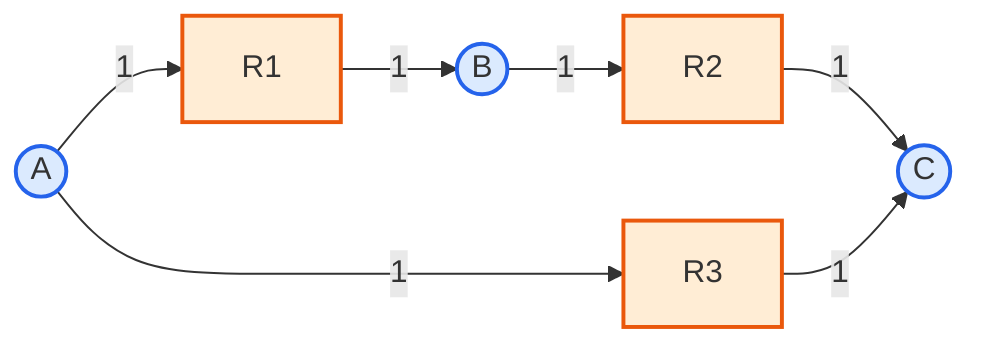

# 3. 대사 네트워크의 그래프 표현

[화학량론 행렬](../glossary.md)은 물질수지와 최적화에는 잘 맞는다. 그러나 어떤 대사물들이 서로 이어져 있는지, 네트워크가 몇 개의 덩어리로 나뉘는지, 모듈 구조는 어떤지와 같은 위상적(연결 구조에 관한) 특성은 직접 보여 주지 않는다. 이런 질문에는 그래프 표현이 유용하다. 다만 대사 네트워크를 그래프로 바꾸는 방법은 하나가 아니다. 어떤 표현을 고르는 순간, 어떤 정보는 보존되고 어떤 정보는 사라진다. 그래서 그래프 지표를 보고할 때는 노드·간선의 정의, 방향성, 가중치, 통화 대사물 처리 규칙을 함께 밝혀야 한다.

## 3.1 부호·가중 이분 그래프


**직관**: 이분 그래프는 "학생-수강 과목" 관계표와 같은 구조다. 학생과 과목은 서로 다른 두 집합이며, 간선은 오직 학생-과목 사이에만 존재하고 학생-학생, 과목-과목 사이에는 존재하지 않는다. 대사물-반응 이분 그래프도 마찬가지로, 대사물과 반응이라는 서로 다른 두 노드 집합 사이에만 간선(참여 관계)이 있다. 이 비유는 참여 관계만 설명하며, 화학량론 계수의 부호·크기나 가역 반응의 bounds는 설명하지 못한다.


대사물 집합을 $$M=\{1,\ldots,m\}$$, 반응 집합을 $$R=\{1,\ldots,n\}$$이라고 하자. $$\mathbf{S}$$의 비영 원소에 대해 대사물 노드와 반응 노드를 연결하면 이분 그래프를 얻는다.

$$
E=\{(i,j)\in M\times R:S_{ij}\neq0\}.
$$

이 그래프에는 대사물-대사물 간선이나 반응-반응 간선이 없다. 각 incidence edge에 다음 정보를 부여하면 $$\mathbf{S}$$의 순 화학량론을 보존할 수 있다.

- 방향: $$S_{ij}<0$$이면 $$X_i\rightarrow R_j$$, $$S_{ij}>0$$이면 $$R_j\rightarrow X_i$$
- 가중치: $$w_{ij}=|S_{ij}|$$

따라서 **부호와 가중치를 포함한 이분 그래프**는 $$\mathbf{S}$$의 비영 원소를 복원할 수 있다. 반면 단순한 무가중 이분 그래프는 $$S_{ij}\neq0$$이라는 참여 관계만 보존하며, 계수의 크기를 잃는다. 반응 방향의 열역학적 허용 범위와 플럭스 bounds도 $$\mathbf{S}$$ 자체에 포함되지 않으므로 별도 속성으로 보존해야 한다.

이 표현은 하나의 반응 노드가 여러 기질과 생성물을 동시에 연결한다는 점에서 다분자 반응의 관계를 유지한다. 대사물만 남기는 단순 그래프로 즉시 투영하면 이 다자 관계가 여러 개의 쌍별 간선으로 분해된다. 대사물·반응 이분 그래프와 그 대사물 투영의 구분은 Samal and Martin(2011)의 예시를 참고할 수 있다([DOI: 10.1371/journal.pone.0022295](https://doi.org/10.1371/journal.pone.0022295)).

### 예제 3.1

§2.3의 네트워크

$$
R_1:A\rightarrow B,\qquad
R_2:B\rightarrow C,\qquad
R_3:A\rightarrow C
$$

는 다음 incidence 구조를 가진다.

*그림 2.3. 장난감 네트워크의 부호·가중 이분 그래프. 원은 대사물, 사각형은 반응이며, 간선 방향은 저장된 반응식에서의 소비·생성을 나타낸다. 숫자는 화학량론 계수의 절댓값이며 플럭스 크기나 효소량은 아니다. 가역성이 허용하는 실제 반대 방향 플럭스는 bounds를 함께 읽어야 한다. 저자 작성; 개념 근거: [Samal and Martin (2011)](https://doi.org/10.1371/journal.pone.0022295).*

예를 들어 $$A\rightarrow R_1$$은 $$S_{A,R_1}=-1$$, $$R_1\rightarrow B$$는 $$S_{B,R_1}=+1$$에 대응한다. 계수가 2인 반응이라면 해당 간선 가중치도 2가 된다.

다음 표처럼 그림 2.3의 여섯 간선을 모두 되돌려 읽으면 toy $$\mathbf{S}$$의 비영 원소를 얻는다. 따라서 이 예제에서는 간선의 존재만이 아니라 방향과 가중치가 복원 규칙의 일부이다.

| incidence edge | 복원되는 $$\mathbf{S}$$ 원소 |
|:---|:---|
| $$A\rightarrow R_1$$ | $$S_{A,R_1}=-1$$ |
| $$R_1\rightarrow B$$ | $$S_{B,R_1}=+1$$ |
| $$B\rightarrow R_2$$ | $$S_{B,R_2}=-1$$ |
| $$R_2\rightarrow C$$ | $$S_{C,R_2}=+1$$ |
| $$A\rightarrow R_3$$ | $$S_{A,R_3}=-1$$ |
| $$R_3\rightarrow C$$ | $$S_{C,R_3}=+1$$ |

## 3.2 연결수와 이분 그래프 밀도

대사물 노드 $$i$$의 연결수와 반응 노드 $$j$$의 연결수를 각각 다음과 같이 정의한다.

$$
k_i=\left|\{j:S_{ij}\neq0\}\right|,
\qquad
d_j=\left|\{i:S_{ij}\neq0\}\right|.
$$

$$k_i$$는 대사물 $$i$$가 참여하는 반응 수이고, $$d_j$$는 반응 $$j$$에 참여하는 대사물 수이다. 하나의 비영 원소는 양쪽 분할의 연결수에 각각 한 번씩 기여하므로

$$
\sum_{i=1}^{m}k_i
=
\sum_{j=1}^{n}d_j
=
|E|
=
\operatorname{nnz}(\mathbf{S})
$$

가 성립한다. 전체 노드 $$M\cup R$$의 연결수를 모두 합하면 $$2|E|$$이다.

단순 이분 incidence 그래프에서 가능한 최대 간선 수는 $$mn$$이므로 밀도는

$$
\delta_{\mathrm{bip}}
=
\frac{|E|}{mn}
$$

이다. 비영 원소마다 incidence edge를 하나 두는 정의에서는 이 값이 §2.4의 행렬 비영 비율 $$\rho_S$$와 수치적으로 같다.

예제 3.1에서는 $$k_A=k_B=k_C=2$$, $$d_{R_1}=d_{R_2}=d_{R_3}=2$$이므로 양쪽 합은 모두 $$6$$이다. 따라서 $$|E|=\operatorname{nnz}(\mathbf{S})=6$$, $$\delta_{\mathrm{bip}}=6/(3\times3)=2/3$$이다. 이 toy 계산과 실제 모델의 스냅숏 수를 섞어 쓰지 않는다.

`e_coli_core`의 한 고정 실행에서는 COBRApy 0.30.0의 패키지 파일 `textbook.xml.gz`(SHA-256 `c674befd7a8199f037fd851c4f8ea8502730d0328ef51b1c46946f19fb44f72a`)을 `load_model("textbook")`으로 읽고, 모든 72개 metabolite 행과 95개 reaction 열을 포함한 $$\mathbf{S}$$에서 0이 아닌 원소를 세었다. 이 규칙 아래 $$|E|=\operatorname{nnz}(\mathbf{S})=360$$이고 $$\delta_{\mathrm{bip}}=360/(72\times95)=1/19\approx0.0526$$이다. 이는 명시한 패키지 바이트·행렬 추출 규칙의 계산 결과이며, 다른 모델 release, 구획 통합 규칙 또는 통화 대사물 제거 규칙으로 일반화하지 않는다.

단순 무방향 그래프에 사용하는 $$2|E|/[|V|(|V|-1)]$$은 이분 incidence 그래프의 밀도식이 아니다. 해당 식은 아래에서 설명할 대사물 투영 그래프처럼 한 종류의 노드만 남긴 단순 그래프에 적용할 수 있다.

연결수는 구조적 참여 빈도일 뿐이다. 높은 $$k_i$$는 높은 플럭스, 필수성, 조절 중요성을 직접 보장하지 않는다. ATP, 물, 양성자와 같은 통화 대사물의 포함 여부만 바꾸어도 연결수 분포와 최단 경로가 크게 달라질 수 있다.

## 3.3 투영 그래프와 경로의 해석

이분 그래프를 한 종류의 노드 집합으로 투영하면 두 가지 대표적 단순 그래프를 얻는다.

1. **대사물 투영 그래프(metabolite projection)**: 같은 반응에 참여하는 대사물들을 연결한다.
2. **반응 투영 그래프(reaction projection)**: 하나 이상의 대사물을 공유하는 반응들을 연결한다.

투영 규칙은 분석 질문에 따라 더 세분해야 한다. 예를 들어 대사물 투영에서 기질-생성물 쌍만 연결할지, 같은 반응의 모든 대사물 쌍을 연결할지에 따라 간선 집합이 달라진다. 반응 하나에 여러 기질과 생성물이 있으면 투영 과정에서 clique가 생길 수 있으며, ATP·물·양성자 같은 통화 대사물은 서로 무관한 경로 사이에 많은 지름길을 만든다. 이 효과 때문에 네트워크의 scale-free, small-world, 중심성 결과는 표현과 전처리 규칙에 의존한다. 여러 그래프 표현과 통화 대사물 처리의 차이는 Samal and Martin(2011)의 비교를 참고할 수 있다([PMC3136524](https://pmc.ncbi.nlm.nih.gov/articles/PMC3136524/)).

예를 들어 $$A+2B\rightarrow C+D$$를 투영하면 규칙에 따라 다음처럼 다른 간선을 얻는다. 두 경우 모두 계수 2와 반응이라는 다자 관계 자체는 남지 않는다.

| 규칙 | 얻는 대사물 간선 | 보존하지 않는 정보 |
|:---|:---|:---|
| 기질→생성물, 방향 유지 | $$A\rightarrow C$$, $$A\rightarrow D$$, $$B\rightarrow C$$, $$B\rightarrow D$$ | 계수 2, 한 반응에 네 대사물이 함께 참여한다는 관계 |
| 같은 반응의 모든 쌍, 무방향 | $$\{A,B\}$$, $$\{A,C\}$$, $$\{A,D\}$$, $$\{B,C\}$$, $$\{B,D\}$$, $$\{C,D\}$$ | 계수 2, 기질·생성물 방향, 다자 관계 |

따라서 투영 그래프의 간선 수나 밀도를 보고할 때에는 위 두 규칙 중 어느 것을 썼는지와 중복 간선을 제거했는지를 함께 기록한다.

노드가 $$m$$개인 단순 무방향 대사물 투영 그래프 $$G_M=(M,E_M)$$의 밀도는

$$
\delta_M
=
\frac{2|E_M|}{m(m-1)}
$$

이다. 여기서 $$|E_M|$$는 **반응 수가 아니라 투영 후 중복을 제거한 대사물-대사물 간선 수**이다. 따라서 $$\delta_M$$, 이분 그래프 밀도 $$\delta_{\mathrm{bip}}$$, 행렬 비영 비율 $$\rho_S$$는 서로 다른 양이다.

그래프 경로는 정해진 투영 규칙 아래에서 두 노드가 위상적으로 연결될 수 있음을 뜻한다. 그래프 경로가 다음 조건을 자동으로 만족하는 것은 아니다.

- 중간 대사물의 정상상태 물질수지
- 비가역 반응의 부호 조건
- 플럭스 상한·하한
- 에너지·산화환원 보조인자의 균형
- 열역학적 실현 가능성

따라서 두 대사물 사이의 그래프 경로 수를 $$\dim\ker(\mathbf{S})$$와 동일시할 수 없다. [영공간](../glossary.md) 차원은 독립적인 선형 정상상태 방향의 수를 나타내며, 단순 경로 개수나 생물학적 대사 경로 개수와 일반적으로 일치하지 않는다. 이 차이는 §4.5에서 영공간 기저, extreme ray, elementary flux mode를 구분하면서 다시 다룬다.

### 반례 3.1: 경로는 있어도 비영 플럭스는 없을 수 있다

외부 대사물 $$A_e,C_e$$와 내부 대사물 $$B_c$$에 대해 $$R_1:A_e\rightarrow B_c$$, $$R_2:B_c\rightarrow C_e$$를 생각하자. 저장 반응식만으로 만든 그래프에는 $$A_e\rightarrow B_c\rightarrow C_e$$ 경로가 있다. 그러나 내부 행 $$B_c$$에 정상상태를 적용하면

$$
v_1-v_2=0
$$

이다. 이제 $$0\leq v_1\leq10$$, $$v_2=0$$이라는 bounds를 두면 $$v_1=v_2=0$$만 가능하다. 즉 그래프는 경로를 보이지만, 이 bounds 아래 $$A_e$$에서 $$C_e$$로 가는 비영 정상상태 플럭스는 없다. 이 반례는 경로 탐색 전에 모델의 내부 행, 경계조건과 대상 환경을 확인해야 함을 보여 준다.

## 3.4 표현 선택과 보고 기준

| 분석 목적 | 적합한 표현 | 함께 보존해야 할 정보 |
|:---|:---|:---|
| 물질수지·[FBA](../chapter-4/README.md)·[FVA](../chapter-4/README.md) | 화학량론 행렬 $$\mathbf{S}$$ | bounds, 목적함수, 구획 |
| 반응-대사물 참여 관계 | 부호·가중 이분 그래프 | 계수, 저장 방향, bounds |
| 대사물 간 도달성 탐색 | 대사물 투영 그래프 | 투영 규칙, 통화 대사물 목록 |
| 반응 모듈·공유 대사물 분석 | 반응 투영 그래프 | 간선 가중치와 공유 대사물 정의 |

그래프 분석 결과에는 최소한 다음 사항을 기록한다.

- 노드와 간선의 정의
- 방향성과 가중치 사용 여부
- 가역 반응의 처리 방법
- 통화 대사물의 제거 또는 유지 목록
- 구획별 동종 대사물의 통합 여부
- 모델 릴리스·파일 checksum과 행렬의 행·열 포함 기준
- 0 판정 tolerance와 incidence edge 생성 규칙
- 투영 규칙, 중복 제거 규칙과 descriptor별 판정 기준

이 정보가 없으면 서로 다른 연구의 밀도, 평균 경로 길이, 중심성, 모듈성을 직접 비교할 수 없다.

---

### 해석상의 주의

- 무가중 이분 그래프는 $$\mathbf{S}$$의 비영 패턴만 보존한다. 화학량론 계수까지 보존하려면 간선 가중치가 필요하다.
- 투영 그래프는 분석을 단순화하지만 한 반응의 다자 관계와 일부 화학량론 정보를 잃는다.
- 그래프 경로는 정상상태 플럭스 경로가 아니다. 물질수지와 bounds를 적용한 뒤에야 플럭스 실현 가능성을 판단할 수 있다.
- 연결수와 중심성은 구조 지표이며, 반응 필수성이나 플럭스 크기의 대용값으로 해석하지 않는다.

### 참고문헌

1. Samal A, Martin OC. Randomizing genome-scale metabolic networks. *PLoS ONE*. 2011;6:e22295. [DOI: 10.1371/journal.pone.0022295](https://doi.org/10.1371/journal.pone.0022295), [PMC3136524](https://pmc.ncbi.nlm.nih.gov/articles/PMC3136524/)

---
