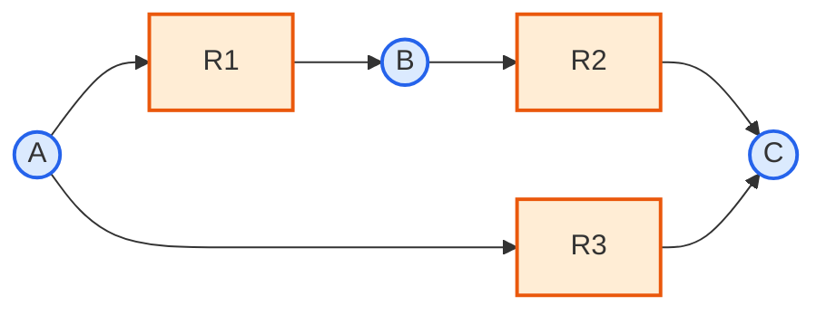

# 3. 대사 네트워크의 그래프 표현: 이분 그래프(Bipartite Graph)

지금까지 $$\mathbf{S}$$라는 **행렬** 관점에서 네트워크를 봤다면, 같은 정보를 **그래프(graph)**로도 표현할 수 있습니다. 두 표현은 서로 동등하며, 다루려는 문제에 따라 더 편한 쪽을 선택하면 됩니다. 왜 굳이 같은 정보를 두 번 표현하는 방법을 배워야 할까요? 행렬은 "계산"(질량 보존을 확인하거나 최적화 문제를 푸는 것)에 강하고, 그래프는 "직관"(어떤 대사물이 병목인지, 네트워크가 얼마나 조밀하게 연결되어 있는지)에 강하기 때문입니다. 두 언어를 오갈 수 있으면 같은 대상을 상황에 따라 가장 편한 도구로 다룰 수 있습니다.

대사 네트워크는 본질적으로 **이분 그래프(Bipartite Graph)**입니다. 즉 노드(node)가 대사물과 반응이라는 두 개의 서로 다른 집합으로 나뉘고, 간선(edge)은 항상 서로 다른 집합 사이에만 존재합니다 — 대사물과 대사물이 직접 연결되거나 반응과 반응이 직접 연결되는 경우는 없습니다.

## 3.1 형식적 정의

이분 그래프를 조금 더 엄밀하게 적어보면, 그래프 $$G=(M \cup R,\, E)$$로 정의할 수 있습니다. 여기서 $$M=\{1,\ldots,m\}$$은 대사물 노드의 집합, $$R=\{1,\ldots,n\}$$은 반응 노드의 집합이며, 간선 집합 $$E$$는 다음과 같이 $$\mathbf{S}$$로부터 직접 정의됩니다.

$$
E = \{\,(i,j) \in M\times R : S_{ij}\neq 0\,\}
$$

즉 "대사물 $$i$$와 반응 $$j$$ 사이에 간선이 있다"는 것은 정확히 "$$S_{ij}\neq 0$$이다"와 같은 말입니다. $$M$$ 내부(대사물끼리)나 $$R$$ 내부(반응끼리)를 잇는 간선은 정의에 아예 존재하지 않으므로, 이 그래프는 자동으로 이분 그래프가 됩니다.

**비유로 생각해 봅시다.** 이분 그래프는 학생-과목 등록 시스템과 비슷합니다. 학생(대사물)은 과목(반응)에 등록할 수 있지만, 학생끼리 직접 연결되지는 않습니다(같은 과목을 듣는 두 학생이 그래프상 직접 이어지지 않는 것처럼). 대사물도 마찬가지로, 두 대사물이 "직접" 연결되는 일은 없고 항상 반응이라는 매개체를 통해서만 이어집니다.

앞서 2.3절에서 손으로 만든 장난감 네트워크($$R_1: A\to B$$, $$R_2: B\to C$$, $$R_3: A\to C$$)를 이분 그래프로 그리면 다음과 같습니다. 원은 대사물, 사각형은 반응이며 화살표 방향은 소비와 생성을 구분합니다.

이 그림을 바로 위의 행렬과 함께 읽어보십시오. 예를 들어 `A → R1`은 $$S_{A,R_1}<0$$, `R1 → B`는 $$S_{B,R_1}>0$$이고, A와 R2 사이에 선이 없다는 것은 $$S_{A,R_2}=0$$입니다. 즉 시각적 연결 하나가 $$\mathbf S$$의 비영 원소 하나에 대응합니다.

- 대사물 노드에서 반응 노드로 향하는 간선: 그 대사물이 해당 반응의 **기질(substrate)**임을 의미 ($$S_{ij} < 0$$)
- 반응 노드에서 대사물 노드로 향하는 간선: 그 대사물이 해당 반응의 **생성물(product)**임을 의미 ($$S_{ij} > 0$$)

이 그림과 $$\mathbf{S}$$ 행렬은 정확히 같은 정보를 담고 있습니다. $$\mathbf{S}$$의 $$(i,j)$$번째 항목이 0이 아니라는 것은, 이분 그래프에서 대사물 노드 $$i$$와 반응 노드 $$j$$ 사이에 간선이 존재한다는 것과 완전히 동일한 진술입니다. 즉 $$\mathbf{S}$$는 이분 그래프의 **부호화된 인접 행렬(signed incidence matrix)**로 볼 수 있습니다.

## 3.2 연결 정도(Degree)와 핸드셰이크 관계

2.4절에서 대사물 $$i$$의 연결 정도 $$k_i$$를 "$$\mathbf{S}$$의 $$i$$번째 행에서 비영 항목의 개수"로 정의했습니다. 그래프 언어로 옮기면, $$k_i$$는 단순히 "대사물 노드 $$i$$에 연결된 간선의 개수"입니다. 반응 노드 쪽에도 똑같은 정의를 적용할 수 있습니다 — 반응 $$j$$의 연결 정도 $$d_j$$는 그 반응에 관여하는 대사물의 개수, 즉 $$\mathbf{S}$$의 $$j$$번째 열에서 비영 항목의 개수입니다.

장난감 네트워크에서 직접 세어 봅시다. $$R_1(A\to B)$$는 대사물 2개(A, B)에 관여하므로 $$d_{R_1}=2$$이고, 같은 방식으로 $$d_{R_2}=d_{R_3}=2$$입니다. 그런데 이 값들을 모두 더하면,

$$
\sum_{j} d_j = 2+2+2 = 6
$$

이 값은 앞서 대사물 쪽에서 구한 $$\sum_i k_i = k_A+k_B+k_C = 2+2+2=6$$과 정확히 같습니다. 이것은 우연이 아닙니다 — 간선 하나는 항상 대사물 쪽 연결 정도와 반응 쪽 연결 정도에 동시에 1씩 기여하므로(그래프 이론에서 "핸드셰이크 보조정리, handshake lemma"라고 부르는 성질의 이분 그래프 버전), 다음 항등식이 항상 성립합니다.

$$
\sum_{i=1}^m k_i \;=\; \sum_{j=1}^n d_j \;=\; |E| \;=\; \text{(} \mathbf{S}\text{의 비영 항목 총개수)}
$$

즉 "행 방향으로 비영 항목을 모두 세어 더한 값"과 "열 방향으로 비영 항목을 모두 세어 더한 값"은 항상 일치하며, 이는 애초에 같은 행렬의 비영 항목을 두 가지 다른 순서로 세었을 뿐이기 때문입니다. 실제로 2.4절에서 계산한 장난감 네트워크의 비영 항목 개수 6과도 정확히 일치합니다.

> **잠깐, 생각해보기:** *E. coli* core 모델은 [실습](lab.md)에서 확인하듯 비영 항목이 360개입니다(2.4절). 그렇다면 "모든 반응의 연결 정도를 더한 값" $$\sum_j d_j$$과 "모든 대사물의 연결 정도를 더한 값" $$\sum_i k_i$$은 각각 얼마일까요? *(정답: 두 값 모두 360입니다. 반응이 95개라면 반응 하나당 평균 연결 정도는 $$360/95\approx 3.79$$개의 대사물, 대사물이 72개라면 대사물 하나당 평균 연결 정도는 $$360/72=5$$개의 반응입니다. 대사물 쪽 평균이 더 크다는 것은, 대사물마다 관여하는 반응 수의 분포가 ATP 같은 허브에 의해 위로 끌어올려져 있다는 신호입니다.)*

## 3.3 그래프 위의 경로(Path)와 대사 경로

이분 그래프의 또 다른 장점은 "경로(path)"라는 개념을 직관적으로 다룰 수 있다는 것입니다. 그래프에서 경로란 노드와 간선을 번갈아 밟아가며 한 노드에서 다른 노드로 이동하는 순서열입니다. 장난감 네트워크에서 A로부터 C까지 가는 경로를 두 가지 찾아봅시다.

- 경로 1: $$A \to R_1 \to B \to R_2 \to C$$ (반응 노드를 2번 거치는 우회로)
- 경로 2: $$A \to R_3 \to C$$ (반응 노드를 1번만 거치는 직행로)

이 두 경로는 정확히 4.3절에서 $$\mathbf{S}\mathbf{v}=\mathbf{0}$$을 풀며 만났던 "$$A\to B\to C$$ 경로"와 "$$A\to C$$ 직행 경로"입니다. 즉 영공간의 자유도(4.4~4.5절)가 두 개였던 이유를 그래프 관점에서 다시 보면, "A에서 C로 가는 서로 다른 경로가 두 가지 있기 때문"이라고 직관적으로 설명할 수 있습니다. 행렬 관점(영공간의 차원)과 그래프 관점(독립적인 경로의 개수)이 같은 현상을 가리키고 있다는 점이 바로 두 표현이 "동등하다"는 말의 실질적인 의미입니다.

## 3.4 그래프와 행렬, 언제 어느 쪽을 쓸까

| 관점 | 표현 방식 | 강점 |
|:---|:---|:---|
| **그래프(Graph)** | 대사물 노드·반응 노드·간선 | 연결성·경로·허브·모듈 구조 등 네트워크 위상(topology) 분석에 직관적 |
| **행렬(Matrix)** | $$\mathbf{S} \in \mathbb{R}^{m \times n}$$ | 선형대수 연산(계수, 영공간 등)과 최적화(LP) 정식화에 필수 |

2.4절에서 살펴본 스케일-프리 특성(허브 대사물), 좁은 세상 특성, 계층적 모듈성(hierarchical modularity) — 즉 탄수화물·아미노산·지질·뉴클레오타이드 대사 등 기능별로 반응들이 뭉쳐 있는 성질 — 은 모두 이 이분 그래프 관점에서 자연스럽게 정의되는 개념입니다. 반면 다음 절에서 다룰 질량 보존이나, [Chapter 4](../chapter-4/README.md)에서 다룰 선형 계획법(LP) 정식화는 그래프가 아니라 행렬 $$\mathbf{S}$$ 위에서 이루어지는 연산입니다. 두 표현은 서로 대체재가 아니라, 같은 대상을 보는 두 개의 렌즈입니다.

> **잠깐, 생각해보기:** ATP처럼 수백 개 반응에 관여하는 허브 대사물을 이분 그래프로 그리면 어떤 모습일까요? 노드 하나(ATP)에서 수백 개의 간선이 사방으로 뻗어나가는 "별 모양(star)" 구조가 될 것입니다. 이것이 바로 $$\mathbf{S}$$ 행렬에서 ATP에 해당하는 행이 대부분의 열에서 비영(nonzero) 값을 가진다는 사실의 그래프적 표현입니다.


💡 **팁:** 대사 네트워크를 그래프로 다루는 도구(NetworkX 등)를 쓰면 최단 경로, 연결 성분, 중심성(centrality) 같은 지표를 몇 줄의 코드로 계산할 수 있습니다. 이런 네트워크 위상 분석은 [Chapter 9](../chapter-9/README.md)에서 AI·그래프 기반 방법과 함께 더 깊이 다룹니다. 이 챕터에서는 "행렬과 그래프가 같은 정보의 두 표현"이라는 대응 관계 자체에 집중합니다.


---
