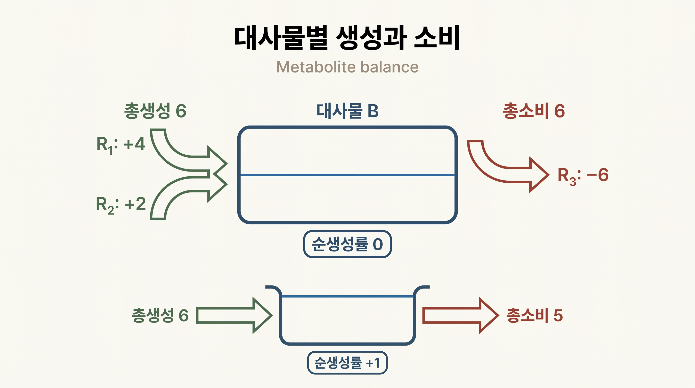
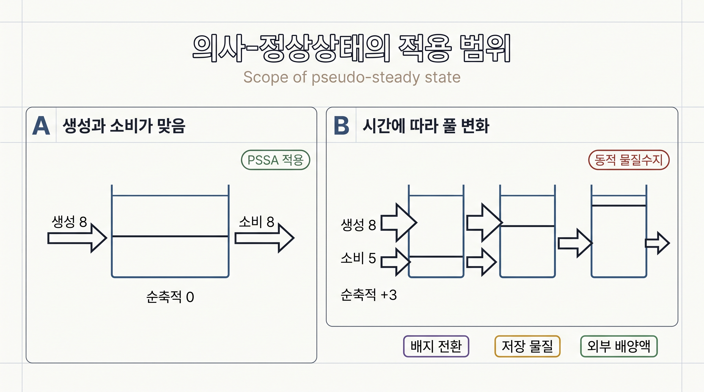

# 4. 물질수지와 의사-정상상태 제약

[화학량론 행렬](../glossary.md)은 반응별 계수와 플럭스를 이용해 각 대사물의 생성률과 소비률을 계산하는 기록표이다. 제약 기반 모델링에서는 세포 내 중간대사물마다 생성과 소비가 맞아 순축적이 없다고 근사한다. 이 조건을 간단히 쓰면 $$\mathbf{S}\mathbf{v}=\mathbf{0}$$이다. 이 절의 핵심은 이 등식을 대사물별 물질수지로 읽고 직접 검산하는 것이다.


대사물 풀의 크기가 일정하더라도 반응이 멈춘 것은 아니다. 해당 대사물을 만드는 반응들의 기여와 사용하는 반응들의 기여가 같은 속도로 이어질 수 있다. 따라서 $$\mathbf{S}\mathbf{v}=\mathbf{0}$$은 “모든 플럭스가 0”이 아니라 “대사물마다 생성과 소비가 맞는다”는 조건이다.


## 4.1 한 대사물의 물질수지

한 대사물이 여러 반응에 참여하면 각 반응이 그 대사물을 만들거나 사용한 양을 차례로 계산한다. 계산은 **반응식의 계수에 그 반응의 플럭스를 곱하는 것**이다. 이 교재의 COBRApy 예제처럼 플럭스를 $$\mathrm{mmol\,gDW^{-1}\,h^{-1}}$$로 나타내면 계산된 생성률과 소비률도 같은 단위를 가진다.

- 곱한 값이 양수이면 그 반응은 현재 방향에서 대사물을 만든다.
- 곱한 값이 음수이면 그 반응은 현재 방향에서 대사물을 사용한다.
- 곱한 값이 0이면 그 반응은 현재 조건에서 물질수지에 기여하지 않는다.

가역 반응에서는 플럭스가 음수일 수 있으므로 반응식의 계수만 보고 실제 생성·소비를 판정하지 않는다. 계수와 플럭스를 함께 확인한다.

모든 반응의 기여를 더하면 대사물 $$i$$의 순생성률이 된다.

$$
(\mathbf{S}\mathbf{v})_i
=
\sum_j S_{ij}v_j
=
\text{총생성률}-\text{총소비률}
$$

_그림 2.10:_ 대사물 $$B$$에 대한 두 생성 기여가 $$4+2=6$$이고 소비 기여가 6이면 순생성률은 0이다. 아래 비교에서는 생성 6과 소비 5가 맞지 않아 순생성률이 $$+1$$이며, 이 플럭스 조합을 지속하면 $$B$$가 축적된다. 단위를 지정하지 않은 교육용 물질수지 모식도이며 실제 모델 계산 결과가 아니다. 저자 작성; 개념 근거: [Orth, Thiele, Palsson (2010)](https://doi.org/10.1038/nbt.1614).

따라서 $$\mathbf{S}\mathbf{v}$$는 새로운 종류의 생물학적 측정값이 아니라, 반응 기록표와 선택한 플럭스 값을 이용해 계산한 **대사물별 순생성률 목록**이다.

## 4.2 일반 물질수지에서 의사-정상상태로

실제 세포에서 대사물의 양은 생성, 소비, 세포 성장에 따른 희석, 세포 안팎의 이동에 따라 변한다. 그러나 모든 농도 변화를 시간에 따라 측정하기는 어렵다. FBA는 관심 시간 동안 세포 내 중간대사물의 생성과 소비가 빠르게 균형을 이룬다고 근사하여 계산을 단순하게 만든다.

**[의사-정상상태](../glossary.md) 가정(pseudo-steady-state assumption, PSSA)**은 관심 시간척도에서 세포 내 중간대사물의 순축적과 성장 희석이 반응에 의한 생성·소비에 비해 충분히 작다고 보는 근사이다. 표준 [FBA](../chapter-4/README.md)는 이 근사를 다음 계산 제약으로 사용한다.

$$
\mathbf{S}\mathbf{v}=\mathbf{0}
$$

이 식은 모든 내부 대사물 $$i$$에 대해

$$
\text{총생성률}_i=\text{총소비률}_i
$$

를 요구한다. 수치 솔버에서는 지정한 feasibility tolerance 안에서 이 등식을 만족하는 것으로 판정한다.

| 이 조건이 뜻하는 것 | 이 조건만으로 뜻하지 않는 것 |
|:---|:---|
| 선택한 내부 대사물마다 생성과 소비가 맞음 | 모든 반응이 멈춤 |
| 관심 시간척도에서 순축적을 무시함 | 대사물 농도가 알려짐 |
| 명시한 모델과 bounds 아래의 계산 제약 | 실제 세포가 화학평형에 있음 |
| 여러 플럭스 조합을 걸러 내는 조건 | 어떤 플럭스 조합이 생물학적으로 최적인지 결정 |

정상상태는 화학평형과 다르다. 화학평형에서는 각 반응의 순속도가 0이지만, 대사 정상상태에서는 서로 다른 반응이 대사물을 계속 만들고 사용하면서 풀 크기만 일정하게 유지될 수 있다. 환경과의 물질 교환과 자유에너지 소산도 계속될 수 있다.

## 4.3 장난감 네트워크를 행별로 검산하기

다음 열린 장난감 네트워크를 고려한다.

$$
\begin{aligned}
R_0 &: \varnothing\rightarrow A,\\
R_1 &: A\rightarrow B,\\
R_2 &: B\rightarrow C,\\
R_3 &: A\rightarrow C,\\
R_4 &: C\rightarrow\varnothing.
\end{aligned}
$$

행 순서를 $$(A,B,C)$$, 열 순서를 $$(R_0,R_1,R_2,R_3,R_4)$$로 두면

$$
\mathbf{S}
=
\begin{bmatrix}
+1&-1&0&-1&0\\
0&+1&-1&0&0\\
0&0&+1&+1&-1
\end{bmatrix}.
$$

행렬 기호를 잠시 내려놓고 각 행을 말로 읽으면 다음과 같다.

- $$A$$: $$R_0$$에서 들어오고, $$R_1$$과 $$R_3$$에서 나간다.
- $$B$$: $$R_1$$에서 만들어지고, $$R_2$$에서 사용된다.
- $$C$$: $$R_2$$와 $$R_3$$에서 만들어지고, $$R_4$$에서 나간다.

플럭스를

$$
(v_0,v_1,v_2,v_3,v_4)=(8,3,3,5,8)
$$

로 두면 대사물별 계산은 다음과 같다.

| 대사물 | 생성 기여 | 소비 기여 | 순생성률 |
|:---:|:---|:---|:---:|
| $$A$$ | $$+1\times8=8$$ | $$1\times3+1\times5=8$$ | $$8-8=0$$ |
| $$B$$ | $$+1\times3=3$$ | $$1\times3=3$$ | $$3-3=0$$ |
| $$C$$ | $$1\times3+1\times5=8$$ | $$1\times8=8$$ | $$8-8=0$$ |

세 행에서 모두 생성과 소비가 맞으므로 이 플럭스 조합은 $$\mathbf{S}\mathbf{v}=\mathbf{0}$$을 만족한다. 이 검산은 각 대사물 행의 기여를 곱하고 더하는 것만으로 수행할 수 있다.

반대로 $$(v_0,v_1,v_2,v_3,v_4)=(8,3,2,5,8)$$로 $$v_2$$만 바꾸면 $$B$$의 순생성률은 $$3-2=1$$, $$C$$의 순생성률은 $$2+5-8=-1$$이 된다. 합계가 0이 아닌 행은 해당 플럭스 조합에서 그 대사물이 축적되거나 고갈된다는 신호이다.

## 4.4 반응 연결과 가능한 플럭스의 구분

그림이나 반응 목록에서 경로가 이어져 있어도 물질수지와 bounds를 동시에 만족하지 못하면 정상상태 플럭스는 흐를 수 없다. 예를 들어 위 네트워크에서 $$R_2$$를 $$v_2=0$$으로 막으면 $$B$$의 물질수지는

$$
v_1-v_2=v_1=0
$$

을 요구한다. 따라서 $$A\rightarrow B$$ 연결이 그림에 남아 있어도 정상상태에서는 $$R_1$$을 통해 비영 플럭스가 흐를 수 없다. 한편 직접 경로 $$R_3:A\rightarrow C$$는 $$v_0=v_3=v_4$$로 맞추면 사용할 수 있다.

이 예는 다음 두 정보를 분리해 읽어야 함을 보여 준다.

1. $$\mathbf{S}$$는 어떤 대사물이 어떤 반응에서 생성·소비되는지를 기록한다.
2. bounds는 각 반응에서 허용하는 플럭스 방향과 범위를 기록한다.

한 반응의 bound를 바꾸면 연결된 여러 대사물의 수지식이 함께 영향을 받는다. 따라서 반응 하나만 보고 가능한 흐름을 판정하지 않고, 연결된 대사물 행을 다시 검산한다. 목적함수를 추가해 여러 가능한 플럭스 가운데 하나를 선택하는 과정은 [Chapter 4](../chapter-4/README.md)에서 다룬다.

## 4.5 의사-정상상태를 적용하기 어려운 경우

PSSA는 다음 상황에서 그대로 적용하기 어렵다.

- 급격한 배지 전환 뒤 대사물 풀이 변하는 과도 상태
- 글리코겐·지질방울처럼 의도적으로 축적되는 저장 물질
- 배양액 농도처럼 시간에 따라 고갈·축적되는 외부 상태변수
- 성장 희석이 물질수지에서 무시할 수 없는 정량 문제

_그림 2.11:_ 패널 A는 생성률과 소비률이 각각 8로 같아 관심 시간척도에서 순축적을 0으로 둘 수 있는 상태를 나타낸다. 패널 B는 생성률 8과 소비률 5의 차이만큼 풀이 증가하므로 동적 물질수지가 필요하다. 배지 전환, 저장 물질 축적과 외부 배양액 변화는 패널 B에 가까운 사례가 될 수 있다. 단위가 없는 교육용 비교 모식도이며 실제 GEM 계산 결과가 아니다. 저자 작성; 개념 근거: [Orth, Thiele, Palsson (2010)](https://doi.org/10.1038/nbt.1614).

이러한 문제에는 외부 물질수지, 동적 FBA, 비정상상태 MFA 또는 동역학 모델이 필요하다. 어떤 접근을 선택하든 모델에 포함한 대사물, 계의 경계, 시간척도와 측정 단위를 먼저 명시해야 한다.

## 4.6 물질수지 검산 순서

새로운 모델이나 계산 결과에서 $$\mathbf{S}\mathbf{v}$$를 해석할 때에는 다음 순서를 따른다.

1. 검산할 대사물과 구획을 확인한다.
2. 해당 대사물의 행에서 0이 아닌 화학량론 계수를 찾는다.
3. 각 계수에 해당 반응의 플럭스를 곱한다.
4. 양의 기여는 생성, 음의 기여는 소비로 나누어 합한다.
5. 두 합이 지정한 수치 허용오차 안에서 맞는지 확인한다.
6. 순생성률이 0이어도 농도·풀 크기·최적성이 결정된 것은 아님을 명시한다.
7. 과도 상태나 저장 물질처럼 PSSA가 부적절한 상황인지 평가한다.

---

### 해석상의 주의

- $$\mathbf{S}\mathbf{v}=\mathbf{0}$$은 대사물별 생성과 소비가 맞는다는 뜻이며, 모든 플럭스가 0이라는 뜻이 아니다.
- 정상상태는 화학평형이 아니다. 총생성률과 총소비률이 비영이어도 순생성률은 0일 수 있다.
- $$\mathbf{S}\mathbf{v}$$의 단위는 사용한 플럭스 정규화에 따르며, 별도 변환 없이 농도 변화율로 읽지 않는다.
- 그래프에 경로가 존재해도 물질수지와 bounds를 만족하는 비영 플럭스가 보장되지는 않는다.
- 의사-정상상태의 적절성은 대사물의 역할, 계의 경계와 관심 시간척도에 따라 판단한다.

### 참고문헌

1. Orth JD, Thiele I, Palsson BØ. What is flux balance analysis? *Nature Biotechnology*. 2010;28:245–248. [DOI: 10.1038/nbt.1614](https://doi.org/10.1038/nbt.1614), [PMC3108565](https://pmc.ncbi.nlm.nih.gov/articles/PMC3108565/)
---
