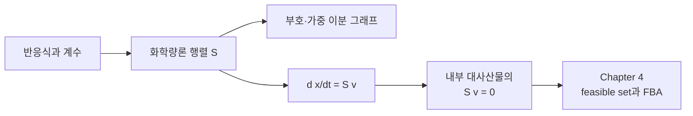

# Chapter 2. 생화학 반응과 대사 네트워크의 수학적 표현

제약 기반 대사 모델은 반응식을 화학량론 행렬 $$\mathbf S$$로 표현한다. 행렬의 각 열은 하나의 반응, 각 행은 하나의 compartment-specific metabolite를 나타낸다. 이 표현을 사용하면 농도 변화는

$$
\frac{d\mathbf x}{dt}=\mathbf S\mathbf v
$$

로, 내부 대사산물의 pseudo-steady-state 조건은

$$
\mathbf S\mathbf v=\mathbf 0
$$

로 기술할 수 있다. 이 장은 반응식에서 $$\mathbf S$$를 구성하고, 행렬·이분 그래프·flux vector가 같은 네트워크를 어떻게 서로 보완하여 표현하는지 다룬다.

## 범위

이 장은 화학량론, 반응 방향성, flux bounds, matrix rank 및 null space를 다룬다. GPR, 세포 구획의 생물학적 의미, transport, boundary reaction 및 biomass formulation은 [Chapter 3](../chapter-3/README.md)에서 다룬다. FBA의 선형계획 정식화와 flux variability analysis는 [Chapter 4](../chapter-4/README.md)에서 다룬다.

## 표현의 흐름

*Figure 2.1: 반응식에서 정상상태 제약까지의 표현 변환. 행렬과 이분 그래프는 동일한 화학량론 정보를 다른 형식으로 나타낸다. 저자 작성.*

## 장 구성

| 절 | 주제 | 핵심 산출물 |
|:---|:---|:---|
| §1 | 반응·대사산물·flux | 부호와 단위가 명시된 reaction record |
| §2 | 화학량론 행렬 | $$\mathbf S$$의 행·열과 계수 |
| §3 | 이분 그래프 | 반응–대사산물 연결 구조 |
| §4 | 동역학·정상상태·선형대수 | rank, null space, conservation relation |
| Lab | COBRApy 조회와 행렬 검산 | `textbook` 모델의 $$\mathbf S$$ snapshot |

## 표기

| 기호 | 의미 |
|:---:|:---|
| $$m,n$$ | metabolite 수, reaction 수 |
| $$\mathbf S\in\mathbb R^{m\times n}$$ | stoichiometric matrix |
| $$\mathbf v\in\mathbb R^n$$ | flux vector |
| $$\mathbf x\in\mathbb R^m$$ | metabolite amount 또는 concentration vector |
| $$r=\operatorname{rank}(\mathbf S)$$ | 행렬 rank |
| $$\ell_j,u_j$$ | reaction $$j$$의 lower/upper bound |

Flux의 단위는 모델 convention에 따라 다르며, 이 교재의 COBRApy 예제에서는 일반적으로 $$\mathrm{mmol\,gDW^{-1}\,h^{-1}}$$를 사용한다.

## 대화형 도해: 핵심 가정과 결과 해석


아래 도해는 **교육용 개념·모의 데이터**를 조작하여 이 장의 핵심 가정과 해석 범위를 확인하는 보조 자료이다. 실제 GEM 결과로 인용할 수 없으며, 실제 계산은 모델 버전·배지·목적함수·solver·허용오차를 고정한 실습 코드로 재현해야 한다.




[새 창에서 대화형 도해 열기](https://cdn.jsdelivr.net/gh/jyryu3161/ebook_metabolic_modeling@main/interactive/index.html?chapter=2)

## 학습 목표

이 장을 마치면 다음을 수행할 수 있다.

1. 반응식의 소비·생성 계수를 $$\mathbf S$$의 한 열로 변환한다.
2. flux 부호와 bound가 저장된 반응식의 방향과 어떻게 연결되는지 설명한다.
3. compartment suffix가 다른 metabolite species를 구분하고 필요한 transport reaction을 식별한다.
4. $$\mathbf S\mathbf v$$를 계산하여 metabolite별 순생성률을 해석한다.
5. pseudo-steady-state 가정과 thermodynamic equilibrium을 구분한다.
6. rank–nullity theorem으로 $$\dim\ker(\mathbf S)=n-r$$를 계산하고, null-space basis·elementary flux mode·extreme ray를 구별한다.
7. COBRApy의 `textbook` 모델에서 $$\mathbf S$$의 크기, nonzero entry, rank 및 null-space dimension을 검산한다.

---
