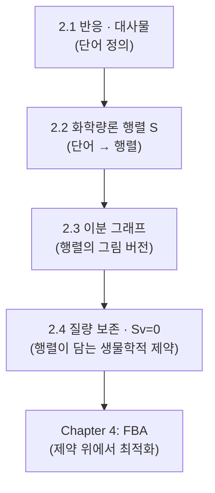

# Chapter 2. 생화학 반응과 대사 네트워크 표현

> 대사 네트워크를 이루는 반응과 대사물을 정의하고, 이를 하나의 거대한 화학량론 행렬(stoichiometric matrix, $$\mathbf{S}$$)로 압축하는 방법을 손으로 직접 계산하며 배웁니다. 이 행렬과 질량 보존·정상 상태 가정 $$\mathbf{S}\cdot\mathbf{v} = \mathbf{0}$$은 이후 모든 챕터([GEM 구조](../chapter-3/README.md), [FBA](../chapter-4/README.md))가 딛고 서는 수학적 지반입니다.


이 장은 행렬(matrix)·계수(rank)·영공간(null space) 같은 선형대수 용어를 **처음부터 손 계산으로** 다시 쌓아 올립니다. 대학교 1학년 수준의 "행렬은 숫자를 네모나게 늘어놓은 표"라는 감각만 있으면 충분합니다. 여기서 익힌 계산 감각은 [Chapter 4](../chapter-4/README.md)에서 자유도를 목적함수와 연결할 때 그대로 재사용됩니다.


## 이 장을 시작하며

[Chapter 1](../chapter-1/README.md)에서 우리는 게놈 규모 대사 모델(genome-scale metabolic model, GEM)이 수천 개의 반응으로 이루어진 거대한 "지도"라는 것을 확인했습니다. *E. coli*의 core 모델만 해도 95개 반응, 최신 iML1515 모델은 유전자 1,516개·반응 2,712개·대사물 1,877개를 가지고 있습니다. Chapter 1이 이 지도를 "멀리서" 조망하며 왜 이런 모델이 필요한지, 무엇을 할 수 있는지를 소개했다면, 이번 장은 그 지도를 이루는 낱장 지도 한 장 한 장 — 즉 반응 하나, 대사물 하나 — 을 확대해서 들여다보는 데서 출발합니다.

여기서 자연스러운 질문이 떠오릅니다.

> **잠깐, 생각해보기:** 종이 위에 그려진 수천 개의 화학 반응식 목록을, 컴퓨터가 1초 만에 계산할 수 있는 형태로 바꾸려면 어떻게 해야 할까요? 반응식을 문자열 그대로 저장해서 하나씩 읽어가며 계산하면 될까요?

문자열을 하나씩 파싱해서 계산하는 방식은 반응이 10개 정도일 때는 통하겠지만, 반응이 수천 개가 되는 순간 감당할 수 없습니다. 예를 들어 "포도당이 줄면 피루브산이 늘어나는가?"라는 단순한 질문에 답하려 해도, 문자열 파싱 방식으로는 관련된 모든 반응식을 사람이 일일이 손으로 추적해야 합니다. 반응이 95개만 되어도 이 방식은 이미 버겁고, 2,712개(iML1515)에 이르면 사실상 불가능합니다.

다행히 화학 반응식에는 우리가 이미 알고 있는 강력한 수학적 도구 — **선형대수학(linear algebra)** — 를 그대로 적용할 수 있는 구조가 숨어 있습니다. 바로 반응식이 "대사물의 개수를 세는 방정식"이라는 점입니다. 헥소키나제 반응 "ATP + Glucose → ADP + Glucose-6-phosphate"을 다시 보면, 이것은 결국 "ATP 1개, Glucose 1개가 줄고, ADP 1개, Glucose-6-phosphate 1개가 늘어난다"는 **숫자들의 나열**에 불과합니다. 이 관찰을 모든 반응에 대해 반복하면, 반응식이라는 텍스트가 순수한 **숫자표(행렬)**로 바뀝니다. 이 장에서는 이 관찰을 발전시켜, 대사 네트워크 전체를 **화학량론 행렬(stoichiometric matrix)** $$\mathbf{S}$$라는 단 하나의 행렬로 압축하는 방법을 배웁니다. 이 행렬이 갖춰지면 "세포가 정상적으로 살아있다"는 생물학적 사실조차 $$\mathbf{S}\mathbf{v} = \mathbf{0}$$이라는 간단한 선형 방정식으로 표현할 수 있게 됩니다.

이 장의 흐름을 미리 지도로 그려보면 다음과 같습니다.

즉 1절에서 "단어"를 정의하고, 2절에서 그 단어들을 행렬로 조립하고, 3절에서 같은 내용을 그래프로 다시 그려보고, 4절에서 그 행렬 위에 "세포가 정상적으로 살아있다"는 물리적 제약을 얹습니다. 이 순서를 따라가면 자연스럽게 다음 장(FBA)의 출발선에 서게 됩니다.

이 장을 마치고 나면, 여러분은 대사 네트워크의 "언어" — 반응·대사물·화학량론 행렬 — 를 자유롭게 읽고 쓸 수 있게 됩니다. 다만 아직 그 행렬에 "누가 이 반응을 수행하는가"(유전자·효소)와 "이 반응이 세포의 어디에서 일어나는가"(구획)에 대한 정보는 담기지 않은 상태입니다. 그 부분은 [Chapter 3](../chapter-3/README.md)에서 이어집니다.

---
## 학습 목표 (Learning Objectives)

이 챕터를 마치면 다음을 할 수 있습니다.

1. 반응(reaction)과 대사물(metabolite)이 가지는 속성과 이 둘의 관계, 그리고 그 뒤에 있는 효소(enzyme)의 역할을 설명할 수 있다.
2. 반응식 표기법과 방향성·가역성(reversibility)이 통량 하한/상한($$v^{lb}, v^{ub}$$)으로 수치화되는 원리를 이해한다.
3. 대사물 ID의 구획(compartment) 접미사 규칙을 읽고 해석할 수 있다.
4. **작은 장난감 네트워크를 손으로 직접 계산**하여 화학량론 행렬 $$\mathbf{S}$$를 구성하고, 실제 게놈 규모 모델에서 나타나는 희소성(sparsity)과 허브 대사물(hub metabolite)의 의미를 설명할 수 있다.
5. 대사 네트워크를 이분 그래프(bipartite graph)와 행렬이라는 두 가지 동등한 방식으로 표현할 수 있음을 이해한다.
6. 대사물 농도 변화식 $$d\mathbf{x}/dt = \mathbf{S}\mathbf{v}$$로부터 의사-정상 상태 가정(pseudo-steady-state assumption, PSSA)을 유도하고, 손으로 만든 장난감 네트워크에서 $$\mathbf{S}\mathbf{v} = \mathbf{0}$$을 직접 풀어 왜 이 시스템이 과소결정(underdetermined)인지, 왜 교환 반응이 없으면 아무 것도 흐를 수 없는지 설명할 수 있다.
7. COBRApy로 모델의 반응·대사물 객체와 $$\mathbf{S}$$ 행렬에 직접 접근하고, 희소성·계수(rank)·자유도를 실제 수치로 확인할 수 있다.
8. 이 챕터가 다루는 범위(반응·대사물·$$\mathbf{S}$$·질량 보존)와, 다음 챕터로 미뤄둔 범위(GPR, 구획·수송, 바이오매스 조성 — [Chapter 3](../chapter-3/README.md); FBA·LP·FVA — [Chapter 4](../chapter-4/README.md))를 명확히 구분할 수 있다.


**이 챕터 전체에서 사용하는 표기 규약**: $$\mathbf{S}$$(화학량론 행렬, $$m\times n$$), $$m$$(대사물 수), $$n$$(반응 수), $$r$$(계수, rank), $$\mathbf{v}$$(플럭스 벡터, 성분 $$v_j$$, 단위 mmol·gDW⁻¹·h⁻¹), $$\mathbf{x}$$(대사물 농도 벡터). 이 기호들은 이후 [Chapter 4](../chapter-4/README.md)에서도 그대로 사용되므로 지금 익혀두면 계속 재사용할 수 있습니다.


---
