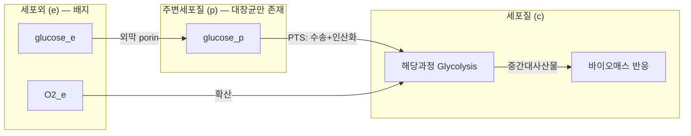

# Chapter 3. Genome-scale Metabolic Model (GEM)의 구조

> 이 장에서는 화학량론 행렬 $$\mathbf{S}$$ 위에 유전자·구획·경계·목적함수라는 "생물학적 정체성"을 입혀, GEM을 이름 그대로 **살아있는 세포를 흉내 내는 계산 가능한 모델**로 완성합니다.


이 구조를 파일로 저장하는 XML 계층, SBML Level 3 FBC, COBRApy 왕복 저장 검증은 [SBML 실무 보충](supplements/sbml-practical.md)에서 이어집니다.


## 이 장을 시작하며

잠깐 상상해 봅시다. [Chapter 2](chapter-2..md)에서 만든 화학량론 행렬 $$\mathbf{S}$$를 여러분에게 건네주고 "이걸로 대장균이 자랄지 예측해 보세요"라고 하면, 여러분은 무엇부터 물어봐야 할까요?

- 이 반응을 실제로 수행하는 효소가 세포 안에 있나요? 그 효소를 만드는 유전자가 살아있나요?
- 이 반응은 세포의 어느 "방(구획)"에서 일어나나요? 세포질인가요, 막 바깥인가요?
- 세포가 배지에서 무엇을 흡수하고 무엇을 내보내나요? (즉, 이 세포는 지금 무엇을 "먹고" 있나요?)
- 그리고 무엇보다 — 이 반응들이 다 모여서 결국 **무엇을 만들기 위해** 존재하나요?

[Chapter 2](chapter-2..md)의 $$\mathbf{S}$$는 이 질문들 중 어느 것에도 답하지 못합니다. $$\mathbf{S}$$는 오직 "무엇이 무엇으로 바뀌는가"라는 화학량론만 담을 뿐, **유전자·위치·환경·목적**이라는 정보가 통째로 빠져 있기 때문입니다. 실제 GEM 파일(SBML)을 열어보면 $$\mathbf{S}$$ 이외에도 이 네 가지 질문에 답하는 부가 정보 — **GPR 규칙**, **구획(compartment)**, **경계 반응(exchange/demand/sink)**, **바이오매스 목적함수** — 가 반드시 함께 붙어 있습니다. 이 장에서는 이 네 요소를 하나씩 뜯어보며, $$\mathbf{S}$$라는 뼈대에 살을 붙이는 방법을 배웁니다.

---

## 학습 목표

이 챕터를 마치면 다음을 할 수 있습니다.

1. GPR(Gene-Protein-Reaction) 연관을 AND(효소 복합체)·OR(동위 효소) Boolean 논리로 표현하고, 주어진 유전자 결손 시나리오에 대해 반응이 켜지는지(on) 꺼지는지(off)를 **손으로 직접 계산**할 수 있다.
2. 그람음성 세균 모델의 세포질·주변세포질·세포외 구획과 진핵생물의 다중 구획 구조를 비교하고, 각 구획의 화학적 환경이 왜 다른지 설명할 수 있다.
3. 운송 반응(transport reaction)의 세 가지 메커니즘(확산·촉진확산·능동수송)을 구분하고, 아세포위 국소화(subcellular localization) 예측 도구의 원리를 이해한다.
4. 교환(exchange)·요구(demand)·싱크(sink) 반응의 차이를 구분하고, 이들의 bounds로 배지 조성(성장 조건)을 정의할 수 있다.
5. 바이오매스 목적함수(BOF)의 구성 요소와 계수 계산 방법을 이해하고, GAM/NGAM이 왜 필요한지 설명할 수 있다.
6. 원핵생물 GEM과 진핵생물 GEM의 구조적 차이(anatomy)를 유전자·반응·대사물·구획 수 측면에서 정량적으로 비교하고, COBRApy로 GPR·구획·바이오매스 반응을 직접 조회할 수 있다.

---

## 1. 화학량론 행렬에 생물학적 정체성 부여하기

### 1.1 이 장에서 다루는 것

[Chapter 2](chapter-2..md)의 화학량론 행렬 $$\mathbf{S} \in \mathbb{R}^{m \times n}$$은 "어떤 대사물이 어떤 반응에서 얼마나 소비·생성되는가"라는 순수하게 화학량론적인 정보만 담고 있습니다. 그러나 실제 GEM 파일(SBML)을 열어보면 $$\mathbf{S}$$ 외에도 다음과 같은 부가 정보가 함께 붙어 있습니다.

- 각 반응에는 이를 촉매하는 유전자 목록이 **GPR 규칙**으로 붙어 있습니다.
- 각 대사물과 반응에는 **구획(compartment)** 태그가 붙어 있어, 같은 분자라도 위치가 다르면 별개의 노드로 취급됩니다.
- 세포와 환경의 경계에는 **exchange/demand/sink** 반응이 있어, 모델이 어떤 조건(배지)에서 시뮬레이션되는지를 결정합니다.
- 하나의 특별한 반응(**바이오매스 반응**)이 "세포가 무엇을 위해 존재하는가"라는 목적을 인코딩합니다.

이 네 가지가 바로 GEM의 "해부학(anatomy)"이며, 이 장의 제목이 뜻하는 바입니다. 이들은 서로 독립적이지 않습니다 — GPR은 구획별로 다른 아이소자임을 가질 수 있고, 운송 반응은 구획 사이를 잇는 특수한 GPR을 가지며, 바이오매스 반응은 여러 구획에서 온 전구체를 소비합니다. 이 장을 통해 이 네 요소가 어떻게 맞물려 하나의 살아있는 세포의 논리를 구성하는지 살펴봅니다.

### 1.2 규모의 역사적 진화: 왜 인체 GEM이 미생물 GEM보다 훨씬 큰가

이 장에서 다룰 구조 요소들이 실제로 모델 규모에 미치는 영향을 먼저 숫자로 확인해 보겠습니다. 대장균(*E. coli*) GEM은 지난 20여 년간 다음과 같이 발전했습니다.

| 모델명 | 연도 | 유전자 수 | 반응 수 | 대사산물 수 | 참고 |
|:---|:---:|---:|---:|---:|:---|
| iJE660 | 2000 | 660 | 627 | 438 | Edwards & Palsson, 첫 대장균 GEM |
| iJR904 | 2003 | 904 | 931 | 625 | Reed et al., 중앙대사 중심 확장 |
| iAF1260 | 2007 | 1,260 | 2,077 | 1,039 | Feist et al., 유전자 규모 대폭 확장 |
| iJO1366 | 2011 | 1,366 | 2,252 | 1,136 | Orth et al., 추가 경로 반응 포함 |
| iML1515 | 2017 | 1,516 | 2,712 | 1,877 | Monk et al., 최신 수동 큐레이션 모델 |

*Table 1.1: 대장균 GEM의 역사적 발전 (Monk et al., 2017).*

인체 GEM은 다음과 같이 훨씬 더 빠르게 커졌습니다.

| 모델명 | 연도 | 유전자 수 | 반응 수 | 대사산물 수(논문 집계) | 참고 |
|:---|:---:|---:|---:|---:|:---|
| Recon 1 | 2007 | 1,496 | 3,311¹ | 2,766 total¹ | 최초의 포괄적 문헌 기반 인체 재구축 |
| Recon 2 | 2013 | 1,789 | 7,440 | 5,063 | 여러 기존 재구축을 community consensus로 통합 |
| Recon 2.2 | 2016 | 1,675 | 7,785 | 5,324 | 대사산물·GPR·에너지 대사 정비 |
| Recon3D | 2018 | 3,288 ORF | 13,543² | — | 12,890개 단백질 구조를 연결한 reconstruction |
| Human1 | 2020 | 3,625 | 13,417 | 10,138 | HMR2·iHsa·Recon3D를 통합한 Human-GEM 기반 |
| Human2 | 2026 | 2,848 | 12,931 | 8,461 | LLM 보조 GPR 점검; 별도의 전문가·커뮤니티 반응 큐레이션 |

*Table 1.2: 인체 GEM의 주요 이정표. ¹Recon1 본문 요약은 2,766 total metabolites와 3,311 metabolic/transport reactions를 제시하지만, Table 1은 2,712 compartment-specific metabolites·3,311 intrasystem reactions·432 exchange reactions로 나눕니다. ²Recon3D의 공개 reconstruction 규모이며, 논문에서 분석에 사용한 flux-consistent 파생 모델은 10,600개 반응·5,835개 구획화 대사산물을 가집니다. 모델마다 exchange 포함 여부와 unique/compartmentalized metabolite 기준이 달라 숫자를 같은 정의로 읽어야 합니다. 정확한 fork/merge 계보와 출처는 [Chapter 5](chapter-5..md)를 참고하십시오.*

Recon3D의 10,600개 반응은 iML1515의 2,712개 반응보다 약 4배 많습니다.

> 🤔 **잠깐, 생각해보기:** 인체가 대장균보다 반응 수가 4배 많다는 것은 "인체가 화학적으로 4배 더 복잡한 반응을 한다"는 뜻일까요? 답을 읽기 전에 잠깐 추측해 봅시다 — 힌트는 이 장의 제목(GEM의 **구조**)에 있습니다.

정답은 "아니오"입니다. 이 차이는 이 장에서 다룰 세 가지 **구조적** 요인 때문입니다.

1. **세포 구획 수의 증가**: 세포질 외에도 미토콘드리아, 소포체, 골지체 등 여러 구획 간의 운송 반응이 추가됩니다. Recon3D의 10,600개 반응 중 약 3,000개(28%)가 구획 간 운송 반응입니다.
2. **조직 특이적 아이소자임의 존재**: 같은 반응을 촉매하는 여러 아이소자임 유전자가 별도의 GPR 항목으로 등록됩니다.
3. **복잡한 지질 대사**: 세포막 구성·신호전달·에너지 저장을 위한 수백 종의 지방산·인지질 대사가 추가됩니다.

즉 "모델이 크다"는 것은 곧 "GPR·구획·운송이 복잡하다"는 것과 같은 말입니다. 2~4절에서 이 세 요소를 하나씩 뜯어봅니다.

---

## 2. 유전자-단백질-반응 연관 (Gene-Protein-Reaction, GPR)

### 2.1 GPR의 기본 논리: AND와 OR

일상에서 흔히 쓰는 두 가지 장치를 떠올려 봅시다. 은행 금고는 **열쇠 두 개가 모두** 있어야 열립니다 — 하나만 있으면 아무 소용이 없습니다. 반면 건물에 앞문과 뒷문이 모두 있다면, **둘 중 하나만** 열려 있어도 안으로 들어갈 수 있습니다. 대사 반응을 가능하게 하는 유전자들도 이 두 가지 방식 중 하나로 조합됩니다.

대사 반응은 효소(Enzyme)에 의해 촉매되며, 효소는 유전자(Gene)에 의해 인코딩됩니다. **유전자-단백질-반응 연관(Gene-Protein-Reaction, GPR)**은 유전자에서 반응으로의 매핑을 **Boolean 논리**로 공식화한 것입니다.

> **핵심 개념 · 용어(English):** **GPR(Gene-Protein-Reaction) 연관**은 "유전자 → 효소 → 반응"이라는 사슬을 AND(복합체, 금고의 두 열쇠)와 OR(동위 효소, 건물의 앞문·뒷문)이라는 두 가지 논리 연산자로 인코딩한 규칙입니다. GPR은 유전자 수준의 교란(결실, 발현 변화)을 반응 수준의 통량 제약으로 변환하는 공식적 다리 역할을 합니다.

**AND 논리 — 효소 복합체(Enzyme Complex, "두 열쇠 금고")**: 여러 유전자 산물이 모두 존재해야 반응이 일어납니다. 반응 $$R_j$$가 단백질 A와 B로 형성된 복합체에 의해 촉매된다면:

$$R_j \Leftrightarrow (\text{Gene}_A \; \text{AND} \; \text{Gene}_B)$$

Gene A나 B 중 하나라도 결실되면 반응은 제거됩니다.

**OR 논리 — 동위 효소(Isozyme, "앞문·뒷문")**: 여러 유전자 산물 중 하나라도 존재하면 반응이 가능합니다. 반응 $$R_j$$가 Gene C 또는 Gene D의 효소로 촉매될 수 있다면:

$$R_j \Leftrightarrow (\text{Gene}_C \; \text{OR} \; \text{Gene}_D)$$

Gene C가 결실되어도 Gene D가 기능적이면 반응은 유지되지만, 둘 다 결실되면 반응은 제거됩니다.

GPR 문자열은 다음과 같은 형식을 가지며, 괄호로 AND와 OR을 중첩할 수 있습니다.

```
(gene1 AND gene2) OR gene3
```


❓ **흔한 오해:** "OR로 연결된 유전자 중 아무거나 하나를 고르면 된다"는 것은 절반만 맞는 말입니다. GPR의 OR은 **"기능적으로 하나만 있어도 반응이 유지된다"**는 뜻이지, 두 유전자가 항상 똑같이 발현된다는 뜻이 아닙니다. 실제로는 조직·조건에 따라 어떤 유전자가 활성 상태인지가 달라집니다 (2.6~2.7절의 Hexokinase·GLUT 사례에서 이를 자세히 다룹니다).


### 2.2 GPR 예시와 유전자 결실 효과

| GPR 규칙 | 논리 유형 | 효소 구조 | 유전자 결실 효과 |
|:---|:---:|:---|:---|
| $$R_1 \Leftrightarrow (\text{glpK})$$ | 단일 유전자 | 단량체 키나아제 | glpK 결실 시 $$R_1$$ 제거 |
| $$R_2 \Leftrightarrow (\text{sdhA AND sdhB AND sdhC AND sdhD})$$ | AND 복합체 | 석신산 탈수소효소 (4개 소단위) | **어느** 소단위 결실 시에도 $$R_2$$ 제거 |
| $$R_3 \Leftrightarrow (\text{pfkA OR pfkB})$$ | OR 동위 효소 | phosphofructokinase 동위효소 | **적어도 하나**의 유전자 존재 시 $$R_3$$ 활성 |
| $$R_4 \Leftrightarrow (\text{aceE AND aceF AND lpd})$$ | AND 복합체 | 피루브산 탈수소효소 복합체 | 어느 필수 성분이든 결손되면 $$R_4$$ 비활성 |

*Table 2.1: GPR 규칙 예시. `pgi`와 `pfkA`는 해당과정의 서로 다른 반응을 촉매하므로 OR 관계가 아닙니다. 실제 GPR에서는 반응 자체가 같은지와 복합체의 모든 필수 성분이 포함됐는지를 먼저 확인합니다.*

### 2.3 손으로 직접 풀어보기: GPR 판정 손 계산

이제 표로만 보지 말고, GPR 규칙 하나를 놓고 유전자 결손 시나리오별로 반응이 켜지는지(ON) 꺼지는지(OFF)를 **직접 손으로 판정**해 봅시다. 다음과 같은 가상의 GPR 규칙을 생각해 봅니다.

$$R \Leftrightarrow (\text{geneA} \; \text{AND} \; \text{geneB}) \; \text{OR} \; \text{geneC}$$

이 규칙은 "geneA와 geneB가 함께 만드는 효소 복합체" 또는 "geneC가 만드는 별도의 동위 효소" 중 **하나만 있어도** 반응 $$R$$이 일어난다는 뜻입니다. 유전자가 존재하면 1, 결손되면 0으로 놓고, AND는 "둘 다 1이어야 1"(곱셈과 같음), OR은 "하나만 1이어도 1"(최댓값과 같음)로 계산하면 다음과 같은 진리표를 얻습니다.

| 시나리오 | geneA | geneB | geneC | (geneA AND geneB) | 최종: (…) OR geneC | 반응 $$R$$ |
|:---|:---:|:---:|:---:|:---:|:---:|:---:|
| ① 야생형(WT, 결손 없음) | 1 | 1 | 1 | 1 | 1 | **ON** |
| ② geneA만 결손 | 0 | 1 | 1 | 0 | 1 | **ON** (geneC가 대신함) |
| ③ geneC만 결손 | 1 | 1 | 0 | 1 | 1 | **ON** (복합체가 살아있음) |
| ④ geneA + geneC 이중 결손 | 0 | 1 | 0 | 0 | 0 | **OFF** |
| ⑤ geneB만 결손 | 1 | 0 | 1 | 0 | 1 | **ON** (geneC가 대신함) |
| ⑥ geneA + geneB 이중 결손 | 0 | 0 | 1 | 0 | 1 | **ON** (geneC가 대신함) |
| ⑦ 세 유전자 모두 결손 | 0 | 0 | 0 | 0 | 0 | **OFF** |

*Table 2.2: 가상 GPR 규칙 $$(\text{geneA AND geneB}) \text{ OR geneC}$$의 유전자 결손 시나리오별 반응 상태 손 계산. AND로 묶인 두 유전자는 "함께 있어야만" 값을 내므로 **한쪽만 없어도 그 항 전체가 0**이 되고, OR로 묶인 항은 **어느 한쪽만 1이어도 전체가 1**이 됩니다.*

이 표에서 가장 눈여겨봐야 할 것은 시나리오 ④입니다. geneA 하나만 없앨 때는 반응이 꺼지지 않다가(②), geneC까지 함께 없애야 비로소 반응이 완전히 꺼집니다(④). 즉 **두 유전자를 동시에 결손시켜야만 드러나는 필수성**이 있으며, 이는 [Chapter 8](chapter-8..md)에서 다룰 **합성 치사(synthetic lethality)** 개념의 가장 단순한 형태이기도 합니다.

> 🤔 **잠깐, 생각해보기:** 만약 GPR이 순서를 바꿔 $$(\text{geneA OR geneB}) \; \text{AND} \; \text{geneC}$$였다면, geneA와 geneB를 **모두** 결손시키면 반응은 어떻게 될까요? geneC는 멀쩡히 남아 있습니다.
>
> **답:** 이번에는 OR로 묶인 (geneA OR geneB)가 바깥쪽 AND의 한 항입니다. geneA와 geneB를 모두 없애면 (geneA OR geneB) = 0이 되고, "0 AND geneC" = 0이 되므로 — geneC가 멀쩡해도 **반응은 꺼집니다**. 똑같은 세 유전자라도 AND/OR의 **중첩 순서**가 결과를 완전히 뒤바꾼다는 점이 이 계산의 핵심입니다.

같은 계산을 실제 대장균 유전자로 반복해 봅시다. Table 2.1의 피루브산 탈수소효소 반응은 $$R_4 \Leftrightarrow (\text{aceE AND aceF AND lpd})$$입니다.

- `aceE`만 결손 → 0 AND 1 AND 1 = 0이므로 $$R_4$$는 **OFF**.
- `lpd`만 결손해도 1 AND 1 AND 0 = 0이므로 $$R_4$$는 **OFF**.

여기서 `lpd`는 단독 대체효소가 아니라 복합체의 E3 성분입니다. 다만 같은 `lpd` 유전자가 다른 탈수소효소 복합체에도 재사용될 수 있다는 사실과, 이 반응 안에서 OR 대체항이라는 주장은 서로 다릅니다.

이것이 바로 2.2절 표의 "유전자 결실 효과" 열을 실제로 계산해 내는 방법이며, 다음 절에서 다룰 유전자 필수성 예측 파이프라인의 첫 단계입니다.

### 2.4 GPR을 통한 in silico 유전자 필수성(Gene Essentiality) 예측

GPR 규칙은 유전자 수준 교란을 반응 수준 시뮬레이션으로 옮기는 공식적 파이프라인을 제공합니다.

```
유전자 결실 → GPR 평가(2.3절의 손 계산) → 반응 제거 → FBA 재실행 → 성장률 비교 → 필수/비필수 분류
```

1. **목표 유전자 $$g$$를 결실시킴** (존재 여부를 0으로 설정)
2. **GPR 규칙을 평가**하여 어떤 반응들이 촉매 활성을 잃는지 결정 (2.3절에서 손으로 해본 바로 그 계산)
3. **활성을 잃은 반응의 통량을 0으로 제약**
4. **[FBA](chapter-4.-flux-balance-analysis-fba.md) LP를 재최적화**하여 최대 바이오매스 계산
5. **생존 임계값(일반적으로 야생형 최대 성장률의 1~10%)과 비교**하여 필수/비필수 분류

각 반응 $$j$$의 활성 상태 $$r_j$$는 관련 유전자들의 발현 상태에 의해 결정되는 Boolean 함수로 쓸 수 있습니다.

$$r_j = f_{\text{GPR}}(g_1, g_2, \ldots, g_k)$$

여기서 $$g_i \in \{0, 1\}$$는 유전자 $$i$$가 존재(1)하는지 결실(0)되었는지를 나타냅니다 — 정확히 2.3절 표에서 사용한 그 표기법입니다. *E. coli*의 경우, 이 파이프라인을 이용한 FBA는 호기적 포도당 성장 조건에서 유전자 결실 표현형 예측의 약 93.5%라는 높은 정확도를 달성합니다. 유전자 필수성 예측의 구체적인 실행 방법과 정확도 지표(민감도/특이도)는 [Chapter 5](chapter-5..md)에서, 유전자 결손을 이용한 균주 설계 응용은 [Chapter 8](chapter-8..md)에서 다룹니다.

### 2.5 대장균 GPR의 상대적 단순성

대장균 iML1515의 GPR 유형을 분석하면 다음과 같은 분포를 얻습니다.

| GPR 유형 | 반응 수(약) | 비율 | 설명 |
|:---|---:|---:|:---|
| 단일 유전자 | ~1,100 | 53% | 하나의 유전자가 하나의 효소를 부호화 |
| OR 관계(동위 효소) | ~380 | 18% | 여러 유전자가 동일 기능을 독립적으로 수행 |
| AND 관계(복합체) | ~120 | 6% | 여러 유전자가 협력해야 하나의 효소 완성 |
| 복합(AND + OR) | ~280 | 14% | 복합체와 동위 효소의 혼합 |
| GPR 없음 | ~197 | 9% | Gene-less 반응(자발 반응 또는 미확인 효소) |

*Table 2.3: iML1515의 GPR 유형 분포. 약 91%의 반응이 최소 하나의 유전자와 연관되어 있습니다.*

대장균의 GPR이 인체 모델보다 상대적으로 단순한 이유는 세 가지입니다.

1. **유전자 수가 적음**: 대사 관련 유전자가 약 1,500개에 불과합니다(인체는 대사 관련 유전자만도 훨씬 많음).
2. **아이소폼(isoform)이 거의 없음**: 예를 들어 대장균의 글루코키나아제(glucokinase)는 단 하나의 유전자(`glk`)로 부호화됩니다.
3. **대안적 스플라이싱(alternative splicing)이 없음**: 원핵생물은 전사 후 RNA 가공이 거의 없어, 하나의 유전자가 하나의 단백질로 직접 번역됩니다.


💡 **팁:** 유전자 필수성 판정의 "생존 임계값(threshold)"은 연구마다 조금씩 다르게 씁니다 — 어떤 연구는 야생형 성장률의 1%를, 어떤 연구는 5~10%를 기준으로 씁니다. 이 임계값 하나가 필수 유전자로 분류되는 개수를 크게 바꿀 수 있으므로, 논문이나 데이터베이스의 유전자 필수성 수치를 볼 때는 반드시 사용된 임계값을 함께 확인해야 합니다.


### 2.6 인체 GPR의 복잡성: 아이소자임과 효소 복합체

인체 GEM의 GPR은 원핵생물보다 훨씬 복잡합니다. 그 원인은 크게 세 가지입니다.

**① 아이소자임(Isozyme)의 다양성** — 동일한 촉매 반응을 수행하지만 서열이 다른 여러 효소가 조직별로 다르게 발현됩니다. 대표적인 예가 **락테이트 탈수소효소(Lactate Dehydrogenase, LDH)**입니다. LDHA와 LDHB 산물이 네 소단위 복합체를 이루어 여러 조합의 LDH isoenzyme을 만들 수 있습니다.

유전자 수준 Boolean GPR에서 `LDHA AND LDHA`처럼 같은 기호를 반복해도 논리값은 `LDHA`와 같으므로, **복합체의 화학량론이나 A/B 조성비를 표현하지 못합니다**. 따라서 일반적인 GEM은 해당 반응을 촉매할 수 있는 유전자 집합을 `LDHA OR LDHB`처럼 단순화하거나, 근거가 충분할 때 서로 다른 단백질 복합체를 별도 항으로 큐레이션합니다. 소단위 개수와 조성까지 필요하면 protein/isoform 수준의 확장 모델이 필요합니다.

**② 대안적 스플라이싱(Alternative Splicing)** — 인체 게놈의 95% 이상의 다중 엑손 유전자가 대안적 스플라이싱을 겪는 것으로 추정되며, 하나의 유전자가 여러 단백질 아이소폼을 생성합니다. 이로 인해 GPR이 다음과 같이 아이소폼 수준까지 복잡해질 수 있습니다.

```
(GENE_A_isoform_1 OR GENE_A_isoform_2) AND GENE_B
```

다만 아이소폼-특이적 기능 데이터가 아직 부족하기 때문에, 현재 대부분의 GPR은 유전자 수준에서 작성됩니다.

**③ 다중 서브유닛 효소 복합체** — **피루브산 탈수소효소 복합체(Pyruvate Dehydrogenase Complex, PDC)**가 대표적입니다.

| 소단위 | 유전자 | 기능 |
|:---|:---|:---|
| E1 α2β2 | PDHA1, PDHA2, PDHB | 피루브산 탈수소효소 |
| E2 | DLAT | 아세틸기 이동 |
| E3 | DLD | NAD$$^+$$ 환원 |
| E3BP | PDHX | E3 결합 단백질 |

```
((PDHA1 OR PDHA2) AND PDHB AND DLAT AND DLD AND PDHX)
```

E1의 α 서브유닛은 PDHA1(체세포) 또는 PDHA2(고환 특이)로 대체 가능(OR)하지만, 나머지 네 성분은 모두 동시에 필요합니다(AND) — 2.3절에서 손으로 계산했던 바로 그 "AND 항 하나라도 없으면 전체가 0" 패턴입니다. 다섯 유전자 중 어느 하나라도 결손되면 PDC 기능이 상실되며, PDHA1 돌연변이는 소아 신경퇴행성 질환인 Leigh 증후군의 주요 원인 중 하나입니다.

### 2.7 사례 연구: Hexokinase (HK1–HK4)

헥소키나아제(Hexokinase, HK)는 포도당에 첫 인산기를 붙여 포도당-6-인산을 만드는, 대사의 "관문(gateway)" 반응입니다.

$$\text{Glucose} + \text{ATP} \rightarrow \text{Glucose-6-phosphate} + \text{ADP} + \text{H}^+$$

인체에는 4가지 아이소자임(HK1, HK2, HK3, HK4/GCK)이 있으며, 각각 다른 조직과 동역학적 특성을 가집니다.

| 특성 | HK1 | HK2 | HK3 | HK4 (GCK) |
|:---|:---|:---|:---|:---|
| 주요 조직 | 뇌, 적혈구 | 근육, 지방, 간 | 전반적(낮은 발현) | 간, 췌장 β세포 |
| Km (Glucose) | ~0.03 mM | ~0.1 mM | ~0.003 mM | ~5–10 mM |
| G6P에 의한 억제 | 강함 | 강함 | 매우 강함 | 없음 |
| 생리적 역할 | 기본 포도당 이용 | 인슐린 의존적 흡수 | 비상 예비 기능 | 포도당 센서 |

*Table 2.4: 인체 Hexokinase 아이소자임 비교. Km 값의 차이가 곧 생리적 역할의 차이를 만듭니다 — HK1은 낮은 혈당에서도 뇌에 포도당을 공급하고, HK4(GCK)는 식후 혈당 상승 시에만 반응하는 "센서"로 작동합니다.*

Recon3D에서 이 반응(HEX1)의 GPR은 단순한 OR 관계로 표현됩니다.

```
(HK1 OR HK2 OR HK3 OR GCK)
```

이 단순한 Boolean 논리 뒤에는 풍부한 생물학이 숨어 있습니다.

- **기능적 중복(Functional Redundancy)**: 네 유전자 중 하나만 있어도 반응이 유지되므로, HK1 전신 결손은 치명적이지만 간에서만 GCK가 결손되는 조직 특이적 결손은 생존 가능합니다.
- **조직 특이적 발현**: GPR 문자열 자체는 조직을 명시하지 않지만, 조직별 발현 데이터를 결합하면 뇌에서는 HK1이, 간에서는 GCK가 반응을 담당하는 식으로 활성 아이소자임이 달라집니다. 이러한 **맥락-특이적 모델(context-specific model)** 기법(iMAT, GIMME, tINIT 등)은 발현 데이터를 GPR 평가에 통합하는 방법으로, [Chapter 6. Omics 통합](chapter-6.-omics.md)에서 자세히 다룹니다.
- **질병과의 연관성**: 이형접합 **기능상실** GCK 변이는 MODY2/GCK-MODY의 특징인 경증·지속성 공복 고혈당을, **활성화** 변이는 선천성 고인슐린성 저혈당을 일으킬 수 있습니다. 같은 반응을 담당하더라도 변이가 효소 활성을 어느 방향으로 바꾸는지 구분해야 합니다. 질병 맥락에서의 GEM 활용은 [Chapter 7](chapter-7..md)에서 다룹니다.

---

## 3. 세포 구획(Compartment)

### 3.1 구획화의 진화적 의의

원핵세포는 방이 하나뿐인 원룸과 비슷합니다 — 요리(합성)와 세탁(분해)이 같은 공간에서 벌어집니다. 반면 진핵세포는 방마다 용도가 다른 아파트에 가깝습니다 — 주방(세포질)과 강산성 화학 세척실(리소좀)이 벽으로 분리되어 있어, 서로 방해하지 않고 동시에 돌아갑니다. **세포 구획화(Cellular Compartmentalization)**는 진핵세포가 획득한 핵심적인 진화적 혁신입니다. 원핵생물은 대부분의 반응을 세포질 하나의 공간에서 수행하지만, 진핵생물은 대사를 여러 막으로 둘러싸인 구획으로 분할하여 다음 세 가지 이점을 얻습니다.

**① 상반되는 반응 조건의 공존**: 지질 합성(소포체, 중성 pH ~7.2)과 가수분해(리소좀, 강산성 pH ~4.5)처럼 서로 다른 화학적 환경이 필요한 반응들이 물리적으로 분리되어 동시에 진행될 수 있습니다. 이 분리가 없다면 리소좀의 강산성 가수분해 효소가 세포질에 풀려 세포 전체가 손상될 것입니다.

**② 대사 효율성의 증대(대사물 채널링, Metabolite Channeling)**: 연속된 반응의 효소들이 물리적으로 근접해 있으면 중간생성물이 확산으로 손실되지 않고 다음 효소로 바로 전달됩니다. 미토콘드리아 TCA 회로 효소들의 metabolon 형성이 대표적 예입니다.

**③ 대사 조절의 정교화**: 구획 간 운송(transport) 자체가 조절 지점이 됩니다. 예를 들어 세포질 피루브산이 미토콘드리아로 들어가는 것은 **MPC(Mitochondrial Pyruvate Carrier)**에 의해 조절되며, 이 하나의 운송 반응 제어만으로도 전체 대사 흐름의 방향(예: 암세포의 Warburg 효과와 같은 병리적 대사 전환)이 크게 바뀔 수 있습니다.

> **핵심 개념 · 용어(English):** **세포 구획(Compartment)**은 막으로 둘러싸인, 독립적인 화학적 환경(pH·redox·이온 조성)을 갖는 세포 내 공간입니다. GEM에서는 같은 화학종이라도 위치한 구획이 다르면 서로 다른 대사물 노드로 취급하며([Chapter 2](chapter-2..md) 참고), 이 구조적 선택이 곧 모델의 규모와 현실성을 좌우합니다.

> 🤔 **잠깐, 생각해보기:** 리소좀은 pH 4.5의 강산성인데 세포질은 pH 7.2의 중성입니다. 만약 이 둘이 막으로 나뉘어 있지 않다면 어떤 일이 벌어질까요? 답: 리소좀의 가수분해 효소(단백질·지질·다당류를 분해하는 효소)들이 세포질 전체의 단백질과 소기관을 무차별적으로 분해해 버릴 것입니다. 즉 구획화는 "세포가 스스로를 소화하지 않도록" 막는 안전장치이기도 합니다.

### 3.2 원핵생물의 구획 구조: 대장균의 3구획

대장균은 그람 음성균(Gram-negative bacterium)으로서 세 가지 명확한 구획을 가집니다.

| 구획 | ID | 주요 특징 |
|:---|:---:|:---|
| 세포질(Cytosol) | `c` | 전체 반응의 약 85%가 발생. pH 7.5–7.8, NAD$$^+$$/NADH ≈ 100:1 |
| 주변세포질(Periplasm) | `p` | 외막-내막 사이 약 12–15 nm 공간. 그람 음성균에만 존재. 영양분 일차 수용, 소화 효소 작용, 펩티도글리칸층, 항생제 저항 효소(β-lactamase) |
| 세포외(Extracellular) | `e` | 배지(medium)를 표현. 교환 반응의 대상 |

*Table 3.1: 대장균 GEM의 3개 구획.*

주변세포질에 위치한 반응은 주로 **운송 반응**입니다. 예를 들어 포도당이 외부에서 주변세포질을 거쳐 세포질로 들어가는 과정은 **PTS(Phosphotransferase System)**라는 원핵생물 특화 메커니즘을 사용하며, 이는 4절에서 자세히 다룹니다.


💡 **팁:** 대사물 ID의 접미사(`_c`, `_e`, `_p`)는 BiGG(Biochemical, Genetic and Genomic knowledge base) 데이터베이스의 표준 명명 규칙입니다. 세포질의 포도당은 `glc__D_c`, 세포외 포도당은 `glc__D_e`로 쓰며, 접미사만 보고도 그 대사물이 모델의 어느 구획에 속하는지 바로 알 수 있습니다.


### 3.3 진핵생물의 구획 구조: 인체의 8+ 구획

인체 세포는 여러 막으로 둘러싸인 세포소기관을 가지며, Recon3D는 다음 8개 이상의 구획을 정의합니다.

| 구획 | ID | 주요 대사 기능 | 특징적 환경 |
|:---|:---:|:---|:---|
| 세포질(Cytosol) | `c` | 당분해, PPP, 지방산 합성 | pH ~7.2, NADP$$^+$$/NADPH ≈ 0.01:1(환원력 유지) |
| 미토콘드리아(Mitochondria) | `m` | TCA 회로, 전자전달계, β-산화, 케톤체 합성 | pH 7.8–8.0, NAD$$^+$$/NADH ≈ 10:1, 자체 mtDNA(37개 유전자) 보유 |
| 소포체(ER) | `r` | 스테롤·인지질 합성, N-글리코실화, CYP450 약물 대사 | GSH/GSSG ≈ 3:1 |
| 골지체(Golgi) | `g` | 단백질 가공·분류, 글리코실화 | pH 6.0–7.0 (cis→trans 구배) |
| 리소좀(Lysosome) | `l` | 가수분해, 복합지질 분해, 자가포식 | pH 4.5–5.0(강산성) |
| 퍼옥시좀(Peroxisome) | `x` | VLCFA β-산화, ROS 제거 (Catalase 등) | pH 7.0–7.5 |
| 핵(Nucleus) | `n` | 뉴클레오타이드 대사, DNA/RNA 합성 전구체 | - |
| 세포외(Extracellular) | `e` | 혈장 성분 포함 배지 | - |
| (내막, Inner Mitochondrial Membrane) | `im` | 전자전달계 복합체 위치 | - |

*Table 3.2: Recon3D의 세포 구획과 주요 기능. 인체 세포질의 NADPH가 NADP$$^+$$보다 훨씬 많다는 것은 산화적 스트레스 방어와 환원적 생합성(지방산·콜레스테롤 합성)을 지속적으로 뒷받침해야 함을 의미합니다.*

미토콘드리아의 특이한 점은 **자체 DNA(mtDNA)**를 가진다는 것입니다. 인체 mtDNA는 37개 유전자를 부호화하며, 이 중 13개는 전자전달계 복합체 단백질을, 나머지 24개는 tRNA·rRNA를 부호화합니다. 이 때문에 인체 GEM에서 미토콘드리아 유전자는 `mt-` 접두사(예: `mt-ATP6`)로 구분됩니다.


❓ **흔한 오해:** "세포질의 ATP(`atp_c`)와 미토콘드리아의 ATP(`atp_m`)는 결국 같은 분자니까 하나의 공동 풀(pool)로 취급해도 된다"는 생각은 GEM에서는 틀렸습니다. 화학적으로는 동일한 분자라도 구획이 다르면 $$\mathbf{S}$$에서 **완전히 별개의 행(대사물 노드)**을 차지하며, 두 구획 사이를 잇는 것은 오직 4절에서 다룰 **운송 반응**뿐입니다. 이 구분이 없으면 미토콘드리아 막의 불투과성이라는 핵심 생물학이 모델에서 사라져 버립니다.


### 3.4 구획별 화학적 환경과 화학량론 행렬의 블록 구조

각 구획은 서로 다른 pH·redox 조건·이온 조성을 가집니다.

| 구획 | pH | Redox Potential | ATP/ADP 비율 |
|:---|:---|:---|:---|
| Cytosol | 7.0–7.2 | NAD$$^+$$/NADH ≈ 700 | 높음(합성 장소) |
| Mitochondria (matrix) | 7.8–8.0 | NAD$$^+$$/NADH ≈ 10 | 낮음(소비 장소) |
| ER (lumen) | 7.2 | GSH/GSSG ≈ 3:1 | - |
| Lysosome | 4.5–5.0 | - | - |

*Table 3.3: 주요 구획의 화학적 환경 비교. 세포질과 미토콘드리아 사이 NAD$$^+$$/NADH 비율 차이(700 대 10)는, 세포질의 NADH가 미토콘드리아 막을 직접 통과할 수 없어 말산-아스파르테이트 셔틀 등 간접적인 redox shuttle이 필요한 이유를 설명합니다.*

구획 수가 늘어나면 [Chapter 2](chapter-2..md)에서 다룬 화학량론 행렬 $$\mathbf{S}$$의 구조도 함께 변합니다. 동일한 화학종이라도 구획마다 별개의 행(대사물 노드)을 차지하므로 — 예를 들어 피루브산은 대장균에서 `pyr_c`, `pyr_e` 2개, 인체에서는 `pyr_c`, `pyr_m`, `pyr_e` 3개 노드가 됩니다 — 구획화된 모델의 $$\mathbf{S}$$는 다음과 같은 **블록-구조(block structure)**에 가까워집니다.

$$\mathbf{S} = \begin{bmatrix} \mathbf{S}_{c} & \mathbf{0} & \cdots & \mathbf{S}_{c \rightarrow e} \\ \mathbf{0} & \mathbf{S}_{m} & \cdots & \mathbf{S}_{m \rightarrow c} \\ \vdots & \vdots & \ddots & \vdots \\ \mathbf{S}_{e \rightarrow c} & \mathbf{S}_{c \rightarrow m} & \cdots & \mathbf{S}_{e} \end{bmatrix}$$

대각 블록($$\mathbf{S}_c$$, $$\mathbf{S}_m$$ 등)은 각 구획 내부 반응을, 비대각 블록은 구획 간 운송 반응(4절)을 나타냅니다. 이 구조는 LP 문제의 규모를 키우지만, [Chapter 4](chapter-4.-flux-balance-analysis-fba.md)에서 다룰 희소 행렬 최적화 기법으로 여전히 효율적으로 풀 수 있습니다.



*Figure 3.1: 대장균 구획 간 대사물 흐름. 세포외 → 주변세포질 → 세포질 순으로 영양분이 이동하며, 각 경계에서 4절의 운송 반응이 매개합니다.*

### 3.5 아세포위 국소화(Subcellular Localization) 예측

모델을 구축할 때 각 효소가 어느 구획에서 작용하는지 결정하는 것은 핵심 과정입니다. 이를 위해 아미노산 서열 기반 **아세포위 국소화 예측 도구**가 사용됩니다.

| 도구 | 원리 | 정확도(약) | 특징 |
|:---|:---|---:|:---|
| TargetP | N-말단 시그널 펩티드 인식 | 90% | 미토콘드리아·엽록체·SP·기타 분류 |
| WoLF PSORT | k-근접 이웃(k-NN) | 85% | 11개 구획 지원 |
| DeepLoc | 딥러닝(CNN+LSTM) | 92% | 10개 구획, 막단백질 구분 가능 |
| MitoFates | 미토콘드리아 특화 | 95% | Presequence 예측 |
| CELLO | SVM 기반 | 88% | 원핵/진핵 모두 지원 |

*Table 3.4: 주요 아세포위 국소화 예측 도구. 대부분 단백질의 N-말단 **시그널 펩티드(signal peptide)** — 미토콘드리아 시그널(양전기·수산기 아미노산 풍부), ER 시그널(소수성 코어), Peroxisomal targeting signal(C-말단 Ser-Lys-Leu), Nuclear localization signal 등 — 를 "주소 라벨"처럼 인식하는 원리로 작동합니다.*

다만 자동 예측에는 한계가 있습니다 — 일부 단백질은 두 구획 이상에 위치하는 **듀얼 타게팅(dual targeting)**을 보이거나, 세포 상태에 따라 위치가 바뀝니다. 따라서 고품질 GEM은 자동 예측을 초기 가이드로 사용하되, 최종적으로는 단백질체학 데이터와 문헌으로 수동 검증합니다. 이 수동 검증 절차 자체(Thiele & Palsson 96단계 프로토콜의 Step 57–64)는 [Chapter 5](chapter-5..md)에서 다룹니다.

---

## 4. 운송 반응(Transport Reaction)

### 4.1 운송 메커니즘의 분류

구획 간 대사산물 이동은 건물의 세 가지 이동 수단에 비유할 수 있습니다 — 계단(누구나 공짜로, 하지만 힘들게 이동 = 확산), 일반 엘리베이터(기계의 도움을 받지만 요금은 없음 = 촉진확산), 그리고 유료 급행 엘리베이터(요금을 내야 원하는 층으로 곧장 이동 = 능동수송). 실제로 구획 간 대사산물 이동은 다음 세 가지 메커니즘으로 이루어지며, 각각 GEM에서 다르게 표현됩니다.

> **핵심 개념 · 용어(English):** **운송 반응(Transport Reaction)**은 같은 화학종이 한 구획에서 다른 구획으로 이동하는 것을 나타내는 반응입니다. 화학적으로 변하지 않는 분자라도 위치가 바뀌므로, $$\mathbf{S}$$에서는 두 개의 서로 다른 대사물 행에 각각 $$-1$$과 $$+1$$을 부여하는 하나의 열로 표현됩니다.

| 유형 | 설명 | 예시 | 모델 표현 |
|:---|:---|:---|:---|
| **확산(Diffusion)** | 수동적, 에너지 불필요, 막을 자유롭게 통과 | O$$_2$$, CO$$_2$$, H$$_2$$O, ethanol, glycerol, urea | $$\text{o2\_e} \rightleftharpoons \text{o2\_c}$$ |
| **촉진확산(Facilitated Diffusion)** | 막 단백질이 매개하지만 에너지 불필요 | GLUT(포도당 수송체), Aquaporin | 수송체 GPR을 포함 |
| **능동수송(Active Transport)** | ATP 또는 이온 기울기를 소비해 농도 기울기에 역행 | ABC transporter, Na$$^+$$/H$$^+$$-coupled symporter, PTS | ATP 또는 다른 이온을 화학량론에 포함 |

*Table 4.1: 운송 메커니즘의 분류.*

### 4.2 원핵생물 특화 수송: PTS 시스템

대장균에서 포도당이 외부에서 주변세포질(`p`)을 거쳐 세포질(`c`)로 들어가는 대표적인 경로는 **PTS(Phosphotransferase System)**입니다.

축소된 `e_coli_core` 모델은 외막 통과와 PTS 단계를 하나의 순반응으로 묶습니다.

$$\text{glc\_\_D\_e} + \text{pep\_c} \rightarrow \text{g6p\_c} + \text{pyr\_c}$$

주변세포질을 명시한 전체 규모 모델에서는 개념적으로 다음 두 단계를 구분할 수 있습니다.

$$\text{glc\_\_D\_e} \rightleftharpoons \text{glc\_\_D\_p}$$

$$\text{glc\_\_D\_p} + \text{pep\_c} \rightarrow \text{g6p\_c} + \text{pyr\_c}$$

PTS의 핵심 특징은 **수송과 인산화의 결합(coupling)**입니다. 포도당을 세포 안으로 옮기는 데 별도의 ATP를 소비하지 않는 대신, 포스포에놀피루브산(PEP)의 고에너지 인산 결합이 피루브산으로 전환되며 에너지를 제공합니다. 이 덕분에 낮은 포도당 농도에서도 효율적인 흡수가 가능합니다. PTS는 원핵생물의 특화된 발명품으로, 진핵생물에는 존재하지 않습니다.

### 4.3 미토콘드리아 수송체와 구획 간 셔틀

미토콘드리아 내막은 대부분의 대사산물에 대해 거의 불투과성이므로, 특화된 수송체가 반드시 필요합니다.

| 수송체 | 유전자 | 수송 대상 | 메커니즘 |
|:---|:---|:---|:---|
| MPC | MPC1, MPC2 | Pyruvate | H$$^+$$-symporter |
| Carnitine shuttle | SLC25A20 | Acyl-carnitine | Carnitine-antiporter |
| ADP/ATP translocase | SLC25A4, SLC25A5 | ADP$$^{3-}$$ / ATP$$^{4-}$$ | Antiporter |
| Phosphate carrier | SLC25A3 | HPO$$_4^{2-}$$ | H$$^+$$-symporter |
| Malate-α-KG carrier | SLC25A11 | Malate / α-KG | Antiporter |
| Citrate carrier | SLC25A1 | Citrate / Malate | Antiporter |

*Table 4.2: 주요 미토콘드리아 수송체(SLC25 family). 대부분이 하나의 분자를 내보내는 대가로 다른 분자를 받아들이는 antiporter입니다.*

ADP/ATP translocase(SLC25A4) 돌연변이는 progressive external ophthalmoplegia를 유발하는 등, 이 수송체들의 결함은 다양한 미토콘드리아 질병과 직결됩니다.

### 4.4 수송 반응의 GPR 표현: GLUT 아이소자임

운송 반응도 다른 반응과 마찬가지로 GPR을 가집니다. 세포질-세포외 포도당 수송을 매개하는 GLUT(Glucose Transporter) 계열이 대표적입니다.

```
(GLUT1 OR GLUT2 OR GLUT3 OR GLUT4)
```

| 아이소자임 | 유전자 | 조직 분포 | 특징 |
|:---|:---|:---|:---|
| GLUT1 | SLC2A1 | 적혈구, 뇌혈관 내피세포 | 기본 포도당 수송 |
| GLUT2 | SLC2A2 | 간, 췌장 β세포, 장 상피세포 | 높은 Km, "포도당 센서" |
| GLUT3 | SLC2A3 | 뇌 뉴런 | 낮은 Km, 높은 친화도 |
| GLUT4 | SLC2A4 | 근육, 지방 | 인슐린 의존적 수송 |

*Table 4.3: GLUT 아이소자임의 조직 특이적 발현. 2.7절의 Hexokinase 예제와 마찬가지로, 하나의 OR-GPR이 조직별로 다른 아이소자임에 의해 활성화되는 패턴입니다.*

### 4.5 구획화 장애와 대사 질병

세포 구획의 기능 장애("compartmental disorders")는 특정 구획의 효소 결핍이나 수송체 돌연변이가 전체 세포 대사에 연쇄적 영향을 미쳐 발생합니다.

| 질병 | 결함 구획 | 결함 효소/수송체 | 대사적 영향 |
|:---|:---|:---|:---|
| Mitochondrial myopathy | Mitochondria | ETC 복합체 | ATP 생성 감소, 젖산 축적 |
| Zellweger syndrome | Peroxisome | PEX(peroxisome biogenesis factor) | VLCFA 축적 |
| Gaucher disease | Lysosome | β-glucocerebrosidase (GBA) | 글루코세레브로사이드 축적 |
| Pompe disease | Lysosome | α-glucosidase (GAA) | 글리코겐 축적 |
| Cystic fibrosis | ER | CFTR | 단백질 misfolding |
| MCADD | Mitochondria | Medium-chain acyl-CoA dehydrogenase | 중쇄 지방산 β-산화 장애 |

*Table 4.4: 세포 구획화 장애와 관련된 대표 질병. 대사 모델에서는 해당 반응의 bounds를 0으로 제약하여 이러한 결손을 시뮬레이션할 수 있습니다.*

Gaucher disease를 모델링할 때는 Human-GEM 버전에 맞는 **리소좀** glucosylceramidase 반응과 GBA의 GPR을 찾아 결손시켜야 합니다. 세포질 대사물(`_c`)을 대상으로 임의의 demand를 읽는 방식은 구획도 틀리고, 축적량도 알려주지 않습니다.


정상상태 GEM의 flux는 농도나 시간에 따른 축적량이 아닙니다. 기질 분해 능력의 상실, 우회경로, 필요한 배출 경로의 최대 용량은 분석할 수 있지만 “얼마나 축적되는가”를 예측하려면 농도·속도식·시간축을 가진 동역학 모델 또는 실험 대사체 데이터가 필요합니다.


이처럼 구획 기반 질병 시뮬레이션은 GPR·구획·경계 반응이라는 이 장의 세 요소를 모두 활용하되, 예측 가능한 양의 범위를 지켜야 합니다. 질병 기전의 체계적 분석과 약물 표적 예측은 [Chapter 7. 질병 모델링과 약물 표적 발굴](chapter-7..md)에서 본격적으로 다룹니다.

---

## 5. 경계 반응: Exchange, Demand, Sink

### 5.1 Exchange 반응과 배지 조성

[Chapter 2](chapter-2..md)에서 살펴본 대로, **교환 반응(Exchange Reaction)**은 세포외(`e`) 대사물과 모델 바깥(환경)을 잇는 의사-반응(pseudo-reaction)입니다.

$$\text{glc\_\_D\_e} \rightleftharpoons \emptyset$$

이 반응(`EX_glc__D_e`)의 하한(lower bound)을 음수로 설정하면 해당 대사물의 흡수를 허용하고, 0으로 고정하면 흡수를 차단합니다. 즉 **교환 반응의 bounds 조합이 곧 배지 조성(성장 조건)을 정의**합니다.

| 조건 | `EX_glc__D_e` lb | `EX_o2_e` lb | 의미 |
|:---|:---:|:---:|:---|
| 호기적 포도당 최소 배지 | −10 | −20 | O$$_2$$와 포도당 모두 존재 |
| 무산소적 포도당 배지 | −10 | 0 | O$$_2$$ 없음, 발효 |
| 호기적 아세테이트 배지 | 0 | −20 | 아세테이트만 탄소원 |
| 기아 상태 | 0 | 0 | 성장 불가 |

*Table 5.1: 교환 반응 bounds 설정에 따른 성장 조건 정의. 이 표는 모델의 "가상 실험" 조건을 설정하는 표준적인 방법을 보여줍니다.*

### 5.2 Demand 반응과 Sink 반응

교환 반응은 항상 세포외(`e`) 구획의 대사물을 대상으로 하지만, 때로는 **세포 내부** 대사물에 대해서도 경계 조건이 필요합니다. 이를 위한 두 가지 반응이 **요구 반응(Demand Reaction)**과 **싱크 반응(Sink Reaction)**입니다.

> **핵심 개념 · 용어(English):** **요구 반응(Demand, `DM_`)**은 세포 내부 대사물을 모델 밖으로 비가역적으로 제거하는 반응이며, **싱크 반응(Sink, `SK_`)**은 동일한 역할을 가역적으로 수행하는 반응입니다. 둘 다 교환 반응과 함께 **경계 반응(Boundary Reaction)**으로 묶이며, COBRApy에서는 `reaction.boundary` 속성으로 구분됩니다.

| 반응 유형 | ID 접두사 | 방향성 | 대상 구획 | 주요 용도 |
|:---|:---:|:---|:---:|:---|
| Exchange | `EX_` | 보통 가역 | 세포외(`e`) | 배지 조성·환경과의 교환 정의 |
| Demand | `DM_` | 비가역(배출만) | 세포내(`c`, `m` 등) | 특정 대사물의 최대 생산 능력 테스트, 바이오매스에 포함되지 않은 최종 산물 배출 |
| Sink | `SK_` | 가역 | 세포내(`c`, `m` 등) | 아직 완전히 알려지지 않은 합성·분해 경로를 임시로 대체하는 소스/싱크 |

*Table 5.2: Exchange·Demand·Sink 반응의 비교.*

> 🤔 **잠깐, 생각해보기:** Demand와 Sink는 둘 다 "세포 내부 대사물의 경계 조건"이라 헷갈리기 쉽습니다. 핵심 차이는 딱 하나 — **방향성**입니다. Demand는 한쪽 방향(배출)만 열려 있는 "일방통행 배수구"이고, Sink는 양방향이 모두 열려 있는 "임시 수도꼭지 겸 배수구"입니다. 만약 어떤 보조인자가 모델에 완전한 합성 경로 없이도 다른 반응에 공급되어야 한다면, 어느 쪽을 써야 할까요? 답: 공급도 받고 배출도 해야 하므로 **Sink**를 씁니다(5.2절 표의 heme 예시).

Demand 반응은 특정 대사물이 정상상태에서 **생산 가능한지와 최대 생산 flux가 얼마인지** 확인하는 테스트용 배출구로 흔히 쓰입니다. 그 flux를 농도나 축적량으로 해석해서는 안 됩니다. Sink 반응은 헴(heme)이나 특정 보조인자처럼, 전체 합성 경로가 모델에 포함되어 있지 않지만 다른 반응들이 반드시 이 대사물을 필요로 할 때, 그 결핍을 임시로 메워 모델이 작동하도록 하는 "임시방편" 역할을 합니다 — 따라서 근거 없는 sink가 많다는 것은 재구축이 아직 불완전할 수 있다는 신호입니다. 이 신호를 체계적으로 진단하는 gap-filling 절차는 [Chapter 5](chapter-5..md)에서 다룹니다.

### 5.3 COBRApy의 경계 반응 분류

COBRApy는 모델 객체에서 이 세 종류의 경계 반응을 각각 별도의 속성으로 조회할 수 있게 해줍니다.

```python
print(f"Exchange 반응 수: {len(model.exchanges)}")
print(f"Demand 반응 수:   {len(model.demands)}")
print(f"Sink 반응 수:     {len(model.sinks)}")

# 경계 반응(boundary reaction) 여부는 개별 반응에서도 확인 가능
rxn = model.reactions.get_by_id("EX_glc__D_e")
print(rxn.boundary)   # True
```

---

## 6. 바이오매스 목적함수 (Biomass Objective Function, BOF)

### 6.1 BOF의 구조

**바이오매스 반응(Biomass Reaction)**, 또는 **바이오매스 목적함수(Biomass Objective Function, BOF)**는 세포 증식에 필요한 모든 전구체를 정해진 비율로 소비하여 1 g 건조 세포 중량(gDW)을 생성하는 의사-반응입니다.

$$v_{\text{bio}}: \sum_i c_i X_i \rightarrow 1 \text{ g dry biomass}$$

> **핵심 개념 · 용어(English):** **바이오매스 반응**은 GEM 안의 다른 모든 반응과 형식적으로 동일한 하나의 화학량론 반응(즉 $$\mathbf{S}$$의 한 열)이지만, 그 계수 $$c_i$$가 실험적으로 측정된 세포 조성비로 채워진다는 점에서 특별합니다. 이 반응의 통량 $$v_{\text{bio}}$$이 곧 [FBA](chapter-4.-flux-balance-analysis-fba.md)가 최대화하는 목적함수이자 세포의 특정 성장률(specific growth rate) $$\mu$$로 해석됩니다.

*E. coli*를 예로 든 BOF의 구성 요소는 다음과 같습니다.

| 대분자 클래스 | 전구체 | 질량 비율(약) |
|:---|:---|---:|
| 단백질 | 20개 아미노산 | ~55% |
| RNA | ATP, UTP, CTP, GTP | ~20% |
| DNA | dATP, dTTP, dCTP, dGTP | ~3% |
| 지질 | 지방산 + 글리세롤-3-인산 | ~9% |
| 지질다당류(LPS) | LPS 전구체 | ~3% |
| 펩티도글리칸 | 펩티도글리칸 전구체 | ~3% |
| 글리코겐 | 글리코겐 전구체 | ~3% |
| 기타 용성 대사물 | 보조인자, 이온 | ~4% |

*Table 6.1: E. coli BOF의 대분자 구성. 단백질이 전체 건조 중량의 절반 이상을 차지하며, 이는 아미노산 전구체 공급이 성장률에 가장 크게 기여함을 시사합니다.*

### 6.2 BOF 계수의 계산

각 전구체의 화학량론 계수 $$c_i$$는 다음 공식으로 계산됩니다.

$$c_i = \frac{f_{\text{macro}} \times w_{\text{DW}}}{M_{\text{monomer},i} \times n_i}$$

- $$f_{\text{macro}}$$: 해당 대분자의 질량 비율
- $$w_{\text{DW}}$$: 그 단량체가 대분자에서 차지하는 질량 비율
- $$M_{\text{monomer},i}$$: 단량체의 몰 질량
- $$n_i$$: 중합 비용(일반적으로 1)

**예시: *E. coli*의 Alanine 계수 계산** — 단백질 질량 비율 55%, Alanine이 단백질에서 차지하는 질량 비율 9.1%, Alanine 몰 질량 89.09 g/mol이라면:

$$c_{\text{Ala}} = \frac{0.55 \times 0.091}{89.09} \times 1000 \approx 0.562 \text{ mmol/gDW}$$

이 계수가 바이오매스 반응에서 Alanine 앞에 붙는 화학량론 계수입니다.

> 🤔 **잠깐, 생각해보기:** 왜 이 계수들을 "적당히 비슷한 값"으로 어림잡아 넣으면 안 될까요? 답: BOF 계수는 [Chapter 4](chapter-4.-flux-balance-analysis-fba.md)의 FBA가 최적화할 때 각 전구체를 **정확히 이 비율로** 요구하도록 강제하는 제약이 됩니다. 계수가 실제 세포 조성과 다르면, 예측된 성장률과 기질 소모율이 실험값과 어긋나게 됩니다 — 즉 BOF는 "대략 그럴듯한 반응"이 아니라 **실험적으로 측정된 세포의 화학적 레시피**입니다.

실제 재구축 과정에서 이 계수들을 어떤 실험 데이터(원소 분석, 아미노산 조성 분석)로 채우는지는 [Chapter 5](chapter-5..md)에서 다룹니다.

### 6.3 성장 관련/비성장 관련 유지 에너지(GAM/NGAM)

세포는 생합성 이외의 목적으로도 지속적으로 ATP를 소비합니다.

> **핵심 개념 · 용어(English):** **성장 관련 유지 에너지(Growth-Associated Maintenance, GAM)**는 성장률에 비례해 소비되는 ATP로, 중합 반응 등 성장률 의존적 과정의 에너지 비용을 나타내며 보통 BOF 계수에 내장됩니다. **비성장 관련 유지 에너지(Non-Growth-Associated Maintenance, NGAM)**는 성장률이 0이어도 충족되어야 하는 기저 유지 요구량(막 전위 유지, 단백질/RNA 회전, 삼투압 조절 등)입니다.

표준 FBA에서 NGAM은 다음과 같은 부등식 제약으로 구현됩니다.

$$v_{\text{ATPM}} \geq \text{NGAM}$$

여기서 $$v_{\text{ATPM}}$$은 ATP 유지 반응(`ATPM`)의 통량입니다. 문헌에서는 흔히 *E. coli*의 "전형적인" 값으로 NGAM ≈ **3.15 mmol ATP/gDW/h**, GAM ≈ **59.8 mmol ATP/gDW**를 인용합니다. 이 값들은 기질 흡수율과 성장률 $$\mu$$의 관계를 실험적으로 측정하여 선형 회귀로 결정합니다.

$$v_{\text{ATP production}} = \text{GAM} \times \mu + \text{NGAM}$$

이 회귀식의 Y-절편이 NGAM을, 기울기가 GAM을 제공합니다.


⚠️ **주의:** NGAM 값은 "대장균이라면 항상 3.15"처럼 고정된 상수가 아니라, **모델마다 개별적으로 큐레이션되는 값**입니다. 이 장의 실행 예제인 `e_coli_core`를 직접 열어보면 ATP 유지 반응(`ATPM`)의 하한이 **8.39 mmol ATP/gDW/h**로 설정되어 있음을 실습 코드에서 확인할 수 있습니다 — 문헌에서 흔히 인용되는 3.15와 다른 값입니다. 반면 GAM(바이오매스 반응의 ATP 계수)은 두 모델 모두 약 59.8~59.81로 거의 일치합니다. NGAM을 실수로 빠뜨리거나 다른 모델의 값을 그대로 가져다 쓰면, 성장률이 비현실적으로 높게 예측되는 흔한 오류로 이어집니다 — "모델을 열었으면 그 모델 자신의 ATPM 값을 확인하라"는 것이 핵심 교훈입니다.


### 6.4 목적함수는 맥락 의존적이다

바이오매스 최대화가 모든 조건에서 최적의 목적함수는 아닙니다. ATP 최대화, 총 통량 최소화, 특정 부산물 최대화 등 대안적 목적함수가 존재하며, 어떤 목적함수가 실제 실험 데이터와 가장 잘 맞는지는 환경 조건(영양 제한 여부, 배양 방식)에 따라 달라집니다. 이 대안 목적함수들의 구체적인 수학적 형태, 적용 조건, 그리고 이를 LP로 어떻게 실행하는지는 [Chapter 4의 §7](chapter-4.-flux-balance-analysis-fba.md)에서 자세히 다루므로 여기서는 반복하지 않습니다. 이 장에서 기억해야 할 것은, 바이오매스 반응 자체는 **어떤 목적함수를 쓰든 관계없이 존재하는 구조적 요소**이며, "그 안에 무엇이 얼마나 들어가는가"(6.1~6.3절)를 정의하는 것이 이 장의 역할이라는 점입니다.

---

## 7. 원핵 vs 진핵 GEM: 구조적 해부 비교 종합

지금까지 살펴본 GPR·구획·운송·경계 반응·바이오매스라는 다섯 가지 구조 요소를 대장균(iML1515)과 인체(Recon3D) GEM에 대해 한 표로 종합하면 다음과 같습니다.

| 특성 | 대장균 (iML1515) | 인체 (Recon3D) |
|:---|:---|:---|
| 구획 수 | 3 (`c`, `p`, `e`) | 8+ (`c`, `m`, `r`, `g`, `l`, `x`, `n`, `e`) |
| 운송 반응 비율 | ~15% (395/2,712) | ~28% (~3,000/10,600) |
| 구획 간 경계 수 | 2 (`e`↔`p`, `p`↔`c`) | 7+ (각 구획↔`c`, `c`↔`e`) |
| 막 단백질 수(게놈) | ~600 | ~3,000 |
| GPR 복잡도 | 단일 유전자 53%, 원격 동위효소 위주 | 조직 특이적 아이소자임·대안적 스플라이싱으로 크게 증가 |
| 구획 특화 대사 | 제한적(에너지 대사 중심) | 광범위(지질·스테롤·당단백질 등) |
| 대안적 스플라이싱 | 없음 | 다중 엑손 유전자의 95%+ |
| 대표 특화 수송 | PTS(수송+인산화 결합) | SLC25 미토콘드리아 carrier family, GLUT family |

*Table 7.1: 원핵생물과 진핵생물 GEM의 구조적 해부 비교. 인체 모델이 구획 수는 2.7배, 운송 반응 비율은 1.5배 더 높습니다 — 이는 진핵생물의 구획화된 대사가 모델에서 훨씬 더 많은 "배관(plumbing)"을 필요로 함을 의미합니다.*

이 비교가 보여주는 핵심 메시지는, 인체 GEM이 대장균 GEM보다 "화학적으로 더 복잡한 반응"을 포함해서가 아니라 — 이 장에서 다룬 **GPR의 조직 특이성**과 **구획·운송의 다층 구조**라는 두 구조적 요인 때문에 더 크고 복잡하다는 것입니다. 1.2절에서 본 역사적 규모 증가 표와 이 절의 비교표는 서로 같은 현상을 다른 각도에서 보여줍니다.

---

## 실습: COBRApy로 GPR·구획·바이오매스·경계 반응 탐색하기

> 💡 **실습:** 아래 코드는 핵심 개념만 담은 발췌본입니다. 전체 실습(GPR 파싱 클래스, 구획별 반응 카운트 시각화, 자동 재구축 모델 비교 등)은 `raw_data/GEM_lecture_notes/gem9_w02_lab.ipynb`에서 확인할 수 있습니다. 아래 예시는 [Chapter 1](chapter-1..md)에서 처음 불러온 COBRApy 내장 예제 모델 `e_coli_core`(95개 반응·72개 대사물·137개 유전자·2개 구획)를 그대로 다시 사용합니다.

**1) GPR 문자열 조회와 간단한 파싱**

```python
from cobra.io import load_model
import re

model = load_model("textbook")

print(f"Model: {model.id}")
print(f"Reactions: {len(model.reactions)}, Genes: {len(model.genes)}")

# 2.1~2.2절의 네 가지 GPR 유형을 대표하는 반응을 골라서 조회
# (gene_reaction_rule은 b-번호 locus tag를, gene_name_reaction_rule은 읽기 쉬운 유전자명을 돌려줍니다)
for rid in ["PGK", "PGL", "PFK", "PDH", "SUCDi"]:
    rxn = model.reactions.get_by_id(rid)
    print(f"  {rxn.id}: {rxn.gene_name_reaction_rule}")

# 기대 출력:
# Model: e_coli_core
# Reactions: 95, Genes: 137
#   PGK: pgk
#   PGL: pgl
#   PFK: pfkA or pfkB
#   PDH: aceF and aceE and lpd
#   SUCDi: sdhA and sdhC and sdhD and sdhB
```

`PGK`·`PGL`은 단일 유전자, `PFK`의 `pfkA or pfkB`는 2.1절의 OR(동위 효소) 관계, `PDH`의 `aceF and aceE and lpd`와 `SUCDi`의 4-소단위 규칙은 AND(복합체) 관계입니다 — `SUCDi`는 사실 Table 2.1의 $$R_2$$(석신산 탈수소효소, sdhA/B/C/D)와 정확히 같은 반응입니다. 전체 모델에 대해 이 관계들을 분류하면 다음과 같은 통계를 얻습니다.

```python
def classify_gpr(gpr_string):
    """GPR 문자열의 AND/OR 유형을 분류 (단순화된 파서)"""
    has_and = " and " in gpr_string.lower()
    has_or = " or " in gpr_string.lower()
    return has_and, has_or

stats = {"single": 0, "isozyme": 0, "complex": 0, "no_gpr": 0}
for rxn in model.reactions:
    rule = rxn.gene_name_reaction_rule
    if not rule:
        stats["no_gpr"] += 1
        continue
    has_and, has_or = classify_gpr(rule)
    if has_or:
        stats["isozyme"] += 1
    elif has_and:
        stats["complex"] += 1
    else:
        stats["single"] += 1

print(stats)
# 기대 출력 (e_coli_core 기준):
# {'single': 27, 'isozyme': 32, 'complex': 10, 'no_gpr': 26}
```


💡 **팁:** `load_model("textbook")`은 캐시에 모델이 없으면 원격 모델 저장소에서 내려받습니다. 원격 자산은 갱신될 수 있으므로, 위 통계 `{'single': 27, 'isozyme': 32, 'complex': 10, 'no_gpr': 26}`은 이 책을 검산한 COBRApy 0.30.0·`e_coli_core` 스냅숏의 기준값으로 읽으십시오. 엄밀한 재현에는 [환경 구축 안내](supplements/reproducible-environment.md)처럼 실제 SBML과 SHA256을 보존해야 합니다. 반면 2.5절 Table 2.3의 iML1515 GPR 분포(대략값, %)는 원 논문(Monk et al., 2017)에 보고된 스냅숏입니다.


**2) 손 계산을 코드로 재현하기: 유전자 결손 시뮬레이션**

2.3절에서 손으로 계산했던 GPR 판정을, 이번에는 코드로 재현해 봅니다. 실제 결과가 손 계산과 일치하는지 직접 확인해 보세요.

```python
def simulate_knockout(gpr_rule, knocked_out_genes):
    """GPR 문자열과 결손 유전자 집합을 받아 반응의 ON/OFF를 판정 (단순 OR-only / AND-only 케이스)"""
    if not gpr_rule:
        return True, "GPR 없음 (자발 반응)"
    if " or " in gpr_rule.lower() and " and " not in gpr_rule.lower():
        genes = {g.strip() for g in re.split(r"\s+or\s+", gpr_rule, flags=re.I)}
        remaining = genes - set(knocked_out_genes)
        return (True, f"동위 효소 {remaining} 생존") if remaining else (False, "모든 동위 효소 결손")
    if " and " in gpr_rule.lower() and " or " not in gpr_rule.lower():
        genes = {g.strip() for g in re.split(r"\s+and\s+", gpr_rule, flags=re.I)}
        missing = genes & set(knocked_out_genes)
        return (False, f"필수 소단위 {missing} 결손") if missing else (True, "복합체 완전")
    return None, "중첩 AND/OR — 2.3절처럼 손으로 괄호 단위로 계산 필요"

pfk_rule = model.reactions.get_by_id("PFK").gene_name_reaction_rule
pdh_rule = model.reactions.get_by_id("PDH").gene_name_reaction_rule

print(simulate_knockout(pfk_rule, ["pfkA"]))
print(simulate_knockout(pfk_rule, ["pfkA", "pfkB"]))
print(simulate_knockout(pdh_rule, ["aceE"]))

# 기대 출력:
# (True, "동위 효소 {'pfkB'} 생존")
# (False, '모든 동위 효소 결손')
# (False, "필수 소단위 {'aceE'} 결손")
```

**3) 구획별 반응·대사물 카운트**

```python
for comp_id, comp_name in model.compartments.items():
    rxn_count = sum(1 for r in model.reactions if comp_id in r.compartments)
    met_count = sum(1 for m in model.metabolites if m.compartment == comp_id)
    print(f"{comp_id} ({comp_name}): reactions={rxn_count}, metabolites={met_count}")

# 기대 출력:
# c (cytosol): reactions=75, metabolites=52
# e (extracellular): reactions=45, metabolites=20
```

대사물 수(52 + 20 = 72)는 정확히 전체 대사물 수와 일치합니다 — 대사물은 반드시 하나의 구획에만 속하기 때문입니다. 그러나 반응 수(75 + 45 = 120)는 전체 반응 수(95)보다 많습니다. 이는 이중 계산이 아니라 **4절에서 다룰 운송·경계 반응이 두 구획에 동시에 걸쳐 있어서** `c in r.compartments`와 `e in r.compartments`를 둘 다 만족하기 때문입니다 — 즉 이 코드 자체가 "구획 간 반응은 한 구획에만 속하지 않는다"는 3.4절의 블록-구조 논리를 그대로 보여주는 셈입니다. `e_coli_core`는 축소 모델이라 구획이 `c`(세포질)와 `e`(세포외) 둘뿐입니다. `p`(주변세포질)를 포함하는 전체 규모의 iML1515나 8개 이상 구획을 가진 Recon3D에서는 동일한 코드가 훨씬 더 많은 행을 출력합니다.

**4) 바이오매스 반응과 NGAM(ATPM) 조회**

```python
biomass_rxn = model.reactions.get_by_id("Biomass_Ecoli_core")
print(f"목적함수 반응: {biomass_rxn.id}")
print(f"전구체(반응물+생성물) 대사물 종류 수: {len(biomass_rxn.metabolites)}")
print(f"ATP 계수(GAM): {biomass_rxn.metabolites[model.metabolites.get_by_id('atp_c')]}")

atpm_rxn = model.reactions.get_by_id("ATPM")
print(f"ATPM 하한(NGAM, mmol/gDW/h): {atpm_rxn.lower_bound}")

solution = model.optimize()
print(f"최적 성장률 mu: {solution.objective_value:.4f} h-1")

# 기대 출력:
# 목적함수 반응: Biomass_Ecoli_core
# 전구체(반응물+생성물) 대사물 종류 수: 23
# ATP 계수(GAM): -59.81
# ATPM 하한(NGAM, mmol/gDW/h): 8.39
# 최적 성장률 mu: 0.8739 h-1
```

이 결과는 6.3절의 danger 콜아웃에서 설명한 대로, `e_coli_core`의 실제 NGAM(8.39)이 문헌에서 흔히 인용되는 3.15와 다르다는 것을 직접 보여줍니다. 이 성장률(μ ≈ 0.874 h⁻¹)을 어떻게 계산하는지는 [Chapter 4](chapter-4.-flux-balance-analysis-fba.md)에서 본격적으로 다룹니다.

**5) 경계 반응(exchange/demand/sink) 조회와 운송 반응 식별**

```python
print(f"Exchange 반응 수: {len(model.exchanges)}")   # 20
print(f"Demand 반응 수:   {len(model.demands)}")      # 0 (e_coli_core에는 없음)
print(f"Sink 반응 수:     {len(model.sinks)}")        # 0

# 운송 반응: 서로 다른 두 구획에 걸친 대사물을 가진 반응
transport = [r for r in model.reactions
             if len({m.compartment for m in r.metabolites}) > 1
             and len(r.metabolites) > 1]
print(f"운송 반응 수: {len(transport)}")

# 기대 출력:
# Exchange 반응 수: 20
# Demand 반응 수:   0
# Sink 반응 수:     0
# 운송 반응 수: 25
```

95개 반응 중 20개가 exchange, 25개가 운송, 나머지 50개가 세포질 내부 반응으로 분류됩니다(20 + 25 + 50 = 95, 이번에는 겹침 없이 정확히 나뉩니다 — 앞의 3)번 코드와 달리 여기서는 각 반응을 "경계／운송／내부" 중 **하나의 범주로만** 배정했기 때문입니다). 이는 3~5절에서 다룬 "내부 반응 vs 운송 vs 경계 반응"이라는 삼분류가 실제 모델 파일에서 그대로 코드로 확인된다는 것을 보여줍니다.

---

## 한 장 요약

- GEM의 "해부학(anatomy)"은 [Chapter 2](chapter-2..md)의 화학량론 행렬 $$\mathbf{S}$$ 위에 얹히는 네 가지 구조 요소 — **GPR**, **구획과 운송**, **경계 반응(exchange/demand/sink)**, **바이오매스 목적함수** — 로 구성된다.
- **GPR**은 유전자-반응 관계를 AND(효소 복합체)·OR(동위 효소) Boolean 논리로 인코딩하며, 이를 통해 유전자 결실을 반응 통량 제약으로 변환하고 유전자 필수성을 예측할 수 있다. 2.3절의 손 계산이 보여주듯, AND/OR의 **중첩 순서**에 따라 같은 세 유전자라도 결과가 달라진다. 인체 GPR은 아이소자임·대안적 스플라이싱·다중 서브유닛 복합체로 인해 원핵생물보다 훨씬 복잡하다(LDH, PDC, Hexokinase 사례).
- **세포 구획**은 서로 다른 화학적 환경을 물리적으로 분리해 상반된 반응의 공존과 정교한 조절을 가능케 한다. 전체 규모의 그람음성 대장균 모델은 `c`, `p`, `e`를, 이 책의 축소 `textbook` 모델은 `c`, `e`만을 가지며, 인체 모델은 여러 세포소기관 구획을 구분한다. 구획화는 $$\mathbf{S}$$를 블록 구조로 만든다.
- **운송 반응**은 확산·촉진확산·능동수송(PTS, ABC transporter 등)으로 구획 간 물질을 이동시키며, GPR과 아세포위 국소화 예측을 통해 구축된다. 구획·운송체의 기능 장애는 다양한 대사 질병(Zellweger, Gaucher, Pompe 등)으로 이어진다.
- **경계 반응**은 exchange(세포외 대사물-환경), demand(세포내 대사물의 비가역적 배출), sink(세포내 대사물의 가역적 공급/배출) 세 종류로 나뉘며, 이들의 bounds 설정이 곧 모델의 성장 조건(배지)을 정의한다.
- **바이오매스 목적함수**는 단백질·RNA·DNA·지질 등 대분자 조성비로 계산된 계수를 가진 특수 반응이며, GAM/NGAM으로 성장 관련/비성장 관련 에너지 요구를 반영한다. NGAM은 모델마다 다르게 큐레이션되므로(`e_coli_core`의 8.39 vs 문헌의 3.15), 항상 그 모델 자신의 값을 확인해야 한다.
- 이 네 요소를 종합하면, 인체 GEM이 미생물 GEM보다 훨씬 큰 이유는 "화학이 더 복잡해서"가 아니라 **GPR의 조직 특이성과 구획·운송의 다층 구조** 때문임을 알 수 있다.
- 이 구조를 게놈 서열로부터 실제로 채워 넣는 재구축(reconstruction) 절차와 품질 관리(QC)는 [Chapter 5](chapter-5..md)에서, 발현 데이터를 GPR·구획에 통합하는 맥락-특이적 모델링(iMAT, GIMME, tINIT)은 [Chapter 6](chapter-6.-omics.md)에서 다룬다.

---

## 스스로 점검

1. **GPR 손 계산**: GPR 규칙이 $$(\text{geneX OR geneY}) \; \text{AND} \; \text{geneZ}$$일 때, (a) geneX만 결손, (b) geneY와 geneZ를 함께 결손시킨 경우 각각 반응이 ON인지 OFF인지 2.3절의 방법으로 직접 계산해 보시오.
   > 힌트: 먼저 괄호 안 OR을 계산한 뒤, 그 결과와 geneZ를 AND로 묶으세요. (a) geneX 결손 → (0 OR 1)=1, 1 AND geneZ(1)=1 → **ON**. (b) geneY, geneZ 결손 → (1 OR 0)=1, 1 AND 0(geneZ 결손)=0 → **OFF**.

2. **구획 개수 비교**: `e_coli_core`, iML1515, Recon3D는 각각 몇 개의 구획을 가지는가? 구획 수 차이가 반응 수 차이에 어떻게 기여하는지 1.2절과 7절의 논리로 설명하시오.
   > 힌트: `e_coli_core`는 2개(`c`, `e`, 축소 모델), iML1515는 3개(`c`, `p`, `e`), Recon3D는 8개 이상. 구획이 늘어날수록 같은 화학종이 여러 노드로 쪼개지고, 이를 잇는 운송 반응이 새로 필요해진다.

3. **경계 반응 구분**: 어떤 대사물 X가 모델 안에서 다른 반응에 의해 소비만 되고 생성되지는 않는데, 그 합성 경로가 아직 모델에 없다고 하자. 이 문제를 풀기 위해 exchange, demand, sink 중 무엇을 추가해야 하며 그 이유는?
   > 힌트: X는 세포내 대사물이므로 exchange(세포외 전용)는 쓸 수 없다. X가 공급도 배출도 필요할 수 있다면 **sink**가 적절하다(5.2절 heme 예시 참고). 만약 X를 생성만 확인하면 되는 "테스트용 배출구"라면 **demand**가 더 적절하다.

4. **BOF 계수 계산**: 어떤 미생물의 단백질 질량 비율이 50%이고, Glycine이 단백질에서 차지하는 질량 비율이 8%, Glycine의 몰 질량이 75.07 g/mol이라면 6.2절의 공식으로 Glycine의 BOF 계수(mmol/gDW)를 계산하시오.
   > 힌트: $$c_{\text{Gly}} = \frac{0.50 \times 0.08}{75.07} \times 1000 \approx 0.533\ \text{mmol/gDW}$$.

5. **원핵 vs 진핵 비교**: Recon3D가 iML1515보다 반응 수가 약 4배 많은 이유를 "화학의 복잡성"이 아니라 이 장에서 배운 **구조적** 이유로 설명하시오. (최소 두 가지 이상 근거를 드시오.)
   > 힌트: 1.2절과 7절 참고 — 구획 수 증가(3개→8개 이상)에 따른 운송 반응 급증, 조직 특이적 아이소자임의 별도 GPR 등록, 복잡한 지질 대사 등을 근거로 들 수 있다.

---

## 다음 장 예고

이 장에서 우리는 [Chapter 2](chapter-2..md)의 화학량론 행렬 $$\mathbf{S}$$ 위에 GPR·구획·운송·경계 반응·바이오매스 목적함수라는 네 가지 구조를 입혀, 마침내 **완전한 모델 구조**를 갖췄습니다. 이제 남은 질문은 하나입니다 — 이 모델로 **세포의 성장·플럭스를 실제로 예측**하려면 어떻게 해야 할까요? [Chapter 4. Flux Balance Analysis(FBA)](chapter-4.-flux-balance-analysis-fba.md)에서는 이 장에서 완성한 구조($$\mathbf{S}$$, bounds, 바이오매스 목적함수)를 **선형 계획법(Linear Programming, LP)** 문제로 바꾸어, `e_coli_core`가 실제로 μ ≈ 0.874 h⁻¹의 속도로 자란다는 것을 직접 계산해 봅니다.

---

## 핵심 용어 정리

| 용어(한글) | English | 정의 |
|:---|:---|:---|
| 유전자-단백질-반응 연관 | Gene-Protein-Reaction (GPR) | 유전자와 반응의 관계를 AND(복합체)·OR(동위 효소) Boolean 논리로 인코딩한 규칙 |
| 효소 복합체 | Enzyme Complex | 여러 유전자 산물이 AND로 결합해야 작동하는 효소 |
| 동위 효소 | Isozyme | 동일 반응을 촉매하는, 서로 다른 유전자가 만드는 여러 효소(OR 관계) |
| 유전자 필수성 | Gene Essentiality | 특정 유전자 결실 시 성장이 임계치 이하로 떨어지는지 여부 |
| 합성 치사 | Synthetic Lethality | 개별 결손으로는 생존하지만 두 유전자를 함께 결손시키면 치사에 이르는 현상 |
| 세포 구획 | Compartment | 막으로 구분된, 독립적인 화학적 환경을 갖는 세포 내 공간 |
| 운송 반응 | Transport Reaction | 같은 화학종을 한 구획에서 다른 구획으로 옮기는 반응 |
| 아세포위 국소화 | Subcellular Localization | 단백질(효소)이 어느 구획에서 작용하는지를 나타내는 위치 정보 |
| 교환 반응 | Exchange Reaction (`EX_`) | 세포외 대사물과 환경 사이의 경계 조건을 정의하는 의사-반응 |
| 요구 반응 | Demand Reaction (`DM_`) | 세포 내부 대사물을 비가역적으로 배출하는 경계 반응 |
| 싱크 반응 | Sink Reaction (`SK_`) | 세포 내부 대사물을 가역적으로 공급/배출하는 경계 반응 |
| 바이오매스 목적함수 | Biomass Objective Function (BOF) | 세포 조성비대로 전구체를 소비해 1 gDW를 생성하는 의사-반응 |
| 성장 관련 유지 에너지 | Growth-Associated Maintenance (GAM) | 성장률에 비례해 소비되는 ATP (BOF 계수에 내장) |
| 비성장 관련 유지 에너지 | Non-Growth-Associated Maintenance (NGAM) | 성장률 0에서도 필요한 기저 ATP 요구량 |

---

## 참고문헌 / 더 읽을거리

- Monk, J. M. et al. (2017). *iML1515, a knowledgebase that computes Escherichia coli traits.* Nature Biotechnology, 35(10), 904–908.
- Brunk, E. et al. (2018). *Recon3D enables a three-dimensional view of gene variation in human metabolism.* Nature Biotechnology, 36(3), 272–281.
- Thiele, I. et al. (2013). *A community-driven global reconstruction of human metabolism (Recon 2).* Nature Biotechnology, 31(5), 419–425.
- Robinson, J. L. et al. (2020). *An atlas of human metabolism.* Science Signaling, 13(624), eaaz1482.
- Duarte, N. C. et al. (2007). *Global reconstruction of the human metabolic network based on genomic and bibliomic data.* PNAS, 104(6), 1777–1782.
- Feist, A. M., & Palsson, B. O. (2010). *The biomass objective function.* Current Opinion in Microbiology, 13(3), 344–349.
- Thiele, I., & Palsson, B. Ø. (2010). *A protocol for generating a high-quality genome-scale metabolic reconstruction.* Nature Protocols, 5(1), 93–121.
- Palsson, B. Ø. (2015). *Systems Biology: Constraint-based Reconstruction and Analysis.* Cambridge University Press.
- Ebrahim, A. et al. (2013). *COBRApy: COnstraints-Based Reconstruction and Analysis for Python.* BMC Systems Biology, 7, 74.
- 본 챕터의 실습 코드 전체: `raw_data/GEM_lecture_notes/gem9_w02_lab.ipynb`
