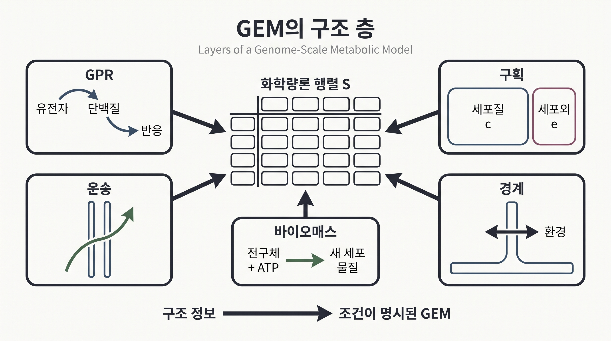
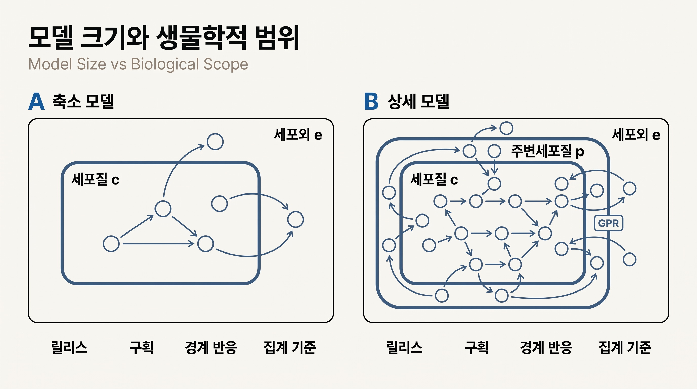

# 1. 화학량론 행렬에서 계산 모델로

## 1.1 GEM의 구조 층

[화학량론 행렬](../chapter-2/README.md) $$\mathbf{S}\in\mathbb{R}^{m\times n}$$는 대사물과 반응의 소비·생성 관계를 숫자로 적은 표다. 그러나 실제 게놈 규모 대사 모델(genome-scale metabolic model, GEM)은 이 표 하나만으로는 충분하지 않다. 같은 물질이라도 어느 구획에 있는지, 반응이 어느 유전자와 연결되는지, 무엇을 최적화할지를 함께 기록해야 한다. 이 장에서는 행렬에 더해지는 다음 구조와 메타데이터를 설명한다.

1. **[반응 bounds](../chapter-2/README.md)**: 방향성, 환경 가용성, 측정된 섭취율과 용량을 $$\mathbf{l}\leq\mathbf{v}\leq\mathbf{u}$$로 표현한다.
2. **[유전자-단백질-반응 연관(GPR)](02.md)**: 유전자 산물의 조합이 어떤 반응의 촉매 가능성을 지지하는지 Boolean 규칙으로 기록한다.
3. **[구획](03.md)과 운송**: 같은 화학종을 위치별 대사물 행으로 구분하고, 위치 사이의 이동을 [운송 반응](04.md) 열로 표현한다.
4. **[경계 반응](05.md)**: 교환(exchange), 수요(demand), 싱크(sink) 반응이 모델 시스템과 경계 사이의 물질 흐름을 표현한다.
5. **바이오매스 반응과 목적함수**: [바이오매스 반응](06.md)은 전구체·에너지 수요를 하나의 반응 열로 집계한다. [목적함수](../chapter-4/README.md) 벡터는 어떤 반응 또는 반응 조합을 최적화할지 별도로 선택한다.
6. **식별자와 근거 주석**: 유전자·단백질·대사물·반응의 데이터베이스 식별자, 문헌 근거, 화학식, 전하, 신뢰도 정보를 보존한다.

*그림 3.2. 게놈 규모 대사 모델을 이루는 구조 층. 화학량론 행렬 $$\mathbf S$$는 대사물의 소비·생성 비율을 기록하고, GPR은 유전자 산물 조합, 구획과 운송은 위치와 이동, 경계 반응은 환경과의 출입, 바이오매스 반응은 성장에 필요한 조성·에너지 요구를 표현한다. 이 그림은 구조 요소의 관계를 설명하는 교육용 모식도이며 solver나 실제 GEM 계산 결과가 아니다. 저자 작성; 개념 근거: [Thiele and Palsson (2010)](https://doi.org/10.1038/nprot.2009.203), [Ebrahim et al. (2013)](https://doi.org/10.1186/1752-0509-7-74).*

이 항목들이 모두 $$\mathbf{S}$$ “위에 따로 얹히는” 독립 객체는 아니다. 구획별 대사물과 운송·경계·바이오매스 반응은 이미 $$\mathbf{S}$$의 행과 열로 들어가 있다. 반면 GPR, bounds, 목적함수 계수, 주석은 행렬 바깥에 붙는 모델 속성이다. 이 구분은 [SBML](https://sbml.org/) Level 3 Flux Balance Constraints 패키지와 COBRA 자료 구조를 해석할 때 중요하다.

바이오매스 반응을 목적함수로 고르는 것은 모델 구조에서 저절로 따라오는 생물학적 사실이 아니라, 분석자가 세운 가정이다. ATP 생산, 특정 대사물 분비, 총 통량 최소화처럼 다른 목적함수를 선택할 수도 있다.

## 1.2 모델 크기의 비교 조건

반응·대사물·유전자 수는 생물 종의 고정된 속성이 아니라 특정 재구축 릴리스의 속성이다. 비교할 때에는 다음 집계 기준을 함께 기록한다.

- exchange, demand, sink, biomass 같은 의사반응 포함 여부
- 동일 화학종을 구획별로 중복 집계하는지 여부
- unique metabolite와 compartment-specific species의 구분
- 유전자, ORF, transcript, protein 가운데 무엇을 세는지
- 전체 reconstruction과 flux-consistent subset 가운데 어느 것을 사용하는지

대표 모델의 보고 수치는 다음과 같다.

| 모델·출처 | 유전자/ORF | 반응 | 대사물 | 집계상의 주의 |
|:---|---:|---:|---:|:---|
| `e_coli_core`, COBRApy 0.30.0 `textbook` 스냅샷 | 137 | 95 | 72 | 교육용 축소 모델, 구획 `c`·`e`; 고정 artifact 재실행 전에는 기대 회귀값 |
| iML1515, Monk et al. 2017 | 1,516 | 2,712 | 1,877 | 논문·공개 모델의 전체 반응 집계 |
| Recon3D reconstruction, Brunk et al. 2018 | 3,288 ORF | 13,543 | 4,140 unique | 분석용 flux-consistent subset은 별도 규모 |
| Human1, Robinson et al. 2020 | 3,625 | 13,417 | 10,138 compartment-specific | 여러 인체 재구축을 통합한 Human-GEM 릴리스 |

*표 3.1. 모델 릴리스별 보고 규모. 수치는 서로 다른 집계 기준을 사용하므로 단순한 생물학적 복잡도 순위로 해석하지 않는다. 출처: [iML1515, DOI 10.1038/nbt.3956](https://doi.org/10.1038/nbt.3956); [Recon3D, DOI 10.1038/nbt.4072](https://doi.org/10.1038/nbt.4072); [Human1, DOI 10.1126/scisignal.aaz1482](https://doi.org/10.1126/scisignal.aaz1482).*

*그림 3.3. 축소 모델과 상세 모델의 생물학적 범위 비교. 왼쪽은 세포질과 세포외 공간을 중심으로 일부 경로를 나타내고, 오른쪽은 주변세포질·운송·경계와 GPR을 더 세분한다. 반응 수가 많다는 사실만으로 예측 품질이 높다고 결론 내릴 수 없으며, 릴리스·구획·경계 반응·집계 기준을 함께 확인해야 한다. 저자 작성 교육용 모식도이며 실제 모델 규모나 성능을 계산한 결과가 아니다. 개념 근거: [Monk et al. (2017)](https://doi.org/10.1038/nbt.3956), [Robinson et al. (2020)](https://doi.org/10.1126/scisignal.aaz1482).*

진핵생물 모델은 크기가 커지기 쉽다. 구획별 species와 운송 반응이 많고, 지질 종을 더 자세히 나누며, 조직·아이소자임 근거까지 더해지기 때문이다. 그러나 반응 수가 많다고 해서 예측이 더 정확하거나, 화학이 더 복잡하거나, 큐레이션 품질이 더 높다는 뜻은 아니다. 모델 크기와 품질은 질량·전하 균형, 연결성, GPR 근거, 조건별 검증과 함께 평가해야 한다.

## 1.3 구조 요소는 서로 다른 생물학적 질문에 답한다

모델을 읽을 때에는 반응·대사물·유전자 수의 비율보다 각 요소가 맡은 역할을 먼저 구분한다. 같은 유전자 수를 가진 두 모델도 구획, 경계와 바이오매스 정의가 다르면 서로 다른 생물학적 범위를 표현한다.

| 구조 요소 | 모델에서 확인하는 질문 | 숫자만으로 알 수 없는 것 |
|:---|:---|:---|
| GPR | 어떤 유전자 산물 조합이 반응을 지지하는가? | 효소량, 발현량, 촉매 속도 |
| 구획과 운송 | 대사물이 어디에 있고 어떤 막을 건너는가? | 실제 농도와 막 투과 속도 |
| 경계 반응 | 환경에서 어떤 물질의 출입을 허용하는가? | 실제 배양액 조성과 섭취율 |
| 바이오매스 반응 | 성장에 필요한 전구체와 에너지를 어떻게 묶었는가? | 세포가 모든 조건에서 같은 조성을 갖는지 |

*표 3.2. GEM 구조 요소가 답하는 생물학적 질문과 해석 한계. 각 항목은 모델 파일의 주석·반응식·경계조건과 함께 읽어야 한다.*

반응 수가 많다고 해서 예측 정확도가 자동으로 높아지지 않는다. 반응 수에는 내부 효소 반응뿐 아니라 운송·교환·요구·싱크·바이오매스 의사반응도 포함될 수 있다. 따라서 모델을 비교할 때에는 전체 크기를 하나의 점수로 환산하기보다, 연구 질문에 필요한 경로·구획·경계·GPR 근거가 갖추어졌는지 확인한다.

## 1.4 이 장의 분석 범위

이 장은 다음 순서로 GEM 구조를 해석한다.

- [§2](02.md): GPR의 AND/OR 의미와 단일 유전자 결손
- [§3](03.md)–[4](04.md): 모델 구획과 운송 반응
- [§5](05.md): exchange·demand·sink와 환경 경계조건
- [§6](06.md): 바이오매스 반응, 정규화, GAM/NGAM, 목적함수
- [§7](07.md): 원핵·진핵 모델 비교

각 요소는 “반응이 존재하는가”, “해당 조건에서 허용되는가”, “실제로 통량이 흐르는가”라는 서로 다른 질문에 답한다. 구조적 존재, 조건별 활성 가능성, 최적화 결과를 구분하여 해석해야 한다.

---

### 참고문헌

1. Orth JD, Fleming RMT, Palsson BØ. Reconstruction and use of microbial metabolic networks: the core *Escherichia coli* metabolic model as an educational guide. *EcoSal Plus*. 2010;4. [PubMed: 26443778](https://pubmed.ncbi.nlm.nih.gov/26443778/)
2. Monk JM, Lloyd CJ, Brunk E, et al. iML1515, a knowledgebase that computes *Escherichia coli* traits. *Nature Biotechnology*. 2017;35:904–908. [DOI: 10.1038/nbt.3956](https://doi.org/10.1038/nbt.3956)
3. Brunk E, Sahoo S, Zielinski DC, et al. Recon3D enables a three-dimensional view of gene variation in human metabolism. *Nature Biotechnology*. 2018;36:272–281. [DOI: 10.1038/nbt.4072](https://doi.org/10.1038/nbt.4072)
4. Robinson JL, Kocabaş P, Wang H, et al. An atlas of human metabolism. *Science Signaling*. 2020;13:eaaz1482. [DOI: 10.1126/scisignal.aaz1482](https://doi.org/10.1126/scisignal.aaz1482)

---
