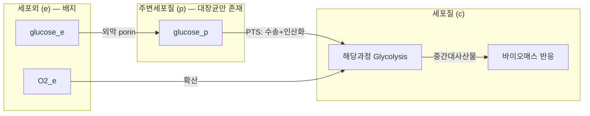

# 3. 세포 구획(Compartment)

## 3.1 구획화의 진화적 의의

원핵세포는 방이 하나뿐인 원룸과 비슷합니다 — 요리(합성)와 세탁(분해)이 같은 공간에서 벌어집니다. 반면 진핵세포는 방마다 용도가 다른 아파트에 가깝습니다 — 주방(세포질)과 강산성 화학 세척실(리소좀)이 벽으로 분리되어 있어, 서로 방해하지 않고 동시에 돌아갑니다. **세포 구획화(Cellular Compartmentalization)**는 진핵세포가 획득한 핵심적인 진화적 혁신입니다. 원핵생물은 대부분의 반응을 세포질 하나의 공간에서 수행하지만, 진핵생물은 대사를 여러 막으로 둘러싸인 구획으로 분할하여 다음 세 가지 이점을 얻습니다.

**① 상반되는 반응 조건의 공존**: 지질 합성(소포체, 중성 pH ~7.2)과 가수분해(리소좀, 강산성 pH ~4.5)처럼 서로 다른 화학적 환경이 필요한 반응들이 물리적으로 분리되어 동시에 진행될 수 있습니다. 이 분리가 없다면 리소좀의 강산성 가수분해 효소가 세포질에 풀려 세포 전체가 손상될 것입니다.

**② 대사 효율성의 증대(대사물 채널링, Metabolite Channeling)**: 연속된 반응의 효소들이 물리적으로 근접해 있으면 중간생성물이 확산으로 손실되지 않고 다음 효소로 바로 전달됩니다. 미토콘드리아 TCA 회로 효소들의 metabolon 형성이 대표적 예입니다.

**③ 대사 조절의 정교화**: 구획 간 운송(transport) 자체가 조절 지점이 됩니다. 예를 들어 세포질 피루브산이 미토콘드리아로 들어가는 것은 **MPC(Mitochondrial Pyruvate Carrier)**에 의해 조절되며, 이 하나의 운송 반응 제어만으로도 전체 대사 흐름의 방향(예: 암세포의 Warburg 효과와 같은 병리적 대사 전환)이 크게 바뀔 수 있습니다.

> **핵심 개념 · 용어(English):** **세포 구획(Compartment)**은 막으로 둘러싸인, 독립적인 화학적 환경(pH·redox·이온 조성)을 갖는 세포 내 공간입니다. GEM에서는 같은 화학종이라도 위치한 구획이 다르면 서로 다른 대사물 노드로 취급하며([Chapter 2](../chapter-2/README.md) 참고), 이 구조적 선택이 곧 모델의 규모와 현실성을 좌우합니다.

> 🤔 **잠깐, 생각해보기:** 리소좀은 pH 4.5의 강산성인데 세포질은 pH 7.2의 중성입니다. 만약 이 둘이 막으로 나뉘어 있지 않다면 어떤 일이 벌어질까요? 답: 리소좀의 가수분해 효소(단백질·지질·다당류를 분해하는 효소)들이 세포질 전체의 단백질과 소기관을 무차별적으로 분해해 버릴 것입니다. 즉 구획화는 "세포가 스스로를 소화하지 않도록" 막는 안전장치이기도 합니다.

## 3.2 원핵생물의 구획 구조: 대장균의 3구획

대장균은 그람 음성균(Gram-negative bacterium)으로서 세 가지 명확한 구획을 가집니다.

| 구획 | ID | 주요 특징 |
|:---|:---:|:---|
| 세포질(Cytosol) | `c` | 전체 반응의 약 85%가 발생. pH 7.5–7.8, NAD$$^+$$/NADH ≈ 100:1 |
| 주변세포질(Periplasm) | `p` | 외막-내막 사이 약 12–15 nm 공간. 그람 음성균에만 존재. 영양분 일차 수용, 소화 효소 작용, 펩티도글리칸층, 항생제 저항 효소(β-lactamase) |
| 세포외(Extracellular) | `e` | 배지(medium)를 표현. 교환 반응의 대상 |

*Table 3.1: 대장균 GEM의 3개 구획.*

주변세포질에 위치한 반응은 주로 **운송 반응**입니다. 예를 들어 포도당이 외부에서 주변세포질을 거쳐 세포질로 들어가는 과정은 **PTS(Phosphotransferase System)**라는 원핵생물 특화 메커니즘을 사용하며, 이는 4절에서 자세히 다룹니다.


💡 **팁:** 대사물 ID의 접미사(`_c`, `_e`, `_p`)는 BiGG(Biochemical, Genetic and Genomic knowledge base) 데이터베이스의 표준 명명 규칙입니다. 세포질의 포도당은 `glc__D_c`, 세포외 포도당은 `glc__D_e`로 쓰며, 접미사만 보고도 그 대사물이 모델의 어느 구획에 속하는지 바로 알 수 있습니다.


## 3.3 진핵생물의 구획 구조: 인체의 8+ 구획

인체 세포는 여러 막으로 둘러싸인 세포소기관을 가지며, Recon3D는 다음 8개 이상의 구획을 정의합니다.

| 구획 | ID | 주요 대사 기능 | 특징적 환경 |
|:---|:---:|:---|:---|
| 세포질(Cytosol) | `c` | 당분해, PPP, 지방산 합성 | pH ~7.2, NADP$$^+$$/NADPH ≈ 0.01:1(환원력 유지) |
| 미토콘드리아(Mitochondria) | `m` | TCA 회로, 전자전달계, β-산화, 케톤체 합성 | pH 7.8–8.0, NAD$$^+$$/NADH ≈ 10:1, 자체 mtDNA(37개 유전자) 보유 |
| 소포체(ER) | `r` | 스테롤·인지질 합성, N-글리코실화, CYP450 약물 대사 | GSH/GSSG ≈ 3:1 |
| 골지체(Golgi) | `g` | 단백질 가공·분류, 글리코실화 | pH 6.0–7.0 (cis→trans 구배) |
| 리소좀(Lysosome) | `l` | 가수분해, 복합지질 분해, 자가포식 | pH 4.5–5.0(강산성) |
| 퍼옥시좀(Peroxisome) | `x` | VLCFA β-산화, ROS 제거 (Catalase 등) | pH 7.0–7.5 |
| 핵(Nucleus) | `n` | 뉴클레오타이드 대사, DNA/RNA 합성 전구체 | - |
| 세포외(Extracellular) | `e` | 혈장 성분 포함 배지 | - |
| (내막, Inner Mitochondrial Membrane) | `im` | 전자전달계 복합체 위치 | - |

*Table 3.2: Recon3D의 세포 구획과 주요 기능. 인체 세포질의 NADPH가 NADP$$^+$$보다 훨씬 많다는 것은 산화적 스트레스 방어와 환원적 생합성(지방산·콜레스테롤 합성)을 지속적으로 뒷받침해야 함을 의미합니다.*

미토콘드리아의 특이한 점은 **자체 DNA(mtDNA)**를 가진다는 것입니다. 인체 mtDNA는 37개 유전자를 부호화하며, 이 중 13개는 전자전달계 복합체 단백질을, 나머지 24개는 tRNA·rRNA를 부호화합니다. 이 때문에 인체 GEM에서 미토콘드리아 유전자는 `mt-` 접두사(예: `mt-ATP6`)로 구분됩니다.


❓ **흔한 오해:** "세포질의 ATP(`atp_c`)와 미토콘드리아의 ATP(`atp_m`)는 결국 같은 분자니까 하나의 공동 풀(pool)로 취급해도 된다"는 생각은 GEM에서는 틀렸습니다. 화학적으로는 동일한 분자라도 구획이 다르면 $$\mathbf{S}$$에서 **완전히 별개의 행(대사물 노드)**을 차지하며, 두 구획 사이를 잇는 것은 오직 4절에서 다룰 **운송 반응**뿐입니다. 이 구분이 없으면 미토콘드리아 막의 불투과성이라는 핵심 생물학이 모델에서 사라져 버립니다.


## 3.4 구획별 화학적 환경과 화학량론 행렬의 블록 구조

각 구획은 서로 다른 pH·redox 조건·이온 조성을 가집니다.

| 구획 | pH | Redox Potential | ATP/ADP 비율 |
|:---|:---|:---|:---|
| Cytosol | 7.0–7.2 | NAD$$^+$$/NADH ≈ 700 | 높음(합성 장소) |
| Mitochondria (matrix) | 7.8–8.0 | NAD$$^+$$/NADH ≈ 10 | 낮음(소비 장소) |
| ER (lumen) | 7.2 | GSH/GSSG ≈ 3:1 | - |
| Lysosome | 4.5–5.0 | - | - |

*Table 3.3: 주요 구획의 화학적 환경 비교. 세포질과 미토콘드리아 사이 NAD$$^+$$/NADH 비율 차이(700 대 10)는, 세포질의 NADH가 미토콘드리아 막을 직접 통과할 수 없어 말산-아스파르테이트 셔틀 등 간접적인 redox shuttle이 필요한 이유를 설명합니다.*

구획 수가 늘어나면 [Chapter 2](../chapter-2/README.md)에서 다룬 화학량론 행렬 $$\mathbf{S}$$의 구조도 함께 변합니다. 동일한 화학종이라도 구획마다 별개의 행(대사물 노드)을 차지하므로 — 예를 들어 피루브산은 대장균에서 `pyr_c`, `pyr_e` 2개, 인체에서는 `pyr_c`, `pyr_m`, `pyr_e` 3개 노드가 됩니다 — 구획화된 모델의 $$\mathbf{S}$$는 다음과 같은 **블록-구조(block structure)**에 가까워집니다.

$$\mathbf{S} = \begin{bmatrix} \mathbf{S}_{c} & \mathbf{0} & \cdots & \mathbf{S}_{c \rightarrow e} \\ \mathbf{0} & \mathbf{S}_{m} & \cdots & \mathbf{S}_{m \rightarrow c} \\ \vdots & \vdots & \ddots & \vdots \\ \mathbf{S}_{e \rightarrow c} & \mathbf{S}_{c \rightarrow m} & \cdots & \mathbf{S}_{e} \end{bmatrix}
$$

대각 블록($$\mathbf{S}_c$$, $$\mathbf{S}_m$$ 등)은 각 구획 내부 반응을, 비대각 블록은 구획 간 운송 반응(4절)을 나타냅니다. 이 구조는 LP 문제의 규모를 키우지만, [Chapter 4](../chapter-4/README.md)에서 다룰 희소 행렬 최적화 기법으로 여전히 효율적으로 풀 수 있습니다.

*Figure 3.1: 대장균 구획 간 대사물 흐름. 세포외 → 주변세포질 → 세포질 순으로 영양분이 이동하며, 각 경계에서 4절의 운송 반응이 매개합니다.*

## 3.5 아세포위 국소화(Subcellular Localization) 예측

모델을 구축할 때 각 효소가 어느 구획에서 작용하는지 결정하는 것은 핵심 과정입니다. 이를 위해 아미노산 서열 기반 **아세포위 국소화 예측 도구**가 사용됩니다.

| 도구 | 원리 | 정확도(약) | 특징 |
|:---|:---|---:|:---|
| TargetP | N-말단 시그널 펩티드 인식 | 90% | 미토콘드리아·엽록체·SP·기타 분류 |
| WoLF PSORT | k-근접 이웃(k-NN) | 85% | 11개 구획 지원 |
| DeepLoc | 딥러닝(CNN+LSTM) | 92% | 10개 구획, 막단백질 구분 가능 |
| MitoFates | 미토콘드리아 특화 | 95% | Presequence 예측 |
| CELLO | SVM 기반 | 88% | 원핵/진핵 모두 지원 |

*Table 3.4: 주요 아세포위 국소화 예측 도구. 대부분 단백질의 N-말단 **시그널 펩티드(signal peptide)** — 미토콘드리아 시그널(양전기·수산기 아미노산 풍부), ER 시그널(소수성 코어), Peroxisomal targeting signal(C-말단 Ser-Lys-Leu), Nuclear localization signal 등 — 를 "주소 라벨"처럼 인식하는 원리로 작동합니다.*

다만 자동 예측에는 한계가 있습니다 — 일부 단백질은 두 구획 이상에 위치하는 **듀얼 타게팅(dual targeting)**을 보이거나, 세포 상태에 따라 위치가 바뀝니다. 따라서 고품질 GEM은 자동 예측을 초기 가이드로 사용하되, 최종적으로는 단백질체학 데이터와 문헌으로 수동 검증합니다. 이 수동 검증 절차 자체(Thiele & Palsson 96단계 프로토콜의 Step 57–64)는 [Chapter 5](../chapter-5/README.md)에서 다룹니다.

---
