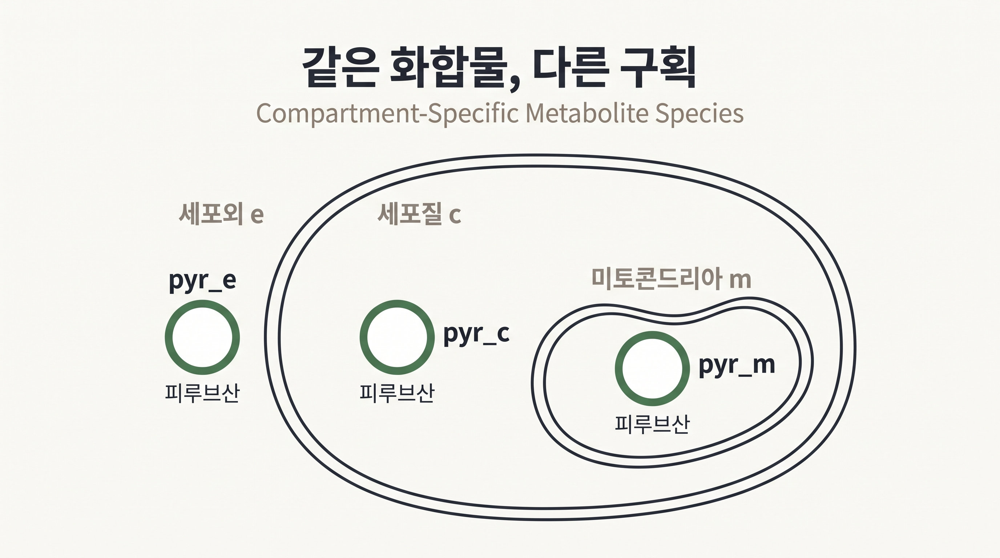
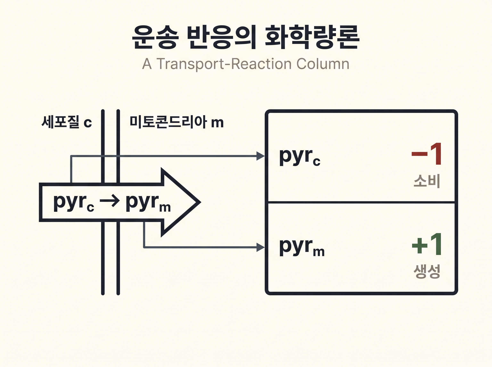

# 3. 모델 구획(compartment)

## 3.1 생물학적 공간과 모델 구획

세포 안은 하나의 균일한 공간이 아니다. 세포막, 소기관막, 세포벽과 막 사이 공간, 그리고 시스템 경계가 세포를 여러 칸으로 나눈다. 이렇게 화학적 환경과 물질 접근성이 서로 다른 공간을 생물학에서 [구획(compartment)](../glossary.md)이라 부른다. GEM에서 구획은 대사물 species와 반응의 위치를 구별하는 **모델 label**이다.

두 개념은 관련되지만 동일하지 않다.

- 세포질·미토콘드리아 기질·주변세포질은 실제 생물학적 공간을 나타낸다.
- `e`(extracellular)는 세포 내부 소기관이 아니라 모델과 환경의 접점을 나타내는 시스템 구획이다.
- 하나의 생물학적 공간을 모델 목적에 따라 더 세분하거나, 여러 공간을 하나로 합칠 수 있다.
- 같은 화학종이라도 구획이 다르면 `pyr_c`와 `pyr_m`처럼 서로 다른 대사물 행으로 표현한다.

구획을 분리하면 막을 가로지르는 이동이 자동으로 일어나지 않는다. 서로 다른 구획의 species는 명시적인 [운송 반응](04.md)으로만 연결된다. 이 구조는 막 투과성, 에너지 결합, redox shuttle과 organelle-specific pathway를 모델에 반영한다.

*그림 3.6. 같은 화합물을 구획별 대사물 종으로 구분하는 모델 표현. 피루브산은 세포외 `pyr_e`, 세포질 `pyr_c`, 미토콘드리아 `pyr_m`처럼 위치 접미사가 다른 별도 대사물로 저장되며, 구획 사이 이동은 운송 반응이 있을 때만 허용된다. 구획 라벨은 생물학적 위치를 근거로 정한 모델 속성이며 실제 농도나 자유 확산을 뜻하지 않는다. 저자 작성 교육용 모식도이며 실제 GEM 계산 결과가 아니다. 개념 근거: [Thiele and Palsson (2010)](https://doi.org/10.1038/nprot.2009.203).*

원핵생물을 “구획이 없는 하나의 공간”으로 일반화해서는 안 된다. 그람음성 세균에는 세포질, 내막, 주변세포질, 외막이 있으며, 일부 세균과 고세균은 단백질성 microcompartment나 특수 막 구조를 가진다. GEM의 구획 수는 이러한 생물학을 얼마나 상세히 재구축했는지에 따라 달라진다.

## 3.2 대장균 모델의 구획

동일한 생물 종이라도 모델 범위에 따라 구획 표현이 다르다.

| 모델 | 구획 | 해석 |
|:---|:---|:---|
| `e_coli_core` `textbook` | `c`, `e` | 주변세포질과 외막 통과를 축약한 교육용 모델 |
| iML1515 | `c`, `p`, `e` | 세포질, 주변세포질, 세포외 species를 구분한 재구축 |

*표 3.5. 대장균 모델의 구획 표현. `e`는 세포의 해부학적 내부가 아니라 모델 경계와 연결되는 extracellular compartment이다. 실제 ID와 구획 목록은 고정한 모델 릴리스에서 확인한다. 모델 수치는 [e_coli_core 교육 모델](https://pubmed.ncbi.nlm.nih.gov/26443778/)과 [iML1515, DOI 10.1038/nbt.3956](https://doi.org/10.1038/nbt.3956)을 기준으로 한다.*

그람음성 세균에서 외부 기질은 외막 porin, 주변세포질 결합 단백질, 내막 수송체를 순차적으로 거칠 수 있다. `e_coli_core`는 일부 단계를 하나의 운송 반응으로 축약한다. 이 축약은 계산 오류가 아니라 모델 범위의 선택이지만, 막별 수송 기전을 분석하는 연구에는 적합하지 않을 수 있다.

## 3.3 진핵생물 모델의 구획

인체 GEM은 세포질과 세포외 공간 외에 여러 소기관을 구분한다. 대표적 위치와 대사 기능은 다음과 같다.

| 모델 구획 | 대표 기능 | 모델링상의 핵심 |
|:---|:---|:---|
| 세포질 `c` | 해당과정, pentose phosphate pathway, 일부 지질 합성 | 다른 소기관과 다수의 운송 반응으로 연결 |
| 미토콘드리아 `m` | TCA cycle, 호흡, 일부 지방산 산화 | 내막 운송과 전기화학적 결합이 중요 |
| 소포체 `r` | 지질·스테롤 대사, 단백질 가공 관련 대사 | lumen과 막의 구분 수준은 모델별로 다름 |
| 골지체 `g` | glycosylation과 분비 경로 관련 대사 | 소포체·세포질과의 물질 전달 필요 |
| 리소좀 `l` | 고분자·복합지질 분해 | acidic lumen의 반응 방향과 운송이 중요 |
| 퍼옥시좀 `x` | 매우 긴 사슬 지방산 산화, 과산화물 대사 | 미토콘드리아·세포질과의 shuttle 필요 |
| 핵 `n` | 일부 nucleotide·transport 과정 | 핵공을 통한 이동의 상세도는 모델별로 다름 |
| 세포외 `e` | 환경·체액과의 경계 species | exchange reaction과 연결 |

*표 3.6. 인체 GEM에서 흔히 사용하는 구획의 기능적 해석. 실제 구획 ID와 포함 범위는 Recon3D, Human-GEM 등 모델 릴리스별 compartment 목록을 확인해야 한다.*

pH, NAD$$^+$$/NADH, NADP$$^+$$/NADPH, ATP/ADP 비율은 조직, 영양 상태, 측정법과 세포 상태에 따라 달라진다. 단일 비율을 “세포질의 고정값” 또는 “미토콘드리아의 고정값”으로 제시할 수 없다. 표준 화학량론 모델의 $$\mathbf{S}$$도 이러한 농도비를 직접 저장하지 않는다. 열역학적 방향성이나 redox 상태를 정량 분석하려면 조건별 농도·활동도와 Gibbs energy 자료를 별도 제약으로 통합해야 한다.

## 3.4 화학량론 행렬에서 구획을 읽는 방법

[화학량론 행렬](../chapter-2/README.md)의 각 행은 구획을 포함한 대사물 종 하나에 대응한다. 따라서 세포질의 피루브산 `pyr_c`와 미토콘드리아의 피루브산 `pyr_m`은 화학식이 같아도 서로 다른 행이다. 두 종은 자동으로 섞이지 않으며, 다음과 같은 운송 반응이 있어야 연결된다.

$$
\mathrm{pyr_c}\rightarrow\mathrm{pyr_m}
$$

이 운송 반응의 열에서 `pyr_c` 행에는 −1, `pyr_m` 행에는 +1이 기록된다. 구획 내부 반응은 한 구획의 대사물 행에만 계수를 갖고, 운송 반응은 둘 이상의 구획 행에 계수를 갖는다. 교환 반응은 보통 세포외 대사물 행을 모델 바깥의 환경과 연결한다.

*그림 3.7. 세포질 피루브산을 소비하고 미토콘드리아 피루브산을 생성하는 운송 반응의 화학량론 기록. 반응 열에서 `pyr_c` 행의 계수는 −1, `pyr_m` 행의 계수는 +1이며, 두 구획의 대사물은 서로 다른 행으로 유지된다. 이 그림은 계수 부호와 생물학적 이동의 대응을 설명하는 교육용 모식도이며 solver나 실제 GEM 계산 결과가 아니다. 저자 작성; 개념 근거: [Thiele and Palsson (2010)](https://doi.org/10.1038/nprot.2009.203).*

이 절에서 필요한 핵심은 행렬의 고급 성질이 아니라 **같은 화합물도 위치가 다르면 별도 대사물로 기록되고, 위치 사이 이동은 별도 반응으로 기록된다**는 점이다. 행과 열의 순서는 파일이나 소프트웨어에 따라 달라질 수 있으므로, 반응 ID의 위치보다 대사물 ID·구획 라벨·화학량론 계수를 확인한다.

## 3.5 구획 배정의 근거

반응을 특정 구획에 배정하려면 촉매 단백질과 기질·생성물의 위치 근거가 필요하다. 근거의 우선순위는 연구 목적에 따라 달라질 수 있으나 일반적으로 다음 자료를 조합한다.

1. 직접적인 효소 활성·현미경·분획 실험
2. organelle-resolved proteomics와 신뢰도 높은 curated database
3. 수송 peptide, transmembrane segment, targeting motif에 대한 sequence-based prediction
4. 상동 단백질과 경로 일관성
5. gap-filling 또는 모델 가능성만을 위한 잠정 배정

잠정 배정은 근거 코드(evidence code)와 함께 표시하고 민감도 분석 대상으로 남겨야 한다. 재구축 과정에서 위치 근거를 문헌·데이터베이스와 교차 검증하는 원칙은 Thiele and Palsson(2010)의 프로토콜에 제시되어 있다([DOI: 10.1038/nprot.2009.203](https://doi.org/10.1038/nprot.2009.203), [PMC3125167](https://pmc.ncbi.nlm.nih.gov/articles/PMC3125167/)).

## 3.6 위치 예측은 보조 근거이다

단백질 서열로 세포 내 위치를 예측하는 도구는 실험 근거가 부족한 반응의 후보 구획을 제시할 수 있다. 그러나 예측 라벨 하나만으로 반응 위치를 확정해서는 안 된다. 신호 펩타이드가 잘 보이지 않는 단백질, 여러 구획에 위치하는 단백질과 생물군별 차이 때문에 오류가 생길 수 있다.

위치 예측 결과를 사용할 때에는 도구·버전, 대상 생물군, 가능한 구획 목록과 신뢰 점수를 기록한다. 직접적인 위치 실험, 단백질체 자료, 큐레이션된 데이터베이스와 경로의 다른 반응 위치가 같은 결론을 지지하는지 함께 확인한다. 서로 다른 논문의 정확도 숫자는 시험 자료와 구획 정의가 다르면 직접 비교하지 않는다. DeepLoc 2.0은 다중 위치를 예측하는 도구의 한 예이며, 보고 성능은 해당 논문의 평가 자료 안에서 해석해야 한다([DOI: 10.1093/nar/gkac278](https://doi.org/10.1093/nar/gkac278), [PMC9252801](https://pmc.ncbi.nlm.nih.gov/articles/PMC9252801/)).

## 3.7 구획 수와 운송 반응 수

구획의 개수만으로 운송 반응 수를 계산할 수 없다. 실제 운송 반응 수는 다음에 의해 결정된다.

- 실제로 접촉하거나 물질을 교환하는 구획 쌍
- 각 경계를 통과하는 화학종 수
- uniport·symport·antiport와 에너지 결합의 구분
- 같은 화학종에 대한 여러 수송체와 GPR
- 운송 방향과 조건별 bounds

구획 연결 그래프의 가능한 쌍 수는 위상적 상한을 제공할 수 있지만, GEM 반응 수의 예측식은 아니다. 실제 모델 비교에서는 transport reaction을 동일한 판정 규칙으로 직접 집계해야 한다.

---

### 해석상의 주의

- 모델 구획 수는 생물체의 고정된 해부학적 구획 수가 아니라 재구축 상세도의 속성이다.
- extracellular compartment는 세포 내부 소기관이 아니다.
- 위치별 pH와 redox ratio는 조건 의존적이며 표준 $$\mathbf{S}$$에 직접 저장되지 않는다.
- $$\mathbf{S}$$에서 운송은 서로 다른 구획의 대사물 행에 음수와 양수 계수를 갖는 반응 열로 표현된다.
- 위치 예측은 실험·데이터베이스·경로 근거와 함께 검토하는 보조 자료이다.

---
