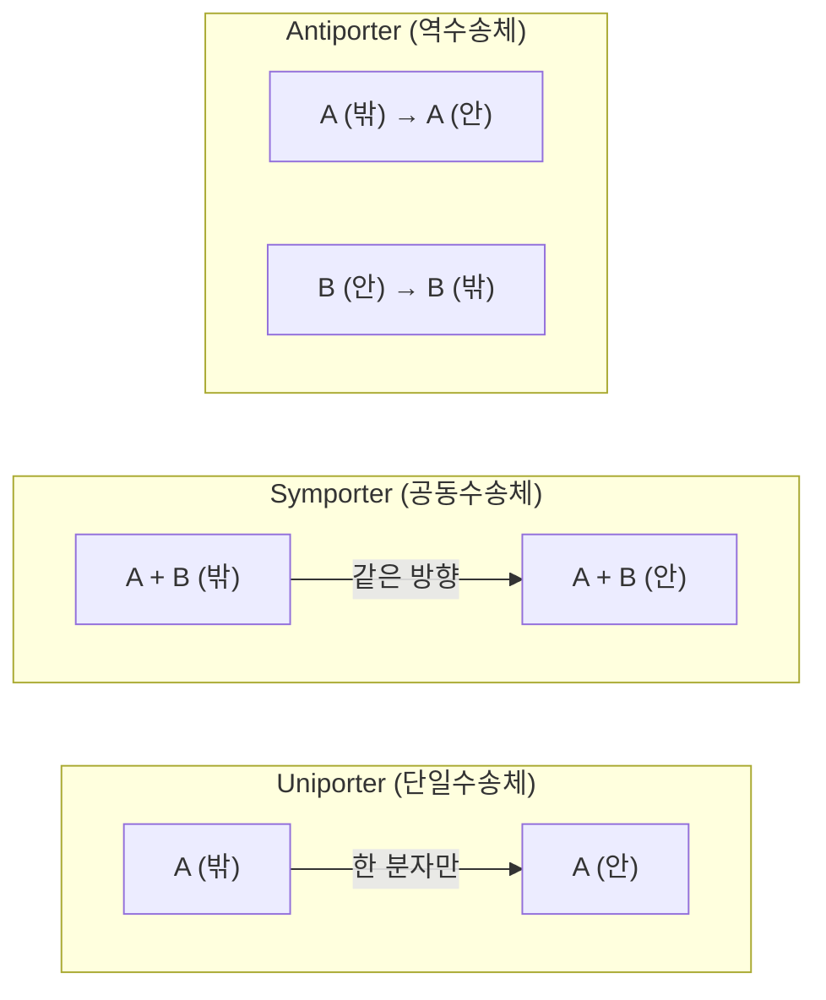

# 4. 운송 반응(Transport Reaction)

## 4.1 운송 메커니즘의 분류

구획 간 대사산물 이동은 건물의 세 가지 이동 수단에 비유할 수 있습니다 — 계단(누구나 공짜로, 하지만 힘들게 이동 = 확산), 일반 엘리베이터(기계의 도움을 받지만 요금은 없음 = 촉진확산), 그리고 유료 급행 엘리베이터(요금을 내야 원하는 층으로 곧장 이동 = 능동수송). 실제로 구획 간 대사산물 이동은 다음 세 가지 메커니즘으로 이루어지며, 각각 GEM에서 다르게 표현됩니다.

> **핵심 개념 · 용어(English):** **운송 반응(Transport Reaction)**은 같은 화학종이 한 구획에서 다른 구획으로 이동하는 것을 나타내는 반응입니다. 화학적으로 변하지 않는 분자라도 위치가 바뀌므로, $$\mathbf{S}$$에서는 두 개의 서로 다른 대사물 행에 각각 $$-1$$과 $$+1$$을 부여하는 하나의 열로 표현됩니다.

| 유형 | 설명 | 예시 | 모델 표현 |
|:---|:---|:---|:---|
| **확산(Diffusion)** | 수동적, 에너지 불필요, 막을 자유롭게 통과 | O$$_2$$, CO$$_2$$, H$$_2$$O, ethanol, glycerol, urea | $$\text{o2\_e} \rightleftharpoons \text{o2\_c}$$ |
| **촉진확산(Facilitated Diffusion)** | 막 단백질이 매개하지만 에너지 불필요 | GLUT(포도당 수송체), Aquaporin | 수송체 GPR을 포함 |
| **능동수송(Active Transport)** | ATP 또는 이온 기울기를 소비해 농도 기울기에 역행 | ABC transporter, Na$$^+$$/H$$^+$$-coupled symporter, PTS | ATP 또는 다른 이온을 화학량론에 포함 |

*Table 4.1: 운송 메커니즘의 분류.*

## 4.1b 운송체의 방향 조합: Uniporter · Symporter · Antiporter

운송 단백질(carrier)은 몇 개의 분자를 어느 방향으로 함께 옮기는지에 따라 세 가지로 나뉩니다. 이 분류는 4.1절의 세 메커니즘과는 다른 축(방향 조합)의 분류이며, 실제로는 서로 겹쳐 쓰입니다(예: 촉진확산은 대개 uniporter, 능동수송은 symporter나 antiporter인 경우가 많습니다).



*Figure 4.1: Uniporter·Symporter·Antiporter의 방향 비교. GLUT는 uniporter(포도당 하나만 이동), SGLT1은 symporter(Na$$^+$$와 포도당이 같은 방향), 대부분의 SLC25 미토콘드리아 수송체(4.3절)는 antiporter(한 분자가 나가는 대가로 다른 분자가 들어옴)입니다.*

**손으로 확인하는 화학량론 결합 예시 — SGLT1**: 소장 상피세포의 나트륨-포도당 공동수송체(Sodium-Glucose Linked Transporter 1, SGLT1)는 GLUT(uniporter, 4.4절)와 달리 나트륨 이온 기울기를 이용하는 이차 능동수송(secondary active transport) symporter입니다. 그 반응식은 다음과 같습니다.

$$
2\,\text{Na}^+_{(e)} + \text{glucose}_{(e)} \rightarrow 2\,\text{Na}^+_{(c)} + \text{glucose}_{(c)}
$$

여기서 계수 2는 "나트륨 이온 2개의 유입 에너지를 담보로 포도당 1분자를 농도 기울기에 **역행**해서 끌어들인다"는 뜻입니다. 나트륨 기울기 자체는 Na$$^+$$/K$$^+$$-ATPase가 ATP를 소비해 유지하므로, SGLT1은 ATP를 직접 쓰지 않지만 궁극적으로는 ATP 의존적입니다. 이런 "간접적으로 ATP를 소비하는" 반응을 GEM에서 표현할 때는, Na$$^+$$ 기울기를 명시적으로 화학량론에 포함시킬지(위 식처럼), 아니면 단순화해 생략할지를 모델 큐레이터가 결정해야 합니다 — 이 선택 하나가 모델의 예측 정확도에 영향을 줄 수 있습니다.

## 4.2 원핵생물 특화 수송: PTS 시스템

대장균에서 포도당이 외부에서 주변세포질(`p`)을 거쳐 세포질(`c`)로 들어가는 대표적인 경로는 **PTS(Phosphotransferase System)**입니다.

축소된 `e_coli_core` 모델은 외막 통과와 PTS 단계를 하나의 순반응으로 묶습니다.

$$\text{glc\_\_D\_e} + \text{pep\_c} \rightarrow \text{g6p\_c} + \text{pyr\_c}$$

주변세포질을 명시한 전체 규모 모델에서는 개념적으로 다음 두 단계를 구분할 수 있습니다.

$$\text{glc\_\_D\_e} \rightleftharpoons \text{glc\_\_D\_p}$$

$$\text{glc\_\_D\_p} + \text{pep\_c} \rightarrow \text{g6p\_c} + \text{pyr\_c}$$

PTS의 핵심 특징은 **수송과 인산화의 결합(coupling)**입니다. 포도당을 세포 안으로 옮기는 데 별도의 ATP를 소비하지 않는 대신, 포스포에놀피루브산(PEP)의 고에너지 인산 결합이 피루브산으로 전환되며 에너지를 제공합니다. 이 덕분에 낮은 포도당 농도에서도 효율적인 흡수가 가능합니다. PTS는 원핵생물의 특화된 발명품으로, 진핵생물에는 존재하지 않습니다.

## 4.3 미토콘드리아 수송체와 구획 간 셔틀

미토콘드리아 내막은 대부분의 대사산물에 대해 거의 불투과성이므로, 특화된 수송체가 반드시 필요합니다.

| 수송체 | 유전자 | 수송 대상 | 메커니즘 |
|:---|:---|:---|:---|
| MPC | MPC1, MPC2 | Pyruvate | H$$^+$$-symporter |
| Carnitine shuttle | SLC25A20 | Acyl-carnitine | Carnitine-antiporter |
| ADP/ATP translocase | SLC25A4, SLC25A5 | ADP$$^{3-}$$ / ATP$$^{4-}$$ | Antiporter |
| Phosphate carrier | SLC25A3 | HPO$$_4^{2-}$$ | H$$^+$$-symporter |
| Malate-α-KG carrier | SLC25A11 | Malate / α-KG | Antiporter |
| Citrate carrier | SLC25A1 | Citrate / Malate | Antiporter |

*Table 4.2: 주요 미토콘드리아 수송체(SLC25 family). 대부분이 하나의 분자를 내보내는 대가로 다른 분자를 받아들이는 antiporter입니다.*

ADP/ATP translocase(SLC25A4) 돌연변이는 progressive external ophthalmoplegia를 유발하는 등, 이 수송체들의 결함은 다양한 미토콘드리아 질병과 직결됩니다.

## 4.4 수송 반응의 GPR 표현: GLUT 아이소자임

운송 반응도 다른 반응과 마찬가지로 GPR을 가집니다. 세포질-세포외 포도당 수송을 매개하는 GLUT(Glucose Transporter) 계열이 대표적입니다.

```
(GLUT1 OR GLUT2 OR GLUT3 OR GLUT4)
```

| 아이소자임 | 유전자 | 조직 분포 | 특징 |
|:---|:---|:---|:---|
| GLUT1 | SLC2A1 | 적혈구, 뇌혈관 내피세포 | 기본 포도당 수송 |
| GLUT2 | SLC2A2 | 간, 췌장 β세포, 장 상피세포 | 높은 Km, "포도당 센서" |
| GLUT3 | SLC2A3 | 뇌 뉴런 | 낮은 Km, 높은 친화도 |
| GLUT4 | SLC2A4 | 근육, 지방 | 인슐린 의존적 수송 |

*Table 4.3: GLUT 아이소자임의 조직 특이적 발현. 2.7절의 Hexokinase 예제와 마찬가지로, 하나의 OR-GPR이 조직별로 다른 아이소자임에 의해 활성화되는 패턴입니다.*

## 4.5 구획화 장애와 대사 질병

세포 구획의 기능 장애("compartmental disorders")는 특정 구획의 효소 결핍이나 수송체 돌연변이가 전체 세포 대사에 연쇄적 영향을 미쳐 발생합니다.

| 질병 | 결함 구획 | 결함 효소/수송체 | 대사적 영향 |
|:---|:---|:---|:---|
| Mitochondrial myopathy | Mitochondria | ETC 복합체 | ATP 생성 감소, 젖산 축적 |
| Zellweger syndrome | Peroxisome | PEX(peroxisome biogenesis factor) | VLCFA 축적 |
| Gaucher disease | Lysosome | β-glucocerebrosidase (GBA) | 글루코세레브로사이드 축적 |
| Pompe disease | Lysosome | α-glucosidase (GAA) | 글리코겐 축적 |
| Cystic fibrosis | ER | CFTR | 단백질 misfolding |
| MCADD | Mitochondria | Medium-chain acyl-CoA dehydrogenase | 중쇄 지방산 β-산화 장애 |

*Table 4.4: 세포 구획화 장애와 관련된 대표 질병. 대사 모델에서는 해당 반응의 bounds를 0으로 제약하여 이러한 결손을 시뮬레이션할 수 있습니다.*

Gaucher disease를 모델링할 때는 Human-GEM 버전에 맞는 **리소좀** glucosylceramidase 반응과 GBA의 GPR을 찾아 결손시켜야 합니다. 세포질 대사물(`_c`)을 대상으로 임의의 demand를 읽는 방식은 구획도 틀리고, 축적량도 알려주지 않습니다.


정상상태 GEM의 flux는 농도나 시간에 따른 축적량이 아닙니다. 기질 분해 능력의 상실, 우회경로, 필요한 배출 경로의 최대 용량은 분석할 수 있지만 “얼마나 축적되는가”를 예측하려면 농도·속도식·시간축을 가진 동역학 모델 또는 실험 대사체 데이터가 필요합니다.


이처럼 구획 기반 질병 시뮬레이션은 GPR·구획·경계 반응이라는 이 장의 세 요소를 모두 활용하되, 예측 가능한 양의 범위를 지켜야 합니다. 질병 기전의 체계적 분석과 약물 표적 예측은 [Chapter 7. 질병 모델링과 약물 표적 발굴](../chapter-7/README.md)에서 본격적으로 다룹니다.

## 4.6 운송 반응의 방향성과 bounds

운송 반응도 다른 반응과 마찬가지로 하한(lower bound, $$v^{lb}$$)과 상한(upper bound, $$v^{ub}$$)을 가지며, 이 값이 반응의 **가역성(reversibility)**을 결정합니다. 이 bounds 개념 자체는 [Chapter 2](../chapter-2/README.md)에서 도입되었지만, 운송 반응에서는 그 물리적 의미가 특히 뚜렷합니다.

$$
v_j^{lb} \leq v_j \leq v_j^{ub}
$$

- **확산(단순 확산)**: 대개 $$v^{lb} < 0,\ v^{ub} > 0$$인 **가역** 반응입니다. O$$_2$$나 CO$$_2$$처럼 막을 자유롭게 넘나드는 분자는 농도 기울기가 바뀌면 방향도 바뀌기 때문입니다.
- **PTS·ABC transporter 같은 능동수송**: 흔히 $$v^{lb} = 0$$으로 고정된 **비가역** 반응입니다. ATP나 PEP의 고에너지 결합을 소비해 특정 방향으로만 밀어붙이는 반응을, 열역학적으로 반대 방향이 자발적으로 일어나지 않기 때문입니다.

| 운송 유형 | 전형적인 $$v^{lb}$$ | 전형적인 $$v^{ub}$$ | 가역성 |
|:---|---:|---:|:---|
| O$$_2$$ 확산 | $$-1000$$ | $$1000$$ | 가역 |
| PTS 포도당 수송 | $$0$$ | $$1000$$ | 비가역(수송+인산화 방향 고정) |
| ADP/ATP translocase(antiporter) | $$-1000$$ | $$1000$$ | 가역(교환 방향은 농도차로 결정) |

*Table 4.5: 운송 반응 bounds의 전형적인 설정 예. 여기서 $$\pm 1000$$은 "사실상 무제한"을 뜻하는 관례적 큰 수이며, 실제 상한을 의미하는 것이 아닙니다 — 이 관례는 [5.1절](05.md)의 경계 반응 bounds 표기와 동일합니다.*


💡 **팁:** 운송 반응이 비가역(irreversible)인지 가역(reversible)인지는 화학식만 보고 판단할 수 없습니다 — 반드시 GEM 파일의 $$v^{lb}, v^{ub}$$ 값을 확인해야 합니다. 예를 들어 겉보기에는 단순해 보이는 대칭적 antiporter라도, 세포 안팎의 이온 조성이 항상 한 방향으로 기울어 있다면 큐레이터가 의도적으로 $$v^{lb}=0$$을 부여하는 경우가 있습니다.


---
