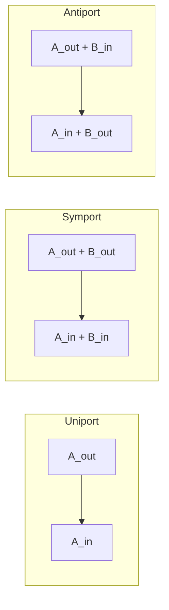

# 4. 운송 반응

[운송 반응](../glossary.md)은 한 [구획](03.md)의 metabolite species를 다른 구획의 species로 이동시킨다. 화학종이 변하지 않더라도 `glc__D_e`와 `glc__D_c`는 $$\mathbf S$$의 서로 다른 행이다.

$$
\mathrm{glc\_\_D_e}\rightleftharpoons\mathrm{glc\_\_D_c}
$$

따라서 해당 반응 열에는 extracellular species에 −1, cytosolic species에 +1이 기록된다. 이 단순 반응식은 수송의 방향, 에너지 coupling 및 transporter gene이 알려진 경우 그 정보를 추가해야 한다.

## 4.1 서로 다른 두 분류축

운송은 에너지원과 운반 stoichiometry라는 두 축으로 분류한다.

| 에너지·기전 | 특징 | 모델 표현 |
|:---|:---|:---|
| 단순 확산 | 막을 통한 수동 이동 | 대개 가역 단일 화학종 이동; 실제 permeability는 별도 제약 |
| 촉진 확산 | carrier/channel이 매개하는 electrochemical-gradient 순방향 이동 | GPR과 방향·capacity 정보를 포함할 수 있음 |
| 일차 능동수송 | ATP hydrolysis 등과 직접 결합 | ATP, H$$_2$$O, ADP, P$$_i$$ 등의 화학량론 포함 |
| 이차 능동수송 | 다른 이온의 electrochemical gradient와 결합 | Na$$^+$$ 또는 H$$^+$$를 같은 반응에 포함 |
| Group translocation | 이동 중 기질이 화학적으로 변환됨 | 외부 기질과 내부 변환 산물이 서로 다른 chemical species |



*Figure 3.2: Uniport, symport 및 antiport의 화학량론적 방향. 이 분류는 수동·능동수송과 독립적인 축이다. 저자 작성; glucose uniport와 sodium–glucose symport의 생리 근거는 [Wright, Loo & Hirayama (2011)](https://doi.org/10.1152/physrev.00055.2009), mitochondrial carrier의 세 운반 mode는 [Ruprecht & Kunji (2020)](https://doi.org/10.1016/j.tibs.2019.11.001)을 참조했다. 원 논문 그림은 사용하지 않았다.*

Uniporter는 한 종류의 substrate를, symporter는 둘 이상의 substrate를 같은 방향으로, antiporter는 서로 다른 substrate를 반대 방향으로 이동시킨다. ‘Symport=능동’, ‘uniport=수동’이라는 일대일 대응은 성립하지 않는다. Driving force와 stoichiometry를 각각 확인한다.

## 4.2 Na$$^+$$–glucose symport

Human SGLT1은 보통 glucose 1 molecule과 Na$$^+$$ 2 ions의 유입을 결합하는 것으로 기술된다.

$$
2\,\mathrm{Na^+_{out}}+\mathrm{glucose_{out}}
\rightarrow
2\,\mathrm{Na^+_{in}}+\mathrm{glucose_{in}}
$$

SGLT1이 ATP를 반응식에서 직접 가수분해하지는 않지만 Na$$^+$$ gradient는 Na$$^+$$/K$$^+$$-ATPase 등 에너지 소비 과정에 의해 유지된다. Na$$^+$$를 생략한 단순 glucose transport는 이 coupling과 energy cost를 잃는다. 반대로 whole-cell model에 ion gradient와 membrane potential을 명시적으로 표현하지 않으면 위 화학량론만으로 실제 driving force가 완전히 결정되지 않는다.

## 4.3 세균의 PEP:carbohydrate PTS

PEP-dependent phosphotransferase system은 여러 세균에서 sugar uptake와 phosphorylation을 결합하는 group-translocation system이다. `e_coli_core`의 glucose PTS는 다음과 같이 축약되어 있다.

$$
\mathrm{glc\_\_D_e}+\mathrm{pep_c}
\rightarrow
\mathrm{g6p_c}+\mathrm{pyr_c}
$$

Glucose가 이동하면서 glucose 6-phosphate로 변환되므로 단순 transport reaction이 아니다. PEP의 phosphate가 protein relay를 거쳐 sugar에 전달되며, 이 모델식은 여러 protein step을 하나의 net reaction으로 집계한다. PTS의 transport·regulatory 역할은 [Deutscher et al. (2006)](https://doi.org/10.1128/MMBR.00024-06)을 참조한다.

주변세포질을 명시하는 model에서는 outer-membrane 이동과 inner-membrane PTS를 별도 reaction으로 나눌 수 있다. 두 formulation의 reaction count가 다르더라도 net chemistry와 compartment scope를 먼저 비교한다.

## 4.4 Mitochondrial carrier

Mitochondrial inner membrane의 metabolite 이동은 SLC25 family와 다른 전용 carrier에 의존한다. Characterized SLC25 members의 다수는 substrate exchange를 촉매하지만 family 전체가 antiporter인 것은 아니며 symport와 uniport도 존재한다.

| Carrier | 대표 gene | 주요 substrate | 주된 mode |
|:---|:---|:---|:---|
| ADP/ATP carrier | SLC25A4/A5/A6/A31 | cytosolic ADP ↔ matrix ATP | antiport |
| Carnitine–acylcarnitine carrier | SLC25A20 | carnitine ↔ acylcarnitine | antiport |
| Oxoglutarate carrier | SLC25A11 | 2-oxoglutarate ↔ dicarboxylate | antiport |
| Citrate carrier | SLC25A1 | citrate ↔ malate 등 | antiport |
| Phosphate carrier | SLC25A3 | phosphate와 proton-equivalent transport | 조건·표현에 따라 symport로 기술 |

*Table 3.4: 대표 mitochondrial carriers. Substrate와 mode는 [Palmieri & Monné (2016)](https://doi.org/10.1016/j.bbamcr.2016.03.007) 및 [Ruprecht & Kunji (2020)](https://doi.org/10.1016/j.tibs.2019.11.001)을 바탕으로 요약했다.*

Malate–aspartate shuttle처럼 redox equivalent를 이동시키는 기능은 단일 반응 하나가 아니라 여러 carrier와 enzyme reaction의 closed sequence로 구현된다. NADH 자체가 inner membrane을 통과한다고 단순화하면 cofactor compartmentation을 왜곡할 수 있다.

## 4.5 Transport GPR의 범위

여러 transporter가 같은 net substrate 이동을 촉매할 수 있으면 generic model은 OR [GPR](02.md)을 사용할 수 있다.

```text
SLC2A1 OR SLC2A2 OR SLC2A3 OR SLC2A4
```

그러나 이 규칙은 모든 조직에서 네 gene이 동시에 발현되거나 동일 kinetics를 갖는다는 뜻이 아니다. Context-specific model에서는 tissue expression, subcellular localization, substrate specificity와 regulation을 반영하여 GPR 또는 reaction set을 좁힌다. SLC2 family의 일부 member는 glucose 외 substrate를 주로 운반하므로 `GLUT` 이름만으로 glucose reaction에 자동 할당하지 않는다. 검토 근거: [Mueckler & Thorens (2013)](https://doi.org/10.1016/j.mam.2012.07.001).

Transport reaction에 GPR이 비어 있을 때에도 단순 확산, 알려지지 않은 transporter, 비특이 transport 또는 annotation gap을 구분한다. GPR 부재를 transporter 부재 또는 spontaneous diffusion으로 자동 해석하지 않는다.

## 4.6 모델 검증 항목

운송 반응은 다음 항목을 점검한다.

1. 양쪽 metabolite가 올바른 compartment와 동일 chemical identity를 갖는가?
2. Symport·antiport의 ion 및 substrate stoichiometry가 보존되는가?
3. 방향성이 electrochemical gradient와 실험 조건에 맞는가?
4. ATP-coupled transport에서 hydrolysis chemistry와 charge가 균형을 이루는가?
5. Transporter GPR과 localization evidence가 같은 membrane을 지지하는가?
6. [Exchange reaction](05.md)과 intracellular transport를 혼동하지 않았는가?
7. Cycle을 통해 외부 공급 없이 ATP 또는 ion gradient가 생성되지 않는가?

수송체 결함의 질병 표현형을 모델링할 때에는 transporter reaction만 제거하는 것으로 충분하지 않을 수 있다. Tissue context, paralog compensation, extracellular substrate availability 및 downstream task를 함께 정의해야 한다.

## 4.7 수송 반응의 가역성과 신뢰도

수송 반응의 방향성(가역성) 배정은 다른 반응보다 특히 중요하다. 가역 수송이 과도하면 futile cycle이나 proton shuttle이 형성되어 외부 기질 공급 없이 ATP 또는 이온 기울기가 만들어지고, 그 결과 성장률이 과대예측될 수 있다(§4.6의 7번 항목). 따라서 열역학·생리 근거가 없는 한 수송 반응을 무조건 가역으로 두지 않고, ATP 합성처럼 특정 방향만 알려진 결합은 그 방향으로 제한한다.

또한 기작이 확인되지 않아 (촉진)확산으로 가정한 세포 내 수송 반응은 실험 근거가 약하므로 대개 낮은 신뢰도(모델링 목적)로 기록한다. 재구축의 신뢰도 점수 체계와 가역성 검증 절차는 [Chapter 5](../chapter-5/README.md)에서 다룬다.

---
